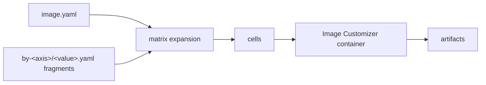

# tailor

[](https://github.com/frhuelsz/tailor/actions/workflows/ci.yml)

**Cargo-style, manifest-driven front-end for the Azure Linux Image Customizer.**

tailor lets you describe Azure Linux images in small YAML definitions instead of hand-writing Docker/Image Customizer invocations. It merges layered `image.yaml` fragments, expands matrices into build cells, resolves base images, and runs the Azure Linux Image Customizer (`mcr.microsoft.com/azurelinux/imagecustomizer`) once per cell. The `config:` tree remains Image Customizer YAML: tailor passes it through without modeling the IC schema.



## Installation

### Prebuilt release binary

Releases publish static Linux musl binaries for `x86_64` and `aarch64`, plus `.sha256` files.

```bash
set -euo pipefail
version="v0.1.0"
target="x86_64-unknown-linux-musl" # or aarch64-unknown-linux-musl
base="https://github.com/frhuelsz/tailor/releases/download/${version}"

curl -L -O "${base}/tailor-${target}"
curl -L -O "${base}/tailor-${target}.sha256"
sha256sum -c "tailor-${target}.sha256"
chmod +x "tailor-${target}"
sudo install -m 0755 "tailor-${target}" /usr/local/bin/tailor
tailor --version
```

### Cargo

The crate is not published to crates.io yet.

```bash
cargo install --git https://github.com/frhuelsz/tailor tailor
# From a local checkout:
cargo install --path crates/tailor
```

Runtime requirement: access to a Docker daemon. The tailor binary itself is fully static; it does not require glibc or OpenSSL on the target machine.

## 60-second quickstart

```bash
tailor init myimage advanced
tailor matrix myimage --format slugs
tailor build myimage --dry-run
```

The `advanced` scaffold creates a workspace `tailor.yaml`, a `myimage/image.yaml`, and example `variant`/`arch` fragments. `matrix` shows the generated cells; `build --dry-run` renders the Image Customizer invocation without running the container.

## Features

- Workspace and standalone image definitions.
- Multiple Image Customizer toolchains, with lockfile support.
- Matrix expansion over user-defined axes plus output formats.
- Per-axis fragments in `by-<axis>/<value>.yaml` and feature fragments in `by-feature/<name>.yaml`.
- Deterministic merge model: maps deep-merge, lists append, scalar conflicts require `$set`.
- Local, OCI, and Azure Linux base image sources.
- Pure pass-through for the Image Customizer `config:` tree.
- Dry runs, validation, rendered config snapshots, selectors, exact cell slugs, and portable static builds.

## Documentation

Start with the [documentation hub](docs/README.md), organized with Diátaxis:

- [Tutorials](docs/tutorials/README.md): learn tailor hands-on.
- [How-to guides](docs/how-to/README.md): accomplish specific tasks.
- [Reference](docs/reference/README.md): commands, fields, directives, and formats.
- [Explanation](docs/explanation/README.md): concepts, merge model, architecture, and design rationale.
