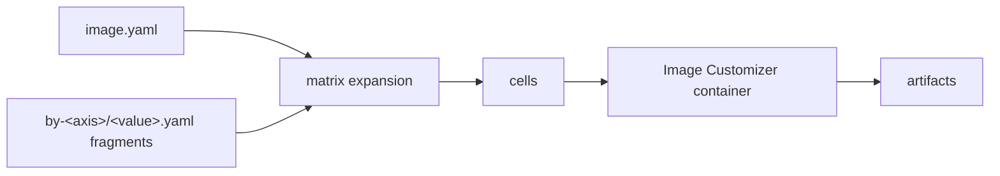

# tailor

[](https://github.com/frhuelsz/tailor/actions/workflows/ci.yml)
[](https://frhuelsz.github.io/tailor/)

**Manifest-driven front-end for the Azure Linux Image Customizer.**

tailor lets you describe Azure Linux images in small YAML definitions instead of hand-writing Docker/Image Customizer invocations. It merges layered `image.yaml` fragments, expands matrices into build cells, resolves base images, and runs the Azure Linux Image Customizer (`mcr.microsoft.com/azurelinux/imagecustomizer`) once per cell. The `config:` tree remains Image Customizer YAML: tailor passes it through without modeling the IC schema.



## Why tailor

The Image Customizer is powerful but low-level: building an image means hand-assembling a privileged `docker run` — the right container tag, narrowly scoped container mounts, **host paths rewritten** into the `/host` namespace, a base image, the output format, RPM sources, and a config YAML — repeated per image, per architecture, per output format. That glue is exactly what teams end up hand-writing around IC; tailor turns it into a reusable, declarative tool — your image set lives in YAML, not in code.

### Manage layered, varied configuration — without copy-paste

Real image sets vary along several axes at once (variant × architecture × release …). tailor expresses that as a `matrix:` and layers small per-axis fragments over a shared base:

- **One base, many cells.** `image.yaml` holds the shared config; each `by-<axis>/<value>.yaml` fragment contributes only its delta. The matrix expands to one **cell** per combination.
- **Predictable merging.** Maps deep-merge, lists append, and scalars conflict *loudly* unless you opt in with `$set` — so two fragments can't silently clobber each other. `$replace`/`$remove` give precise list control, `$include` splices shared snippets, and `${params}` interpolate per-cell values (e.g. an arch-specific package name).
- **Add a variant by adding a file.** A new axis value is just a new fragment; existing cells stay identical. Merge precedence follows the order you declare axes — not directory names — so nothing re-orders behind your back.

The nuance lives in a handful of small, reviewable files instead of N copy-pasted full configs.

### Runs Image Customizer for you

You describe *what* you want; tailor handles the *how*. For each cell it assembles and runs the complete IC invocation through the Docker API (no shelling out):

- **Base resolution** — a local file, an `oci:` reference, or `azureLinux:` (MCR) shorthand, resolved to a digest and pinned in `tailor.lock`.
- **The privileged run** — `--privileged`, a read-only workspace mount plus narrow writable carve-outs, the correct `--platform linux/<arch>`, and **every host path rewritten** into `/host` (an easy-to-get-wrong step you'd otherwise script by hand).
- **Output & cleanup** — per-format `--output-image-format`, streamed logs, exit/output verification, and **sudo-free cleanup** of the root-owned files IC leaves behind.
- **Reproducibility** — `tailor build --locked` pins the IC container and base digests; `tailor build --dry-run` prints the exact `docker run …` first.

### Just an `image.yaml`

You don't need a workspace to start. This standalone definition — no `tailor.yaml`, no toolchain to pin — is a complete, buildable image:

```yaml
# image.yaml
name: hello
base:
  azureLinux:
    version: "3.0"
    variant: minimal-os
config:
  # azureLinux/oci bases are downloaded via IC's OCI input, a preview feature; tailor never edits
  # your IC config, so you enable it here.
  previewFeatures: [input-image-oci]
  os:
    hostname: hello
    bootloader:
      resetType: hard-reset
    packages:
      install: [openssh-server, vim]
  storage:
    bootType: efi
    disks:
      - partitionTableType: gpt
        maxSize: 4G
        partitions:
          - { id: esp, type: esp, size: 8M }
          - { id: rootfs, size: grow }   # grow the rootfs so package installs fit
    filesystems:
      - { deviceId: esp, type: fat32, mountPoint: { path: /boot/efi, options: "umask=0077" } }
      - { deviceId: rootfs, type: ext4, mountPoint: { path: / } }
```

Build it (add `--dry-run` to preview without launching the container):

```bash
tailor build
```

From that definition tailor resolves the base image, assembles the full privileged Image Customizer invocation — host paths rewritten into the `/host` mount, the platform set, the output format applied — and runs it:

```text
docker run \
  --rm \
  --privileged \
  --platform linux/amd64 \
  -v /home/you/hello:/host/home/you/hello:ro \
  -v /home/you/hello/.tailor/cache:/host/home/you/hello/.tailor/cache:rw \
  -v /home/you/hello/artifacts:/host/home/you/hello/artifacts:rw \
  -v /dev:/dev \
  mcr.microsoft.com/azurelinux/imagecustomizer:latest \
  customize \
  --config-file /host/home/you/hello/.tailor-render.hello_amd64_cosi.ic.yaml \
  --build-dir /tmp \
  --image oci:mcr.microsoft.com/azurelinux/3.0/image/minimal-os \
  --output-image-format cosi \
  --output-image-file /host/home/you/hello/artifacts/hello_amd64_cosi.cosi
```

The result is `artifacts/hello_amd64_cosi.cosi`. You wrote no `outputs:` (so it defaulted to `cosi`) and pinned no toolchain (so it used the latest Image Customizer). Grow into a workspace — a shared toolchain, defaults, and many images — only when you need it.

## Installation

### Prebuilt release binary

Releases publish static Linux musl binaries for `x86_64` and `aarch64`, plus `.sha256` files.

```bash
set -euo pipefail
version="v0.1.0"
target="x86_64-unknown-linux-musl" # or aarch64-unknown-linux-musl
base="https://github.com/frhuelsz/tailor/releases/download/${version}"

curl -L -O "${base}/tailor-${target}"
curl -L -O "${base}/tailor-${target}.sha256"
sha256sum -c "tailor-${target}.sha256"
chmod +x "tailor-${target}"
sudo install -m 0755 "tailor-${target}" /usr/local/bin/tailor
tailor --version
```

### From source

The crate is not published to crates.io yet.

```bash
cargo install --git https://github.com/frhuelsz/tailor tailor
# From a local checkout:
cargo install --path crates/tailor
```

Runtime requirement: access to a Docker daemon. The tailor binary itself is fully static; it does not require glibc or OpenSSL on the target machine.

## 60-second quickstart

```bash
tailor init myimage advanced
tailor matrix myimage --format slugs
tailor build myimage --dry-run
```

The `advanced` scaffold creates a workspace `tailor.yaml`, a `myimage/image.yaml`, and example `variant`/`arch` fragments. `matrix` shows the generated cells; `build --dry-run` renders the Image Customizer invocation without running the container.

## Features

- Workspace and standalone image definitions.
- Multiple Image Customizer toolchains, with lockfile support.
- Matrix expansion over user-defined axes plus output formats.
- Per-axis fragments in `by-<axis>/<value>.yaml` and feature fragments in `by-feature/<name>.yaml`.
- Deterministic merge model: maps deep-merge, lists append, scalar conflicts require `$set`.
- Local, OCI, and Azure Linux base image sources.
- Pure pass-through for the Image Customizer `config:` tree.
- Dry runs, validation, rendered config snapshots, selectors, exact cell slugs, and portable static builds.

## Documentation

📖 **Full documentation: [frhuelsz.github.io/tailor](https://frhuelsz.github.io/tailor/)** (versioned; the `latest` release plus in-development `dev`).

The same content lives in [`docs/`](docs/README.md):

- [Tutorials](docs/tutorials/README.md): learn tailor hands-on.
- [How-to guides](docs/how-to/README.md): accomplish specific tasks.
- [Reference](docs/reference/README.md): commands, fields, directives, and formats.
- [Explanation](docs/explanation/README.md): concepts, merge model, architecture, and design rationale.
