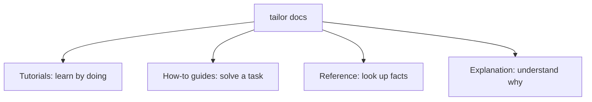

# tailor documentation

This documentation follows the [Diátaxis](https://diataxis.fr/) framework: each section has a different job.

## Sections

- [Tutorials](tutorials/README.md) — start here if you are new to tailor.
- [How-to guides](how-to/README.md) — focused recipes for common tasks.
- [Reference](reference/README.md) — complete CLI and YAML details.
- [Explanation](explanation/README.md) — the model behind workspaces, matrices, cells, and merging.

## Quick links

- [Getting started](tutorials/getting-started.md)
- [Your first matrix](tutorials/your-first-matrix.md)
- [CLI reference](reference/cli.md)
- [Image definition reference](reference/image-yaml.md)
- [Merge directives](reference/directives.md)
- [Core concepts](explanation/concepts.md)
