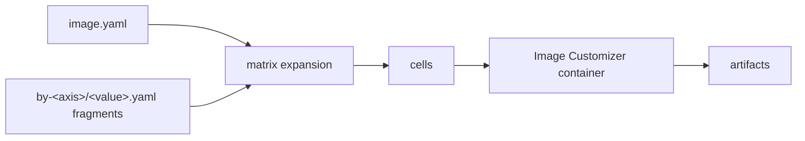
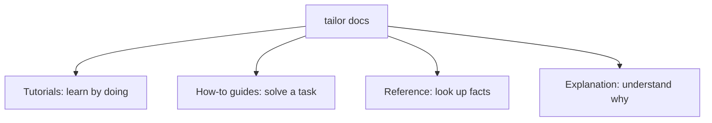

# tailor

**Manifest-driven front-end for the Azure Linux Image Customizer.**

tailor lets you describe Azure Linux images in small YAML definitions instead of hand-writing Docker/Image Customizer invocations. It merges layered `image.yaml` fragments, expands matrices into build cells, resolves base images, and runs the Azure Linux Image Customizer (`mcr.microsoft.com/azurelinux/imagecustomizer`) once per cell. The `config:` tree remains Image Customizer YAML: tailor passes it through without modeling the IC schema.

## Documentation

This documentation is organized into four sections, each with a different job.

## Sections

- [Tutorials](tutorials/README.md) — start here if you are new to tailor.
- [How-to guides](how-to/README.md) — focused recipes for common tasks.
- [Reference](reference/README.md) — complete CLI and YAML details.
- [Explanation](explanation/README.md) — the model behind workspaces, matrices, cells, and merging.

## Quick links

- [Getting started](tutorials/getting-started.md)
- [Your first matrix](tutorials/your-first-matrix.md)
- [CLI reference](reference/cli.md)
- [Image definition reference](reference/image-yaml.md)
- [Merge directives](reference/directives.md)
- [Core concepts](explanation/concepts.md)
