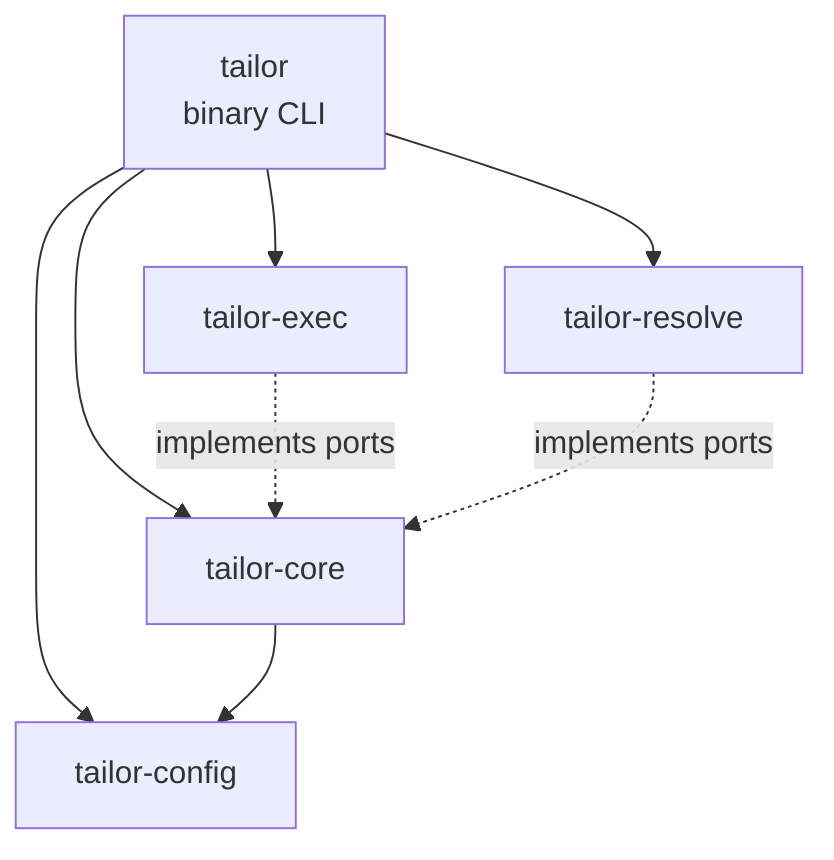

# Architecture

tailor is split into small Rust crates with an inward dependency direction.

| Crate | Responsibility |
| --- | --- |
| `tailor-config` | Parse `tailor.yaml`/`image.yaml`, expand matrices, merge fragments, interpolate params, render cells. |
| `tailor-core` | Domain model, build plans, lockfile/stamp logic, orchestration, and port traits. |
| `tailor-resolve` | Resolve toolchain and base image digests/hashes. |
| `tailor-exec` | Docker/Bollard execution adapter, IC arg construction, path translation, cleanup. |
| `tailor` | CLI parsing, command dispatch, output formatting, and composition root. |

The config-to-render path is deterministic and synchronous. Container execution is the async boundary because Docker/Bollard and log streaming are async.
