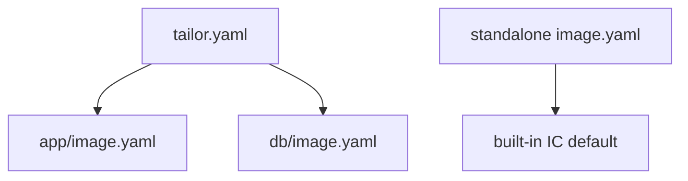

# Concepts

## Workspace and standalone mode

A workspace has a `tailor.yaml` at its root. tailor finds it by walking up from the current directory. Member images are normally auto-discovered as immediate `*/image.yaml` files.

If no `tailor.yaml` exists, tailor treats the current directory's `image.yaml` as a standalone image and uses the built-in default IC toolchain unless the image defines one inline.



## Images

An image is the authoring unit. It has top-level tailor fields such as `name`, `base`, `matrix`, `outputs`, `params`, `rpmSources`, and `features`. Its `config:` tree is Image Customizer YAML and remains opaque to tailor.

## Matrices, axes, and cells

`matrix:` declares named axes. The cartesian product creates cells. Each cell is one Image Customizer invocation and one output artifact.

```yaml
matrix:
  arch: [amd64, arm64]
  edition: [lite, pro]
```

This creates four axis tuples before outputs are considered. Declare axes widest → most-specific, so
`arch` comes first.

## Slugs

A cell slug is:

```text
<image>_<axis values in matrix order>_<format>
```

For example:

```text
gizmo_amd64_lite_cosi
```

Axis values cannot contain `_`, because `_` separates slug components.

## Fragments

Fragments are per-axis deltas:

```text
gizmo/
  image.yaml
  by-arch/amd64.yaml
  by-arch/arm64.yaml
  by-edition/lite.yaml
  by-edition/pro.yaml
```

`by-edition/pro.yaml` applies only to cells where `edition=pro`. `by-feature/<name>.yaml` applies when the image lists that feature; features do not multiply the matrix.
