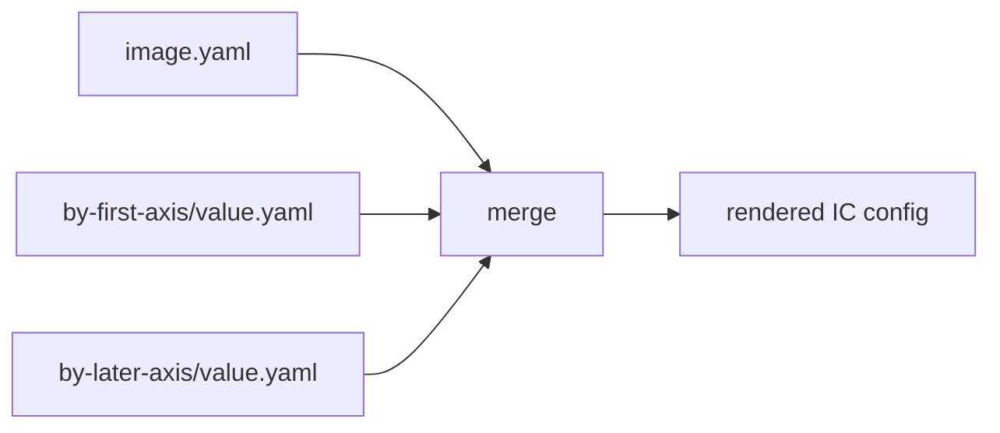

# Merge model

The merge model is designed to be deterministic and reviewable.



## Precedence is axis declaration order

Fragments apply in the order axes are declared in `matrix:`. A later axis wins later `$set` conflicts and appends later to lists.

```yaml
matrix:
  edition: [lite, pro]
  channel: [stable, edge]
```

Here `by-edition/...` applies before `by-channel/...`. This is intentional: adding a directory or changing alphabetical order cannot silently change precedence. Authors control precedence where they declare the axes.

## Maps, lists, and scalars

- Maps deep-merge.
- Lists append by default.
- Differing scalar assignments conflict unless the later assignment uses `$set`.

This makes accidental double ownership loud while keeping additive IC lists easy.

## Why no IC-aware merge?

tailor does not know that an IC list contains packages, partitions, filesystems, or services. It does not merge list items by `id` or deduplicate packages. If a structured list must change, own the whole list in the fragment or use `$replace`.

That keeps tailor a thin wrapper over Image Customizer rather than a second IC schema implementation.
