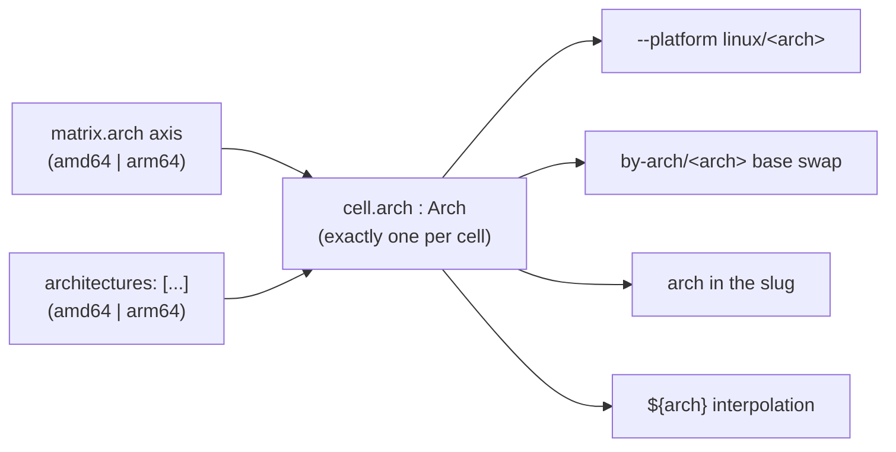

# The `arch` axis & platform model

> **Status:** Implemented · _last reviewed 2026-06-29_
>
> The reserved `arch` axis, amd64 default, catalogue-slot arch reconciliation, and OCI platform mismatch validation are implemented in `crates/tailor-config/src/schema.rs` and `crates/tailor-core/src/orchestrator.rs`. Per-image `architectures` is gone; only `Defaults.architectures` remains.

`arch` is tailor's one **reserved** matrix axis: it looks like any other axis, but it is *typed* and
wired to the container platform and base selection. That is true today but quiet, and it carries two
**silent footguns** — the `arch`-axis-vs-`architectures` precedence, and a base whose architecture can
diverge from the cell's arch. This doc makes the reserved status explicit, defines how a cell's
**effective arch** is reconciled from the image and the base image, and proposes validating it so a
mismatch fails loudly instead of producing a broken image.

---

## 1. `arch` is the reserved axis (current behavior)

Every other axis (`variant`, `runtime`, `type`, `edition`, …) is an **opaque label**: any
`[A-Za-z0-9.-]` string, meaningful only for partitioning the matrix, `${axis}` interpolation, `by-axis/`
fragments, and `--select`. `arch` is all of that **plus** real semantics tailor reaches into *by name*:

> **Terminology** (three related names, *not* separate features):
> - **architecture** — the concept: a CPU target, `amd64` or `arm64`. Wherever this doc writes
>   "architecture" in plain text (e.g. "a base whose architecture is arm64"), it means exactly this.
>   There is **no** singular `architecture:` field anywhere. The default architecture is **`amd64`**.
> - **`arch`** — the *name* tailor uses for it everywhere: the matrix axis, `${arch}`, the base swap in
>   `by-arch/<arch>.yaml`, the slug, `--platform linux/<arch>`.
> - **`architectures:`** — a *field* listing the target architectures: a **workspace default** in
>   `tailor.yaml` (`defaults.architectures`, `schema.rs:306`) that overrides the `amd64` default, and
>   today also a redundant per-image field (`schema.rs:336`) this doc proposes to drop (§3, §5). It is
>   shorthand for an `arch` axis — one cell per listed architecture — so "the `arch` axis or
>   `architectures`" below means either.
>   "the `arch` axis or `architectures`" below means either spelling.

| Property | Free-form axis (`variant`, …) | Reserved `arch` |
| --- | --- | --- |
| Value domain | any `[A-Za-z0-9.-]` string | **closed**: `amd64` \| `arm64` (`parse_arch`; else `MissingArchBase`) — `orchestrator.rs:250` |
| How it's declared | `matrix:` only | `matrix.arch` axis **or** the `architectures:` field — **equivalent** (`2026-06-22-design.md:382`) |
| Always present? | only if declared | **yes** — `architectures` (image, else `defaults.architectures`) gives every cell a concrete arch, and an `arch` coordinate is injected so `--select`/`${arch}`/`by-arch/` work either way (`orchestrator.rs:248-259`) |
| Drives the container | no | **`--platform linux/<arch>`** (`orchestrator.rs:142,190` → `arg_builder.rs:215`) |
| Drives the base | no | a **`by-arch/<arch>.yaml`** fragment swaps `base` per arch (and a catalogue slot's `arch` must match) |
| Slug | in declared order | always present; **position differs** by spelling (`slug_for`, `orchestrator.rs:317-333`) |
| Precedence | by declaration order | treated as the **broadest** axis (`2026-06-29-directive-design.md:231`) |

**Footgun A — silent precedence.** If both an `arch` axis *and* `architectures` are set, the axis wins
and `architectures` is **silently ignored** (`orchestrator.rs:248-254`). The fix is to drop the
redundant **per-image** `architectures:` field, keeping only the `tailor.yaml` workspace default (§3, §5).

---

## 2. The effective arch — one per cell, reconciled

Every cell resolves to exactly one **effective arch**, and that single value drives everything:
`--platform linux/<arch>`, the base swap (`by-arch/<arch>.yaml`), the slug, and `${arch}`. The effective
arch is **reconciled**
from two declarations:

- the **image arch** — the `arch` axis in `image.yaml` (today also the redundant `architectures:` field,
  §5); and
- the **base-image arch** — a catalogue slot's `arch` ([`2026-06-29-base-image-catalogue.md`](./2026-06-29-base-image-catalogue.md) §5.1),
  or the architecture component of an `oci.platform`.

The rule (the full table is §3):

- both unset → **`amd64`** (the declarative default; overridable workspace-wide in `tailor.yaml`);
- exactly one set → it **fills in** the other;
- both set → they **must agree**, else it is an **error** (declaring two conflicting arches is invalid
  input).

A `path` / `azureLinux` base declares no arch, so it never conflicts — the image arch decides. A
catalogue slot's `arch` and an `oci.platform`'s arch component do participate, so a slot can even
*supply* the arch to an image that declares none.

---

## 3. Reconciling image arch × base-image arch

|  image arch ↓ \ base-image arch → | _(unset)_ | `arm64` | `amd64` |
| --- | --- | --- | --- |
| **_(unset)_** | `amd64` * | `arm64` | `amd64` |
| **`arm64`** | `arm64` | `arm64` | **error** |
| **`amd64`** | `amd64` | **error** | `amd64` |

\* The both-unset default is `amd64`, overridable workspace-wide in `tailor.yaml`
(`defaults.architectures`). It is **not** the host arch — a fixed default keeps a workspace
reproducible regardless of which machine builds it.

- **Either side may supply the arch.** `base: { ref: core_arm64 }` (slot `arch: arm64`) makes the
  cell arm64 with no `arch` axis at all; symmetrically an `arch` axis makes the cell arm64 even if the
  base declares nothing.
- **Both unset → `amd64`** (or the `tailor.yaml` override). To build a non-default arch (e.g. an `arm64`
  image) you **declare** the target: a catalogue base whose `arch: arm64`, or `arch` in `image.yaml`
  (axis, or alongside a directly declared base). A base that can't match the resolved arch is **invalid
  input**, surfaced as an error.
- **A conflict is a hard error**, naming the cell, the image arch, and the base-image arch, surfaced by
  `validate` (no I/O needed) — instead of today's silent mispull.

The effective arch is then the *single source of truth*: `--platform linux/<arch>`
(`orchestrator.rs:142,190` → `arg_builder.rs:215`), the `download` pull platform, the slug, and
`${arch}` all derive from it.

### Today (the silent divergence this fixes)

- The container `--platform` is **always** `linux/<cell.arch>` (`orchestrator.rs:142,190`), where
  `cell.arch` comes solely from the image (axis/`architectures`).
- `oci.platform`, if set, overrides **only the base-digest** platform (`oci.rs:13-16`) and is **not**
  checked against `cell.arch`. So `base: { oci: { uri: …, platform: linux/arm64 } }` on an **amd64**
  cell pulls the **arm64** manifest into an **amd64** container → a broken image, no warning. (`path`
  and `azureLinux` cannot diverge — neither declares an arch.) The §3 matrix replaces this with an
  explicit reconcile-or-error.

### Collapse the per-image `architectures:` field

Today an arch can come from an `arch` axis **or** an `architectures:` field, and if both are set the
axis silently wins (`orchestrator.rs:248-254`). The per-image field is redundant: with `amd64` as the
default, a workspace override in `tailor.yaml` (`defaults.architectures`), and the base-image `arch`
able to supply the target, the per-image arch sources need only be the **`arch` axis** and the **base
image**. So the proposal: keep the **workspace default** (`tailor.yaml: defaults.architectures`, the
only place to override `amd64`), and **drop the per-image `architectures:` field** — removing the
silent-precedence footgun. Until that lands, both-set should warn (`--strict` error).

---

## 4. Catalogue interaction

A catalogue slot carries its **own** `arch` precisely because `tailor bases download` runs
cell-independently — there is no cell to derive an arch from
([`2026-06-29-base-image-catalogue.md`](./2026-06-29-base-image-catalogue.md) §5.1). When a cell then references the slot
(`base: { ref: <name> }`), the slot's `arch` becomes the **base-image arch** in the §3 matrix: it
agrees with, fills in, or conflicts with the image arch. This finally closes the loop that direct
`path` bases leave open (today tailor only *warns* on a `base.path` shared across arches and never
inspects the file — `2026-06-22-design.md` §6); a named slot makes the base's arch explicit and checkable.

---

## 5. Recommendations

1. **Make it obvious.** Document `arch` as the reserved axis — its dual spelling, closed value set, and
   platform/base wiring, plus the effective-arch matrix (§3) — prominently in
   `docs/reference/image-yaml.md` and `meta/docs/2026-06-22-image-definitions.md` on implementation (not buried in
   a matrix-table footnote).
2. **Reconcile + validate** the image arch against the base-image arch (§3) at config-resolution time,
   covered by `validate`.
3. **One effective arch per cell** is the single source of truth; `--platform`, the pull, the slug, and
   `${arch}` all derive from it.

---

## 6. Open questions

1. **More architectures.** The closed `{amd64, arm64}` set lives in `parse_arch`. Adding `riscv64`
   means growing it (and `Arch`); is that in scope?
2. **`oci.platform` vs slot `arch`.** A catalogue slot uses `arch` (this design). A *direct* `oci` base
   still has a `platform` string (for exact-manifest selection, e.g. `linux/arm64/v8`); its arch
   component feeds the §3 matrix. Should the direct `oci` base also move to `arch` + an optional
   variant, so the surface is uniform, or keep `platform` for the raw-registry case?
3. **Default of `amd64` on an `arm64` host.** The declarative default is `amd64`, so an undeclared
   build on an arm64 host emulates amd64 (or errors if emulation is unavailable). Acceptable for a
   reproducible default; the workspace overrides via `defaults.architectures` if arm64 is the norm.
4. **Cross-arch host builds** (building an `arm64` image on an `amd64` host via binfmt/qemu) are a
   *runtime* concern (`meta/docs/2026-06-29-container-runtimes.md`), orthogonal to this contract — the cell's
   effective arch is still the target, regardless of host.
