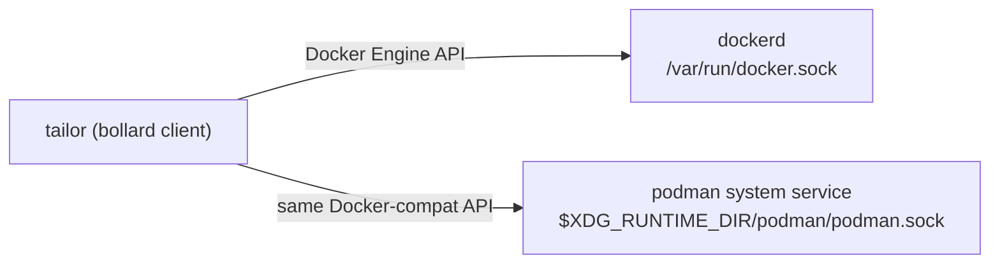
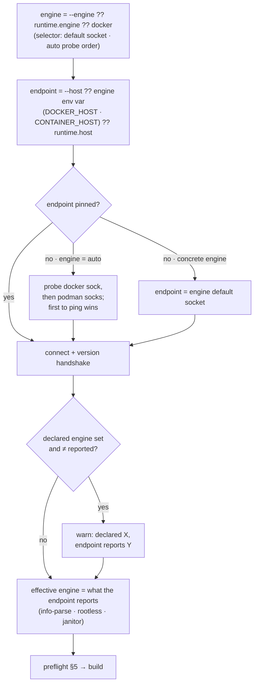
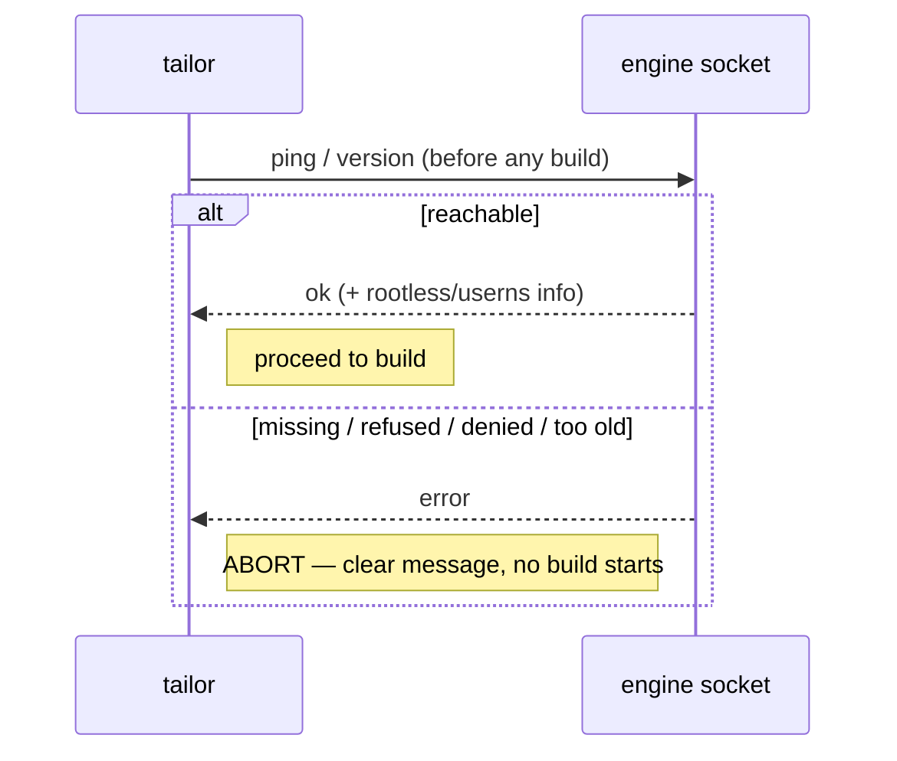
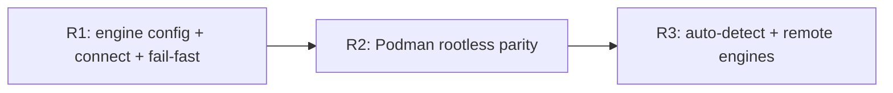

# tailor — Alternate container runtimes (Podman)

> **Status:** Partially implemented (R1 connection/fail-fast) · _last reviewed 2026-06-29_
>
> Engine selection, `runtime.engine`/`runtime.host`, CLI overrides, connection planning, `auto` probing, and fail-fast preflight exist in `crates/tailor-config/src/schema.rs`, `crates/tailor-exec/src/container/connection.rs`, and `crates/tailor-exec/src/container/runtime.rs`. Live rootless-Podman parity and remote-engine support remain R2/R3 work.

---

## 1. Current state

tailor runs Image Customizer in a container through the Rust **`bollard`** crate, which speaks the
**Docker Engine HTTP API** (design §7.1). The relevant seams already exist:

- **`ContainerRuntime` trait** (`tailor-core::ports`) — `pull_image`, `create_and_run`,
  `daemon_info`. `IcExecutor<R>` is generic over it, so the engine is already an injected dependency.
- **`BollardRuntime`** (`tailor-exec`) — the one implementation; connects via
  `Docker::connect_with_local_defaults()` (honors `DOCKER_HOST`, else the default Docker socket).
- **`DaemonInfo { rootless, userns_remap }`** — already parsed from `docker.info()` and used to decide
  ownership normalization (the janitor, §7.7). The design *already anticipates* rootless/userns
  engines.

What's missing: any way to **choose** an engine, connect to a non-default socket, or **fail fast with
a clear message** when the engine isn't there.

---

## 2. Key insight — Podman already speaks the Docker API

Podman ships a **Docker-compatible REST API**: `podman system service` (or the socket-activated
`podman.socket`) exposes the same Engine API `bollard` already uses. So **Podman needs no new
`ContainerRuntime` implementation** — it is the existing `BollardRuntime` pointed at Podman's socket.
The subset tailor uses (create/start/attach/wait/remove/pull/info) is covered by Podman's compat API.



So "support Podman" is three concerns, none of which is a rewrite:

1. **Configuration** — let the user pick the engine and/or socket (§3).
2. **Connection resolution** — map that to a `bollard` connect call (§4).
3. **Fail fast** — verify the engine is reachable *before* a build, with an actionable error (§5).

Plus a set of **Podman-specific nuances** (rootless, the janitor, privileged) that mostly *help*
tailor's no-`sudo` story (§6).

---

## 3. Configuration surface

Extend the existing workspace `runtime:` block (which already holds `privileged`, `mounts`,
`buildDir`, `logLevel`, `imageCacheDir`, `janitorImage`) with an engine selector and an optional
explicit endpoint:

```yaml
# tailor.yaml
runtime:
  engine: podman          # docker (default) | podman | auto
  # Optional explicit endpoint. Omitted ⇒ derived from `engine` (its default socket) or the
  # DOCKER_HOST / CONTAINER_HOST environment variable.
  host: unix:///run/user/1000/podman/podman.sock
```

- **`engine`** — `docker` (default, unchanged behavior), `podman`, or `auto`.
- **`auto`** — probe known endpoints in order (Docker socket / `DOCKER_HOST`, then the rootless and
  rootful Podman sockets) and use the **first that answers** a ping; if none answer, fail fast (§5)
  listing every endpoint tried.
- **`host`** — an explicit endpoint (`unix://…`, `tcp://…`, `ssh://…` for remote Podman), overriding
  the engine default.
- **`engine` and `host` are two orthogonal axes — they compose, they don't conflict.** `host` picks
  *where* to connect; `engine` is a **selector** that picks the default socket (when `host` is unset),
  the `auto` probe order, and the engine name in messages. What actually governs *runtime behavior* —
  `info`-parsing, rootless/userns detection, the janitor chown (§6) — is the engine the endpoint
  **really is**, learned from the `version` handshake (§5). The socket is ground truth: you can't
  impose Podman semantics on a real Docker daemon, or vice-versa. Each axis resolves independently
  (CLI flag → env var → manifest → default):
  - **engine (selector)** = `--engine` → `runtime.engine` → `docker` (default).
  - **endpoint** = `--host` → engine env var (`DOCKER_HOST` for docker · `CONTAINER_HOST` for podman)
    → `runtime.host` → (engine `auto` ⇒ probe, §4; otherwise the engine's default socket).

  So `--host` does **not** override `--engine` (or vice-versa) — the earlier "single ladder" framing
  was wrong. When a host is pinned, the `version` handshake reconciles declared-vs-actual:
  - **`engine: auto`** asserted nothing, so tailor silently **adopts** whatever the endpoint reports
    (Podman names itself in the version components).
  - **An explicit `engine` that disagrees with the endpoint** — e.g. `--engine podman --host
    /var/run/docker.sock` (endpoint is really Docker), or `--engine docker` pointed at a Podman socket
    — tailor follows the **actual** daemon and logs a **non-fatal warning** that the declared engine was
    overridden. It does *not* honor the wrong label, because applying the wrong engine's semantics (e.g.
    Podman-rootless assumptions against a rootful Docker daemon) would misread ownership and break the
    build. The explicit `engine` still did its *selector* job (default socket / probe order); it just
    can't override physical reality.

**Default endpoints by engine** (used when `host` is unset and no env override):

| engine | rootless socket (preferred) | rootful socket |
| ------ | --------------------------- | -------------- |
| docker | `DOCKER_HOST` else `/var/run/docker.sock` | `/var/run/docker.sock` |
| podman | `$XDG_RUNTIME_DIR/podman/podman.sock` | `/run/podman/podman.sock` |

`runtime` stays workspace-scoped (like toolchains/defaults); the per-build `--engine`/`--host` flags
cover the "build this one on Podman" case.

---

## 4. Connection resolution

A small resolver turns `(engine, host, env, flags)` into one `bollard` connect call — the only new
code `BollardRuntime` needs:



The declared engine is resolved **first**, but it's only a *selector* — `--host` (or `runtime.host` /
an env var) overrides
the *endpoint*, and the **actual** daemon at that endpoint drives behavior. So `--engine podman --host
tcp://builder` reaches that endpoint, and if it really is Podman you get Podman semantics; if it turns
out to be Docker, tailor uses Docker semantics and warns. A stray `DOCKER_HOST` is ignored unless the
resolved engine is docker.

Endpoint scheme → `bollard`:

- `unix://<path>` (or a bare `/path`) → `Docker::connect_with_unix(path, timeout, API_DEFAULT_VERSION)`.
- `tcp://` / `http://` → `Docker::connect_with_http(...)` (plain, for a local or trusted-network engine).
- `https://` (TLS) → deferred to **R3** (rustls remote, keeps the static binary, no OpenSSL); recognized
  and **rejected with a clear "not supported yet" error** until then.
- `ssh://user@host` (remote Podman) → out of scope for v1; recognized and rejected with a clear error.
- nothing explicit, `engine: docker` → keep `connect_with_local_defaults()` (today's path, so Docker
  users see zero change).

**Implemented as** `BollardRuntime::establish(&ConnectionPlan)` (connect + probe + fail-fast preflight)
and `connection::resolve(&ResolveInputs) -> ConnectionPlan` (the pure resolver); the `ContainerRuntime`
trait and `IcExecutor` are unchanged. `--dry-run` uses a `NoopRuntime` and never connects.

---

## 5. Fail fast — clear error when the engine is missing or unreachable

**Requirement:** a build must abort immediately, with an actionable message, if the selected runtime
isn't available or can't be accessed — never start customizing only to fail mid-flight.

tailor runs an **engine preflight** once, before any image is built (the same "fail fast before the
slow privileged work" pattern as the signing preflight, 2026-06-29-signing.md §5.1):

1. Resolve the endpoint (§4).
2. **Ping** it — a cheap `bollard` `ping()`/`version()` round-trip — and fetch `daemon_info()`.
3. On failure, classify the error and emit a **specific, actionable** message; otherwise proceed.



Error classification → message (each names the **engine**, the **endpoint**, and a **fix**):

| Condition | Detected as | Message (shape) |
| --------- | ----------- | --------------- |
| Socket file absent | `connect`/ENOENT | `podman engine not found: no socket at <path>. Start it: \`systemctl --user start podman.socket\` (rootless) or \`podman system service\`.` |
| Daemon not running | connection refused | `cannot reach the docker engine at <path> (connection refused). Is the daemon running?` |
| Permission denied | EACCES on socket | `permission denied opening <path>. Add your user to the \`docker\` group, or use rootless Podman.` |
| API too old / incompatible | version handshake | `<engine> at <path> speaks API <v>, tailor needs ≥ <min>.` |
| `engine: auto`, none answer | all probes fail | `no container engine reachable — tried <docker sock>, <podman sock>. Set runtime.host or start an engine.` |

This is surfaced **non-fatally** by `tailor validate` / `--dry-run` (they *report* engine
availability without failing, since they don't run containers) and is a **hard gate** for `build` /
`clean` / anything that actually executes. The check reuses `daemon_info()`, so it also primes the
rootless/userns decision (§6) in the same round-trip.

The same `version()` round-trip also settles the **effective engine** (§3): tailor uses whatever the
endpoint actually reports to drive `info`-parsing, rootless/userns detection, and the janitor decision
— the socket is ground truth, since you can't impose Podman semantics on a real Docker daemon (or
vice-versa). When an explicitly declared `engine` disagrees with what the endpoint reports, tailor
**follows the endpoint** and logs a **non-fatal warning** (e.g. `--engine podman, but
/var/run/docker.sock reports Docker <v>; using Docker`). `engine: auto` adopts the reported engine
silently. Engine identity never *fails* the preflight on its own — only an unreachable or incompatible
endpoint does.

---

## 6. Podman-specific considerations

Most Podman differences *help* tailor (rootless aligns with the no-`sudo` goal), but a few need care:

| Concern | Docker | Podman | tailor impact |
| ------- | ------ | ------ | ------------- |
| **Rootless** | opt-in, uncommon | the common mode | Files written as "root" in the container map to the **calling user** via userns — so the **janitor chown may be unnecessary**. `daemon_info()` already gates this; just make sure it detects Podman-rootless (next row). |
| **`info()` rootless detection** | `security_options` contains `rootless` | Podman's compat `info` reports rootless differently (e.g. `host.security.rootless`) | `daemon_info()`'s `security_options.contains("rootless")` parse likely **needs a Podman-aware branch**. Open question (§7). |
| **`--privileged` + `-v /:/host`** | works | works (within the user namespace when rootless) | IC's privileged/host-root contract is preserved; confirm a rootless privileged IC run can write the output (E2E validation). |
| **`--platform linux/<arch>`** | supported | supported | unchanged. |
| **Pull by digest, `--rm`, attach/wait** | supported | supported via compat API | unchanged. |
| **Image refs** | Docker Hub default | Podman may need fully-qualified registries | tailor already uses fully-qualified refs (`mcr.microsoft.com/...`), so no short-name ambiguity. |

The upshot: on **rootless Podman**, tailor can plausibly drop the privileged janitor chown entirely
(ownership is already the caller's), which is a strictly better posture than rootful Docker — the
existing `DaemonInfo` plumbing is what makes that automatic.

---

## 7. Open questions / assumptions to validate

1. **Podman `info` rootless/userns shape** — confirm the compat-API `info` fields and update
   `daemon_info()` so rootless Podman is detected (drives the janitor decision).
2. **Rootless privileged IC run** — validate end-to-end that a rootless Podman + `--privileged` +
   `-v /:/host` IC `customize` produces a correct, caller-owned artifact (the correctness bar).
3. **Socket auto-discovery** — exact rootless path (`$XDG_RUNTIME_DIR/podman/podman.sock`) vs. rootful
   (`/run/podman/podman.sock`), and whether to socket-activate (`podman.socket`) if absent.
4. **Remote engines** (`ssh://` Podman, `tcp://` Docker) — defer to a later milestone; note TLS via
   rustls keeps the static binary.
5. **`auto` probe ordering & latency** — bound each probe with a short timeout so `auto` fails fast
   rather than hanging on a dead endpoint.
6. **bollard compat coverage** — verify every call tailor makes (create/start/attach/wait/remove/
   pull/info) behaves identically on Podman's compat API across the supported Podman versions.

---

## 8. Non-goals

- A general OCI-runtime abstraction or direct `containerd`/`nerdctl`/`crun` support — tailor targets
  engines that speak the **Docker Engine API** (Docker, Podman). Others are out of scope.
- Managing the engine lifecycle (starting `podman system service` for the user) — tailor *detects and
  guides*, it does not start daemons.
- Changing IC's privileged/host-root contract — that is IC's, inherited unchanged.

---

## 9. Milestones



- **R1 — selectable engine + fail-fast.** ✅ *Implemented.* `runtime.engine`/`host`, `--engine`/`--host`,
  env overrides, the connection resolver (`tailor-exec::container::connection`), and the **engine
  preflight** with classified errors (`BollardRuntime::establish`). Docker behavior unchanged; Podman
  works when pointed at its socket. `engine: auto` probing and declared-vs-detected reconciliation are
  in; their end-to-end validation against a live Podman is R2/R3.
- **R2 — Podman rootless parity.** Fix `daemon_info()` Podman detection; validate the rootless
  privileged IC run E2E; skip the janitor chown when ownership is already the caller's.
- **R3 — auto & remote.** `engine: auto` probing with bounded timeouts; remote `ssh://`/`tcp://`
  endpoints over rustls.

---

## 10. Summary

Supporting Podman is small because Podman speaks the Docker Engine API and tailor already hides the
engine behind `ContainerRuntime` + `DaemonInfo`. The work is: a `runtime.engine`/`host` config (plus
env/flag overrides), a connection resolver that points `bollard` at the chosen socket, and a
**fail-fast engine preflight** that aborts a build with a specific, actionable error when the selected
runtime is absent or inaccessible. Rootless Podman is a bonus — it can make tailor's no-`sudo` posture
even cleaner by removing the janitor chown.
