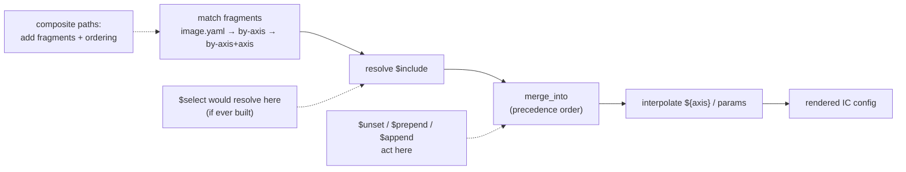
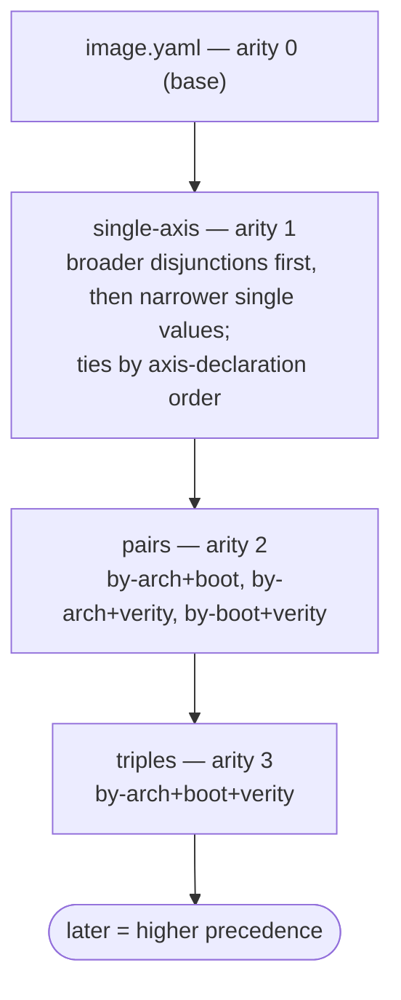

# Directive & fragment design

> **Status:** Implemented · _last reviewed 2026-06-29_
>
> `$unset`, composite fragment paths, `$prepend`/`$append`, reserved `$select`, and `tailor explain` are implemented in `crates/tailor-config/src/merge.rs`, `fragment.rs`, `render.rs`, and `crates/tailor/src/run.rs`. Deferred candidates remain intentionally unbuilt.

This is the forward design for the capabilities chosen out of the survey in
[`2026-06-29-directive-gaps.md`](./2026-06-29-directive-gaps.md), grounded in the `comparison/` port of Trident's test images.
It specifies five things:

1. **`$unset`** — remove an inherited key (final design; supersedes `2026-06-29-unset-directive.md`).
2. **Composite fragment paths** — let a fragment target a *combination* of axis values: a conjunction
   across axes (`by-a+b/x+y.yaml`) or a disjunction within one axis (`by-a/x+y.yaml`).
3. **`$prepend` / `$append`** — add items to either end of an inherited list.
4. **`$select`** — what the half-wired stub does today, and the decision to keep it reserved.
5. **`tailor explain`** — a CLI inspector that prints the literal merge order for a cell.

Capabilities deliberately **not** built are listed at the end with pointers back to the survey.

| Capability | Kind | Status |
| --- | --- | --- |
| `$unset` | merge directive | **Implemented** — canonical is the bare value `key: $unset` (`merge.rs`) |
| Composite fragment paths (conjunction + single-axis disjunction) | fragment selection | **Implemented** (`fragment.rs`) |
| `$prepend` / `$append` | merge directives (lists) | **Implemented** (`merge.rs`) |
| `tailor explain` | CLI inspector | **Implemented** — prints the ordered merge file list (`render.rs::merge_plan`, `run.rs`) |
| `$select` | merge directive | **Reserved** — errors with a clear `ReservedDirective` (`merge.rs`) |
| interpolated `$include`, `$mergeBy`, `$default`, `$rename`, ragged axes | — | Deferred / not doing — see `2026-06-29-directive-gaps.md` |

Where each piece lives in the existing per-cell pipeline:



---

## 1. `$unset` — remove an inherited key

### Problem

`$set`/`$replace`/`$remove` can change a value, swap a list, or drop list items, but none can remove a
mapping **key**. That blocks lifting a common setting into the shared `image.yaml` while letting a minority
cell render the key *absent*. The port hit this three ways: `os.selinux` (must stay out of the base only
because it is rare), `os.overlays` in `vm-testimages` (a `$remove` leaves `overlays: []` where Trident
omits the key), and the `functest` cell, whose `$remove`s leave `scripts.postCustomization: []`,
`os.additionalFiles: []`, and `os.packages.remove: []` behind.

### Canonical syntax — a bare value sentinel

Set the key's value to the token `$unset`:

```yaml
config:
  os:
    selinux: $unset
```

It reads in place — "`selinux` → unset" — exactly where you'd otherwise see `selinux: { mode: disabled }`.
One spelling covers every case: remove several keys by annotating each; drop a whole subtree by unsetting
the subtree itself.

```yaml
config:
  os:
    selinux: $unset
    overlays: $unset
  scripts: $unset            # remove the entire scripts block, not just a child
```

### The one cost: `$unset` is a reserved value token

`$unset` is recognized at **merge time, before interpolation**, by exact match: a scalar whose entire
value is the string `$unset` is the directive; anything else (`$unsetme`, `/etc/$unset`, `enforcing`) is
literal data. The price is that a field can no longer hold the *literal* string `$unset` — the same bargain
YAML already makes for `null`, `~`, and the `<<` merge key. No real Image Customizer value (hostname,
package, path, mode, size) is ever the string `$unset`, so the collision is theoretical; the tolerated
mapping synonym below is the escape hatch if it ever matters.

### What about `$unset: false`?

In the canonical bare form there is **no boolean at all** — `$unset` *is* the value, so `: false` never
arises. It can only be written in the mapping synonym `selinux: { $unset: false }`, which is exactly the
shape this design moved away from: there `$unset`'s value is filler whose only legal value is `true`, so
`false` is a hard `DirectiveShape` error (it cannot mean "skip the unset" — a do-nothing fragment is
pointless). The mapping form `{ $unset: true }` is accepted as a tolerated synonym, not the recommended
spelling.

### Semantics

- Merge-time, resolved before `interpolate_tree`. A `$unset` produced *by* interpolation (a `${var}` that
  expands to `$unset`) stays literal — recognition precedes interpolation, like `$include`.
- Removing an absent key is a no-op.
- Order-sensitive like the other directives: a later fragment's `$unset` removes a key an earlier one set;
  a later plain value or `$set` re-adds it.
- Unsetting the last key of a nested map leaves the *parent* map in place (possibly empty). To drop the
  parent too, unset it at its own level (`scripts: $unset`, not `scripts: { postCustomization: $unset }`).

### Implementation sketch

Add `const UNSET: &str = "$unset"` in `crates/tailor-config/src/merge.rs`. Recognize it in `merge_mapping`
while iterating overlay entries — that is the only layer that owns the parent `Mapping` and can delete the
entry (`merge_value` only returns a replacement `Value`):

```text
for (key, over_val) in overlay:
    push key onto ctx.path
    if over_val is the scalar string "$unset":
        base.remove(key)                      # no-op if absent
    else:
        base[key] = merge_value(base.get(key), over_val, ctx)
    pop path
```

No boolean to validate, so there is no `$unset: false` branch. (If the mapping synonym is accepted, check
`inner == true` and raise `DirectiveShape` otherwise, reusing the `UnknownDirective` / `UnsupportedDirective`
diagnostic style.) Tests: removes an existing key; absent key is a no-op; a later fragment re-adds; values
that merely *contain* `$unset` stay literal; a `${var}` expanding to `$unset` stays literal.

### Alternatives (not canonical)

- **Parent-position key list — `os: { $unset: [selinux, overlays] }`.** The strongest runner-up: `$unset`
  as a meta-key naming sibling keys to drop (the map analogue of `$remove`). It keeps the invariant
  "directives are always *keys*, values are always literal data", so it needs **no** value-token
  reservation — but the removal reads away from the key, and it is the first directive to sit *alongside*
  data keys. If the team values keeping scalars strictly literal over the in-place reading, switch to this
  form; it is a one-line change to each example.
- **Value-position boolean — `key: { $unset: true }`.** Most structurally consistent (sole key of the
  value, like `$set`/`$remove`); kept as a tolerated synonym. Not canonical because the value is filler and
  invites the `$unset: false` trap.
- **`$set: null` / JSON-Merge-Patch "null deletes":** rejected — `null` is a legitimate IC config value, so
  it cannot double as the delete sentinel; that is precisely why a dedicated token is needed.

---

## 2. Composite fragment paths — target axis combinations

### Problem

Some config depends on a **conjunction** of axis values, not on any single axis. Single-axis
`by-<axis>/<value>.yaml` fragments plus the base cannot express "only when `boot=uki` **and**
`verity=root`." In `comparison/vm-testimages`, storage and the `/etc` overlay depend on the *pair*
`(boot, verity)`: UKI+root needs the initrd overlay, UKI+usr must remove it, GRUB+root needs the etc-mount
overlay, GRUB+none needs a different plain layout. `comparison/testimage` had the same shape on
`variant × runtime` (e.g. `selinux-policy`, `containerd-mmap-fix.cil`, `binutils` living on only some
pairs). The port papered over this by normalizing the values *upward* and accepting supersets — losing
per-pair precision.

### Syntax

A fragment may name **several axes** in its directory and the **matching values** in its filename, each
joined by `+`:

```text
vm-testimages/
  by-boot/uki.yaml                 # boot = uki
  by-verity/root.yaml              # verity = root
  by-boot+verity/uki+root.yaml     # boot = uki AND verity = root
  by-boot+verity/uki+usr.yaml      # boot = uki AND verity = usr
```

```yaml
# by-boot+verity/uki+root.yaml — applies only to the (uki, root) cells
config:
  os:
    overlays:
      - mountPoint: /etc
        lowerDirs: [/etc]
        upperDir: /var/lib/overlays/etc/upper
        workDir: /var/lib/overlays/etc/work
        isInitrdOverlay: true
```

**Reading a `+` path.** The number of `+`-joined **axes in the directory** decides how the `+`-joined
**values in the file** are read:

- **Two or more axes** (`by-boot+verity/`): the file names exactly one value per axis, **positionally** — a
  *conjunction* (`boot=uki` AND `verity=root`).
- **One axis** (`by-mode/`): the file may name one *or several* values, all of that axis — one value is
  today's plain fragment; several values is a *disjunction* over that axis (next subsection).

So `+` handles conjunctions *across* axes and disjunctions *within* one axis, but not both at once (no
disjunction inside a conjunction — for that, write the separate files or use `selectors:`). There is no
`any`/`not`/predicate language and no user-facing `match:` (the inline `match:` evaluator in `fragment.rs`
stays internal). `selectors:` still chooses which cells *exist*; composite paths only place deltas onto
cells that do.

### Single-axis disjunction (`by-mode/modeA+modeB.yaml`)

When several values come from **one** axis, the fragment targets a cell whose value on that axis is **any**
of them — for when a few values of one axis share a delta the others do not:

```text
testimage/
  by-mode/dev.yaml             # mode = dev
  by-mode/test.yaml            # mode = test
  by-mode/dev+test.yaml        # mode ∈ {dev, test}  — shared by dev and test, not prod
```

`by-mode/dev+test.yaml` applies iff `cell[mode] ∈ {dev, test}`. It saves copying a shared delta into each
`by-mode/<value>.yaml` without inventing a coarser axis. (If *all but one* value shares the delta, prefer
putting it in the base and overriding/`$unset`-ing the exception.)

### Precedence (the load-bearing rule)

Fragments are applied in a deterministic total order; later application wins for scalars and extends lists.
A fragment that names **more axes is strictly more specific** and must apply later so it can refine the
single-axis fragments it builds on:



Formally, sort fragments by this key (ascending = applied earlier = lower precedence), where `S` is the
set of axes a fragment names:

1. **Arity `|S|`** (how many axes are pinned), ascending — base (0), single-axis (1), pairs (2), … More
   axes ⇒ more specific ⇒ applied later ⇒ wins. For arity 1 this still reduces to today's
   axis-declaration order, so existing single-axis behavior is unchanged.
2. **Axis indices** (the declared positions of `S`), ascending — this is what keeps *cross-axis* order
   following the matrix's axis declaration: `by-arch/…` applies before `by-mode/…` because `arch` is
   declared first, regardless of how many values either names. Breadth (step 3) is **not** allowed to
   leapfrog this, so a `by-mode` disjunction never jumps ahead of an `arch` fragment.
3. **Value breadth**, broader applied **earlier** — but only as a tie-break *within the same axis-set*. A
   single-value `by-mode/modeA.yaml` is narrower (more specific) than a multi-value
   `by-mode/modeA+modeB.yaml`, so on a cell both match (`mode=modeA`) the single-value fragment applies
   **later and wins** — the "singular targets beat disjunctions" rule. For multi-axis composites every axis
   pins exactly one value, so breadth is constant and this step is a no-op.
4. **Deterministic tie-break** for equal arity, axes, *and* breadth — the values in order. Two
   equal-specificity fragments that set the *same scalar* on an overlapping cell (two same-size
   disjunctions like `A+B` and `B+C` overlapping on `B`) are an author smell: settle it with `$set` or
   avoid the overlap.

(The implementation is `crates/tailor-config/src/fragment.rs::Order` — the tuple
`(arity, axis-indices, Reverse(breadth), values, label)`.)

### Validation

- Every axis named in the directory must be a declared axis; every value must be a declared value for its
  axis (closed-axis validation, exactly as single-axis fragments already get).
- **Multi-axis directory** (≥2 axes): the file must name **exactly one value per axis**, positionally in
  directory order (count mismatch → error pointing at the file).
- **Single-axis directory**: the file names one or more **distinct** values of that axis, in the axis's
  **declared value order** (`by-mode/dev+test.yaml`, not `test+dev`) — one canonical spelling per set.
- Axes must appear in **declared order** in the directory name; `by-verity+boot/…` is rejected with a
  suggestion to use `by-boot+verity/…`.
- No duplicate axes (`by-boot+boot`) or duplicate values (`by-mode/dev+dev`). Axis names and values must
  not themselves contain `+` (real values — `amd64`, `uki`, `root`, `dev` — never do).
- A composite/disjunction file whose values can never apply (because `selectors:` prunes them) is a dead
  fragment, not an error; a future `tailor lint` could flag it.

### Implementation sketch

In `fragment.rs` discovery, generalize the `by-<axis>/<value>.yaml` parse: strip the `by-` prefix, split
the directory on `+` for the axis list and the filename stem on `+` for the values. With **≥2 axes**, `zip`
positionally (require equal counts) into an AND predicate; with **1 axis**, treat the values as a set and
build a membership predicate `cell[axis] ∈ {values}` (the existing single-value fragment is the
one-element case). Validate declared axes/values and canonical ordering as above, compute the sort key
`(arity, breadth, tie-break)`, and sort; the `merge_into` loop is otherwise unchanged. Keep arity general,
but note that arity ≥ 3 is usually a sign the thing should be its own image (cf. `2026-06-29-directive-gaps.md` §8).

---

## 3. `$prepend` and `$append` — add to either end of a list

### Problem

Lists **append** in fragment order; the only way to put an item *first* today is `$replace` with the whole
reconstructed list — blunt, and it re-states the inherited items it is trying to preserve. Order is
observable for `scripts.postCustomization`: the port's `grub/none` cell shows a residual
`duid-type-to-link-layer.sh` / `update-os-release.sh` ordering mismatch precisely because scripts can only
land in axis order unless one fragment owns the whole list.

### Why both directives, not just `$prepend`

`$prepend` must be a directive-mapping at the field (like `$replace`/`$remove`), so the field's value stops
being a plain list. That **removes access to the implicit bare-list append** in the same fragment — so a
fragment that needs to touch **both ends at once** (e.g. wrap the inherited scripts with a setup script in
front and a teardown at the back) would be forced back to `$replace` with the full list. A symmetric
`$append` restores the other end and composes with `$prepend` in one mapping:

```yaml
scripts:
  postCustomization:
    $prepend:
      - path: scripts/setup.sh
    $append:
      - path: scripts/teardown.sh
```

`$append: [x]` used alone is semantically identical to today's default bare-list append — its value is that
it is **explicit and combinable** with `$prepend`.

### Semantics

- Valid only for lists. A list field's value is either a plain list (= append, the default) or a
  **list-directive mapping**.
- In one mapping you may combine `$prepend`, `$append`, and `$remove`; `$replace` is **exclusive** (it
  swaps the whole list, so mixing it with the others is contradictory → error).
- Applied to the inherited list `L` for a single fragment, in a fixed order:
  `result = prepend_body ++ (L with $remove matches dropped) ++ append_body`.
- Across fragments (applied in precedence order, including composite paths), each fragment transforms the
  running list, so a **later** fragment's `$prepend` ends up further toward the front and its `$append`
  further toward the back — "later fragments wrap further out".

```yaml
# inherited: [a, b]
# fragment:  { $prepend: [x], $append: [y] }
# result:    [x, a, b, y]
```

### Deferred: anchor inserts and indices

`$insertBefore` / `$insertAfter` (insert relative to a named anchor item) are **not** part of this design —
`$prepend`/`$append` cover every ordering case the comparison produced. Anchored insertion would add
absent-anchor and non-unique-anchor error handling for a need that has not appeared; add it later, exact
match only, if a real mid-list residual shows up. Numeric indices are never added — they are fragile across
fragment reuse.

### Implementation sketch

Add `const PREPEND` / `const APPEND` in `merge.rs`. In the list-merge path, when the overlay value is a
list-directive mapping, evaluate `$remove` then assemble `prepend ++ remaining ++ append`; reject a mapping
that mixes `$replace` with any of the three. The plain-list (append) and `$replace`/`$remove` paths are
unchanged. Tests: prepend-only; append-only equals bare append; both ends in one fragment; two fragments
each prepending (later lands first); `$replace` + `$prepend` in one mapping errors.

---

## 4. `$select` — status and decision

### What it does today (answer: it is **not** supported)

`$select` is a **reserved-but-unimplemented stub**. In `crates/tailor-config/src/merge.rs` there is a
`SELECT` constant and a dispatch branch that returns `ConfigError::UnresolvedDirective`, plus a comment
claiming `$select` is "resolved in earlier passes". **No such pass exists** anywhere in `tailor-config`
(the passes are `include`, `interpolate`, `merge`, `fragment`), and `$select` appears in no reference doc.
So any `$select` written anywhere is a guaranteed hard error at merge — it is a keyword with no behavior.

### Decision: keep it reserved, do not implement now

The comparison never needed it. Choosing a field value by a single axis is already covered by a
`by-<axis>/<value>.yaml` fragment (e.g. the arm64 base swap lives in `by-arch/arm64.yaml`), and
combinations are covered by composite paths (§2). A field-site `$select` mainly buys *co-location* of an
axis's branches — a minor ergonomic win — and is one generalization away from the forbidden `match:`.

Applied cleanup (done in this pass):

- `$select` now returns a dedicated `ConfigError::ReservedDirective` whose message points authors at
  `by-<axis>/<value>.yaml` fragments and composite `by-a+b/x+y.yaml` paths, instead of the misleading
  "must be resolved before merge".
- The stale "resolved in earlier passes" comment in `merge.rs` was corrected to "`$select` is reserved
  and currently errors here".

### If it is ever implemented — the narrow spec

Single axis only, closed-axis-validated, resolved before merge for the current cell:

```yaml
base:
  $select:
    arch:
      amd64: { path: ../artifacts/baremetal.vhdx }
      arm64: { path: ../artifacts/core_arm64.vhdx }
      default: { path: ../artifacts/core.vhdx }
```

Exactly one axis name; branch keys are declared values of that axis plus optional `default`; the chosen
branch replaces the `$select` node and then participates in the normal merge. No multi-axis predicates and
no `all`/`any`/`not` — composite fragment paths remain the sanctioned answer for combinations.

---

## 5. CLI: inspecting the merge order (`tailor explain`)

### Why

With a base, single-axis fragments, single-axis disjunctions, multi-axis composites, and a precedence rule
that ranks them by arity then breadth, it is no longer obvious **which files merge into a cell, or in what
order**. The order is exactly what determines who wins a scalar and how lists assemble, so it deserves a
first-class way to see it. This is a read-only, offline inspector (no container, like `render`/`validate`).

### Shape

Pick a cell the same way `render` does — by slug (`--cell`) or by constraining axes (`-s/--select`) until
one cell remains — and print the ordered list of contributing files:

```text
$ tailor explain trident-vm-testimage --cell amd64_uki_root
cell  amd64_uki_root   (arch=amd64, boot=uki, verity=root, target=standard)

merge order (top = base, bottom wins):
  1  image.yaml                      arity 0   base
  2  by-boot/uki.yaml                arity 1   boot=uki
  3  by-verity/root.yaml             arity 1   verity=root
  4  by-boot+verity/uki+root.yaml    arity 2   boot=uki ∧ verity=root
       └─ $include layouts/packages/verity.yaml
```

Each row shows the file, its arity, and the axis-values that make it apply; `$include`d files are shown
nested under the fragment that pulls them in (in resolution order). The list is the literal sequence handed
to `merge_into`, so reading top-to-bottom is reading precedence low-to-high. For a single-axis disjunction
you can confirm the "singular wins" rule at a glance:

```text
  …
  3  by-mode/dev+test.yaml           arity 1   mode ∈ {dev,test}   (breadth 2)
  4  by-mode/dev.yaml                arity 1   mode = dev          (breadth 1, wins)
```

### Options

- `--cell <slug>` / `-s axis=value …` — choose the cell (reuses the existing selection flags). If the
  selection still matches several cells, list them and exit non-zero, like `render`.
- `--format json` — emit the ordered file list (with arity, matched axes, breadth, `$include` children) for
  tooling instead of the text table.
- `--with-config` — also print the merged IC config after the order (otherwise use `tailor render`).
- *(extension)* `--blame <dotted.path>` — for one field, print only the files that touched it and the final
  winner. Per-field provenance is a natural follow-on but secondary to the file-order view asked for here.

### Implementation note

`explain` reuses the front half of the render pipeline verbatim — match fragments for the cell, resolve
`$include`, sort by the precedence key — then, instead of folding them with `merge_into`, it emits the
ordered (and `$include`-expanded) file list. Because it runs the *same* discovery and sort, the printed
order is guaranteed to match what a real render/build does; it cannot drift from the merge it explains.

---

## Deferred / not doing

Full rationale for each is in [`2026-06-29-directive-gaps.md`](./2026-06-29-directive-gaps.md); summarized here so this doc is
self-contained.

- **Interpolated `$include` paths** (`layouts/storage/${boot}_${verity}.yaml`) — *Medium*. A real
  ergonomics gap, but a pipeline change, not a directive, and it can hide matrix logic inside strings.
  Revisit only after composite paths; if built, interpolate only the include target string with the
  already-built axis/param context and keep cycle detection after interpolation.
- **Merge-by-key for lists** (`$mergeBy: { key: name, … }`) — *Low*. Tempting for `partitions[].id`,
  `users[].name`, `additionalFiles[].destination`, but it fights the IC-agnostic generic-list merge; the
  port read better with whole-layout `$set` ownership.
- **`$default` / set-if-unset** — *Skip*. Put the common value in the base and use `$set` for true
  overrides; absent-minority is the `$unset` case.
- **`$rename`** — *Skip*. An unsupported stub with no demonstrated use and awkward conflict semantics;
  prefer dropping it from the inventory unless a concrete IC schema-migration case appears.
- **Ragged / dependent axes** (an axis that only applies for some values of another) — *not a feature*. When
  one axis value forces all others to a single value it is "a different kind of thing, better kept as its
  own image" (`2026-06-29-directive-gaps.md` §8); the installer split (`trident-installers` vs
  `trident-container-installer`) is the worked example.

## Cross-references

- [`2026-06-29-directive-gaps.md`](./2026-06-29-directive-gaps.md) — the full survey and rationale this design draws from.
- [`2026-06-29-matrix-constraints.md`](./2026-06-29-matrix-constraints.md) — `selectors:` and the "axis value vs separate image"
  philosophy (§7.2) behind §2 and the ragged-axis decision.
- `comparison/NORMALIZATION.md` — the concrete per-item divergences (`overlays: []`, selinux, script
  ordering, installer consolidation) that motivate `$unset`, composite paths, and `$prepend`/`$append`.
