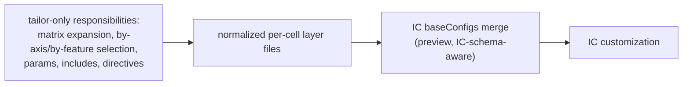
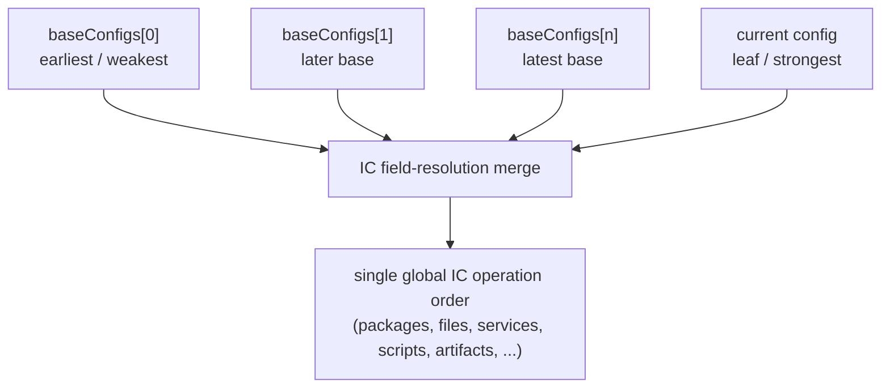
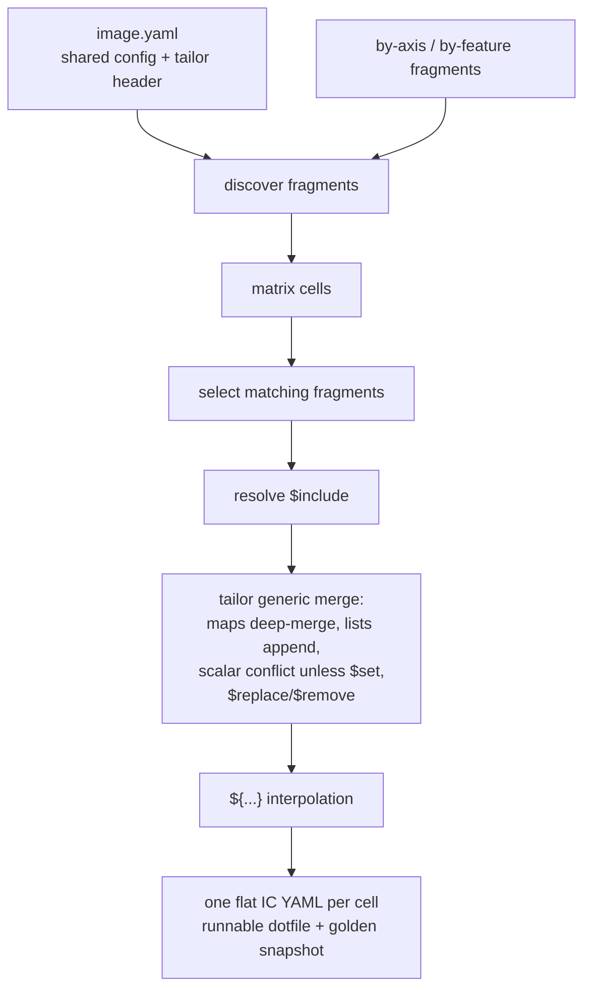
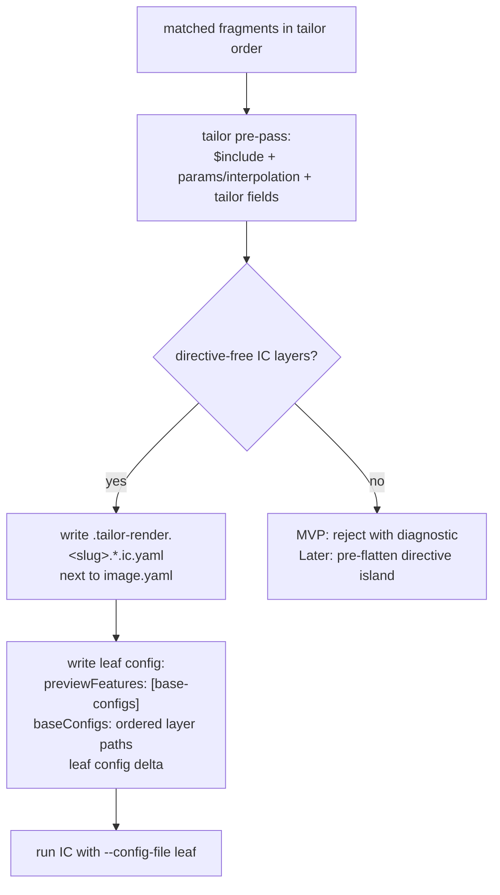

# tailor — Feasibility of deferring config merging to IC `baseConfigs`

> **Status:** Proposed · _last reviewed 2026-06-29_
>
> No `baseConfigs` or `merge: ic` support exists in `crates/tailor-config`/`crates/tailor-exec`; today rendering still goes through `crates/tailor-config/src/render.rs`, `include.rs`, and `merge.rs`. This remains a feasibility proposal for a future opt-in IC-native merge path.

---

## 1. Headline answer

**Yes, but only as an opt-in hybrid for the IC-config merge step.** IC `baseConfigs` can take over
some schema-aware inheritance for already-selected, already-normalized IC YAML layers, but it cannot
replace tailor's matrix expansion, fragment selection, params/interpolation, `$include`, or tailor's
explicit merge directives. A wholesale replacement would remove core tailor behavior; a narrow
`merge: ic` mode may be useful when a workspace values IC-exact behavior over tailor's deterministic
flattened goldens and loud scalar conflicts.



---

## 2. IC `baseConfigs` summary

The IC documentation describes `baseConfigs` as a **preview** feature: "Its API and behavior is
subject to change," and it must be enabled by adding `base-configs` to `previewFeatures`. The field
was added in v1.1. Each entry is a `baseConfig` with a required `path`; the path may be absolute or
relative, and relative paths are resolved relative to the parent directory of the current config file.

The merge order is explicitly ordered inheritance:

- `baseConfigs` is a list of base configuration files to inherit from.
- "When multiple base configs are specified, fields are resolved in order — Fields from later
  configurations override or extend those from earlier ones, or are processed sequentially."
- "The current(last) config's value (if specified) overrides all base configs."
- IC operation ordering applies **globally**, not once per file: the files are "interlaced (and
  merged), not processed sequentially." To process configs sequentially, the docs say to run IC
  multiple times instead of using `baseConfigs`.



IC's semantics are field-specific, not a generic YAML merge rule:

| IC category from the docs | Examples | Meaning for tailor |
| --- | --- | --- |
| Current config overrides all base configs | `input.image.path`, `output.image.path`, `output.image.format`, `output.artifacts.path`, `os.hostname`, `os.imageHistory`, `os.selinux`, `os.uki`, ISO/PXE initramfs/kdump fields | Later/leaf scalar or object values win without tailor's explicit `$set` conflict marker. |
| Base config items are merged with current config's items | `output.artifacts.items`, `os.kernelCommandLine`, `iso.kernelCommandLine`, `pxe.kernelCommandLine` | Additive fields can combine across layers. Exact subfield behavior is IC-owned. |
| Base config items are processed first, then current config's | `os.users`, `os.groups`, `os.services`, `os.packages`, `os.modules`, `os.additionalFiles`, `os.additionalDirs`, `os.overlays`, ISO/PXE `additionalFiles`, `scripts.postCustomization`, `scripts.finalizeCustomization` | Ordered list-like operations map well to tailor's append-by-order authoring style, but they are IC operations, not merely concatenated YAML arrays. |
| Strongest option wins | `os.bootLoader.resetType` | IC applies an enum-strength order: `hard-reset` is stronger than empty/no reset. |

Two important limits follow from the docs. First, `baseConfigs` is marked "Only supported in the
top-level config," so tailor should generate a single leaf/head config with the `baseConfigs` list.
Second, because the API is preview and schema-aware, tailor should not assume that every future IC
field has tailor's current generic "maps merge, lists append" behavior.

---

## 3. tailor's current model, for contrast

tailor currently renders each image definition into one concrete IC config per matrix cell. The input
is an `image.yaml` plus optional `by-<axis>/<value>.yaml` and `by-feature/<name>.yaml` fragments. The
fragment path encodes the common match; inline `match:` handles compound predicates. Fragments apply
in a deterministic total order: `image.yaml` first, then axis fragments in **matrix axis-declaration
order**, then feature fragments in feature declaration order. Later-declared axes therefore have later
merge precedence.

The render pipeline in `crates/tailor-config/src/render.rs` is:

1. discover fragments,
2. expand the matrix into cells,
3. pick fragments whose path predicate and `match:` apply,
4. merge `params` and build a `${...}` interpolation context,
5. resolve `$include` inside each matched `config:` delta,
6. merge deltas with tailor's engine,
7. interpolate `${param}` / `${axis}` strings,
8. resolve tailor target fields (`base`, `outputs`, `rpmSources`), and
9. write one runnable cell config plus optional normalized golden snapshots.



tailor's merge engine is deliberately IC-opaque: it does not model IC field names, key storage lists
by `id`, or validate IC schema. That aligns with design §8: IC owns its config and capabilities.
However, tailor still owns composition invariants: closed axes, deterministic fragment order, loud
scalar conflicts, exactly one `base` per cell, and stable golden output.

---

## 4. Feature-by-feature mapping

| tailor feature / responsibility | Can move to IC `baseConfigs`? | Why |
| --- | --- | --- |
| Layering several IC config files in a known order | **Mostly yes** | This is exactly what `baseConfigs` provides: ordered bases followed by the current config. |
| Map/object composition | **Partly** | IC composes its own schema fields. This is more schema-correct than tailor, but not a generic YAML deep-merge promise for arbitrary unknown paths. |
| Additive list/operation order | **Often yes** | IC processes many list-like fields base-first then current: packages, services, users, files, dirs, scripts, modules, overlays. |
| Whole-field override | **Yes for IC-listed fields** | IC says the current config overrides listed fields such as `os.hostname`, `output.image.format`, `os.selinux`, and others. |
| tailor's loud scalar conflicts | **No** | IC appears to choose later/current values for override fields; it does not expose tailor's "conflict unless `$set`" rule. |
| `$set` | **No, as syntax** | IC has no `$set`. tailor must reject it, lower it to plain YAML before IC, or flatten a directive-bearing segment itself. |
| `$replace` / `$remove` | **No, as syntax** | IC has no generic list replace/remove directives. `$remove` especially requires knowing inherited list contents, so tailor must evaluate it before IC or disallow IC-merge mode for that cell. |
| `$include` splice | **No** | IC `baseConfigs` includes whole config files, not arbitrary subtree/list-element splices. tailor must resolve `$include` before writing IC layers. |
| `${param}` interpolation and `params` | **No** | IC does not know tailor axes or params, and params may reference other params. tailor must interpolate before IC. |
| Matrix expansion (`axes × outputs`, include/exclude, slugs) | **Never** | This is about **which cells exist**, not how IC YAML fields combine. IC has no build matrix concept. |
| `by-<axis>` / `by-feature` fragment selection | **Never** | This is about **which layers apply to which cell**. IC only sees the ordered files tailor gives it. |
| Axis-order precedence | **Never directly** | tailor can preserve this only by ordering the generated `baseConfigs` list according to its fragment order. |
| Per-cell tailor `base` / `outputs` / `rpmSources` | **No** | These are tailor target fields used to assemble IC CLI args and output paths. Some correspond to IC `input`/`output`, but tailor intentionally keeps the target matrix outside opaque IC config. |
| Golden snapshot of final IC config | **No, not authoritatively** | If IC performs the final merge, tailor no longer has IC's exact merged config unless IC exposes one. tailor can snapshot the generated layer set/plan instead. |

The key boundary is: IC can help with **how selected IC layers combine**. It cannot help with
**which layers are selected for a cell** or **which cells exist**.

### 4.1 The decomposition — "can tailor just pass the pieces in order?"

Yes — that is the whole idea, and it is the right split of labor:

- **tailor owns** *which cells exist* (matrix) and *which layers apply, in what order* (fragment
  selection + axis-declaration precedence).
- **IC owns** *how those ordered layers combine* (the field-aware YAML merge).

For a **directive-free** cell, tailor does **no config merging at all** — it hands IC the ordered
pieces as `baseConfigs` and IC produces the merged config. Two things tailor must still apply **to
each piece** first, but **neither is a merge**:

1. **Interpolation / params** — params are *cross-layer* (e.g. `by-arch` sets `efiArch`,
   `by-channel` uses `${efiArch}` in `bootPkg`, the base uses `${bootPkg}`), so tailor gathers the
   params, builds the context, and substitutes `${…}` into each piece. IC has no concept of tailor
   params, so this cannot move to IC. After it, each piece is literal IC YAML.
2. **`$include`** — tailor's `$include` splices a *subtree/list element* into one layer; IC's
   `baseConfigs` includes only *whole files*. So tailor resolves `$include` within each piece. A
   per-file transform, not a cross-layer merge.

So "pass the pieces in order" works **provided the pieces are tailor's interpolated,
`$include`-resolved layers** — not the raw authored fragments. The only **hard blockers** are the
directives that contradict IC's fixed merge policy: `$replace`/`$remove` (IC *appends* lists, so a
later layer cannot replace or remove inherited items by ordering alone) and `$set` on a field where
IC *merges* rather than overrides. Cells using those need tailor to pre-compute just that field
(§5.3); everything else defers cleanly.

---

## 5. Viable proposal: opt-in hybrid IC merge mode

Add an explicit merge-engine choice, probably image-level with a workspace default:

```yaml
# image.yaml or workspace default, proposed
merge:
  engine: tailor   # default; current behavior
  # engine: ic     # opt-in; requires IC baseConfigs preview support at runtime
```

### 5.1 Default remains `tailor`

The default should remain today's flattening engine because it is portable across IC versions,
preserves goldens, and retains strict conflict diagnostics. This also avoids making a v1.1 preview IC
feature mandatory for ordinary tailor users.

### 5.2 `engine: ic` pipeline

For each cell, tailor would still perform all tailor-owned work:

1. expand the matrix and choose the cell,
2. discover and order matching fragments exactly as today,
3. merge/resolve tailor fields (`base`, `outputs`, `rpmSources`, params),
4. resolve `$include` in each `config:` layer,
5. interpolate `${...}` in each layer, and
6. write an ordered set of generated IC layer files plus a leaf/head config containing `baseConfigs`.



The generated files should be colocated in the image directory as dotfiles, e.g.:

```yaml
# .tailor-render.gizmo_lite_amd64_stable_cosi.head.ic.yaml (generated)
previewFeatures:
  - base-configs
baseConfigs:
  - path: ./.tailor-render.gizmo_lite_amd64_stable_cosi.00.image.ic.yaml
  - path: ./.tailor-render.gizmo_lite_amd64_stable_cosi.01.by-edition-lite.ic.yaml
  - path: ./.tailor-render.gizmo_lite_amd64_stable_cosi.02.by-arch-amd64.ic.yaml
  - path: ./.tailor-render.gizmo_lite_amd64_stable_cosi.03.by-channel-stable.ic.yaml
```

Colocation matters because IC resolves `baseConfigs` paths relative to the current config file's
parent directory, and design §7.6 already requires runnable configs to live beside the image's assets
so relative IC paths like `files/...` and `scripts/...` keep working. Using relative `baseConfigs`
paths also avoids embedding host-only absolute paths in YAML; tailor's normal `--config-file` path
translation exposes the head file inside the container.

### 5.3 Directive handling policy

The practical MVP should be conservative:

- `engine: ic` accepts only IC `config:` layers that are **directive-free after `$include` expansion**.
- `${...}` interpolation is still supported because tailor can apply it independently to each layer.
- `$include` is still supported because tailor resolves it before writing layer files.
- `$set`, `$replace`, and `$remove` inside `config:` cause a render-time error explaining that the
  cell needs `engine: tailor` or a future directive-lowering mode.

A later milestone could support "directive islands": when a matched layer contains `$set`, `$replace`,
or `$remove`, tailor pre-flattens the minimal prefix/path segment needed to erase the directive and
then resumes emitting plain IC layers. That is substantially more complex and risks reintroducing two
merge engines in one cell, so it should not be the first version.

### 5.4 `previewFeatures` policy

Because `baseConfigs` itself is generated by tailor in this mode, there are two choices:

1. **Narrow exception:** tailor adds `base-configs` to the generated head config's `previewFeatures`.
2. **Strict opacity:** tailor requires the authored IC config to already include `previewFeatures:
   [base-configs]`, and IC fails otherwise.

The first is more ergonomic but conflicts with design §8's "No `previewFeatures` injection." The
second preserves the config-opaque principle but is awkward because the user must enable a feature
that only tailor's generated head uses. Recommendation: document `engine: ic` as a narrow,
opt-in exception where tailor may synthesize `baseConfigs` and the matching preview token, while still
not scanning or gating any other IC feature.

### 5.5 Dry-run and golden snapshots

`tailor render` / `--dry-run` would need two outputs in IC mode:

- **Plan/layer snapshot:** the generated head config plus each generated base layer, in order. This is
  authoritative for what tailor passes to IC.
- **Optional approximate flattened view:** tailor may continue to offer `--flatten-with-tailor` for
  reviewer convenience, but it must be labeled non-authoritative because IC's schema-aware merge may
  not match tailor's generic merge.

This is the biggest product downside. Today's `.rendered/<cell>.yaml` is the expected final IC config
and shows a shared-fragment blast radius directly. In IC mode, the final merged config lives inside IC
unless IC adds an "emit merged config" capability.

---

## 6. Worked synthetic example

The existing `gizmo` fixture has `edition × arch × channel` cells. In current tailor mode, the
`lite/amd64/stable` cell becomes one flat config after appending packages, resolving
`layouts/storage/lite.yaml`, and substituting `${bootPkg}`.

In IC mode, assuming all layers are directive-free after includes/interpolation, tailor could emit:

```yaml
# generated layer 00 from image.yaml
os:
  kernelCommandLine:
    extraCommandLine: [console=ttyS0, quiet]
  packages:
    install: [gizmo-core, base-extra, boot-stable]
```

```yaml
# generated layer 01 from by-edition/lite.yaml after $include resolution
os:
  hostname: gizmo-lite
  packages:
    install: [widget-lite]
storage:
  bootType: efi
  disks:
    - partitionTableType: gpt
      partitions:
        - id: esp
          type: esp
          size: 64M
        - id: root
          size: grow
  filesystems:
    - deviceId: esp
      type: fat32
      mountPoint: { path: /boot/efi }
    - deviceId: root
      type: ext4
      mountPoint: { path: / }
```

```yaml
# generated head
previewFeatures: [base-configs]
baseConfigs:
  - path: ./.tailor-render.gizmo_lite_amd64_stable_cosi.00.image.ic.yaml
  - path: ./.tailor-render.gizmo_lite_amd64_stable_cosi.01.by-edition-lite.ic.yaml
```

The fixture's `pro` and `edge` cells currently use `$remove`, `$replace`, and `$set`; under the
recommended MVP they would remain `engine: tailor` cells until directive lowering exists.

---

## 7. Trade-offs

| Pros | Cons |
| --- | --- |
| Less generic merge behavior for tailor to own long-term. | Loses the authoritative final flattened golden unless IC exposes one. |
| More aligned with config opacity: IC owns IC schema, field precedence, and future merge behavior. | IC `baseConfigs` is preview, v1.1+, and behavior may change. |
| Behavior matches the IC version actually running. | Scalar conflicts may become silent overrides instead of tailor's loud diagnostics. |
| Future IC merge features can arrive without tailor schema work. | Harder `explain`: tailor can explain selection/order, but not IC's internal field winner without reproducing IC semantics. |
| Avoids pretending tailor's generic list append is IC's authoritative behavior. | Two merge modes (`tailor` and `ic`) are harder to document, test, and support. |
| Natural fit for schema-specific cases such as `bootLoader.resetType` strongest-wins. | Directive-bearing fragments either force fallback or require complex partial pre-flattening. |

---

## 8. Config-opacity angle

Deferring the final IC-config merge is philosophically attractive. design §8 says tailor should not
model IC capabilities or schema: tailor is a wrapper plus generic composer, and IC validates its own
config. `baseConfigs` moves one more IC-specific operation back into IC, where field-specific choices
like package processing order, `output.artifacts.items`, and `bootLoader.resetType` strength belong.

The conflict is with two existing tailor guarantees:

1. **Loud deterministic conflicts.** tailor currently errors when two fragments set different scalar
   values unless the later fragment says `$set`. IC's model is more opinionated and may simply choose
   the later/current value for fields it owns.
2. **Deterministic golden snapshots.** tailor currently writes the final merged IC YAML for review and
   CI blast-radius diffs. In IC mode, tailor can snapshot only the generated inheritance graph unless
   IC can print its resolved config.

So `engine: ic` is more IC-opaque but less CUE-like. It should be presented as a conscious trade:
"trust IC's schema-aware merge" instead of "review tailor's fully flattened merge."

---

## 9. Open questions / assumptions to validate

1. **Exact recursive support.** The docs say `baseConfigs` is only supported in the top-level config.
   Confirm whether base config files may themselves contain `baseConfigs`, and whether tailor should
   forbid generating nested lists regardless.
2. **Relative path resolution inside base config files.** The `baseConfig.path` rule is clear, but the
   docs reviewed here do not fully spell out whether paths inside each base config (`additionalFiles`,
   scripts, overlays, package lists) resolve relative to that base file or to the current leaf file.
   Colocating generated files should make either behavior safe for tailor-generated layers, but this
   needs an E2E test.
3. **Full map semantics.** IC documents field categories, not a generic "all mappings deep-merge"
   algorithm. Validate behavior for nested object fields not explicitly listed.
4. **Scalar override diagnostics.** Confirm whether IC reports any conflict/duplicate diagnostics or
   always applies the documented later/current precedence.
5. **List append vs operation semantics.** For packages, services, users, and additional files, confirm
   whether duplicate entries are preserved, deduplicated, updated by identity, or left to the operation
   implementation.
6. **`previewFeatures` merge behavior.** The docs require `base-configs` in `previewFeatures`, but do
   not list `previewFeatures` in a merge category. Confirm whether preview features from base configs
   are inherited, and whether the leaf must contain every needed token.
7. **`output.artifacts` and generated paths.** Confirm interactions between `baseConfigs`,
   `output.artifacts.path`, and root-owned output cleanup, especially when artifacts are defined in a
   base layer but overridden in the leaf.
8. **IC version policy.** Decide whether `engine: ic` merely lets IC fail on old versions (consistent
   with design §8) or whether tailor should preflight `imagecustomizer --version` for a clearer error.
9. **Merged-config visibility.** Check whether IC has or could add a dry-run/print-merged-config mode;
   without it, IC mode cannot preserve current golden semantics.

---

## 10. Recommendation and milestones

Recommendation: **do not replace tailor's merge engine wholesale.** Keep `engine: tailor` as the
default and consider `engine: ic` only as an opt-in, preview-backed hybrid for directive-free IC
config layers. This preserves today's review/reproducibility story while giving early adopters a path
to IC-exact schema-aware merging.

Staged milestones:

1. **M0 — E2E spike outside the main path.** Generate a small `baseConfigs` chain from the `gizmo`
   fixture style and run IC v1.1+ to validate order, path resolution, and preview behavior.
2. **M1 — Plan renderer.** Add an internal renderer that emits per-cell layer plans but does not build
   with them. Snapshot the head/layers for review.
3. **M2 — Opt-in directive-free build mode.** Support `merge.engine: ic` only when generated IC layers
   contain no `$set`, `$replace`, or `$remove`; keep tailor mode default.
4. **M3 — UX and diagnostics.** Add clear render errors, plan diffs, and `explain` output that shows
   selected layer order while identifying IC as the final merge authority.
5. **M4 — Decide on directive islands.** Based on real usage, either implement minimal pre-flattening
   for directive-bearing segments or explicitly keep IC mode directive-free.
6. **M5 — Revisit default only after stabilization.** Consider broader adoption only if IC
   `baseConfigs` leaves preview and exposes merged-config output sufficient to recover golden diffs.

