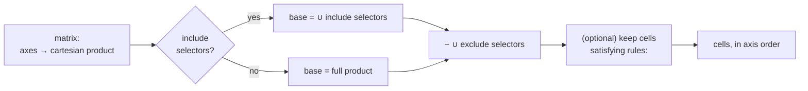

# tailor — Matrix selection: options analysis

> **Status:** Implemented · _last reviewed 2026-06-29_
>
> The selected A1/B2 shape is live: axes are `AxisValues` and selection is the sibling `selectors:` block in `crates/tailor-config/src/schema.rs`, expanded by `crates/tailor-config/src/matrix.rs`. Predicate `rules:` remain intentionally deferred.

---

## 1. Problem

A build matrix is a cartesian product of axes, but real image sets are **not** full products. Today the
only tool to shape them is a subtractive, cell-at-a-time `exclude:`, which states what is *removed* —
so the reader must compute the complement to recover intent. Two representative cases from the
`comparison/` port:

- **`testimage` — mostly full, a few holes.** 3×... but arm64 only applies to the plain host image. The
  rule is one sentence; today it is three `exclude` entries whose *residue* is that sentence.
- **`vm-testimage` — sparse and entangled.** Five axes (`phase`, `boot`, `verity`, `target`, `arch`) but
  only **12 of 48** combinations are real, with interlocking rules (uki ⇒ base+qemu+amd64; uki ⇒ verity;
  usr ⇒ uki; azure ⇒ grub+root+amd64; arm64 ⇒ grub+qemu). `exclude` would need ~36 entries.

A secondary irritation: axes and selection logic share one namespace under `matrix:`, so "what are the
axes?" and "which cells exist?" are visually intermixed.

## 2. Current state

`Matrix` = `IndexMap<axis, Vec<value>>` (axes, flattened) + `include: Vec<Selector>` +
`exclude: Vec<Selector>`. A selector is `axis → scalar` (partial for `exclude`, must-pin-all for
`include`). `expand()` = product − exclude + include. Closed axes: selectors must reference declared
axes/values. Cells emit in axis-declaration order (drives slug order).

## 3. What "good" means here — evaluation criteria

| # | Criterion | Why it matters |
| - | --------- | -------------- |
| C1 | **Reads as intent** | The rule is visible without computing a complement. |
| C2 | **Sparse/entangled fit** | Handles `vm-testimage` without a wall of entries. |
| C3 | **Mostly-full fit** | Handles `testimage` (a few holes) without ceremony. |
| C4 | **Concerns separated** | Axis declaration distinct from selection logic. |
| C5 | **Closed-axis validation** | Typos in axis/value still caught. |
| C6 | **Slug stability** | Cell order/slugs independent of how they were selected. |
| C7 | **Low impl cost** | Contained change to schema + expander. |
| C8 | **Back-compat / migration** | Few in-repo manifests; still, less churn is better. |

There are really **two independent decisions**: (§4) *what is the selection language?* and (§5) *where
do the axes live?* They can be mixed and matched.

---

## 4. Decision A — the selection language

Five concrete options, each shown against both cases.

### A0 — Status quo: scalar `exclude`, cell-at-a-time (baseline)

```yaml
exclude:
  - { runtime: container, arch: arm64 }
  - { variant: root-verity, arch: arm64 }
  - { variant: usr-verity,  arch: arm64 }
```
Subtractive only; vm would need ~36 lines. **C1 poor, C2 poor, C3 ok.**

### A1 — **Selectors** (sub-cube include *and* exclude)  ★ core idea

Generalize a cell selector into a **section** (sub-cube): each axis may be a scalar, a **list**, or
**omitted (= all)**. `include` selectors union; `exclude` selectors subtract; base = union(include) or
full product if no include. (These entries are the **selectors** named in §6.1; "section/sub-cube" is
the region one matches.)

`testimage`, denylist framing:
```yaml
exclude:
  - { arch: arm64, runtime: container }
  - { arch: arm64, variant: [root-verity, usr-verity] }   # list value
```
`testimage`, allowlist framing (reads as the actual rule):
```yaml
include:
  - { arch: amd64 }                                  # every amd64 cell (rest expand)
  - { arch: arm64, runtime: host, variant: plain }   # plus the one arm64 cell
```
`vm-testimage`, allowlist (omitted axes expand, so each block lists only what it constrains):
```yaml
include:
  - { boot: grub, verity: [none, root], target: qemu }          # phase×arch expand → 8
  - { boot: grub, verity: root, target: azure, arch: amd64 }    # phase expands     → 2
  - { phase: base, boot: uki, verity: [root, usr], target: qemu, arch: amd64 }  # → 2
```
The author picks denylist or allowlist per image. Sections subsume A0, the "union-of-products" sketch,
and per-value conditions. **C1 good, C2 good, C3 good, C5/C6 preserved, C7 low.** This is the workhorse.

### A2 — Per-value `when:` (locality on the value)

Attach a condition to an axis *value*:
```yaml
arch:
  - amd64
  - { value: arm64, when: { runtime: host, variant: plain } }
```
Nice locality for `testimage` (one clause next to `arm64`). But it puts logic **inside** the axis
declaration (works against C4), scopes only one value, and for `vm` every value needs a multi-axis
`when` — verbose and scattered. **C1 ok, C2 poor, C3 good.** Weaker than sections; folded in as sugar at
best.

### A3 — Predicate / implication `rules:` (reads like English)

State entangled constraints directly as implications:
```yaml
rules:
  - { when: { boot: uki },     require: { phase: base, target: qemu, arch: amd64 } }
  - { when: { verity: usr },   require: { boot: uki } }
  - { when: { verity: none },  require: { boot: grub } }     # UKI images are always verity
  - { when: { target: azure }, require: { boot: grub, verity: root, arch: amd64 } }
  - { when: { arch: arm64 },   require: { boot: grub, target: qemu } }
```
Cells = product filtered to those satisfying every rule. For `vm` this mirrors the prose constraints
almost word-for-word (great C1/C2 for *entangled* sets). Costs: it's a mini boolean logic (AND/OR,
empty-set surprises — e.g. *omitting* the `none ⇒ grub` rule silently leaves a stray `uki_none` cell),
harder to validate, and less YAML-native than enumerating sub-cubes. Best as an **optional power-tool**
layered on selectors, not the primary. **C1 good, C2 good, C3 ok, C7 higher.**

### A4 — Named value-groups (sugar for terse sections)

Let an image name reusable value-sets, then select by name:
```yaml
groups:
  verityish: { verity: [root, usr] }
include:
  - { boot: uki, $group: verityish, target: qemu, phase: base, arch: amd64 }
```
Helps only when the same slice recurs; for our two cases it adds a layer without much payoff. Defer
until a real case shows repetition. **C1 ok, C7 medium.** Not now.

### Scorecard (selection language)

| | C1 intent | C2 sparse | C3 full | C5 valid | C6 slug | C7 cost |
| --- | --- | --- | --- | --- | --- | --- |
| A0 scalar exclude | poor | poor | ok | yes | yes | — |
| **A1 sections** | **good** | **good** | **good** | yes | yes | low |
| A2 per-value when | ok | poor | good | yes | yes | low |
| A3 predicate rules | good | good | ok | harder | yes | higher |
| A4 named groups | ok | ok | ok | yes | yes | medium |

**Takeaway:** A1 (sections) is the strongest single primitive; A3 (rules) is a compelling *optional*
addition for entangled sets; A2/A4 are sugar that don't earn their keep yet.

---

## 5. Decision B — where the axes live (placement)

Independent of the language above. Three options.

### B0 — Flattened (today): axes + directives share `matrix:`
```yaml
matrix:
  arch:    [amd64, arm64]
  runtime: [host, container]
  include: [...]
  exclude: [...]
```
Zero new concepts; but axes and logic intermix (C4 poor), and an axis-name typo looks like a directive.

### B1 — `axes:` sub-block inside `matrix:` (one key, clear nesting)
```yaml
matrix:
  axes:
    arch:    [amd64, arm64]
    runtime: [host, container]
  include: [...]
  exclude: [...]
```
Separates concerns (C4 good) **without** a new top-level concept; `include`/`exclude` are obviously
siblings of `axes`. Minimal surprise. Good middle ground.

### B2 — Top-level split: `matrix:` (axes) + a selection block ★ user-preferred
```yaml
matrix:                      # the axes — their cartesian product is the candidate cells
  arch:    [amd64, arm64]
  runtime: [host, container]
selectors:                   # which candidates become builds (name TBD — see §6.1)
  include: [...]
  exclude: [...]
```
`matrix:` keeps the word everyone already uses for "the build matrix" and holds *only* the axes; a
second top-level block holds the selection logic. Cleanest separation, reads as two plain-English
nouns, and the axis block is exactly what you'd expect under `matrix:`. Costs a second top-level key
and the larger schema break. (The earlier sketch named the axes `dimensions:`; reusing `matrix:` for
the axes is more familiar and is the user's preference — §6.1 proposes the selection-block name.)

**Placement trade-off:** B1 and B2 both fix C4; B1 keeps everything under one key, **B2 is the most
explicit and is the chosen direction** — `matrix:` = axes, a sibling block = selection. B0 is the least
churn but keeps the conflation.

---

## 6. Recommendation

Treat the two decisions separately and pick a coherent pair:

- **Language: adopt A1 (sections)** as the core — `include`/`exclude` lists where each entry is a
  sub-cube (scalar | list | omitted-per-axis), union then difference, order-independent, stable slugs.
  It is the one change that makes *both* cases read as intent, and it subsumes A0/union/per-value.
- **Placement: adopt B2 — `matrix:` (axes) + a sibling selection block** (the user-preferred split).
  `matrix:` holds only the axes (the word already means "the build matrix"); the selection logic lives
  in its own top-level block, named per §6.1. (B1's `matrix.axes` sub-block remains a lower-churn
  fallback; the engine is identical.)
- **Optionally layer A3 (`rules:`)** later if entangled images like `vm` prove common — it reads
  closest to the underlying constraints, but selectors already cover `vm` today, so it is not blocking.

Keep `exclude` as a first-class framing (denylist) alongside `include` (allowlist); let each image use
whichever states its intent in the fewest, clearest lines.



## 6.1 Naming the selection block & its entries (proposal)

The user's instinct is `filters:` or `selectors:`. Here is the case for each, plus the runners-up, then
a recommendation. Whatever the block is called, it contains an **`include:`** list (allowlist) and an
**`exclude:`** list (denylist), and each list entry is one partial cell spec.

| Block name | Reads as | For it | Against it |
| --- | --- | --- | --- |
| **`selectors:`** ★ | "these selectors pick the cells" | each entry *is* a selector; polarity-neutral (include **and** exclude both *select*); matches the internal `CellSelector` type | slightly technical |
| `filters:` | "filter the matrix" | familiar from UIs/spreadsheets; the user's first instinct | "filter" leans subtractive, so an *include* filter reads mildly backwards |
| `cells:` | "which cells: include X, exclude Y" | maximally literal — names the thing being chosen | collides with the prose noun "cell"; reads oddly next to `outputs:` |
| `selection:` | "the selection includes X, excludes Y" | singular, reads as the overall result | vaguer about what an entry is |

**Recommendation — `selectors:`**, with each entry called a **selector**. A selector is a partial
assignment over the axes — each axis pinned to a **value**, a **list**, or **omitted (= all)** — that
matches a **region** (sub-cube) of the matrix. `include` selectors union into the build set; `exclude`
selectors remove from it. `filters:`/`filter` is the close runner-up if you prefer the friendlier word;
the engine and semantics are identical, so this is purely a readability call.

Keep **`include:` / `exclude:`** as the polarity keys: they are unambiguous, pair as allowlist/denylist,
and match **GitHub Actions** matrix vocabulary (`strategy.matrix.include/exclude`) — so the one concept a
reader likely already knows transfers directly, even though we split the axes out of `matrix:`.

Putting it together (recommended shape; axes ordered widest → most-specific, so `arch` leads — see §7):
```yaml
matrix:
  arch:    [amd64, arm64]
  runtime: [host, container]
  variant: [plain, root-verity, usr-verity]
selectors:
  include:
    - { arch: amd64 }                                  # every amd64 cell
    - { arch: arm64, runtime: host, variant: plain }   # plus the one arm64 cell
```

## 7. Worked results — the recommended form in practice

> **Authoring convention — axis order.** Declare axes **widest → narrowest/most-specific**; since the
> declaration order drives both slug order and fragment-merge precedence, `arch` (the broadest axis,
> touching every cell) almost always comes **first**, and the most image-specific axis last. All
> examples below follow this.

`testimage` (B2 + A1 selectors, allowlist):
```yaml
matrix:
  arch:    [amd64, arm64]
  runtime: [host, container]
  variant: [plain, root-verity, usr-verity]
selectors:
  include:
    - { arch: amd64 }
    - { arch: arm64, runtime: host, variant: plain }
```
### 7.1 `vm-testimage` — the sparse, entangled case

Today this image crams four concerns into one 8-value `kind` axis plus four arch excludes:
```yaml
# today (comparison/vm-testimages) — kind smushes phase+boot+verity+target into one token
matrix:
  arch: [amd64, arm64]
  kind: [base-grub, base-grub-verity, base-grub-verity-azure, base-root-verity, base-usr-verity,
         update-grub, update-grub-verity, update-grub-verity-azure]
  exclude:                       # subtractive: arm64 holes you must mentally re-add
    - { arch: arm64, kind: base-grub-verity-azure }
    - { arch: arm64, kind: update-grub-verity-azure }
    - { arch: arm64, kind: base-root-verity }
    - { arch: arm64, kind: base-usr-verity }
```

The four real concerns become four honest axes, and the 12 valid cells are **three `include`
selectors** (omitted axes expand, so each lists only what it constrains):
```yaml
matrix:
  arch:   [amd64, arm64]
  phase:  [base, update]
  boot:   [grub, uki]
  verity: [none, root, usr]
  target: [qemu, azure]
selectors:
  include:
    - { boot: grub, verity: [none, root], target: qemu }          # arch × phase expand → 8
    - { boot: grub, verity: root, target: azure, arch: amd64 }    # phase expands       → 2
    - { phase: base, boot: uki, verity: [root, usr], target: qemu, arch: amd64 }  #      → 2
```

The 12 resulting cells (slug = `arch_phase_boot_verity_target`):
```text
amd64_base_grub_none_qemu     amd64_update_grub_none_qemu
amd64_base_grub_root_qemu     amd64_update_grub_root_qemu
amd64_base_grub_root_azure    amd64_update_grub_root_azure
amd64_base_uki_root_qemu      amd64_base_uki_usr_qemu
arm64_base_grub_{none,root}_qemu     arm64_update_grub_{none,root}_qemu
```

Each delta now lives on the axis that *owns* it, instead of being copy-pasted across `base-*`/`update-*`
`by-kind/` fragments: `by-boot/uki.yaml` (UKI packages, drop grub), `by-verity/{root,usr}.yaml` (verity
storage + veritysetup), `by-target/azure.yaml` (the `core_selinux` base `$set` + SELinux/cloud-init),
`by-phase/update.yaml` (the update-image script). That collapses today's six `by-kind/*` fragments —
which each re-state the same verity/azure deltas — into one fragment per concept.

The same set is also expressible with **A3 rules** (the five implications in §4 A3) if you prefer
stating the entanglement directly over enumerating the three sub-cubes; both yield the identical 12
cells (verified). This is the concrete form that unblocks the re-axis tabled in
`comparison/vm-testimages/`.

### 7.2 Stress test — folding `functest` in via a `type` axis

`comparison/` keeps `functest` as its own image because it is a different *kind* of artifact (the VM that
*runs* the tests, emitting qcow2) rather than a deployed image. As an exercise, suppose we instead add a
`type: [e2e, functest]` axis to `testimage` and fold it in. The product grows to
`arch × type × runtime × variant = 24`, of which only **8** are real: the 7 existing `e2e` cells plus a
single `functest` cell (host, amd64, qcow2). `functest` is a **degenerate slice** — it collapses
`runtime`, `variant`, and `arch` to one value each.

With **A1 selectors** (allowlist):
```yaml
matrix:
  arch:    [amd64, arm64]
  type:    [e2e, functest]
  runtime: [host, container]
  variant: [plain, root-verity, usr-verity]
selectors:
  include:
    - { type: e2e, arch: amd64 }                                  # 6 amd64 e2e cells
    - { type: e2e, arch: arm64, runtime: host, variant: plain }   # 1 arm64 e2e cell
    - { type: functest, runtime: host, variant: plain, arch: amd64 }  # the lone functest cell
```

With **A3 rules** (predicate) the degenerate slice reads almost like prose — one implication per type:
```yaml
matrix: { arch: [amd64, arm64], type: [e2e, functest], runtime: [host, container], variant: [plain, root-verity, usr-verity] }
selectors:
  rules:
    - { when: { type: functest }, require: { runtime: host, variant: plain, arch: amd64 } }
    - { when: { arch: arm64 },    require: { type: e2e, runtime: host, variant: plain } }
```

A `by-type/functest.yaml` fragment would then carry the deltas (`outputs: { $replace: [{ format: qcow2 }] }`
plus the hypervisor packages), and `hostname` interpolation would key off `${type}`.

**Honest takeaway.** It works mechanically, and A3 expresses the collapse cleanly — but it surfaces a
modeling smell: `functest` has no verity `variant`, so pinning `variant: plain` is a meaningless
placeholder. When one axis value forces every *other* axis to a single value, that value is usually a
sign of a **different kind of thing**, better kept as its own image (the current `comparison/` choice).
The example is therefore a useful negative result: the selection language *can* absorb `functest`, but the
question "axis value or separate image?" should be answered by whether the axes are genuinely shared — not
by whether the matrix engine can encode it. (A1 vs A3 also contrast nicely here: A1 enumerates the lone
cell, A3 states the rule that produces it.)

## 8. Vocabulary (recommended)

- **axis** — a named, closed set of values, declared under `matrix:`.
- **cell** — a full assignment, one value per axis (one build); slugged in axis order.
- **selector** — one `include`/`exclude` entry: a partial assignment (each axis a **value**, a **list**,
  or **omitted = all**) that matches a **region** (sub-cube) of the matrix.
- **(optional) rule** — a `{ when, require }` implication (A3) that keeps only cells where `when` ⇒
  `require`.

## 9. Implementation sketch (shape-independent core)

- **Schema.** `Selector = IndexMap<axis, OneOrMany<String>>`. Axes live in `matrix:
  IndexMap<axis, Vec<value>>` (B2); a sibling `selectors: { include: Vec<Selector>, exclude:
  Vec<Selector>, rules?: Vec<{ when: Selector, require: Selector }> }`. (B1 fallback: nest the same
  under `matrix.axes` + siblings.)
- **Expander** (`matrix.rs`). product → retain ∪include (if any) → drop ∪exclude → (A3) retain cells
  satisfying every rule. One helper `selector_matches(selector, cell)`: each listed axis's value ∈ the
  selector's set; omitted axes always match.
- **Validation.** selector/rule keys ∈ axes; values ∈ axis sets; empty axis = error; recommend
  error on empty final cell set; optional warn on a no-op exclude (likely typo).
- **CLI / slugs.** unchanged (axis order). `-s axis=value` composes after expansion.
- **Tests.** product; include-union; exclude-difference; list values; omitted-axis expansion; unknown
  axis/value errors; `testimage` denylist⇔allowlist equivalence; `vm` 3-selector→12-cell fixture; stable
  slug order; (A3) rule filtering + empty-set guard.
- **Comparison.** migrate `testimage`, `vm-testimages`, installers to the chosen form; finish the
  tabled `vm` decomposition.

## 10. Open questions

1. **Selection-block name** — `selectors:` (recommended, §6.1) vs `filters:` (user's other candidate) vs
   `cells:`/`selection:`. Purely readability; engine identical. **Needs the final call.**
2. **Placement** — resolved to **B2** (`matrix:` axes + sibling selection block); B1 (`matrix.axes`) kept
   as a lower-churn fallback.
3. **Ship A3 (`rules:`) now or later?** include/exclude selectors cover both current cases; `rules:` is
   sugar for entangled sets. Recommend **later, only if** more `vm`-like images appear. (If shipped, it
   sits beside `include`/`exclude` under the selection block.)
4. **List values in CLI `-s`** (`-s arch=amd64,arm64`) and in `exclude` — extend for symmetry? Cheap;
   recommend yes as a follow-up.
5. **Back-compat** — clean break (recommended; pre-1.0, ~all in-repo manifests) vs one-release dual
   support with a deprecation warning. Note this also drops today's flattened-`matrix:` (B0/GHA) form.
6. **Optional selector `name:`** for `explain` readability (`- { name: grub-qemu, where: {...} }`) vs bare
   map + YAML comment. Recommend optional `name`, bare map as the common case.
