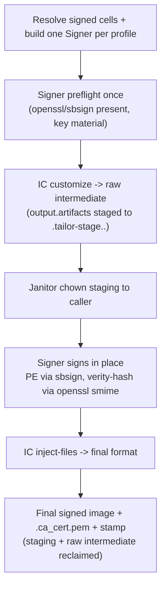

# tailor — Signing implementation status

> **Status:** Implemented (S1) · _last reviewed 2026-07-09_
>
> The signed pipeline is wired end to end: the `Signer` port (`tailor-core`), the `tailor-sign`
> crate (`openssl` CA/leaf + verity CMS, `sbsign` PE), the executor's three-pass
> (`customize` → raw intermediate → sign → `inject-files`), and the `run.rs` composition
> (`signer_for` + build-start binary preflight). Reconstructed after the 2026-07-06 data loss.
> **Remaining gaps:** the fingerprint still keys off the legacy `injectFiles` bool rather than signer
> identity (signed outputs are not yet cached on the profile), and the inert `injectFiles` field is
> retained; S2 remote backends and the S3 pure-Rust Authenticode writer are future work.

## Summary

Signing is at **S1 — implemented**. Users declare signing profiles and opt images into them;
`tailor validate` / `tailor build --dry-run` surface signing-prerequisite status (including missing
`openssl`/`sbsign` binaries) and render the signed three-pass; and a real `tailor build` runs the
`customize → sign → inject-files` pipeline, publishing the CA at `<output_dir>/<slug>.ca_cert.pem`.
What remains is caching (fingerprint → signer identity), the `injectFiles` field retirement, and the
S2/S3 backends below.

## What's implemented

| Implemented slice | Code evidence | Design coverage |
| --- | --- | --- |
| Workspace-level signing config is parsed from `tailor.yaml`. | `ToolConfig` has `signing: Option<SigningConfig>` (`crates/tailor-config/src/schema.rs:23-25`). `SigningConfig` has `default` and named `profiles` (`crates/tailor-config/src/schema.rs:161-172`). | [2026-06-29-signing.md §4](./2026-06-29-signing.md#4-manifest-surface) |
| Image-level opt-in is parsed as `signing: true`, `signing: false`, or `signing: <profile-id>`. | `ImageDefinition` has `signing: Option<SigningRef>` (`crates/tailor-config/src/schema.rs:356-359`); `SigningRef` is bool-or-string (`crates/tailor-config/src/schema.rs:253-262`). | [2026-06-29-signing.md §4](./2026-06-29-signing.md#4-manifest-surface) |
| The schema models the S1/S2 key-source names currently exposed to users. | `SigningBackend` supports `local-test-ca`, `keypair`, and `azure-key-vault` (`crates/tailor-config/src/schema.rs:198-208`, `crates/tailor-config/src/schema.rs:210-218`). | [2026-06-29-signing.md §6](./2026-06-29-signing.md#6-signer-abstraction) / [§11](./2026-06-29-signing.md#11-milestones-refines-designmd-17-m4) |
| Profile references are resolved and structurally validated. | `resolve_signing` maps omitted/`false` to unsigned, `true` to `signing.default`, and strings to named profiles, then validates (`crates/tailor-config/src/schema.rs:264-302`). `SigningProfile::validate` requires `key`+`cert` for `keypair` and `vault`+`certificate` for `azure-key-vault` (`crates/tailor-config/src/schema.rs:221-250`). | [2026-06-29-signing.md §4](./2026-06-29-signing.md#4-manifest-surface), partial [§5.1](./2026-06-29-signing.md#51-preflight--fail-fast-before-building) |
| The CLI gathers distinct signing requirements for selected images before execution. | `signing_requirements` resolves each selected target, deduplicates by profile id, and records requesting images (`crates/tailor/src/run.rs:823-850`). | [2026-06-29-signing.md §5.1](./2026-06-29-signing.md#51-preflight--fail-fast-before-building) step 1 |
| Preflight exists as a cheap, aggregate prerequisite check. | `SigningRequirement`, `MissingPrerequisite`, `SignError`, `preflight_profile`, and `preflight` live in `tailor-core` (`crates/tailor-core/src/signing.rs:23-147`). `keypair` checks readable PEM-shaped key/cert files; `local-test-ca` is considered satisfiable; `azure-key-vault` is structural-only for now (`crates/tailor-core/src/signing.rs:74-95`). | Partial [2026-06-29-signing.md §5.1](./2026-06-29-signing.md#51-preflight--fail-fast-before-building) |
| `tailor validate` reports signing readiness non-fatally. | `validate` calls `report_signing(&signing_requirements(...))` after cell validation (`crates/tailor/src/run.rs:237-250`); `report_signing` prints ready/not-ready details (`crates/tailor/src/run.rs:852-874`). | [2026-06-29-signing.md §5.1](./2026-06-29-signing.md#51-preflight--fail-fast-before-building) |
| `tailor build --dry-run` remains daemon-free and warns that signing execution is absent. | Dry-run renders the current unsigned plan, then reports signing status and prints `signing execution is not yet implemented` (`crates/tailor/src/run.rs:537-555`). | Partial [2026-06-29-signing.md §5.1](./2026-06-29-signing.md#51-preflight--fail-fast-before-building) / [§11 S1](./2026-06-29-signing.md#11-milestones-refines-designmd-17-m4) |
| Real signed builds hard-stop after successful preflight. | Non-dry-run signed builds call `tailor_core::preflight` and immediately return `signing_not_implemented` (`crates/tailor/src/run.rs:558-563`). | Safety guard for [2026-06-29-signing.md §11 S1](./2026-06-29-signing.md#11-milestones-refines-designmd-17-m4) while execution is incomplete |
| Integration tests cover the foundation and refusal behavior. | Tests assert non-fatal validate reporting, fail-fast missing-key preflight, dry-run notes, unknown profile errors, and the hard refusal instead of silently unsigned output (`crates/tailor/tests/signing.rs:1-129`). | Regression coverage for the implemented S1 foundation |

### Important fingerprint note

The intended S1 fingerprint change in [2026-06-29-signing.md §8](./2026-06-29-signing.md#8-reproducibility-fingerprint--lockfile) is **not implemented as signer identity** yet. Current fingerprint inputs still include the legacy `inject_files` boolean (`crates/tailor-core/src/fingerprint.rs:10-23`, `crates/tailor-core/src/fingerprint.rs:51-54`), and the orchestrator fills it from `target.definition.inject_files` (`crates/tailor-core/src/orchestrator.rs:88-97`). Because signed execution hard-stops today, this does not yet produce stale signed artifacts, but it must change before signed outputs can be cached correctly.

## What's missing / remaining gaps

### S1 — implemented

The S1 items formerly listed here now exist: the `Signer` port + `SigningPlan`/`SigningResult`
(`tailor-core::ports`), the `tailor-sign` crate (`openssl` CA/leaf + verity-hash CMS, `sbsign` PE,
inject-files.yaml parsing), the executor's `customize` → raw intermediate → sign → `inject-files`
three-pass, and the `run.rs` `signer_for` composition with build-start binary preflight. Two S1
follow-ups remain: **the fingerprint still keys off the legacy `inject_files` bool, not signer
identity** (see the fingerprint note above — signed outputs are not yet cached on the profile), and
the inert **`injectFiles` image field is retained, not retired**.

### S2 — remote signing backends

- **`azure-key-vault` is schema-only plus structural validation.** It requires `vault` and `certificate` (`crates/tailor-config/src/schema.rs:239-246`), and preflight explicitly says a live credential/handshake probe is later (`crates/tailor-core/src/signing.rs:79-80`).
- **`pkcs11` and `remote-service` are not schema variants yet.** The backend enum contains only `LocalTestCa`, `Keypair`, and `AzureKeyVault` (`crates/tailor-config/src/schema.rs:198-208`).
- **No remote-key Authenticode/CMS structure-building exists.** This depends on the missing `Signer` port and signing crate described above.

### S3 — optional pure-Rust Authenticode writer

- **No first-party Authenticode PE writer exists.** Today there is no PE signature writer, local or remote. S3 would replace `sbsign` with first-party construction of Authenticode/CMS data and PE attribute-certificate embedding; Authenticode remains a security-sensitive external format, so [2026-06-29-signing.md §11](./2026-06-29-signing.md#11-milestones-refines-designmd-17-m4) keeps this optional and later.

## Current pipeline (implemented)

A signed `tailor build` now runs the three-pass end to end:

See [2026-06-29-signing.md §5](./2026-06-29-signing.md#5-execution-pipeline) for the authoritative flow. The remaining
gaps are the fingerprint/`injectFiles` items above and the S2/S3 backends.

[^rcgen]: `rcgen` crate docs: <https://docs.rs/rcgen/latest/rcgen/>.
[^sbsign]: `sbsign(1)` manual: <https://manpages.ubuntu.com/manpages/noble/man1/sbsign.1.html>.
[^authenticode]: Microsoft Authenticode overview: <https://learn.microsoft.com/en-us/windows-hardware/drivers/install/authenticode>.
[^cms]: RFC 5652, Cryptographic Message Syntax: <https://www.rfc-editor.org/rfc/rfc5652.txt>.
[^dmverity]: Linux kernel dm-verity documentation: <https://docs.kernel.org/admin-guide/device-mapper/verity.html>.
