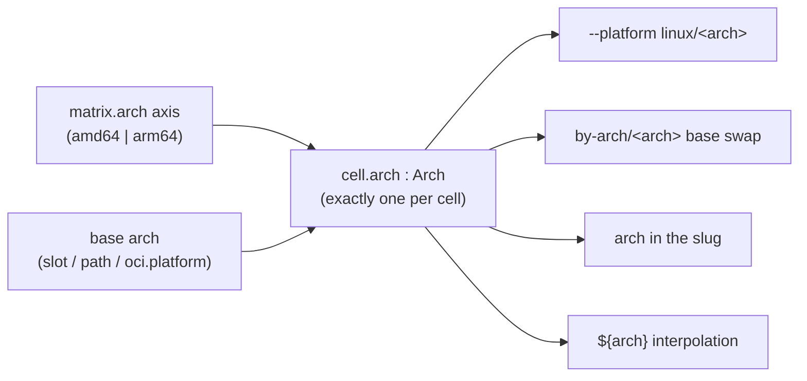

# The `arch` axis & platform model

> **Status:** Implemented · _last reviewed 2026-06-29_
>
> The reserved `arch` axis, the built-in amd64 default, catalogue-slot **and local `path` base** arch reconciliation, and OCI platform mismatch validation are implemented in `crates/tailor-config/src/schema.rs` and `crates/tailor-core/src/orchestrator.rs`. The `architectures` field is **gone entirely** — both the per-image field and the workspace `defaults.architectures`. A cell's arch comes from the `arch` matrix axis or a base's own `arch` (slot / `path` / `oci.platform`), else the built-in `amd64` default.

`arch` is tailor's one **reserved** matrix axis: it looks like any other axis, but it is *typed* and
wired to the container platform and base selection. That is true today but quiet, and it carries a
**silent footgun** — a base whose architecture can diverge from the cell's arch. This doc makes the
reserved status explicit, defines how a cell's **effective arch** is reconciled from the image and the
base image, and validates it so a mismatch fails loudly instead of producing a broken image.

---

## 1. `arch` is the reserved axis (current behavior)

Every other axis (`variant`, `runtime`, `type`, `edition`, …) is an **opaque label**: any
`[A-Za-z0-9.-]` string, meaningful only for partitioning the matrix, `${axis}` interpolation, `by-axis/`
fragments, and `--select`. `arch` is all of that **plus** real semantics tailor reaches into *by name*:

> **Terminology** (two related names, *not* separate features):
> - **architecture** — the concept: a CPU target, `amd64` or `arm64`. Wherever this doc writes
>   "architecture" in plain text (e.g. "a base whose architecture is arm64"), it means exactly this.
>   There is **no** `architecture:` or `architectures:` field anywhere (both were removed). The default
>   architecture is a fixed built-in **`amd64`**.
> - **`arch`** — the *name* tailor uses for it everywhere: the matrix axis, `${arch}`, the base swap in
>   `by-arch/<arch>.yaml`, the slug, `--platform linux/<arch>`. One cell per `arch` axis value; a base's
>   own `arch` (slot / `path` / `oci.platform`) supplies it when there is no axis.

| Property | Free-form axis (`variant`, …) | Reserved `arch` |
| --- | --- | --- |
| Value domain | any `[A-Za-z0-9.-]` string | **closed**: `amd64` \| `arm64` (`parse_arch`; else `MissingArchBase`) |
| How it's declared | `matrix:` only | the `matrix.arch` axis, or supplied by a base's own `arch` (slot / `path` / `oci.platform`) |
| Always present? | only if declared | **yes** — the axis or a base arch gives every cell a concrete arch (else the `amd64` default), and an `arch` coordinate is injected so `--select`/`${arch}`/`by-arch/` work either way |
| Drives the container | no | **`--platform linux/<arch>`** (`orchestrator.rs` → `arg_builder.rs`) |
| Drives the base | no | a **`by-arch/<arch>.yaml`** fragment swaps `base` per arch (and a catalogue slot's `arch` must match) |
| Slug | in declared order | always present; **position differs** by whether `arch` is an explicit axis (`slug_for`) |
| Precedence | by declaration order | treated as the **broadest** axis |

There is no longer any `architectures:` field, so the old "axis vs field" precedence footgun is gone:
architecture is set by the `arch` axis or a base's `arch`, and the two are reconciled in §3.

---

## 2. The effective arch — one per cell, reconciled

Every cell resolves to exactly one **effective arch**, and that single value drives everything:
`--platform linux/<arch>`, the base swap (`by-arch/<arch>.yaml`), the slug, and `${arch}`. The effective
arch is **reconciled**
from two declarations:

- the **image arch** — the `arch` axis in `image.yaml`; and
- the **base-image arch** — a catalogue slot's `arch` ([`base-image-catalogue.md`](./base-image-catalogue.md) §5.1),
  a local `path` base's own `arch`, or the architecture component of an `oci.platform`.

The rule (the full table is §3):

- both unset → **`amd64`** (the built-in default);
- exactly one set → it **fills in** the other;
- both set → they **must agree**, else it is an **error** (declaring two conflicting arches is invalid
  input).

An `azureLinux` base is multi-arch, so it declares no arch and never conflicts — the image arch
decides. A catalogue slot's `arch`, a `path` base's `arch`, and an `oci.platform`'s arch component do
participate, so any of them can even *supply* the arch to an image that declares none.

---

## 3. Reconciling image arch × base-image arch

|  image arch ↓ \ base-image arch → | _(unset)_ | `arm64` | `amd64` |
| --- | --- | --- | --- |
| **_(unset)_** | `amd64` * | `arm64` | `amd64` |
| **`arm64`** | `arm64` | `arm64` | **error** |
| **`amd64`** | `amd64` | **error** | `amd64` |

\* The both-unset default is a fixed built-in `amd64`. It is **not** the host arch — and there is no
workspace override — so a workspace builds reproducibly regardless of which machine builds it; to build
a non-default arch you **declare** it (an `arch` axis or a base's `arch`).

- **Either side may supply the arch.** `base: { ref: core_arm64 }` (slot `arch: arm64`) or a local
  `base: { path: ./gb200.vhd, arch: arm64 }` makes the cell arm64 with no `arch` axis at all;
  symmetrically an `arch` axis makes the cell arm64 even if the base declares nothing.
- **Both unset → `amd64`.** To build a non-default arch (e.g. an `arm64` image) you **declare** the
  target: a base whose `arch: arm64` (a catalogue slot or a `path` base), or an `arch` axis in
  `image.yaml`. A base that can't match the resolved arch is **invalid input**, surfaced as an error.
- **A conflict is a hard error**, naming the cell, the image arch, and the base-image arch, surfaced by
  `validate` (no I/O needed) — instead of today's silent mispull.

The effective arch is then the *single source of truth*: `--platform linux/<arch>`
(`orchestrator.rs:142,190` → `arg_builder.rs:215`), the `download` pull platform, the slug, and
`${arch}` all derive from it.

### Today (the silent divergence this fixes)

- The container `--platform` is **always** `linux/<cell.arch>` (`orchestrator.rs`), where `cell.arch`
  comes from the `arch` axis or a base's `arch`, else the `amd64` default.
- `oci.platform`, if set, overrides **only the base-digest** platform (`oci.rs:13-16`) and is **not**
  checked against `cell.arch`. So `base: { oci: { uri: …, platform: linux/arm64 } }` on an **amd64**
  cell pulls the **arm64** manifest into an **amd64** container → a broken image, no warning. (`path`
  and `azureLinux` cannot diverge — neither declares an arch.) The §3 matrix replaces this with an
  explicit reconcile-or-error.

### The `architectures:` field is gone (done)

Arch used to come from an `arch` axis **or** an `architectures:` field, and if both were set the axis
silently won — a footgun. The field was **fully removed**: first the per-image `architectures:`, then
the workspace `defaults.architectures`. The reasoning: with `amd64` as the built-in default and the
**base image** able to supply the target arch (a catalogue slot's `arch`, or a local `path` base's
`arch`), architecture belongs to the base or an explicit `arch` axis — not a separate list field. A
workspace-wide arch default was itself a footgun (it silently multiplied or re-targeted every
axis-less image), so it went too. To build multiple arches, declare an `arch: [amd64, arm64]` matrix
axis; to build a single non-default arch, put `arch:` on the base.

---

## 4. Catalogue interaction

A catalogue slot carries its **own** `arch` precisely because `tailor bases download` runs
cell-independently — there is no cell to derive an arch from
([`base-image-catalogue.md`](./base-image-catalogue.md) §5.1). When a cell then references the slot
(`base: { ref: <name> }`), the slot's `arch` becomes the **base-image arch** in the §3 matrix: it
agrees with, fills in, or conflicts with the image arch. This finally closes the loop that direct
`path` bases leave open (today tailor only *warns* on a `base.path` shared across arches and never
inspects the file — `design.md` §6); a named slot makes the base's arch explicit and checkable.

---

## 5. Recommendations

1. **Make it obvious.** Document `arch` as the reserved axis — its dual spelling, closed value set, and
   platform/base wiring, plus the effective-arch matrix (§3) — prominently in
   `docs/reference/image-yaml.md` and `meta/docs/image-definitions.md` on implementation (not buried in
   a matrix-table footnote).
2. **Reconcile + validate** the image arch against the base-image arch (§3) at config-resolution time,
   covered by `validate`.
3. **One effective arch per cell** is the single source of truth; `--platform`, the pull, the slug, and
   `${arch}` all derive from it.

---

## 6. Open questions

1. **More architectures.** The closed `{amd64, arm64}` set lives in `parse_arch`. Adding `riscv64`
   means growing it (and `Arch`); is that in scope?
2. **`oci.platform` vs slot `arch`.** A catalogue slot uses `arch` (this design). A *direct* `oci` base
   still has a `platform` string (for exact-manifest selection, e.g. `linux/arm64/v8`); its arch
   component feeds the §3 matrix. Should the direct `oci` base also move to `arch` + an optional
   variant, so the surface is uniform, or keep `platform` for the raw-registry case?
3. **Default of `amd64` on an `arm64` host.** The default is a fixed built-in `amd64`, so an undeclared
   build on an arm64 host emulates amd64 (or errors if emulation is unavailable). Acceptable for a
   reproducible default; declare an `arch` axis or a base `arch: arm64` when arm64 is the target.
4. **Cross-arch host builds** (building an `arm64` image on an `amd64` host via binfmt/qemu) are a
   *runtime* concern (`meta/docs/container-runtimes.md`), orthogonal to this contract — the cell's
   effective arch is still the target, regardless of host.
