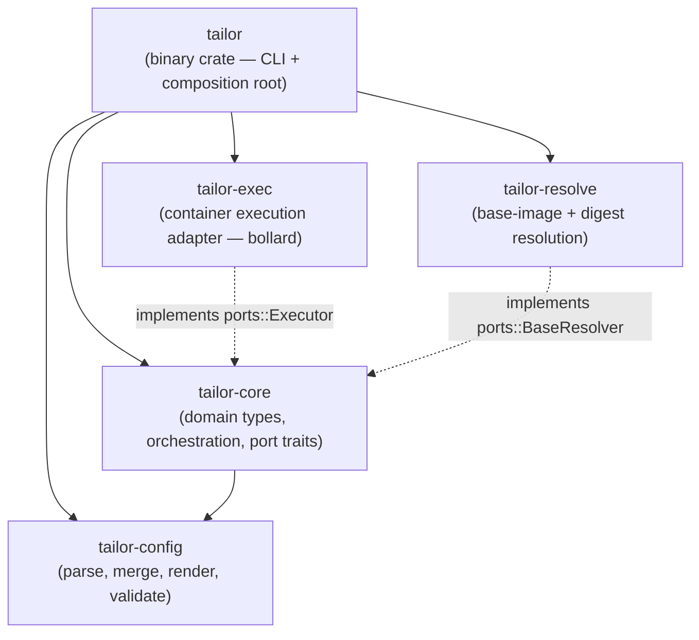
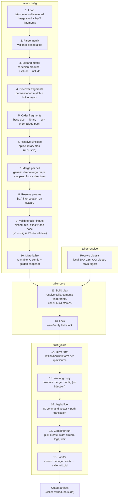
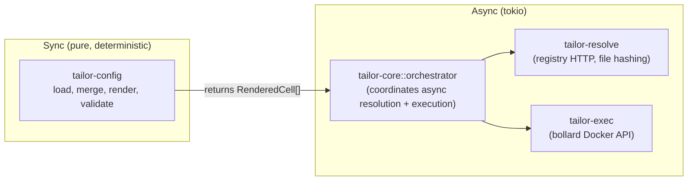

# tailor — Software Architecture

> **Status:** Stale · _last reviewed 2026-06-29_
>
> The five-crate graph matches `Cargo.toml`, and the main layers exist, but the detailed module maps and feature table point at speculative paths such as `schema/tool_config.rs`, `merge/directives.rs`, `lockfile/`, and source-map/test fakes that do not match the current `crates/*/src` layout. Use the live crate tree as source of truth until this doc is reconciled.

---

## Table of contents

1. [Design principles](#1-design-principles)
2. [Crate graph & dependency direction](#2-crate-graph--dependency-direction)
3. [Per-crate design](#3-per-crate-design)
4. [Key domain types & port traits](#4-key-domain-types--port-traits)
5. [Config → render → execute pipeline](#5-config--render--execute-pipeline)
6. [Error-handling strategy](#6-error-handling-strategy)
7. [Async vs sync boundary](#7-async-vs-sync-boundary)
8. [Testing strategy](#8-testing-strategy)
9. [Workspace layout & dependencies](#9-workspace-layout--dependencies)
10. [Feature → owning crate mapping](#10-feature--owning-crate-mapping)
11. [Open questions & trade-offs](#11-open-questions--trade-offs)

---

## 1. Design principles

These are drawn from the user's stated preferences and the conventions observed in
[marvin](../../../marvin/AGENTS.md) and the tailor design docs:

- **Hexagonal (ports-and-adapters) architecture.** Core business logic depends on trait
  abstractions (ports); concrete implementations (adapters) live in separate crates and are wired
  at the composition root. Directly modeled on `marvin-core/src/ports/`.
- **Clarity and readability first.** Small, single-purpose modules; explicit data flow; no clever
  indirection. Code should read like the design doc describes.
- **Progressive complexity.** A minimal single-image build exercises only a subset of modules;
  the full matrix/fragment engine activates only when the manifest uses it.
- **Deterministic rendering.** The config→IC-config pipeline is pure and sync. Async (tokio) is
  confined to the container execution boundary.
- **Typed errors per library crate** (thiserror); the binary crate may use a thin application
  error enum. No `anyhow` in library crates — provenance and structured diagnostics demand typed
  variants (especially for `tailor explain`).
- **Workspace dependency pinning** — all third-party versions declared once in
  `[workspace.dependencies]`, per-crate manifests use `{ workspace = true }`.
- **Edition 2024, resolver 3, stable toolchain** — matching the marvin conventions.

---

## 2. Crate graph & dependency direction



**Dependency rules (acyclic, inward-pointing):**

| Crate | Depends on | Provides |
| ----- | ---------- | -------- |
| `tailor-config` | (standalone: serde, serde_yml, semver) | Parse/merge/render engine; IC config types |
| `tailor-core` | `tailor-config` | Domain types, BuildPlan, Lockfile, port traits |
| `tailor-resolve` | `tailor-core` (for port traits + domain types) | `BaseResolver` adapter (OCI/local hash) |
| `tailor-exec` | `tailor-core` (for port traits + domain types) | `Executor` + `ContainerRuntime` adapters (bollard) |
| `tailor` (binary) | all of the above | CLI, composition root, output formatting |

**Why this split (the crate consolidation):**

An earlier draft proposed a 6-crate split (`tailor-manifest`, `tailor-ic`, `tailor-engine`,
`tailor-resolve`, `tailor-lock`). After studying image-definitions.md (which adds the
axes/matrix/fragment/merge engine) and the marvin architecture, this architecture consolidates to the
five crates above (design.md §14 now defers here):

- **`tailor-config`** absorbs both the manifest/tool+image schema and the
  image-definitions compositor. The manifest schema and the image-definition engine share types,
  merge logic, and validation — splitting them doubles the type surface for no gain.
- **`tailor-core`** absorbs the lockfile model. These are pure
  domain types tightly coupled to orchestration (the build plan computes fingerprints using lock
  entries). Keeping them with the orchestrator avoids a separate `tailor-lock`
  crate with a cyclic conceptual dependency on core types.
- **`tailor-exec`** is the single execution adapter — the bollard container execution,
  path translation, janitor, RPM farm, and IC arg-vector builder all implement
  the executor port. They share bollard types and container lifecycle; splitting further
  fragments a single adapter without an independent consumer.
- **`tailor-resolve`** stays separate — digest/hash resolution is separable and has a distinct
  dependency set (oci-client, sha2).

---

## 3. Per-crate design

### 3.1 `tailor-config` — parse, merge, render, validate

**Responsibility:** everything from authored YAML to a rendered, validated IC config per matrix
cell. Owns the full image-definitions.md behavior.

**Module tree:**

```text
tailor-config/src/
├── lib.rs
├── error.rs                 # ConfigError (thiserror)
├── schema/
│   ├── mod.rs
│   ├── tool_config.rs       # ToolConfig, Toolchain, Runtime, Defaults (serde)
│   ├── target.rs            # TargetConfig (serde) — inline or split file
│   ├── image_def.rs         # ImageDefinition: name, matrix, outputs, base, features, params, config
│   └── fragment.rs          # Fragment: match, config block, tailor fields
├── axes/
│   ├── mod.rs
│   ├── matrix.rs            # Matrix expansion (cartesian product, include/exclude)
│   └── cell.rs              # Cell — one point in the matrix (HashMap<AxisName, AxisValue>)
├── merge/
│   ├── mod.rs
│   ├── deep_merge.rs        # Generic map deep-merge + list append (no IC-schema keying)
│   ├── directives.rs        # $include, $set, $remove, $replace, $select
│   └── source_map.rs        # Provenance tracking (which fragment set each value)
├── params.rs                # ${...} interpolation engine
├── render/
│   ├── mod.rs
│   ├── pipeline.rs          # Top-level: fragments → merge → params → output
│   ├── runnable.rs          # Emit runnable IC config (colocated dotfile)
│   └── golden.rs            # Emit normalized golden snapshot (for diffing)
├── loader.rs                # Discover + load tool config / images / fragments
└── types.rs                 # Shared newtypes: AxisName, AxisValue, FragmentPath, etc.
```

> tailor validates only its **own** inputs (matrix closed-axis, exactly-one base) inside the loader /
> render pipeline — there is no `validate/` module that checks IC config structure. The `config:`
> tree is opaque; IC validates it at runtime (the user↔IC contract).

**Public API surface (key types and functions):**

```rust
/// Load and resolve a full workspace from a manifest path.
pub fn load_workspace(manifest_path: &Path) -> Result<Workspace, ConfigError>;

/// Render all cells for an image definition.
pub fn render_image(
    image: &ImageDefinition,
    workspace: &Workspace,
) -> Result<Vec<RenderedCell>, ConfigError>;

/// The provenance source map — "which fragment contributed this field".
pub struct SourceMap { /* ... */ }

/// One rendered matrix cell, ready for execution.
pub struct RenderedCell {
    pub cell: Cell,
    pub ic_config: serde_yml::Value,  // the merged IC config
    pub base: BaseSource,
    pub outputs: Vec<OutputSpec>,
    pub source_map: SourceMap,
}
```

**Relationship to marvin:** directly models marvin's `config/{loader,merge,source_map,types}.rs`
pattern, scaled up for the richer merge semantics (directives, `$include`
resolution). The `SourceMap` tracks per-leaf provenance identically to marvin's
`source_map.rs` — enabling `tailor explain` to answer "which fragment set this value?"

### 3.2 `tailor-core` — domain types, orchestration, port traits

**Responsibility:** the heart of tailor's business logic. Owns: domain model (Target, Cell,
BuildPlan, Lockfile, Fingerprint), orchestration (plan which
cells to build, check up-to-date, coordinate execution), and the **port trait definitions** that
adapters implement.

**Module tree:**

```text
tailor-core/src/
├── lib.rs
├── error.rs                  # CoreError (thiserror)
├── domain/
│   ├── mod.rs
│   ├── target.rs             # Target (resolved from config)
│   ├── cell.rs               # Cell, CellSlug (unique key per build unit)
│   ├── build_plan.rs         # BuildPlan: ordered list of cells to execute
│   ├── fingerprint.rs        # Canonical per-cell fingerprint (§9.1)
│   └── output.rs             # OutputSpec, OutputFormat, file extension mapping
├── lockfile/
│   ├── mod.rs
│   ├── model.rs              # Lockfile struct (flat: toolchain + janitor + registry-base digests)
│   ├── io.rs                 # Read/write tailor.lock (serde_yaml_ng)
│   ├── drift.rs              # Drift detection (compare lock vs current inputs)
│   └── stamp.rs              # Build stamps (per-cell sidecar JSON)
├── orchestrator.rs           # Top-level build orchestration (plan → resolve → execute)
├── ports/
│   ├── mod.rs
│   ├── executor.rs           # Executor port trait (run IC in a container)
│   ├── container_runtime.rs  # ContainerRuntime port (pull, create, start, logs, remove)
│   ├── base_resolver.rs      # BaseResolver port (hash/digest resolution)
│   ├── filesystem.rs         # Filesystem ops port (RPM farm, working copy, chown)
│   └── lockfile_store.rs     # LockfileStore port (read/write/check lock)
└── testing/
    ├── mod.rs
    ├── fake_executor.rs      # In-memory fake Executor (records invocations)
    ├── fake_runtime.rs       # In-memory fake ContainerRuntime
    ├── fake_resolver.rs      # Deterministic fake BaseResolver
    └── conformance.rs        # Conformance test suite for port implementations
```

**Key decision:** the lockfile lives in core (not a separate crate) because the fingerprint
computation, drift checking, and build-stamp comparison are core orchestration concerns that
reference domain types (Cell, Target, OutputSpec, IC version). A separate `tailor-lock` crate
would need to re-export or depend on all of these — an artificial boundary.

### 3.3 `tailor-exec` — container execution adapter (bollard)

**Responsibility:** the concrete adapter implementing `ports::Executor` and
`ports::ContainerRuntime`. Owns: bollard API interaction, IC argument vector construction, path
translation (§7.3), sudo-free janitor (§7.7), RPM-source farm + createrepo (§7.8), working-copy
IC config (§7.6), log streaming.

**Module tree:**

```text
tailor-exec/src/
├── lib.rs
├── error.rs                  # ExecError (thiserror)
├── executor.rs               # Implements ports::Executor (the IC run orchestration)
├── arg_builder.rs            # IC argument vector construction per cell
├── path_translate.rs         # Host path → container path translation (§7.3)
├── container/
│   ├── mod.rs
│   ├── runtime.rs            # Implements ports::ContainerRuntime via bollard
│   ├── pull.rs               # Image pull by digest
│   ├── lifecycle.rs          # Create/start/wait/remove container
│   └── logs.rs               # Streaming stdout/stderr via bollard attach
├── janitor.rs                # Sudo-free chown/cleanup via throwaway container (§7.7)
├── rpm_farm.rs               # Adjacent reflink/hardlink farm for rpmSources (§7.8)
├── working_copy.rs           # Working-copy IC config (§7.6) — colocate merged config (no injection)
└── platform.rs               # Platform detection (uid/gid, userns-remap, rootless)
```

### 3.4 `tailor-resolve` — base-image + digest resolution

**Responsibility:** implements `ports::BaseResolver`. Resolves base images (local file hash, OCI
registry digest, azureLinux MCR digest) and toolchain container digests.

**Module tree:**

```text
tailor-resolve/src/
├── lib.rs
├── error.rs                  # ResolveError (thiserror)
├── resolver.rs               # Implements ports::BaseResolver
├── local.rs                  # Stream SHA-256 + size for local path bases
├── oci.rs                    # Resolve registry digest for platform (oci-client)
├── azure_linux.rs            # MCR azureLinux sugar → OCI resolve
└── toolchain.rs              # Resolve IC container tag → digest
```

### 3.5 `tailor` (binary) — CLI + composition root

**Responsibility:** the user-facing CLI. Parses arguments (clap derive), wires concrete adapters
into core's port traits (composition root / dependency injection), dispatches subcommands, formats
output (human/JSON).

**Module tree:**

```text
tailor/src/
├── main.rs                   # Entry point, tokio::main, composition root
├── cli.rs                    # Clap CLI definition (global opts + subcommands)
├── commands/
│   ├── mod.rs
│   ├── build.rs              # `tailor build`
│   ├── render.rs             # `tailor render`
│   ├── explain.rs            # `tailor explain` (provenance query via SourceMap)
│   ├── list.rs               # `tailor list`
│   ├── show.rs               # `tailor show`
│   ├── lock.rs               # `tailor lock` / `tailor update`
│   ├── validate.rs           # `tailor validate`
│   ├── clean.rs              # `tailor clean`
│   └── matrix.rs             # `tailor matrix` (CI JSON)
├── output.rs                 # Human + JSON output formatting
└── error.rs                  # Application error (wraps CoreError + ExecError + etc.)
```

**Composition root pattern** (from marvin `main.rs`): the binary constructs concrete adapter
instances and passes them to the orchestrator as trait objects or generics:

```rust
// main.rs — composition root (illustrative)
#[tokio::main]
async fn main() -> ExitCode {
    let cli = Cli::parse();

    // Construct concrete adapters
    let runtime = BollardRuntime::connect().await?;
    let resolver = OciResolver::new();
    let executor = IcExecutor::new(runtime.clone());

    // Wire into orchestrator (generics, monomorphized — marvin §3a.3a pattern)
    let orchestrator = Orchestrator::new(executor, resolver);

    // Dispatch
    match commands::dispatch(cli, orchestrator).await {
        Ok(code) => ExitCode::from(code),
        Err(e) => { /* format + exit code */ }
    }
}
```

---

## 4. Key domain types & port traits

### 4.1 Domain types (`tailor-core`)

```rust
/// A resolved image (after config load + defaults applied) — the catalogue/authoring unit.
/// (`Target` is kept only as the internal struct name; "image" is the user-facing term.)
pub struct Target {
    pub name: String,
    pub toolchain: ToolchainRef,
    pub config_path: Option<PathBuf>,   // None for `convert`
    pub base: BaseSource,               // or BaseByArch for per-arch
    pub outputs: Vec<OutputSpec>,
    pub architectures: Vec<Arch>,
    pub matrix: Matrix,                 // user-defined axes (arch may be one of them)
    pub rpm_sources: Vec<PathBuf>,
    pub features: Vec<String>,          // image-level flag list (gates by-feature/)
    pub operation: Operation,           // customize | convert   (was features.operation)
    pub inject_files: bool,             //                       (was features.injectFiles)
    pub extra_dependencies: Vec<PathBuf>,
}

/// One cell in the build matrix (one IC invocation → one artifact).
pub struct Cell {
    pub target: Arc<Target>,
    pub axes: BTreeMap<AxisName, AxisValue>,  // FULL cell coordinate (variant/release/arch/phase/…)
    pub arch: Arch,                     // convenience; == axes["arch"], drives --platform
    pub output: OutputSpec,
    pub slug: CellSlug,                 // <image>_<axis values, matrix order>_<format>, '_'-joined (§7.6, §10)
}

/// The canonical per-cell fingerprint (§9.1) — hash over all build-affecting inputs.
#[derive(Clone, PartialEq, Eq, Hash)]
pub struct Fingerprint(pub [u8; 32]);

/// The build plan: an ordered list of cells to execute.
pub struct BuildPlan {
    pub cells: Vec<PlannedCell>,
}

pub struct PlannedCell {
    pub cell: Cell,
    pub fingerprint: Fingerprint,
    pub up_to_date: bool,               // compared against build stamp
}
```

### 4.2 Port traits (`tailor-core::ports`)

```rust
// ── ports/executor.rs ──────────────────────────────────────────────────────

/// The IC execution port — run Image Customizer in a container.
///
/// Implementations own the full lifecycle: pull image, create container,
/// start, stream logs, wait, remove, janitor chown.
pub trait Executor: Send + Sync {
    /// Execute one matrix cell. Returns the produced artifact path on success.
    fn execute(
        &self,
        cell: &Cell,
        plan: &ExecutionPlan,
        cancel: CancellationToken,
    ) -> impl Future<Output = Result<ExecutionResult, ExecError>> + Send;

    /// Clean (remove) outputs for the given cells — sudo-free via janitor.
    fn clean(
        &self,
        paths: &[PathBuf],
        cancel: CancellationToken,
    ) -> impl Future<Output = Result<(), ExecError>> + Send;
}

/// Everything the executor needs to run one cell (pre-computed by orchestrator).
pub struct ExecutionPlan {
    pub ic_image_ref: String,           // container@digest
    pub platform: String,               // linux/<arch>
    pub args: Vec<String>,              // IC argument vector (paths already translated)
    pub binds: Vec<String>,             // container bind mounts
    pub privileged: bool,
    pub rpm_farm_paths: Vec<PathBuf>,   // prepared farm dirs
    pub working_copy: Option<PathBuf>,  // working-copy IC config if needed
    pub managed_roots: Vec<PathBuf>,    // paths the janitor will chown
    pub clone_index: Option<u32>,       // Some(i) under `build --clones N`; suffixes all per-clone paths
    pub runtime_config: RuntimeConfig,
}

pub struct ExecutionResult {
    pub artifact_path: PathBuf,
    pub exit_code: i64,
    pub logs: String,                   // last N lines for error reporting
}

// ── ports/container_runtime.rs ─────────────────────────────────────────────

/// Low-level container runtime operations (bollard abstraction).
pub trait ContainerRuntime: Send + Sync {
    fn pull_image(&self, reference: &str) -> impl Future<Output = Result<(), ExecError>> + Send;

    fn create_and_run(
        &self,
        config: ContainerConfig,
        cancel: CancellationToken,
    ) -> impl Future<Output = Result<ContainerResult, ExecError>> + Send;

    fn inspect_image(&self, reference: &str)
        -> impl Future<Output = Result<ImageInfo, ExecError>> + Send;

    /// Detect daemon configuration (userns-remap, rootless, etc.)
    fn daemon_info(&self) -> impl Future<Output = Result<DaemonInfo, ExecError>> + Send;
}

// ── ports/base_resolver.rs ─────────────────────────────────────────────────

/// Resolve base images to digest-pinned references + content hashes.
pub trait BaseResolver: Send + Sync {
    /// Resolve a base source for a given architecture to a pinned entry.
    fn resolve(
        &self,
        source: &BaseSource,
        arch: Arch,
    ) -> impl Future<Output = Result<ResolvedBase, ResolveError>> + Send;

    /// Resolve a toolchain container tag to its registry digest.
    fn resolve_toolchain(
        &self,
        toolchain: &ToolchainEntry,
    ) -> impl Future<Output = Result<String, ResolveError>> + Send;
}

pub enum ResolvedBase {
    LocalFile { sha256: [u8; 32], size: u64 },
    Oci { digest: String, platform: String, uri: String },
}

// ── ports/filesystem.rs ────────────────────────────────────────────────────

/// Filesystem operations that may need special handling (RPM farm, ownership).
pub trait FilesystemOps: Send + Sync {
    /// Build an **adjacent** reflink/hardlink/copy farm (sibling of the source ⇒ same fs) for an
    /// `rpmSources` directory, skipping any existing `repodata/`. See design.md §7.8.
    fn build_rpm_farm(
        &self,
        source: &Path,
        dest: &Path,
    ) -> Result<(), std::io::Error>;

    /// Write the working-copy IC config (the merged config, colocated; no injection).
    fn write_working_copy(
        &self,
        content: &[u8],
        path: &Path,
    ) -> Result<(), std::io::Error>;
}
```

### 4.3 Config types (`tailor-config`)

```rust
/// Top-level tool config (tailor.yaml).
pub struct ToolConfig {
    pub schema_version: u32,
    pub toolchains: Toolchains,
    pub runtime: RuntimeConfig,
    pub defaults: Defaults,
    pub images: ImageCatalogue,         // auto-discovered members + explicit globs + inline
}

/// An image definition (image.yaml + by-*/ fragments).
pub struct ImageDefinition {
    pub name: String,
    pub matrix: Option<Matrix>,
    pub base: Option<BaseSource>,
    pub outputs: Vec<OutputSpec>,
    pub features: Vec<String>,
    pub params: BTreeMap<String, String>,
    pub config: serde_yml::Value,       // shared IC config
    pub fragments: Vec<Fragment>,
}

/// One fragment (a by-*/ file or inline match-guarded doc).
pub struct Fragment {
    pub path: FragmentPath,             // source file for provenance
    pub match_expr: Option<MatchExpr>,  // explicit match (ANDed with path predicate)
    pub base: Option<BaseSource>,       // per-axis base override
    pub params: BTreeMap<String, String>,
    pub config: serde_yml::Value,       // partial IC config delta
}

/// Match expression (image-definitions.md §6).
pub enum MatchExpr {
    Eq { axis: AxisName, value: AxisValue },
    Set { axis: AxisName, values: Vec<AxisValue> },
    Feature(String),
    All(Vec<MatchExpr>),
    Any(Vec<MatchExpr>),
    Not(Box<MatchExpr>),
}
```

---

## 5. Config → render → execute pipeline

The full data flow from authored YAML to a built artifact:



**Stage ownership:**

| Stage | Crate | Module |
| ----- | ----- | ------ |
| 1. Load | `tailor-config` | `loader.rs` |
| 2–3. Axes/expand | `tailor-config` | `axes/matrix.rs` |
| 4–5. Discover/order fragments | `tailor-config` | `loader.rs` + `schema/fragment.rs` |
| 6. $include | `tailor-config` | `merge/directives.rs` |
| 7. Merge | `tailor-config` | `merge/deep_merge.rs` |
| 8. Params | `tailor-config` | `params.rs` |
| 9. Validate tailor inputs | `tailor-config` | `render.rs` (closed-axis, exactly-one base) |
| 10. Materialize | `tailor-config` | `render/` |
| 11. Build plan | `tailor-core` | `orchestrator.rs` + `domain/build_plan.rs` |
| 13. Lock | `tailor-core` | `lockfile/` |
| 14. RPM farm | `tailor-exec` | `rpm_farm.rs` |
| 15. Working copy | `tailor-exec` | `working_copy.rs` |
| 16. Arg builder | `tailor-exec` | `arg_builder.rs` |
| 17. Container run | `tailor-exec` | `container/` + `executor.rs` |
| 18. Janitor | `tailor-exec` | `janitor.rs` |

---

## 6. Error-handling strategy

### Per-crate typed errors (thiserror)

Each library crate defines a crate-level error enum with structured, actionable variants.
No `anyhow` in libraries — provenance tracking and `tailor explain` diagnostics demand typed
errors that name contributing fragments, cells, and IC versions.

```rust
// tailor-config/src/error.rs
#[derive(Debug, thiserror::Error)]
pub enum ConfigError {
    #[error("in {fragment}: scalar conflict at `{path}` — set by both {first} and {second} (use $set to override)")]
    ScalarConflict {
        fragment: FragmentPath,
        path: String,
        first: String,
        second: String,
    },

    #[error("closed-axis violation: axis `{axis}` value `{value}` is not declared in the matrix")]
    UndeclaredAxisValue { axis: String, value: String },

    #[error("cell {cell}: no base image resolved (set `base` in image.yaml or a per-axis fragment)")]
    MissingBase { cell: String },

    // ... IO, YAML parse, etc. (no IC-config validation — IC validates its own config)
}
```

```rust
// tailor-core/src/error.rs
#[derive(Debug, thiserror::Error)]
pub enum CoreError {
    #[error("lock drift: {path} sha256 was {expected} in tailor.lock but is now {actual}")]
    LockDrift { path: String, expected: String, actual: String },

    #[error("tailor.lock is missing an entry for `{reference}` ({platform})")]
    LockMissing { reference: String, platform: String },

    // ... unknown toolchain, IO, serde, etc. (no version gating — IC owns its capabilities)
}
```

### Provenance / source-map errors

The `SourceMap` (§3.1, modeled on marvin's `config/source_map.rs`) records which fragment last
wrote each scalar leaf in the merged config. This enables:

- **`tailor explain <image> <field-path>`** — look up the source map entry for the dotted path
  and report the contributing fragment, file, and line.
- **Conflict errors** — when two fragments set the same scalar to different values without
  `$set`, the error names both fragments (via source map provenance), not just "conflict at
  path X".
- **Diagnostics in rendered goldens** — an optional comment header in golden files listing the
  fragment application order.

### Binary error type

The `tailor` binary uses a thin application error enum (not `anyhow`) that wraps the library
errors and maps them to exit codes (following marvin's `sysexits` pattern):

```rust
// tailor/src/error.rs
#[derive(Debug, thiserror::Error)]
enum AppError {
    #[error("{0}")]
    Config(#[from] tailor_config::ConfigError),
    #[error("{0}")]
    Core(#[from] tailor_core::CoreError),
    #[error("{0}")]
    Exec(#[from] tailor_exec::ExecError),
    #[error("{0}")]
    Resolve(#[from] tailor_resolve::ResolveError),
    #[error(transparent)]
    Io(#[from] std::io::Error),
}
```

---

## 7. Async vs sync boundary

**Principle:** the config/render engine is **pure and sync**. Rendering must be deterministic
(image-definitions.md §9.3 "rendering is pure/deterministic"); introducing async into the merge
engine would add non-determinism concerns, complicate testing, and serve no purpose — there is no
I/O in the merge/render path beyond initial file reads.

**The async boundary lives at the orchestrator/execution layer:**



| Layer | Sync/Async | Rationale |
| ----- | ---------- | --------- |
| `tailor-config` (load/merge/render/validate) | **Sync** | Pure data transformation; file reads are blocking but trivial; deterministic output guaranteed |
| `tailor-core` orchestrator | **Async** | Coordinates parallel cell execution (bounded `--jobs`) |
| `tailor-core` domain types, lockfile, fingerprint | **Sync** | Pure computation |
| `tailor-resolve` | **Async** | OCI registry HTTP calls (reqwest), parallel digest resolution |
| `tailor-exec` | **Async** | bollard is async; container lifecycle, log streaming, janitor |
| `tailor` (binary) | **`#[tokio::main]`** | Async entry point; sync config loading happens before entering the async orchestrator |

The binary's `main` looks like:

```rust
#[tokio::main]
async fn main() -> ExitCode {
    let cli = Cli::parse();
    // Sync: load + render config (no tokio needed)
    let workspace = tailor_config::load_workspace(&cli.manifest)?;
    // Async: resolve, execute
    let orchestrator = build_orchestrator().await;
    commands::dispatch(cli, workspace, orchestrator).await
}
```

---

## 8. Testing strategy

### 8.1 Unit tests

Each crate has inline `#[cfg(test)]` modules per source file — the standard Rust convention.
Focus areas:

- **`tailor-config`**: merge logic (generic deep-merge + append), directive expansion
  (`$include`, `$set`, `$remove`, `$replace`), param interpolation, matrix expansion,
  closed-axis validation, exactly-one-base check.
- **`tailor-core`**: fingerprint computation, build-stamp comparison, lockfile serialization
  round-trips, orchestrator planning.
- **`tailor-exec`**: arg builder (verify exact IC argument vectors), path translation,
  RPM farm link strategy selection.
- **`tailor-resolve`**: local file hashing.

### 8.2 Conformance suites for port traits (modeled on marvin `testing/conformance.rs`)

`tailor-core::testing` provides a conformance test suite that any port implementation must pass.
The suite exercises the port's behavioral contract against a caller-supplied instance:

```rust
// tailor-core/src/testing/conformance.rs (illustrative)

/// Run the executor conformance suite against any Executor implementation.
pub async fn executor_conformance<E: Executor>(executor: &E) {
    // Test: execute returns artifact path on success
    // Test: execute surfaces IC exit code on failure
    // Test: clean removes outputs via janitor
    // Test: cancellation stops a running container
    // ...
}

/// Run the resolver conformance suite.
pub async fn resolver_conformance<R: BaseResolver>(resolver: &R) {
    // Test: local file returns sha256 + size
    // Test: unknown file returns error
    // ...
}
```

### 8.3 In-memory fakes (test without Docker)

`tailor-core::testing` provides fake implementations of every port trait:

- **`FakeExecutor`** — records invocations, returns configurable results. Enables testing the
  full orchestrator logic without a Docker daemon.
- **`FakeRuntime`** — simulates container lifecycle (immediate success/failure). Enables testing
  `tailor-exec` logic (arg builder, janitor decisions) without bollard.
- **`FakeResolver`** — returns deterministic hashes/digests from a preconfigured map.

This is the same pattern as marvin's `testing/in_memory.rs` — production and test code share one
trait surface; the fake is swap-in.

### 8.4 Golden/snapshot tests for the renderer

The design commits to checked-in golden files (image-definitions.md §9.3). The test strategy:

- **`tailor-config` integration tests** load the worked examples
  (`docs/examples/trident-vm-testimage/`), render all cells, and assert byte-equality with the
  checked-in `rendered/*.yaml` files.
- CI runs `tailor render --all` and diffs against committed goldens; unexpected changes fail the
  build.
- Golden files serve double duty: human-reviewable IC configs **and** regression tests for the
  merge engine.

### 8.5 Integration tests (with Docker)

A `tests/integration/` directory in the workspace root (or a `tailor-exec/tests/`) runs against a
real Docker daemon (gated by `#[cfg(feature = "integration")]` or a CI flag):

- Pull a real IC image, run a trivial customize, verify the output exists and is caller-owned.
- Verify the janitor chown produces the correct uid/gid.
- Verify RPM farm isolation (source dir is not mutated).

These are expensive and not run on every commit — only in CI's integration pipeline.

### 8.6 Test without Docker

The composition root pattern + fake ports enable the majority of testing without Docker:

- **All of `tailor-config`** is pure — no Docker needed at all.
- **All of `tailor-core` orchestration** uses `FakeExecutor` + `FakeResolver`.
- **`tailor-exec` unit tests** test arg builder and path translation without running containers.
- Only the integration tests in §8.5 require a real daemon.

---

## 9. Workspace layout & dependencies

### 9.1 Directory tree

```text
tailor/
├── Cargo.toml                    # [workspace]
├── rust-toolchain.toml           # channel = "stable", components = [rustfmt, clippy]
├── rustfmt.toml                  # edition = "2024", max_width = 100
├── deny.toml                     # cargo-deny
├── LICENSE                       # MIT
├── README.md
├── justfile                      # task runner (build, check, test, validate)
├── docs/
│   ├── design.md
│   ├── image-definitions.md
│   ├── architecture.md           # this document
│   └── examples/
│       ├── minimal-single-image/
│       └── trident-vm-testimage/
└── crates/
    ├── tailor/                   # binary crate (CLI)
    │   ├── Cargo.toml
    │   └── src/
    ├── tailor-config/            # config parse/merge/render/validate
    │   ├── Cargo.toml
    │   └── src/
    ├── tailor-core/              # domain types, orchestration, ports, testing
    │   ├── Cargo.toml
    │   └── src/
    ├── tailor-exec/              # bollard execution adapter
    │   ├── Cargo.toml
    │   └── src/
    └── tailor-resolve/           # base/toolchain resolution adapter
        ├── Cargo.toml
        └── src/
```

### 9.2 Workspace `Cargo.toml` (illustrative)

```toml
[workspace]
resolver = "3"
members = [
    "crates/tailor",
    "crates/tailor-config",
    "crates/tailor-core",
    "crates/tailor-exec",
    "crates/tailor-resolve",
]

[workspace.package]
version = "0.1.0"
edition = "2024"
rust-version = "1.91"
license = "MIT"
repository = "https://github.com/user/tailor"
authors = ["tailor contributors"]

[workspace.dependencies]
# --- async runtime ---
tokio = { version = "1.48", features = ["macros", "rt-multi-thread", "sync", "fs", "signal", "process"] }
tokio-util = { version = "0.7", features = ["rt"] }

# --- serialization ---
serde = { version = "1", features = ["derive"] }
serde_yml = "0.0.12"               # maintained serde_yaml successor (see §11.1)
serde_json = "1"

# --- error handling ---
thiserror = "2"

# --- CLI ---
clap = { version = "4", features = ["derive", "env", "color"] }

# --- container runtime ---
bollard = "0.18"

# --- OCI / registry ---
oci-client = "0.14"

# --- hashing ---
sha2 = "0.10"
hex = "0.4"

# --- versioning ---
semver = { version = "1", features = ["serde"] }

# --- filesystem ---
reflink-copy = "0.1"
nix = { version = "0.29", features = ["user", "process"] }

# --- globbing ---
glob = "0.3"

# --- observability ---
tracing = "0.1"
tracing-subscriber = { version = "0.3", features = ["env-filter"] }

# --- testing ---
tempfile = "3"
indoc = "2"
assert_cmd = "2"

[workspace.lints.rust]
unsafe_code = "forbid"
rust_2018_idioms = { level = "warn", priority = -1 }
unreachable_pub = "warn"

[workspace.lints.clippy]
all = { level = "warn", priority = -1 }
pedantic = { level = "warn", priority = -1 }
module_name_repetitions = "allow"
must_use_candidate = "allow"
missing_errors_doc = "allow"
missing_panics_doc = "allow"
doc_markdown = "allow"
too_many_lines = "allow"

[profile.release]
lto = "thin"
codegen-units = 1
strip = "debuginfo"
```

### 9.3 `rustfmt.toml`

```toml
edition = "2024"
max_width = 100
use_field_init_shorthand = true
use_try_shorthand = true
```

### 9.4 `rust-toolchain.toml`

```toml
[toolchain]
channel = "stable"
components = ["rustfmt", "clippy"]
profile = "minimal"
```

---

## 10. Feature → owning crate mapping

| design.md feature | Section | Owning crate | Module(s) |
| --- | --- | --- | --- |
| Tool config (`tailor.yaml`) parsing | §5.1 | `tailor-config` | `schema/tool_config.rs`, `loader.rs` |
| Target config parsing | §5.2 | `tailor-config` | `schema/target.rs`, `loader.rs` |
| Workspace discovery (walk-up, depth-1 members) | §5.3 | `tailor-config` | `loader.rs` |
| Base-image resolution (path) | §6 | `tailor-resolve` | `local.rs` |
| Base-image resolution (OCI) | §6 | `tailor-resolve` | `oci.rs` |
| Base-image resolution (azureLinux) | §6 | `tailor-resolve` | `azure_linux.rs` |
| Lockfile model + IO | §9 | `tailor-core` | `lockfile/` |
| Build stamps + up-to-date check | §9.2, §12 | `tailor-core` | `lockfile/stamp.rs`, `orchestrator.rs` |
| Fingerprint computation | §9.1 | `tailor-core` | `domain/fingerprint.rs` |
| Container execution (bollard) | §7.1–§7.2 | `tailor-exec` | `container/`, `executor.rs` |
| Path translation | §7.3 | `tailor-exec` | `path_translate.rs` |
| IC subcommand selection | §7.4 | `tailor-exec` | `arg_builder.rs` |
| Log streaming + cancellation | §7.5 | `tailor-exec` | `container/logs.rs` |
| Working-copy IC config | §7.6 | `tailor-exec` | `working_copy.rs` |
| Sudo-free janitor (§7.7) | §7.7 | `tailor-exec` | `janitor.rs` |
| RPM-source farm (§7.8) | §7.8 | `tailor-exec` | `rpm_farm.rs` |
| Output naming / collision check | §10 | `tailor-core` | `domain/output.rs` |
| CLI / verb surface | §11 | `tailor` (binary) | `cli.rs`, `commands/` |
| Incremental / caching | §12 | `tailor-core` | `orchestrator.rs`, `lockfile/stamp.rs` |
| Clean (sudo-free) | §12 | `tailor-exec` | `janitor.rs` (via `Executor::clean`) |

| image-definitions.md feature | Section | Owning crate | Module(s) |
| --- | --- | --- | --- |
| Axes / matrix expansion | §5 | `tailor-config` | `axes/` |
| Fragments + path-encoded match | §6 | `tailor-config` | `schema/fragment.rs`, `loader.rs` |
| Match expressions | §6 | `tailor-config` | `schema/fragment.rs` (MatchExpr) |
| Merge semantics (generic deep-merge + append) | §7 | `tailor-config` | `merge/deep_merge.rs` |
| Directives ($include, $set, etc.) | §7 | `tailor-config` | `merge/directives.rs` |
| Parameters (${...} interpolation) | §8 | `tailor-config` | `params.rs` |
| Base sourcing per axis | §8.1 | `tailor-config` | `schema/fragment.rs` (BaseSource in fragments) |
| Rendering (runnable + golden) | §9.3 | `tailor-config` | `render/` |
| Validation (tailor inputs only) | §9.4 | `tailor-config` | `render.rs` (closed-axis, one-base) |
| Source map / provenance | §9.5 | `tailor-config` | `merge/source_map.rs` |
| `tailor explain` | §9.5 | `tailor` (binary) | `commands/explain.rs` |
| `tailor render` | §9.3 | `tailor` (binary) | `commands/render.rs` |

---

## 11. Open questions & trade-offs

### 11.1 YAML library: `serde_yaml` is unmaintained

`serde_yaml` (dtolnay) is archived. Options:

| Library | Status | Notes |
| ------- | ------ | ----- |
| `serde_yml` | Active fork, API-compatible | Drop-in replacement; some rough edges |
| `yaml-rust2` + manual serde | Active | More control over YAML features; more code |
| Treat `config:` as opaque `serde_yml::Value` | — | Avoids deep schema modeling; still need a parser |

**Recommendation:** use `serde_yml` for pragmatism (API compatibility with existing examples and
ecosystem). The `config:` IC content is parsed as `serde_yml::Value` (opaque tree) — tailor
never deserializes it into strongly-typed IC schema structs (see §11.3). Monitor `serde_yml`
health; if it stalls, `yaml-rust2` is the fallback.

### 11.2 One big config crate vs split

The image-definitions engine (axes/matrix/fragments/merge/directives/params/render/validate) is
substantial. Should it be a separate crate from the tool/target schema parsing?

**Decision: one crate (`tailor-config`), internally modular.** Reasons:
- The schemas (ToolConfig, Target, ImageDefinition, Fragment) share types (BaseSource, OutputSpec,
  Arch).
- The merge engine needs the schema types to validate invariants.
- Splitting would create a circular-feeling dependency (the "image-def" crate needs schema types;
  the "manifest" crate needs rendered cells from "image-def").
- Internal modules provide sufficient encapsulation; the public API is curated in `lib.rs`.

### 11.3 Vendor IC config schema types vs opaque YAML passthrough

Two strategies for the `config:` content:

| Approach | Pros | Cons |
| -------- | ---- | ---- |
| **Opaque `Value` passthrough** | No coupling to IC schema or versions; fragments merge on raw YAML trees; IC validates at runtime | Validation deferred to IC run |
| **Typed IC schema structs** | Compile-time validation; richer merge; IDE support | Must track IC schema changes; version-specific types; large maintenance surface |

**Decision: fully opaque `Value` passthrough — zero IC-schema knowledge.** The `config:` tree is an
opaque value the merger never interprets. The merge engine is **generic**: deep-merge maps, append
lists, and a tiny directive set (`$include`/`$set`/`$remove`/`$replace`). It does **not** key lists by
any IC field — an earlier design knew `partitions[].id`/`filesystems[].deviceId`/`verity[].id`, but
that was dropped: it baked IC's schema into tailor and meant chasing IC versions. Finer list control
is via explicit `$replace`/`$remove`, or by owning the whole list in the per-axis file (the common
case via `$include`). IC validates the merged output itself at runtime; tailor runs no IC-schema
validation pass. This realizes the principle "tailor is a config merger + IC wrapper; the inputs and
capabilities of IC are a contract between the user and IC" (design.md §8, §2 non-goal).

### 11.4 How directives are represented in the type system

Directives (`$include`, `$set`, `$remove`, etc.) appear as keys in the raw YAML. Two
representation options:

**Option A: Pre-parse into an AST.** After YAML parsing, walk the `Value` tree and replace
`$`-prefixed keys with enum variants in a custom `ConfigValue` type:

```rust
enum ConfigValue {
    Scalar(String),
    Map(BTreeMap<String, ConfigValue>),
    List(Vec<ConfigValue>),
    Include { path: String },
    Set(Box<ConfigValue>),
    Remove(Vec<ConfigValue>),
    Replace(Vec<ConfigValue>),
    Select { axis: String, branches: BTreeMap<String, ConfigValue> },
}
```

**Option B: Process directives during merge.** Leave the tree as `serde_yml::Value`; detect and
handle `$`-prefixed keys during the merge walk.

**Recommendation: Option A (pre-parse).** It separates concerns (parsing directives from merging
them), makes directive validation happen once at load time, enables exhaustive match in the merge
engine, and produces better error messages (the directive is a typed node, not a raw string key
discovered mid-merge).

### 11.5 Generics vs trait objects for ports

Marvin uses generics-by-default for ports (monomorphized, no vtable cost), with `dyn` only where
a generic would ripple too far. For tailor:

- **Generics** for `Executor`, `BaseResolver` in the orchestrator — these are hot-path traits
  with one implementation each; monomorphization is free and avoids allocation.
- **`Arc<dyn ContainerRuntime>`** — if the runtime needs to be shared across the executor and
  janitor without generic propagation, `dyn` is simpler.

The composition root in `main.rs` is the only place that names concrete types; all library code
is generic over the port traits.

### 11.6 Parallel cell & clone execution

The design mandates bounded parallelism (`--jobs`). Implementation: `tokio::JoinSet` with a
semaphore (or `futures::stream::buffer_unordered`) in the orchestrator. Each **(cell × clone)** is an
independent async task. **Clones** (`build --clones N` — a CLI-only flag, never in config) are a
second multiplier orthogonal to the matrix: the orchestrator stamps a clone index into each
`ExecutionPlan`, making every per-clone path unique (output suffix, container name, working-copy
dotfile, RPM-farm dir) so identical copies never collide — mirroring trident's
`build_clones`/`set_suffix`. `render` ignores `--clones` (the rendered config is identical across
clones). The image cache requires serialized janitor cleanup after all cache-using cells finish
(design.md §7.7).

### 11.7 `tailor render` vs `tailor build` — two entry points into the pipeline

`render` exercises stages 1–10 (all sync, in `tailor-config`) and produces golden files.
`build` exercises stages 1–18 (config + async execution). The `render` command never touches
Docker — it is useful for CI golden-diff checks and local preview without a daemon.

### 11.8 Whether to add a `tailor-ic-schema` crate

If IC ever publishes a machine-readable JSON Schema or Rust types for its config, a thin
`tailor-ic-schema` crate could wrap them for the §9.4 merged-output validation step. For now,
validation is against a bundled JSON Schema file (extracted from IC docs) in `tailor-config`.
This is not a crate boundary — it's a data file in `tailor-config/schemas/`.

---

## Appendix A: Conventions adopted from marvin

| Convention | Source | Adoption in tailor |
| ---------- | ------ | ------------------ |
| `resolver = "3"`, `edition = "2024"`, pinned `rust-version` | marvin `Cargo.toml` | Workspace root |
| `[workspace.dependencies]` pinning | marvin `Cargo.toml` | All deps declared once |
| `thiserror` typed errors per lib crate | marvin `error.rs` pattern | Each `crates/*/src/error.rs` |
| Ports-and-adapters: traits in `ports/` | marvin `crates/marvin-core/src/ports/` | `tailor-core/src/ports/` |
| Source map for provenance | marvin `config/source_map.rs` | `tailor-config/src/merge/source_map.rs` |
| Conformance test suite for ports | marvin `testing/conformance.rs` | `tailor-core/src/testing/conformance.rs` |
| In-memory fakes for ports | marvin `testing/in_memory.rs` | `tailor-core/src/testing/fake_*.rs` |
| Clap derive CLI, one module per subcommand | marvin `marvinctl/src/commands/` | `tailor/src/commands/` |
| Composition root in `main.rs` | marvin `marvinctl/src/main.rs` | `tailor/src/main.rs` |
| `rustfmt.toml`: edition 2024, max_width 100 | marvin `rustfmt.toml` | Identical |
| Clippy pedantic + targeted allows | marvin `Cargo.toml` lints | Identical lint config |
| `#[forbid(unsafe_code)]` | marvin crates | All tailor crates |
| `just` as the task runner | marvin `justfile` | Task runner for build/check/test/validate |

---

## Appendix B: aclctl comparison — where the lighter approach suffices

`aclctl` uses `anyhow` in its library crate and has no port-trait abstraction. This is
appropriate for its simpler domain (a thin CLI over Azure ACLs with no composition/merge engine
and no need for fake-backed testing).

For tailor, the marvin-style strict approach is warranted because:
- The merge engine needs provenance-rich errors (not `anyhow`'s erased chain).
- The executor must be fakeable for unit testing without Docker.
- Multiple concrete adapters (local resolver vs OCI resolver, bollard vs future podman) are
  foreseeable.

The one thing borrowed from aclctl's lighter style: the binary crate does **not** define a
`Database` or `Store` port — tailor's persistence is trivial (read/write `tailor.lock` and build
stamps as flat files), so a `LockfileStore` trait would be over-engineering. Direct file I/O in
`tailor-core::lockfile::io` is sufficient.
