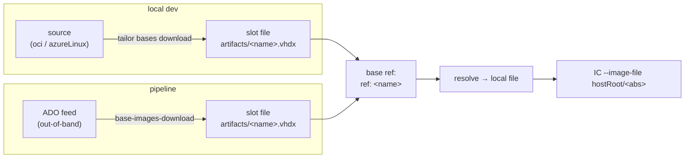
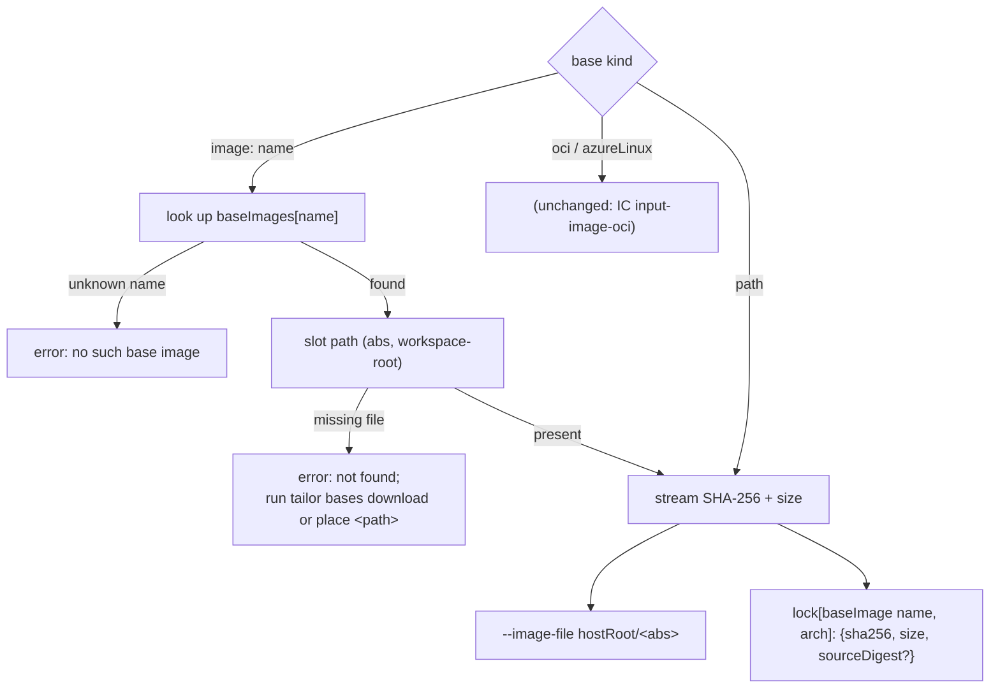

# Base-image catalogue & `tailor bases`

> **Status:** Implemented · _last reviewed 2026-06-29_
>
> `baseImages:`, `base: { ref: ... }`, `tailor bases download/verify`, and the real `oci_client` pull path are implemented in `crates/tailor-config/src/schema.rs`, `crates/tailor-core/src/catalogue.rs`, `crates/tailor-resolve/src/download.rs`, and `crates/tailor/src/run.rs`. Caveat: `source_digest`/`size` are computed but still not persisted to `tailor.lock` (§5.3).

This is the forward design for the last piece of the Trident `tests/images/builder` that tailor does
not yet cover: **acquiring base OS images**. The builder downloads base images for local builds
(`oras pull` from MCR → a local `.vhdx`); in the pipeline the *same* files arrive through a different
channel (an Azure DevOps artifact feed) and are placed at the *same* local paths. Either way, the
image build consumes a **local file**.

tailor must replace this while preserving that invariant: **the build always consumes a local file,
never a build-time registry pull.** This document specifies a small mechanism that does so — a named
**base-image catalogue** in `tailor.yaml`, a new **`tailor bases`** command (with `download` /
`verify` subcommands) that materialises catalogue entries from their remote source, and a **catalogue
reference** base kind for image definitions.

| Piece | Where | Summary |
| --- | --- | --- |
| `baseImages:` catalogue | `tailor.yaml` (`ToolConfig`) | Named slots: `name → { path, source? }`. |
| `base: { ref: <name> }` | `image.yaml` (`BaseSource`) | Reference a catalogue slot; resolves to its file. |
| `tailor bases download` / `verify` | CLI | Materialise catalogue slots from their `source`; or assert referenced slots exist. |

---

## 1. Problem

### 1.1 What the builder does

Trident's `tests/images/builder` resolves base images two ways that land on one file
([`builder/download.py`](https://github.com/microsoft/trident/blob/main/tests/images/builder/download.py),
[`builder/__init__.py`](https://github.com/microsoft/trident/blob/main/tests/images/builder/__init__.py)):

- **Local builds** — `oras pull mcr.microsoft.com/azurelinux/3.0/image/<variant>:latest` into a temp
  dir, find the single `.vhdx`, copy it to the image's local path (`artifacts/<name>.vhdx`).
- **Pipeline builds** — a separate `base-images-download-template` pulls the same images from the
  `AzureLinuxArtifacts` ADO feed (a `BaseImageManifest`: org/project/feed + package + version) and
  drops them at the *same* `artifacts/<name>.vhdx` paths.

The image config (`ImageConfig.base_image`) only ever names a `BaseImage`; the bytes are a file on
disk by the time IC runs. The named base images are a fixed enum: `baremetal`, `core_selinux`,
`qemu_guest`, `core_arm64`, `minimal`, the `ubuntu_*` and `myimage_*` variants, etc.

### 1.2 Why tailor's current `oci` / `azureLinux` base does not fit

tailor already has two registry base kinds (`crates/tailor-config/src/schema.rs` `BaseSource::Oci` /
`BaseSource::AzureLinux`, resolved in `crates/tailor-resolve/src/{oci,azure_linux}.rs`). But they hand
the registry reference to **Image Customizer**, which downloads it *at build time* via the
`input-image-oci` **preview feature** (`meta/docs/design.md` §6). That is exactly what the pipeline
cannot do:

- The pipeline's base images come from the **ADO feed, not a registry** tailor can pull — so a
  build-time OCI pull is simply the wrong source.
- It depends on an IC **preview feature** and a writable `runtime.imageCacheDir` inside the
  privileged container, for every base, on every run.
- It is **not reproducible across environments**: local pulls MCR, the pipeline pulls a feed, and the
  bytes are never pinned to one artifact the build verifies.

So tailor needs a file-based path that works identically in both environments, with the *acquisition*
of the file factored out of the build.

### 1.3 Secondary win: kill the brittle relative base paths

Today every image repeats a base path, e.g. `base: { path: ../../../artifacts/baremetal.vhdx }`, and
the correct number of `../` depends on the workspace layout. That repetition is error-prone (it has
already produced real bugs). A catalogue lets the path live **once** and images reference it **by
name** — see §6.

---

## 2. The model

A **base-image catalogue** is a set of named *slots*. A slot is a local file path plus, optionally,
the remote *source* that file came from. `tailor bases download` is the only thing that reads a slot's
source; everything else (resolution, build, the lock) only ever sees the slot's **file**.

> Paco's framing: *"it's like having a local OCI cache, but the image depends on the cached file
> instead of the logical OCI image."* The slot **is** the cache entry; `download` fills it; the image
> definition depends on the slot.



The two environments differ only in **who fills the slot**. In dev, `tailor bases download` does; in
CI, the existing feed download does, and `tailor bases download` is skipped (or run as a presence
check). The build is identical: a `path` base under the hood.

---

## 3. Schema — `tailor.yaml` `baseImages:`

`ToolConfig` already has an `images:` field, but it names the workspace's **buildable images**
(`ImageCatalogue`: members/exclude/inline). To avoid the clash, the new catalogue is **`baseImages:`**.

```yaml
# tailor.yaml
baseImages:
  baremetal:
    arch: amd64
    # Where the file lives / where `download` writes it (relative to the workspace root).
    path: ../../artifacts/baremetal.vhdx
    # Optional: how `tailor bases download` materialises it. Absent ⇒ provided out-of-band (e.g. CI feed).
    source:
      azureLinux:
        version: "3.0"
        variant: baremetal

  core_arm64:
    arch: arm64
    path: ../../artifacts/core_arm64.vhdx
    source:
      azureLinux:
        version: "3.0"
        variant: core

  qemu_guest:
    arch: amd64
    # No `source`: this slot is filled by the pipeline feed only; `download` skips it.
    path: ../../artifacts/qemu_guest.vhdx
```

Entry shape:

| Field | Required | Meaning |
| --- | --- | --- |
| `path` | yes | The slot file: build input **and** `download` output. Workspace-root-relative (like signing key/cert paths, `crates/tailor-core` preflight), absolutised to the workspace root. |
| `arch` | no | The base image's architecture (`amd64` \| `arm64`) — the **same vocabulary** as the `arch` axis / `architectures`, not a `linux/...` platform string. Drives the pull platform (`linux/<arch>`) and **reconciles** with the referencing cell's arch ([`arch-and-platform.md`](./arch-and-platform.md) §3). Absent ⇒ the cell's arch decides. |
| `source` | no | A remote source `download` can pull from — `oci: { uri }` or `azureLinux: { version, variant }` — pulled for `linux/<arch>`. Absent ⇒ the slot must be pre-placed; `download` skips it. |

Block-style YAML throughout (no inline flow maps), per the workspace convention.

---

## 4. Schema — referencing a slot from `image.yaml`

A new `BaseSource` variant references a catalogue slot by name. It deserialises from `{ ref: <name> }`
(untagged, alongside `path` / `oci` / `azureLinux`):

```yaml
# image.yaml — default base (amd64)
base:
  ref: baremetal
```

```yaml
# by-arch/arm64.yaml — arm64 cells swap to the arm64 slot
base:
  ref: core_arm64
```

The direct `path` base stays valid — a catalogue is opt-in, and one-off local files need no slot.
Catalogue slots are **arch-specific by name** (mirroring Trident's `baremetal` vs `core_arm64`); a
multi-arch image picks the right slot with a `by-arch/<arch>.yaml` fragment (the same way it would
`$set` a per-arch `base.path` today), and the slot's `arch` reconciles with the cell's
([`arch-and-platform.md`](./arch-and-platform.md) §3).

> **Why a key, not a bare string.** `base: baremetal` would be ambiguous with a relative path that
> happens to have no slashes. An explicit `image:` key keeps `BaseSource` an unambiguous `oneOf`. A
> bare-string sugar is listed as an open question (§10).

---

## 5. `tailor bases` — base-image management

A parent `tailor bases` subcommand groups base-image operations (mirroring `tailor add`'s nested
shape, `crates/tailor/src/cli.rs`), leaving room to grow — `clean`, … The three it ships with:

```
tailor bases list
tailor bases download [NAMES]...   [--force]
tailor bases verify   [NAMES]...
```

**`list`** prints every catalogue slot with its resolved arch, `source` kind (`oci:` / `azureLinux:` /
`out-of-band`), on-disk presence, and absolute path — a read-only inventory of what the build will
consume and what `download` can pull.

**`download`** materialises catalogue slots from their `source`:

- **Default** (no names): every slot that **has a `source`** and whose **file is missing** is
  downloaded. Slots without a source, or whose file already exists, are left alone (idempotent — safe
  to run before every local build).
- **`NAMES`**: only those slots. Naming a slot with no source is an **error** (`no source for
  <name>; place the file at <path>`).
- **`--force`**: re-download even if the file exists (refresh a floating tag).

**`verify`** downloads nothing; it **asserts** every slot referenced by the selected images/cells
exists on disk, failing fast with the missing names and paths. This is the pipeline's "is the feed
download wired?" gate — it runs after the feed step, before the build. With `NAMES`, it checks only
those slots.

### 5.1 Arch

A slot declares its **`arch`** (`amd64` \| `arm64`) — the same vocabulary as the `arch` axis and
`architectures`, not a `linux/...` platform string. `download` pulls the source for
`linux/<arch>`, and at build time the slot's arch **reconciles** with the referencing cell's arch:
they must agree, or either fills the other in, and a conflict is an error — the matrix in
[`arch-and-platform.md`](./arch-and-platform.md) §3. This is why slots are arch-specific by name
(e.g. `core_arm64` declares `arch: arm64`).

### 5.2 Acquisition mechanism

tailor already depends on the `oci_client` crate and resolves registry digests with it
(`crates/tailor-resolve/src/oci.rs`). `download` reuses that adapter to **pull the artifact's image
layer** for the resolved platform and write it to the slot `path`
(`crates/tailor-resolve/src/download.rs`):

1. Pull the **platform manifest** for `linux/<arch>` via `oci_client`'s platform resolver
   (`pull_image_manifest` follows the OCI image index to the per-arch manifest and returns its
   digest — the slot's *source* provenance).
2. **Select the image layer.** The Azure Linux image artifact carries the disk image as a single
   layer annotated `org.opencontainers.image.title: image.vhdx` alongside small SPDX/signature
   layers; `download` prefers the layer whose title matches the slot file's extension, else the
   largest layer carrying a disk-image extension, else the largest layer overall.
3. **Stream the layer blob raw** to `path` (`pull_blob`). The Azure Linux disk image is stored
   *uncompressed* — the layer's bytes start with the `vhdxfile` magic, not a tar/gzip header — so
   the layer digest **is** the file's `sha256`. No untar/decompress step.

> **Confirmed MCR layout.** The `mcr.microsoft.com/azurelinux/<ver>/image/<variant>` artifact is an
> [OCI image index](https://github.com/opencontainers/image-spec/blob/main/image-index.md)
> with per-arch manifests; each per-arch manifest carries the raw `.vhdx` as a single
> title-annotated layer (plus SPDX + signature blobs). The layer media type is the generic
> [`application/vnd.oci.image.layer.v1.tar`](https://github.com/opencontainers/image-spec/blob/main/media-types.md),
> but the payload is the raw disk image, so tailor streams it verbatim.

> **Rejected alternative — shell out to `oras`** (what the builder does). It would add a runtime
> binary dependency to every dev box and pipeline agent, against tailor's static-single-binary goal
> (`meta/docs/design.md`). Reusing `oci_client` keeps tailor self-contained.

### 5.3 Idempotency & provenance (lock)

A downloaded file's **content hash** is the build input (identical to a `path` base). The slot's
**source digest** is *provenance*: the per-arch manifest digest the layer was pulled from. `download`
surfaces both the source digest and the byte size for each pulled slot in its result
(`SlotOutcome::Downloaded { source_digest, size }`, `crates/tailor-core/src/catalogue.rs`).
Re-running `download` without `--force` skips a slot whose file is present; `--force` re-pulls. This
keeps the build reproducible (it pins the file's hash) while making the file's origin auditable.

> **Implementation caveat.** The layer pull and idempotent present/`--force` logic are implemented
> (`crates/tailor-resolve/src/download.rs`, `crates/tailor-core/src/catalogue.rs`). Persisting the
> source digest to `tailor.lock` (`lock[baseImage <name>]: { sourceDigest, sha256, size }`) is the
> remaining step — the data is already computed and returned, it is just not yet written to the lock.

---

## 6. Resolution & build integration

`base: { ref: <name> }` slots into the existing per-cell resolution (`meta/docs/design.md` §6,
`crates/tailor-resolve`):



- A catalogue reference resolves to its slot file and then behaves **exactly like a `path` base**:
  streamed SHA-256 + size, host-translated `--image-file`. The image-dir vs workspace-root base
  distinction is handled at resolution time (slot paths are workspace-root-relative; `path` bases
  remain image-dir-relative, per the absolute-path rules in `crates/tailor-config/src/path.rs`).
- A **missing slot file** is a hard error with an actionable hint (run `tailor bases download`, or — in
  CI — ensure the feed step placed it). Unknown slot **name** is a config error surfaced by `validate`.
- `validate` resolves catalogue **names** (cheap, no I/O) so a typo'd `image:` fails fast; it does
  **not** require the files to exist (so `validate` still runs on a fresh checkout).

### 6.1 The brittle-path win

With a catalogue, the eight comparison images stop repeating `../../../artifacts/<name>.vhdx`:

```yaml
# before (per image, layout-sensitive ../ count)
base:
  path: ../../../artifacts/baremetal.vhdx

# after (path lives once in tailor.yaml)
base:
  ref: baremetal
```

The relative path is defined **once** in `baseImages`, eliminating the per-image `../` arithmetic that
previously broke when the workspace layout changed.

### 6.2 The base image in the matrix

When a cell's base resolves to a catalogue slot, that cell's `tailor matrix` record gains the resolved
**base-image name** (the `baseImages` key):

```json
{
  "image": "trident-mos",
  "slug": "trident-mos_host_amd64_iso",
  "axes": { "runtime": "host", "arch": "amd64", "type": "iso" },
  "format": "iso",
  "baseImage": "baremetal"
}
```

It is **derived per cell** — a `by-arch/` fragment may reference a different slot per arch — so it is
**not** a new matrix axis and does **not** change the slug; it only makes the cell→base-image
dependency explicit and machine-readable. `tailor bases verify` and the pipeline enumerate `tailor
matrix --format json` (or its ADO form, `tailor matrix --ado`, [`ado-matrix.md`](./ado-matrix.md)) to
learn exactly which base images the selected cells need, so they download or verify **only those**. A
`path` / `oci` / `azureLinux` base leaves `baseImage` absent.

---

## 7. CI / pipeline integration

The split is the whole point:

| | Who fills the slot | tailor command | Build |
| --- | --- | --- | --- |
| **Local dev** | `tailor bases download` (pulls MCR/OCI) | run it (idempotent) | `--image-file <slot>` |
| **Pipeline** | the ADO feed step (today's `base-images-download-template`) | `tailor bases verify` (presence check) | `--image-file <slot>` |

The pipeline keeps its existing feed download placing files at the slot paths; it adds an optional
`tailor bases verify` gate and otherwise changes nothing. It can enumerate `tailor matrix` — as JSON,
or as an ADO matrix variable via `tailor matrix --ado` ([`ado-matrix.md`](./ado-matrix.md)) — to drive
one build job per cell and learn which base images each needs. The `trident2` workspace gains
`baseImages:` entries pointing at the repo-root `artifacts/` files the pipeline already produces, and
the image definitions switch from `base: { path: ../../../artifacts/... }` to `base: { ref: ... }`.

---

## 8. Architecture / layering

Consistent with the hexagonal layout (`meta/docs/architecture.md`):

- **Acquisition (I/O)** lives in the `tailor-resolve` adapter, next to the existing OCI digest
  resolution — a new `download`/`pull` function over `oci_client`. If a port is warranted, add a
  `BaseImageFetcher` trait in `tailor-core` (`fetch(source, platform, dest)`); the in-memory test
  double mirrors the existing `FakeResolver`.
- **Orchestration** (read `baseImages`, decide which slots are missing, place files, update the lock)
  lives in `tailor-core` and is driven by a CLI `Bases` command in `crates/tailor/src/run.rs` with
  `download` / `verify` subcommands (an `BasesCommand` enum mirroring the existing `AddCommand`),
  alongside `Resolve` / `Lock` / `Update`.
- **Catalogue parsing** is a `ToolConfig.base_images: Option<BaseImageCatalogue>` field in
  `crates/tailor-config/src/schema.rs` (each slot: `arch`, `path`, optional `source`); the new
  `BaseSource::Ref { reference: String }` variant joins the untagged enum, and the matrix renderer adds
  the resolved `baseImage` field per cell (§6.2).
- **Arch reconciliation** (slot `arch` × cell arch, [`arch-and-platform.md`](./arch-and-platform.md) §3)
  happens during per-cell resolution in `tailor-resolve` / `tailor-core`, before the file is hashed.

---

## 9. Relationship to the existing `oci` / `azureLinux` base

Both stay; they answer different questions.

| | `base: { ref: <name> }` (this design) | `base: { oci }` / `base: { azureLinux }` (today) |
| --- | --- | --- |
| Who fetches | tailor (`download`) or the pipeline feed | Image Customizer, at build time |
| Build input | a **local file** (`--image-file`) | a **registry digest** (`--image`, `input-image-oci`) |
| Preview feature | none | `input-image-oci` (IC ≥ 1.1) |
| Works in the Trident pipeline | **yes** (feed-placed file) | no (feed is not a registry) |
| Best for | reproducible, file-based, CI-parity builds | a quick dev build straight off a registry |

A catalogue slot **may reuse** the `oci`/`azureLinux` structs for its `source`, but the consumed
artifact is a file, not IC's OCI input.

---

## 10. Open questions

1. **Bare-string sugar** `base: <name>` / `base: <path>` — convenient but ambiguous; deferred in
   favour of explicit `{ ref: }` / `{ path: }`. Revisit if authors ask.
2. **~~`azureLinux` platform~~ (resolved)** — the slot's `arch` field (§5.1) drives the pull platform
   (`linux/<arch>`) for every source kind, including `azureLinux` whose variant name (`core`) does not
   encode the arch. No per-source platform string is needed.
3. **More source kinds** — an `https` URL or a direct ADO-feed source would let `tailor bases download`
   cover the pipeline's channel too. Out of scope here (the pipeline keeps its feed step), but the
   `source` enum is designed to grow.
4. **Lock semantics for floating tags** — `:latest` sources are not reproducible until pinned. The
   recorded `sourceDigest` (§5.3) makes a pull auditable; whether `--locked` should *require* the file
   to match the locked `sha256` is a follow-on.
5. **Catalogue path base-dir** — workspace-root-relative is proposed (matches signing paths). Slot
   files land under the gitignored `artifacts/`, so nothing new is tracked.
6. **`output`/RPM-source parity** — the builder also stages RPM sources (`bin/RPMS`,
   `artifacts/rpm-overrides`). Those are already `rpmSources` paths in tailor; only base-image
   *acquisition* is in scope here.

---

## 11. Migration mapping (Trident → tailor)

| Trident `BaseImage` | tailor `baseImages` slot | `source` |
| --- | --- | --- |
| `baremetal` | `baremetal` (`arch: amd64`) → `artifacts/baremetal.vhdx` | `azureLinux { 3.0, baremetal }` |
| `core_arm64` | `core_arm64` (`arch: arm64`) → `artifacts/core_arm64.vhdx` | `azureLinux { 3.0, core }` |
| `core_selinux` | `core_selinux` (`arch: amd64`) → `artifacts/core_selinux.vhdx` | (feed-only ⇒ no `source`) |
| `qemu_guest` | `qemu_guest` (`arch: amd64`) → `artifacts/qemu_guest.vhdx` | (feed-only ⇒ no `source`) |
| `ubuntu_2404_amd64` … | `ubuntu_2404_amd64` … | `oci`/`https` when published |

`download.py`'s "pull from MCR, find the single `.vhdx`, copy to the path" becomes `tailor bases
download` over `oci_client`; the feed path (`BaseImageManifest`) stays a pipeline concern that fills
the same slots.
