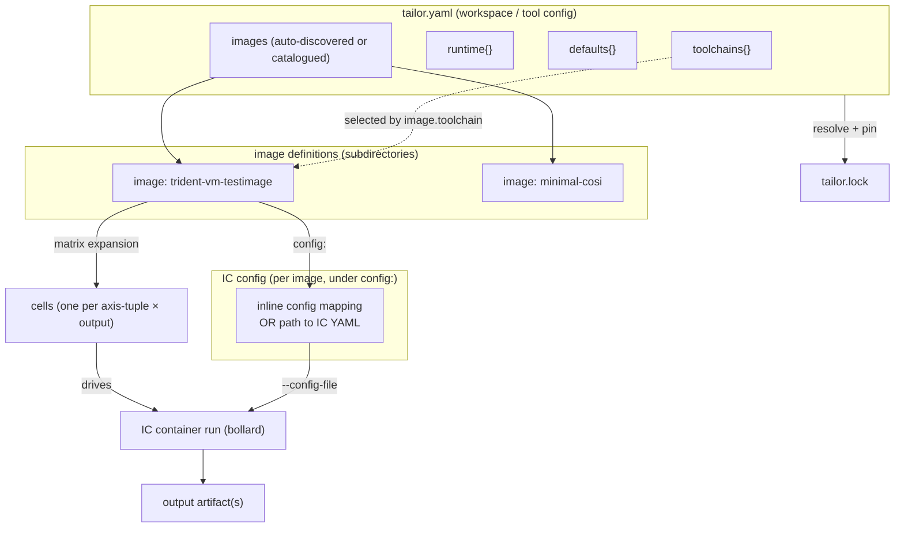
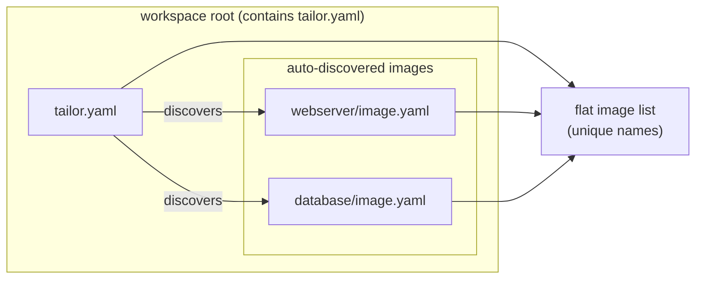
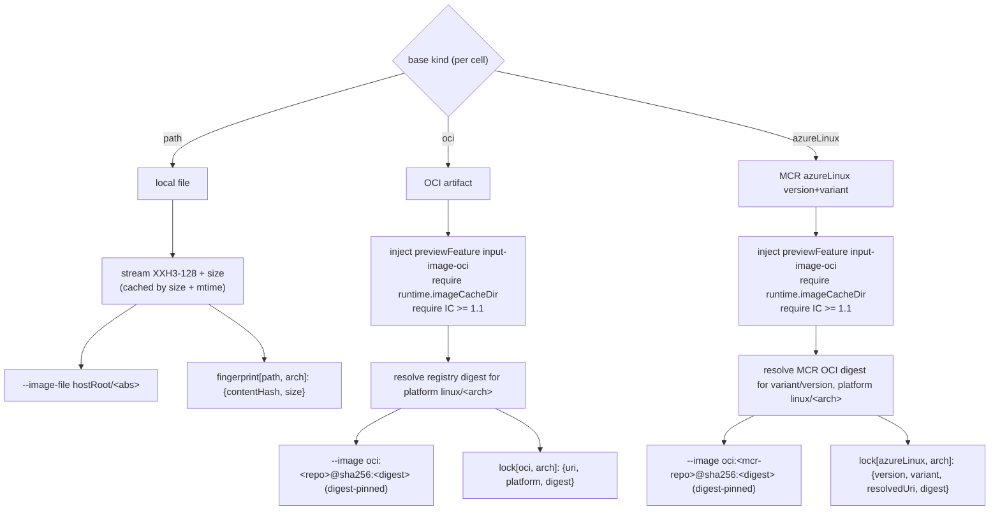
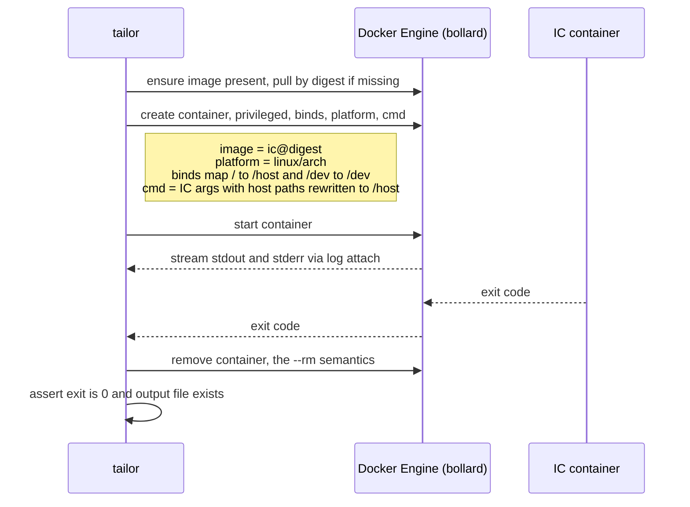
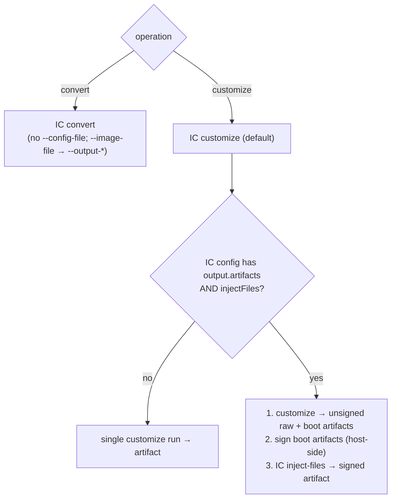
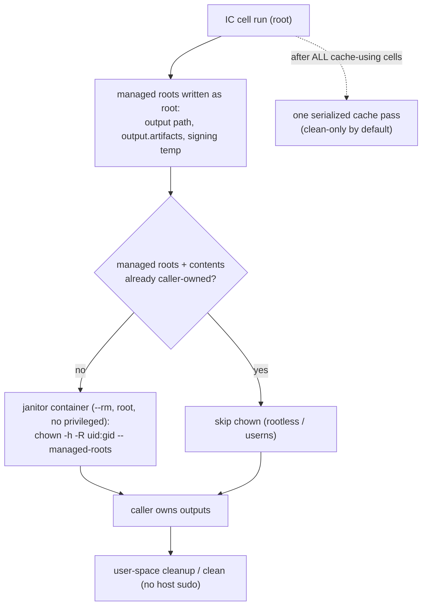
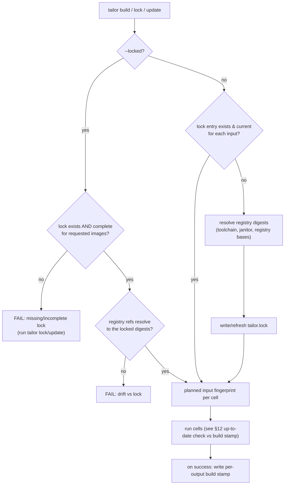
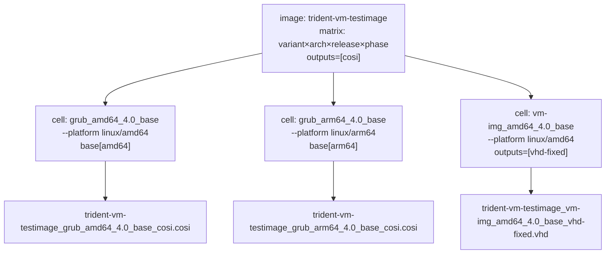
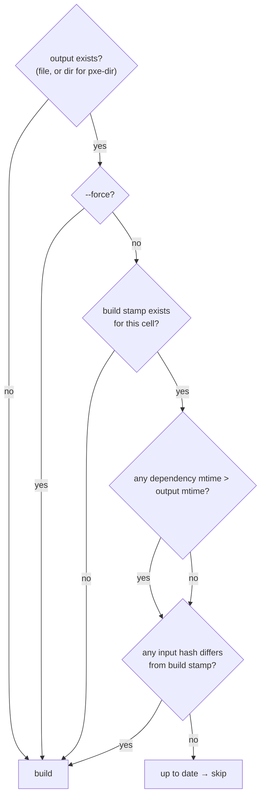

# tailor — Design

> **Status:** Partially implemented (foundational/living) · _last reviewed 2026-06-29_
>
> Milestones M1–M3 are built across `crates/tailor-config`, `crates/tailor-core/src/orchestrator.rs`, `crates/tailor-exec/src/arg_builder.rs`, and `crates/tailor-core/src/stamp.rs`. M4 signing execution is not built, and the later caching/RPM tiers remain partial; see §17 for the milestone framing.

---

## 1. Problem statement & motivation

Building customized OS images with the Azure Linux **Image Customizer** (`imagecustomizer`, "IC")
today means hand-assembling a privileged `docker run` invocation for every image: the right
container tag, the host-root bind mount, the base image path, the output format, RPM sources, and
an IC config YAML — repeated per image, per architecture, per output format, with no shared
toolchain pinning and no reproducibility guarantees. The `trident` repo solved this for its own
test images with a bespoke Python builder (`tests/images/builder`), but that builder hard-codes its
image set in Python (`testimages.py`) and is not reusable outside trident.

`tailor` generalizes that proven model into a standalone, declarative, **config-management +
execution-orchestration** tool, structured like Cargo:

- one central **"configure the tools"** file (the toolchain: which IC container/version, Docker
  runtime settings, global defaults),
- a set of **"configure the images"** configs (each defines an IC config plus base image, output
  formats, architectures, and feature flags),
- a **lockfile** pinning IC container digest(s) and resolved base-image digests for reproducible
  rebuilds.

The Cargo analogy is about **structure** (one tool config + per-image configs + reproducible
execution), **not** dependency resolution. `tailor` has no dependency graph and no registry.

### Why this is worth building

| Pain today (raw IC / Python builder)                          | What tailor provides                                          |
| ------------------------------------------------------------- | ------------------------------------------------------------- |
| Per-image bespoke `docker run` lines                          | One declarative manifest; tailor assembles the invocation     |
| No pinning of IC container or registry inputs                 | Lockfile pins re-fetchable registry digests (toolchain + `oci`/`azureLinux` bases) |
| Image set hard-coded in Python                                | YAML manifest, no code changes to add an image               |
| No reproducible rebuild story                                 | `tailor build --locked` enforces the pinned digests (output reproducibility is bounded — §9.3) |
| Output/arch matrix expanded by hand                           | `outputs × architectures` matrix expansion                    |
| Config drift across IC versions chased by hand                | tailor stays version-agnostic: IC owns its config & capabilities |

---

## 2. Goals / non-goals

### Goals

1. Declarative YAML manifest describing a **toolchain** (IC container/version + runtime) and a set
   of **images** (IC config + base image + outputs + arch + features).
2. Container-only execution of IC via the Rust **`bollard`** crate, faithfully reproducing the
   builder's invocation contract (privileged, host-root mount, `/dev`, platform, build-dir, RPM
   sources, customize / convert / inject-files).
3. Reproducible *pulls* via a **lockfile** pinning re-fetchable registry digests (IC container +
   `oci`/`azureLinux` bases); local inputs are tracked by build stamps; `--locked` enforces the lock.
4. **Thin over IC, not a re-modeling of it**: tailor is a generic config merger + a wrapper that
   invokes IC. It does not model IC's config schema or version capabilities — those are the user↔IC
   contract; IC validates and gates them itself.
5. **Multi-axis matrix** — user-defined axes (variant, release, phase, …) plus architecture ×
   output formats, expanded into cells (each cell = one IC invocation producing one artifact).
6. **Base image from a local file OR an OCI location**, mapped onto IC's native `input.image`.
7. A small, ergonomic verb surface (`build`, `render`, `explain`, `list`, `show`, `lock`/`update`,
   `resolve`, `validate`, `clean`, `matrix`).
8. Alignment with Azure Linux / Trident Rust conventions (cargo workspace, clippy, tests, license
   headers, rustfmt).

### Non-goals

- **No dependency graph, no version resolution of "packages"/crates, no registry, no publishing.**
- `tailor` **never customizes images itself** — it only orchestrates the IC container. All image
  semantics live in the `config:` IC configuration.
- Not a wrapper that mirrors every IC schema field. The `config:` key is opaque to tailor; tailor
  does not re-model `storage`/`os`/`scripts`/etc.
- No general-purpose Docker orchestration beyond what IC requires.
- Not a replacement for IC; tailor is strictly a front-end/orchestrator.

---

## 3. Background

### 3.1 The engine — Image Customizer

IC is a container-only tool (`mcr.microsoft.com/azurelinux/imagecustomizer:<tag>`) that takes a
base OS image plus a YAML config and produces a customized image. The git repo is tagged
**v0.3.0 … v1.3.0** (with a leading `v`), but the **published MCR container tags omit the `v`**
(e.g. `mcr.microsoft.com/azurelinux/imagecustomizer:0.18.0`, per the IC quick-start docs); a
floating `latest` tag also exists. tailor keeps the human-facing semantic **version** distinct from
the registry **tag** to avoid this footgun (see §5.1).

**Top-level IC config keys** (`config` type):

| Key               | Purpose                                                       | Added  |
| ----------------- | ------------------------------------------------------------- | ------ |
| `input`           | Base image source (`input.image`)                             | v0.13  |
| `storage`         | Disks, partitions, filesystems, verity                       | v0.3   |
| `os`              | hostname, kernelCommandLine, packages, services, users, …     | v0.3   |
| `scripts`         | post/finalize customization scripts                          | v0.3   |
| `iso` / `pxe`     | Live ISO / PXE outputs                                        | v0.3 / v0.8 |
| `output`          | Output image + artifacts                                      | v0.13  |
| `previewFeatures` | Opt-in not-yet-stable features                               | v0.8+  |
| `baseConfigs`     | Hierarchical config inheritance (preview `base-configs`)     | v1.1   |

**`input.image` is a oneOf** — exactly one of:

- `path` — local file (vhd/vhdx/qcow2/raw). *(v0.13)*
- `oci` — `{ uri, platform }`, preview `input-image-oci`, requires `--image-cache-dir`. *(v1.1)*
- `azureLinux` — `{ version, variant }`, downloads from MCR, preview `input-image-oci`. *(v1.1)*

**`output.image`** — `path`, `format` (vhd, vhd-fixed, vhdx, qcow2, raw, iso, pxe-dir, pxe-tar,
cosi, baremetal-image), optional `cosi.compression.level` (preview `cosi-compression`, v1.2).
**`output.artifacts`** (`items` + `path`, preview `output-artifacts`, v0.14) drives signed
bootchain → `inject-files`.

**CLI override semantics** (the lever tailor pulls): `--image-file` overrides `input.image`;
`--output-image-file` / `--output-image-format` override `output.image`. So tailor can leave a
image's IC config format-agnostic and drive the matrix entirely from the command line.

**Subcommands:** `customize` (default, v0.13), `convert` (v1.2), `inject-files` (v0.14),
`create` (v1.2). Global flags include `--log-level` (panic…trace) and `--version`.

### 3.2 Prior art — the trident builder

`tests/images/builder` (Python) is the proven model tailor generalizes:

- **`ArtifactManifest`** = the toolchain: `customizer_container`, `customizer_version`,
  `customizer_container_full` (resolved tag), list of base images. → tailor's **tool config**.
- **`ImageConfig`** = one image: `name`, config dir, **root IC config YAML** (`config_file`),
  `base_image`, `output_format`, `architecture`, `requires_trident`/`requires_dhcp` (RPM sources),
  `image_customizer_convert`, `ssh_key`, `extra_dependencies`. → tailor's **image definition**.
- **Pipeline:** download base → customize (run IC container) → \[convert] → sign + inject-files
  (SecureBoot) → run. Plus **image cloning** (deep-copy config + `_N` suffix, built in parallel)
  and **incremental up-to-date checks** (output mtime vs each dependency's mtime; `--force` to
  override).
- **Container invocation contract** (verbatim from `builder/customize.py`, the thing tailor must
  reproduce via bollard):

  ```text
  docker run --rm --privileged -v /:/host -v /dev:/dev [--platform <arch>] \
    <ic_container> --config-file <root.yaml> --log-level <lvl> --build-dir /tmp \
    --image-file <base_image> --output-image-format <fmt> --output-image-file <out> \
    [--rpm-source <path> ...]
  ```

  The host root `/` is bind-mounted at `/host`; **every host path passed to IC is rewritten to
  `/host/<absolute-path>`** (`builder/utils.py::build_path`). `--build-dir` is `/tmp` inside the
  container.

---

## 4. Concepts & terminology



- **Image** — the authoring and catalogue unit. Each image lives in its own directory as an
  `image.yaml` (plus optional `by-*/` fragments, `files/`, `scripts/`, etc.). It is what
  `tailor.yaml` catalogues and what `tailor build <image>` builds. An image declares a `matrix:`
  that expands into one or more cells.
- **Cell** — one point of an image's matrix (one combination of all axis values) × one output
  format — the concrete unit tailor renders and hands to IC. Each cell is one IC container
  invocation producing one artifact. (Synonym: "target" may appear in internal/engine prose to mean
  a fully-resolved cell, but the authoring/catalogue/CLI surface always says "image".)
- **Clone** — an identical copy of a cell build, produced by `--clones N`. Total build instances
  = images × cells × clones. Clones share the same rendered config; they differ only in output
  suffix and isolation paths.
- **Toolchain** — a pinned IC container (registry + version/tag, digest resolved into the lock)
  plus the runtime knobs to invoke it. Multiple toolchains may coexist in one workspace.
- **Workspace** — the `tailor.yaml` tool config (toolchains + runtime + defaults + image
  catalogue). Found by walking UP from the cwd, like Cargo.
- **Lockfile** — `tailor.lock`, a flat set of resolved **registry digests** (toolchain, janitor,
  `oci`/`azureLinux` bases) so the same images are re-fetched everywhere. Local-input change-detection
  lives in build stamps (§9), not the lock.
- **Matrix** — the cartesian product of user-defined axes (plus architecture and output format)
  for an image; each point is one cell.

---

## 5. Manifest schemas

`tailor` defines **two** logical schemas — the tool config (`tailor.yaml`) and the image
definition (`image.yaml`) — plus the lockfile. Only the top-level `tailor.yaml` and `tailor.lock`
carry a `schemaVersion`; image definitions are governed by the workspace's version and do not
repeat it. **The top level of every `image.yaml` (and fragment) is tailor fields only; all Image
Customizer config lives under `config:`** — an inline YAML mapping OR a path string. `config:` is
opaque to tailor (tailor never models the IC schema).

### 5.1 Tool config — `tailor.yaml` ("configure the tools")

```yaml
schemaVersion: 1

# --- Which Image Customizer container(s) to use -------------------------------------------------
# `version` is OPTIONAL, informational metadata (tailor does not gate IC versions — §8).
# `tag` is the REGISTRY tag actually pulled; it defaults to `version` (MCR publishes unprefixed tags
# like `:1.3.0`), and to `latest` when neither `tag` nor `version` is given. Override `tag` for a
# pinned or date-stamped tag. The resolved registry DIGEST (authoritative) is written into tailor.lock.
toolchains:
  default: ic-1.3                    # name used when an image omits `toolchain:`
  entries:
    - name: ic-1.3
      container: mcr.microsoft.com/azurelinux/imagecustomizer
      version: "1.3.0"               # optional; informational. Omit to track `latest`.
      # tag: "1.3.0"                  # optional; defaults to `version`, else `latest`
    - name: ic-1.1
      container: mcr.microsoft.com/azurelinux/imagecustomizer
      version: "1.1.0"

# --- Docker/runtime settings for the bollard execution layer ------------------------------------
# Reproduces the builder's invocation contract. Sensible defaults; rarely overridden.
# NOTE: `mounts.hostRoot` is the single source of truth for path translation AND the bind target;
# changing it re-points every `/host/<abs>` rewrite and the `-v /:<hostRoot>` bind consistently.
runtime:
  privileged: true                   # required by IC
  mounts:
    hostRoot: /host                  # -v /:/host  (host path → <hostRoot>/<abs> translation)
    dev: true                        # -v /dev:/dev
  buildDir: /tmp                     # --build-dir (container-internal; NOT host-translated)
  logLevel: debug                    # --log-level (panic|fatal|error|warn|info|debug|trace)
  imageCacheDir: ./.tailor/cache     # host dir; REQUIRED if any image uses oci/azureLinux.
                                     # Resolved rel. to the manifest, created on the host, and
                                     # passed as --image-cache-dir <hostRoot>/<abs> (host-translated).
  janitorImage:                      # digest-pinned minimal image for sudo-free chown/cleanup (§7.7)
    container: mcr.microsoft.com/azurelinux/busybox
    tag: "latest"                    # digest resolved into tailor.lock like the toolchain

# --- Defaults applied to every image unless overridden -------------------------------------------
defaults:
  architectures: [amd64]
  outputs:
    - format: cosi

# --- Image catalogue (OPTIONAL) -----------------------------------------------------------------
# Omit entirely to auto-discover every */image.yaml at depth 1 from the workspace root.
# Provide to curate the set or inline trivial images.
# images:
#   members:
#     - "*/"                          # default: every immediate subdirectory with an image.yaml
#   exclude:
#     - "scratch/"
#   inline:
#     - name: minimal-cosi
#       base:
#         path: ./artifacts/minimal.vhdx
#       outputs:
#         - format: cosi
#       config:
#         os:
#           hostname: minimal
```

**Field reference (tool config):**

| Field                     | Type                       | Req | Notes                                                          |
| ------------------------- | -------------------------- | --- | ------------------------------------------------------------- |
| `schemaVersion`           | int                        | yes | tailor manifest schema version (currently `1`). Only `tailor.yaml`/`tailor.lock` carry it. |
| `toolchains.default`      | string (name)              | yes | Default toolchain name for images that omit `toolchain:`.       |
| `toolchains.entries`      | list<{name,container,version?,tag?}> | yes | One or more pinned IC containers. Names must be unique; `tag` is the registry tag, default = `version` (no `v`). |
| `runtime.privileged`      | bool                       | no  | Default `true`; IC requires privileged.                       |
| `runtime.mounts.hostRoot` | string                     | no  | Default `/host`; the container-side mount of host `/` and the prefix for all path translation. |
| `runtime.mounts.dev`      | bool                       | no  | Default `true`; bind `/dev:/dev`.                             |
| `runtime.buildDir`        | string                     | no  | Default `/tmp`; IC `--build-dir` (container-internal, not translated). |
| `runtime.logLevel`        | enum                       | no  | Default `info`; IC `--log-level`.                            |
| `runtime.imageCacheDir`   | host path                  | cond | Required when any image uses `oci`/`azureLinux`. Created on host; passed host-translated as `--image-cache-dir`. |
| `runtime.janitorImage`    | {container, tag?}          | no  | Digest-pinned minimal image for sudo-free ownership/cleanup (§7.7). Default a busybox/coreutils-class image. |
| `defaults.architectures`  | string[]                   | no  | Inherited by images lacking `architectures:`.                |
| `defaults.outputs`        | output[]                   | no  | Inherited by images lacking `outputs:`.                      |
| `images`                  | {members?, exclude?, inline?} | no | Image catalogue. **Omit** to auto-discover every `*/image.yaml` at depth 1. Provide to curate the set. |

### 5.2 Image config — `image.yaml` ("configure the image")

Each image is a self-contained directory with an `image.yaml` at its root. The **top level is
tailor fields only**; all IC configuration lives under `config:` (an inline YAML mapping OR a path
string pointing to an external IC YAML). tailor treats `config:` as opaque — it merges it
structurally (with directives from fragments) and passes the result to IC via `--config-file`.

```yaml
name: trident-vm-testimage

# Toolchain selection: EITHER a name referencing tailor.yaml toolchains.entries (workspace mode),
# OR an inline {name, container, version, tag?} (standalone mode). Omitted => workspace default (or
# tailor's built-in default when standalone).
toolchain: ic-1.3

# User-defined axes. The cartesian product (minus exclude, plus include) = the set of cells.
matrix:
  variant: [grub, root-verity, usr-verity, vm-img]
  arch: [amd64, arm64]
  release: ["3.0", "4.0"]

# Output matrix. Each output format × each cell = one IC invocation → one artifact.
outputs:
  - format: cosi

# Base image source (registry bases are multi-arch; per-arch local files use `baseImages:` catalogue slots).
base:
  azureLinux:
    version: "3.0"
    variant: core

# Image-level feature flags (gates by-feature/<name>.yaml fragments).
features: [pcrlock-static-files]

# Named scalar constants for ${...} interpolation.
params:
  efiArch: x64
  grubEfiPkg: grub2-efi-binary

# Extra RPM sources: each is a directory of RPMs OR a .repo file → IC --rpm-source.
rpmSources:
  - ./rpms/

# IC operation (customize | convert). Default: customize.
operation: customize

# Run IC inject-files signing when the IC config sets output.artifacts. Default: false.
injectFiles: false

# Extra inputs for incremental checks (the only way to track IC-YAML-referenced files).
extraDependencies:
  - ./files/

# Image Customizer config — an inline mapping (the IC config tree) OR a path string.
# This is OPAQUE to tailor. tailor merges it structurally and passes it to IC.
config:
  os:
    hostname: trident-vm-testimage
    packages:
      install:
        - openssh-server
        - cracklib-dicts
    services:
      enable:
        - sshd
  scripts:
    postCustomization:
      - path: scripts/configure-sshd.sh
```

**Field reference (image config):**

| Field                  | Type                                   | Req | Notes                                                       |
| ---------------------- | -------------------------------------- | --- | ----------------------------------------------------------- |
| `name`                 | string (`[A-Za-z0-9.-]+`, no `_`)      | yes | Unique image id; used in output filenames and CLI. `_` is reserved as the slug separator. |
| `toolchain`            | string (name) \| {name,container,version?,tag?} | no | Name-ref (workspace) OR inline entry (standalone). Defaults to `toolchains.default` or tailor's built-in default. |
| `matrix`               | map<axisName, [values]> + include/exclude | no | User-defined axes. Omit for a single-cell image. `arch` may appear as an axis or via `architectures`. |
| `architectures`        | string[] (`amd64`\|`arm64`)            | no  | Defaults from `defaults.architectures`. Equivalent to a `matrix.arch` axis. |
| `outputs`              | [{format, cosiCompressionLevel?, name?}] | no | Defaults from `defaults.outputs`. `name` is a `${...}` template override for the output basename (§10). |
| `base`                 | oneOf {ref \| path \| oci{uri,platform?} \| azureLinux{version,variant}} | yes | Exactly one base source. A registry base (oci/azureLinux) is multi-arch ⇒ one `base` covers all arches. Per-arch local files use `baseImages:` catalogue slots and `base: { ref: <name> }` per cell. |
| `features`             | string[]                               | no  | Image-level feature flag list. Gates `by-feature/<name>.yaml` fragment inclusion. |
| `params`               | map<string, scalar>                    | no  | Named constants for `${...}` interpolation into `config:` string values. |
| `rpmSources`           | path[]                                 | no  | Each entry is a directory of RPMs OR a `.repo` file → IC `--rpm-source` (customize only). |
| `operation`            | enum `customize`\|`convert`            | no  | Default `customize`. Drives IC subcommand + arg-vector (§7.4). |
| `injectFiles`          | bool                                   | no  | Default `false`; drives signing/inject-files pipeline (§7.4). |
| `extraDependencies`    | path[]                                 | no  | Extra inputs for incremental checks; the only way to track IC-config-referenced files (§8.3). |
| `config`               | mapping \| path string                 | cond | IC config content. Required for `operation: customize`; forbidden for `convert`. Inline = IC YAML tree; string = path to an external IC YAML. |

Operation-specific validation (enforced at load time):

- **`customize`**: `config` required; `base` required; `rpmSources` allowed; full
  output-format set allowed (`cosi, vhd, vhd-fixed, vhdx, qcow2, raw, iso, pxe-dir, pxe-tar,
  baremetal-image`).
- **`convert`**: `config` **forbidden**; `injectFiles` **must be false/absent**; base must be a
  local-file (`path`) source (IC `convert` takes an `--image-file`, not a download); `rpmSources`
  **forbidden**; output formats restricted to the convert-supported set (`vhd`, `vhd-fixed`,
  `vhdx`, `qcow2`, `raw`, `cosi`, `baremetal-image`).

Matrix/base validation (after defaults + `--arch` are applied, enforced before running):

- `architectures` and `outputs` must each be **non-empty**; otherwise the image produces no cells
  (error).
- Each rendered cell must resolve exactly one `base`; no cell may end up without a base.
- A single `base.oci.platform`/`base.path` shared across multiple architectures is **warned** (a
  local file is single-arch; an explicit `oci.platform` that does not match the cell's architecture
  is an **error**). When `oci.platform` is omitted it defaults to `linux/<arch>` per cell.
- A registry base (`oci`/`azureLinux`) is **multi-arch** — one `base` covers all architectures via
  the platform manifest. For per-arch **local files**, define one `baseImages:` catalogue slot per
  arch (each with its own `path` + `arch`) and select it with `base: { ref: <name> }`.

### 5.3 Workspace topology & discovery (Cargo model)

**tailor follows the Cargo workspace convention.** A `tailor.yaml` at the workspace root is found
by **walking UP** from the current working directory (like `Cargo.toml`). Member images are
**subdirectories**, each self-contained with an `image.yaml` plus optional supporting structure
(`by-*/`, `files/`, `scripts/`, `layouts/`, `repos/`).

**Discovery rules:**

- **`images:` is OPTIONAL.** Omit the entire `images:` key ⇒ **auto-discover every `*/image.yaml`
  at depth 1** from the workspace root. This is the common case (convention over configuration).
- Provide `images:` as an object `{ members?: [glob], exclude?: [glob], inline?: [ImageDef] }`:
  - `members` (default `["*/"]`): path/glob strings to member directories (each containing an
    `image.yaml`) or directly to `image.yaml` files, resolved relative to `tailor.yaml`.
  - `exclude`: path/glob strings to exclude from the discovered/listed members.
  - `inline`: images defined directly inside `tailor.yaml` (for trivial single-file images that
    don't warrant their own directory).
- Duplicate `name`s across all discovered/inline images are an **error**.

**Standalone mode:**

When **no `tailor.yaml`** exists in the ancestry ⇒ build the `image.yaml` in the cwd directly.
Toolchain is specified inline in the image definition (or tailor's **built-in default** is used —
the default IC image and tag live in one obvious place, `crates/tailor-config/src/defaults.rs`:
`DEFAULT_IC_CONTAINER` = `mcr.microsoft.com/azurelinux/imagecustomizer` and `DEFAULT_IC_TAG` =
`latest`). `tailor.lock` is written beside the standalone `image.yaml`.

**Path resolution:**

- `tailor.yaml` relative paths resolve to the **workspace root** (the directory containing
  `tailor.yaml`).
- Each `image.yaml`'s relative paths (`base.path`, `rpmSources`, `extraDependencies`, paths inside
  `config:`) resolve to **that image's directory** (the directory containing the `image.yaml`).



### 5.4 How tailor selections relate to the IC config (authority model)

The `config:` IC configuration (inline or path-referenced) is the source of truth for *image
semantics* (storage, os, scripts, etc.). tailor owns exactly five levers and asserts **a single,
unambiguous authority rule** for each, always via the IC **command line** (which IC documents as
overriding the config file):
etc.). tailor owns exactly five levers and asserts **a single, unambiguous authority rule** for
each, always via the IC **command line** (which IC documents as overriding the config file):

| tailor concern        | IC lever (CLI, authoritative)              | What tailor does to the IC config                        |
| --------------------- | ------------------------------------------ | -------------------------------------------------------- |
| Base image            | `--image-file` (path) / `--image` (oci/azl) | Nothing. tailor does **not** write `input.image`; CLI wins. |
| Output format         | `--output-image-format`                    | Nothing; CLI wins.                                       |
| Output path           | `--output-image-file`                      | Nothing; CLI wins.                                       |
| COSI compression level | `--cosi-compression-level` (when set)     | For `customize`: inject `cosi-compression` previewFeature (IC ≥ 1.2 **requires** it for this flag). For `convert`: pass the flag directly, **no** token (convert has no config and IC does not gate it there). |
| Required previewFeatures | (none — config only)                    | Injects missing tokens it is responsible for (§7.6).     |

Consequences:

- tailor **never** edits `input.image`/`output.image` (including `output.image.cosi.compression`) in
  the (working copy of the) IC config. The only mutation it performs is appending `previewFeatures`
  tokens it is responsible for (e.g. `input-image-oci` for an `oci`/`azureLinux` base, and
  `cosi-compression` **only for `customize`** when `cosiCompressionLevel` is set — IC's `customize`
  docs require this token for the `--cosi-compression-level` flag, whereas `convert` accepts the flag
  with no token). This keeps one authority per lever and avoids stale/conflicting config.
- If the user's IC config *already* contains an `input.image`, an `output.image.format`/`path`, or an
  `output.image.cosi.compression.level` that conflicts with the image's `base`/`outputs`, tailor
  emits a **warning** (the CLI value will win) rather than silently diverging. `--strict` promotes
  such warnings to errors.

---

## 6. Base-image resolution

An image's `base` is resolved **per matrix cell** to (a) a concrete,
digest/hash-pinned input for that cell's container run and (b) a lock entry keyed by
`(kind, architecture)`. tailor drives the base through the IC **command line** (authoritative over
`input.image`, per §5.4) and never writes `input.image` into the IC config.



- **`path`** — the common MVP case. The base is a single-architecture local file, so for a
  multi-arch image define one `baseImages:` catalogue slot per arch (each with its own `path` +
  `arch`) and select the right slot per cell with `base: { ref: <name> }`. A shared `base.path`
  across architectures is allowed but warned, since one file cannot be correct for two arches.
  tailor streams an **XXH3-128** content hash (+ size) for change detection; this is deliberately
  non-cryptographic (local files are not security/provenance pins and are not recorded as
  re-fetchable lock entries). During `tailor build`, unchanged large bases skip the read via a
  `(size, mtime)` cache under `<output>/.tailor/base-hashes/`; malformed, missing, or unwritable
  cache entries are ignored and the file is re-hashed. The path is host-translated and passed as
  `--image-file <hostRoot>/<abs>`.
- **`oci`** — requires the pinned IC to support `input-image-oci` (≥ v1.1) and a configured
  `runtime.imageCacheDir`. The cell's **platform defaults to `linux/<arch>`** unless `oci.platform`
  is set explicitly. tailor resolves the registry **digest** for that platform and runs IC with a
  **digest-pinned** reference `--image oci:<repo>@sha256:<digest>`, so the *locked* digest is the
  one IC downloads (not a re-resolved floating tag). tailor injects the `input-image-oci`
  previewFeature into the working-copy IC config (§7.6).
- **`azureLinux`** — sugar over MCR; requires IC ≥ v1.1 and `imageCacheDir`. tailor resolves the
  concrete MCR OCI **digest** for `variant`/`version` at `linux/<arch>`, records the resolved URI +
  digest in the lock, and runs IC with the same **digest-pinned `--image oci:…@sha256:…` form** so
  reproducibility holds. (The human-friendly `azurelinux:<variant>:<version>` CLI form is *not*
  digest-pinned and is therefore used only by `tailor resolve`/`update` to discover the digest, not
  for locked builds.)
  - **Assumption to validate (E2E):** this design assumes IC's `--image oci:<repo>@sha256:…` accepts
    a digest reference and that an `azureLinux` image is reachable as a plain MCR OCI `repo@digest`,
    and that doing so does **not** bypass any `azureLinux`-specific validation IC performs for the
    sugar form. The IC docs do not confirm this. tailor therefore (a) flags this as an explicit
    assumption to verify against a real IC run during the OCI-base milestone (§17 M3), and (b) until
    verified, offers `resolve`-time digest verification but may fall back to the native
    `azurelinux:<variant>:<version>` form (accepting weaker pinning) if the digest-pinned `oci:` form
    is rejected by IC or proves to skip AzureLinux trust checks. **This fallback is incompatible with
    `--locked`:** under `--locked`, only digest-pinned references are permitted, so if a workable
    digest-pinned form cannot be established for an `azureLinux` base, `tailor build --locked` **fails
    for that image** (the user must run `resolve`/`update` to establish a digest-pinned form first).
    The chosen form is recorded in the lock so builds remain auditable, and fallback-mode entries are
    explicitly marked as non-reproducible (§9.3).

> **Multi-arch note:** A registry base (`oci` or `azureLinux`) references a **multi-arch manifest**
> — one `base` source covers all architectures (tailor selects the platform per cell via
> `linux/<arch>`). Per-arch **local files** use `baseImages:` catalogue slots selected per cell with
> `base: { ref: <name> }`.

Digest resolution uses a registry client (`oci-client`, already a Trident dependency) or bollard's
image inspect; local hashing uses streamed XXH3-128 for fast change detection. Because every kind is
reduced to a digest-pinned reference or a content hash before execution, `--locked` builds are
reproducible without trusting a floating tag (see §9.3).

---

## 7. Execution layer (bollard)

### 7.1 Why bollard, not the docker CLI

The kickoff fixes execution as **container-only via the Rust `bollard` crate** (talks to the Docker
Engine API directly). This avoids shelling out, gives structured access to container lifecycle and
log streams, and keeps tailor a single self-contained binary.

### 7.2 Container run model

tailor reproduces the builder's contract exactly:



Concretely, mapped to bollard `CreateContainerOptions` / `Config` / `HostConfig`:

- `image`: `<container>@<digest>` where `<digest>` is the lock's `sha256:…` string used verbatim
  (the lock stores the full `sha256:` prefix, so image refs never double-prefix). Example:
  `mcr.microsoft.com/azurelinux/imagecustomizer@sha256:abcd…`.
- `platform` (create option): `linux/<arch>` per matrix cell (the `--platform` lever).
- `HostConfig.privileged = true`.
- `HostConfig.binds = ["/:<hostRoot>", "/dev:/dev"]` using the configured `runtime.mounts.hostRoot`
  (default `/host`).
- `Config.cmd`: the IC argument vector, **with every host path rewritten to `<hostRoot>/<abs>`**.
- `--rm` behavior: container removed after completion (success or failure) once logs/exit are read.

### 7.3 Path translation

The single most important detail (from `builder/utils.py::build_path`): because host `/` is mounted
at `<hostRoot>` (default `/host`), **every host path argument passed to IC must be translated**:
`/home/user/x.vhdx` → `/host/home/user/x.vhdx`. tailor centralizes this in one helper keyed off the
configured `hostRoot` and applies it to **all** host-path arguments:

| IC argument            | Translated? | Notes                                                            |
| ---------------------- | ----------- | ---------------------------------------------------------------- |
| `--config-file`        | yes         | The working-copy IC config path (§7.6).                          |
| `--image-file`         | yes         | Local `path` base; absent for digest-pinned `--image` oci/azl.   |
| `--output-image-file`  | yes         | Under `--output-dir`; tailor verifies the host-side file/dir after the run. |
| `--rpm-source` (each)  | yes         | One per `rpmSources` entry.                                      |
| `--image-cache-dir`    | yes         | `runtime.imageCacheDir`, created on the host first.             |
| `--build-dir`          | **no**      | Container-internal scratch (`/tmp`); not a host path.           |

Output paths are translated for the IC argument but tailor stat-checks the **host-side** path
(directory for `pxe-dir`, file otherwise, see §10) to confirm the artifact was produced.

### 7.4 Subcommand selection (customize / convert / inject-files)



- **customize** — default; one run per matrix cell. Arg vector (host paths translated):
  `--config-file <wc.yaml> --log-level <lvl> --build-dir /tmp --image-file|--image <base>
   --output-image-format <fmt> --output-image-file <out> [--cosi-compression-level <n>]
   [--rpm-source <r> …] [--image-cache-dir <cache>]`. `--cosi-compression-level` is added iff the
   cell's `outputs[].cosiCompressionLevel` is set (format `cosi`, IC ≥ 1.2).
- **convert** — format-only conversion (IC ≥ v1.2). Distinct arg vector with **no `--config-file`,
  no `--rpm-source`, no inject-files**, and a local-file base only:
  `convert --build-dir /tmp --image-file <base.path> --output-image-format <fmt>
   --output-image-file <out> [--cosi-compression-level <n>]`. Mirrors the builder's
   `image_customizer_convert` path; the image's `config` must be omitted and `injectFiles` must be
   false (both enforced in §5.2 validation). `--cosi-compression-level` is passed **directly with no
   `previewFeatures` injection** (convert has no config and IC does not preview-gate the flag for
   convert).
- **inject-files** — when `operation: customize`, the image's IC config declares
  `output.artifacts`, and `injectFiles` is set, tailor runs the builder's signed-image pipeline:
  customize → sign boot artifacts → `inject-files`. (Signing/cert generation is an
  **iterate-phase** feature; the MVP supports unsigned customize/convert only — see §17.)

### 7.5 Logging & cancellation

IC logs are streamed live to tailor's stdout/stderr (bollard log attach). Ctrl-C / SIGTERM cancels
the run and removes the container. tailor runs on a `tokio` runtime (bollard is async).

### 7.6 Working-copy IC config (scratch strategy)

tailor renders a **merged** IC config per cell (composed from `image.yaml` + fragments, see
[image-definitions.md](./image-definitions.md)), which differs from any single authored file. That
rendered config must be written somewhere IC can read it — and it must live **in the image's config
directory**, because IC resolves `scripts`, `os.additionalFiles`, `os.overlays`, `baseConfigs`, repo
files, etc. **relative to the config file**. So tailor writes a **working copy** as a dotfile in the
image directory. It passes the user's config through untouched — tailor never adds or edits IC fields
(§8); the working copy is purely the serialized merge result, colocated for path resolution.

The working copy is keyed by the cell's unique **cell slug** (§10), which also keys build stamps and
output artifacts.

- Written **in the image's config directory** as `.tailor-render.<cell-slug>.ic.yaml`. This is the
  only location that preserves all of IC's relative-path resolution; relocating it elsewhere would
  silently break those references (which tailor does not scan for, §8).
- A **dotfile** within the image's directory, invisible to workspace auto-discovery (which looks for
  `*/image.yaml`, not dotfiles) and **excluded from dependency hashing and mtime checks** (§12), so a
  working copy never pollutes incremental checks.
- Removed after the cell completes (success or failure). tailor refuses to overwrite a pre-existing
  non-tailor file at that path. Because the working copy is written **by tailor as the calling user**
  (not by IC), it is user-owned and cleanup never needs root — unlike IC-produced files (§7.7).
- **Clones** (`--clones N`) append a clone-index suffix to the cell slug, e.g.
  `.tailor-render.<cell-slug>_clone2.ic.yaml`, isolating each clone's working copy.
- **Writable image directory required.** Because every composed image needs its merged config written
  colocated, tailor needs the image directory to be writable. (A future symlink-farm mirroring the
  config dir for sibling-and-below references is noted in §18; parent-relative references would still
  be unsupported.)

### 7.7 Root-owned IC outputs & sudo-free operation

**The problem.** IC runs as **root** inside the privileged container. Every file it writes to the
host through the `/host` mount — the output image, `output.artifacts`, the `--image-cache-dir`
contents, and (in the signing pipeline) any RPM-source repos it builds with `createrepo` — is
therefore **owned by root on the host**. The prior-art Python builder coped with this by shelling
out to `sudo rm -rf`/`sudo` for cleanup (`builder/context_managers.py`, `temp_dir(sudo=True)`).
Requiring host `sudo` for an everyday build/clean tool is a poor experience and a security wart.

**Design goal: tailor requires Docker daemon access but never host `sudo`.** The crucial
observation is that tailor *already* commands a privileged actor — the Docker daemon. Any operation
that needs root on the host can be delegated to a throwaway container instead of escalating on the
host. So tailor never calls `sudo`; the daemon does the privileged work.

**Managed host roots (per cell).** tailor normalizes only an explicit set of host paths it is
responsible for — the *only* paths a janitor ever touches:

- the cell's main output path (`--output-image-file`; a file, or a directory for `pxe-dir`);
- the `output.artifacts.path` parsed from the IC config, if present (the path tailor already parses,
  §15);
- the per-cell RPM-repo farm's generated `repodata/` (and createrepo temp dirs) when `rpmSources`
  are used — **not** the farm's RPM entries, which in hardlink mode share inodes with the user's
  originals (§7.8).

Parent directories are **pre-created by tailor as the calling user** wherever possible, so only the
leaf subtree IC actually writes is root-owned. tailor never chowns a path it neither created nor
parsed. The shared **image cache is excluded** here and handled separately (below) to avoid races.

**Ownership-normalization ("janitor") step.** After a cell's IC run, tailor launches a short
throwaway container that runs `chown -h -R <uid>:<gid> -- <managed roots>`, where `<uid>:<gid>` are
the **calling user's** ids (`getuid()`/`getgid()` via `nix`/`libc`). After normalization the
invoking user owns the outputs and can read, move, and **delete them with no sudo**.



Key properties:

- **Janitor image is an explicit contract, not an assumption.** tailor does **not** assume the IC
  image ships `chown`/`rm`/a shell. `runtime.janitorImage` is a **digest-pinned, minimal**
  image (default: a busybox/coreutils-class image) — the one small extra image tailor depends on,
  pinned like the IC container. The janitor invokes the tool **directly (exec form, no shell)**. As
  an *optimization*, tailor may reuse the already-pinned IC image when a one-time preflight confirms
  it provides `chown`/`rm` at known absolute paths; otherwise it falls back to `janitorImage`.
- **Minimal mounts, least privilege.** The janitor bind-mounts only the specific managed roots
  (identity mounts), **not** all of `/`; it needs container-root but **no `--privileged`** and no
  `/dev`. Paths are passed as argv after `--`, and `-h`/no-dereference prevents the recursive chown
  from following symlinks out of the managed tree; a managed root with a symlinked path component is
  rejected.
- **`--build-dir` needs no host cleanup.** It is container-internal (`/tmp`, *not* under the `/host`
  mount) and is destroyed with `--rm`, so root-owned build scratch never reaches the host.
- **Rootless / `userns-remap`.** The skip decision is **per-managed-path and recursive** (a managed
  root is skipped only when it *and its contents* are already caller-owned — cheap, since managed
  roots are small and cell-private), not a shallow top-level stat. When the daemon uses
  `userns-remap` (detected via `docker info`), the janitor runs with `--userns=host` so the chowned
  ids are real host ids; if neither digest-pinned chown nor userns mapping can produce caller-owned
  files, tailor reports the affected paths rather than silently leaving them.
- **Image cache (race-free policy).** The shared `--image-cache-dir` is written by parallel IC runs,
  so per-cell chowning would race a still-downloading IC. tailor instead keeps the cache root-owned
  *during* builds (IC as root can always write into it) and performs a **single, serialized** janitor
  pass over it only **after all cache-using cells finish** (or on `clean`). By default that pass is
  **clean-only** (`rm -rf`), never a chown, so cache reuse semantics are never altered; whether
  chowning cache contents is safe for reuse is an explicit E2E validation item (§17 M3).
- **Cleanup parity.** Any root-owned scratch needing removal (aborted run, cache cleanup) goes
  through a janitor `rm -rf -- <paths>`, never host `sudo` — the builder's `sudo rm -rf` relocated
  from the host into the daemon.
- **Failure handling.** The janitor `lstat`s each managed root first and operates only on paths that
  exist, so a failed IC run with no output never becomes a spurious chown error. Cleanup failures are
  reported **separately** from the original IC error, with the exact paths left root-owned and the
  one-line container command to reclaim them — tailor never silently leaves unremovable files.
- **Cost.** The extra container per cell is negligible beside the IC run and touches only small,
  cell-private managed roots; the potentially-large shared cache is walked at most once per build,
  not per cell.

### 7.8 Local RPM sources (`--rpm-source`) & createrepo metadata

**The problem (confirmed against IC source).** For a **directory** `--rpm-source`, IC runs
`createrepo_c --compatibility --update <dir>` **in place** in that directory
(`rpmsourcesmounts.go::createRepoFromDirectory` → `rpmrepomanager.CreateOrUpdateRepo`). Since the
directory is bind-mounted from the host and IC runs as root, the generated `repodata/` lands in the
**user's RPM tree, root-owned** — both mutating the source and re-triggering the §7.7 sudo problem.
The prior-art builder sidesteps the mutation by `copytree`-ing every RPM into a temp dir and pointing
IC there (`builder/builder.py`, cleaned with `temp_dir(sudo=True)`), but a **full copy of a large RPM
set is expensive**.

Two facts from the IC source open up cheaper options:

- A **`.repo`-file** `--rpm-source` does **not** run createrepo
  (`rpmsourcesmounts.go::createRepoFromRepoConfig`); IC just bind-mounts the `file://` `baseurl`
  directories and uses **pre-existing** metadata. This is also why `rpmSources` entries may be
  **either a directory of RPMs or a `.repo` file** — both are valid IC `--rpm-source` values.
- `createrepo_c` does **not** need root, and it already ships **inside the IC container image**
  (`imagecustomizer.Dockerfile`). So tailor can generate metadata itself, as the calling user.

**Invariants any solution must keep:** never mutate the user's source dir; never require host
`sudo`; isolate parallel cells (each createrepo gets its own metadata, no races).

**Options evaluated:**

| Option | Per-RPM cost | Keeps invariants? | Caveats |
| ------ | ------------ | ----------------- | ------- |
| Full copy (builder baseline) | O(bytes) | yes, but repodata is root-owned (janitor/sudo) | slow/expensive for large RPM sets |
| **Adjacent reflink/hardlink farm + IC directory createrepo** | O(files), ~free | yes; small root-owned `repodata/` → §7.7 janitor | adjacency guarantees same fs; reflink (CoW) needs only read; hardlink needs owned/writable RPMs (`protected_hardlinks`), else copy; re-runs createrepo each build; no GPG (dir source) |
| **Precomputed `.repo` (tailor runs createrepo as the caller)** | O(files) once, cached | **yes — no mutation, no root-owned files at all, no big copy** | must confirm `.repo` baseurl/relative-path semantics; tailor orchestrates a createrepo container |
| **Overlay volume** (Docker `local` driver) | ~zero | yes; repodata in tailor upperdir | kernel/daemon overlay support; same-fs upper/work; rootless may disallow; dedicated mount, not `/host` |

**Answering the CoW/overlay question directly:** yes, Docker can do an overlay **without host
`sudo`**, via the **`local` volume driver**:
`docker volume create --driver local --opt type=overlay --opt device=overlay
--opt o=lowerdir=<rpms>,upperdir=<scratch-upper>,workdir=<scratch-work>`, then attach that volume at
the RPM-source path. The **daemon** (root) performs the mount, the original RPMs are the read-only
`lowerdir`, and createrepo's `repodata/` lands in the tailor-owned `upperdir`. Elegant where
supported, but gated on daemon/kernel overlay support and same-filesystem `upper`/`work`
constraints, and unavailable on some rootless setups.

**Recommended design — tiered, by capability:**

1. **MVP baseline: adjacent reflink/hardlink farm (one farm per `rpmSources` entry).** For each
   `rpmSources` directory, tailor builds a per-cell **adjacent** farm — a sibling temp dir of the
   source (e.g. `<source>/../.tailor-farm-<cell-slug>/`). Placing it next to the source **guarantees
   the same filesystem**, the prerequisite both reflink and hardlink need; it is already under
   `/host` (it lives in the user's tree), so there is no special plumbing, and tailor removes it
   after the build. The farm holds the source's **`*.rpm` files only**, preserving relative paths and
   **explicitly skipping** any existing `repodata/`, `.repodata*`, `.tailor*`, and non-RPM files — so
   a previous in-place createrepo run in the user's tree can never be carried in (or, via hardlinks,
   written back). One farm per source keeps repo boundaries and `rpmSources` priority order intact;
   tailor passes one `--rpm-source <farm>` per source in order. IC runs createrepo over each farm
   (never the user's tree); the only root-owned output is the small generated `repodata/`, registered
   as a §7.7 managed root.

   **Population precedence — `reflink -> hardlink -> copy`:**
   - **reflink** (CoW filesystem — btrfs, XFS-reflink, …): a copy-on-write clone that needs only
     *read* on the source, so it works **even for foreign-owned RPMs** (e.g. root-owned build
     artifacts). Preferred whenever the filesystem supports it.
   - **hardlink** (non-CoW; same fs already guaranteed by adjacency): nearly free, but
     `fs.protected_hardlinks=1` (the distro default) only lets a non-root user link a file they **own
     or can write** — so it covers the common "*I built my own RPMs*" case but is denied for
     foreign-owned, read-only RPMs.
   - **copy** (last resort): the only remaining fallback, now narrowed to **ext4-class fs *and*
     foreign-owned RPMs**. Still correct, just `O(bytes)`; tailor detects the `EPERM`/`EXDEV` and logs
     a one-line reason so a slow build is diagnosable.

   **Cleanup hazard (hardlink mode).** A farm RPM entry shares its inode with the user's original, so
   the §7.7 janitor **touches only the generated metadata (`repodata/` + known createrepo temp dirs),
   never the farm's RPM entries** — a recursive `chown` of the farm would change the *originals'*
   ownership in place. (`rm` is safe: it only decrements the link count.) The design therefore forbids
   recursive chown of the farm root in hardlink mode. Hardlinks/reflinks are preferred over symlinks,
   whose absolute targets would not resolve in the container's `/host` view.

   **Residual limits (why tier 2 still exists).** Even on the fast path, tier 1 **re-runs createrepo
   every build** (no metadata caching), still produces a small **root-owned `repodata/`** (needs the
   janitor), and presents the farm as a **directory source — so IC skips GPG signature checking**
   (signed RPMs need the tier-2 `.repo` path). Adjacency assumes the source's parent dir is writable;
   in the rare read-only-parent case tailor falls back to an out-of-tree scratch farm (and a copy).
2. **Target optimization: precomputed `.repo`, createrepo run by tailor as the caller.** tailor runs
   `createrepo_c` itself in a helper container **`--user <caller-uid>:<gid>`** (reusing the IC image,
   which already contains it; `--userns=host` when the daemon uses userns-remap) over each per-source
   farm, then passes IC one generated `.repo` file with a section per source. IC then **skips
   createrepo entirely** → **no root-owned files at all**, and the metadata is **cacheable**.
   Required specifics:
   - **Container-visible baseurl.** The `.repo` `baseurl` is parsed by IC in the *container*
     namespace **before** it bind-mounts the dir, and is **not** covered by §7.3 argument
     translation. So the generated baseurl must be `file://<hostRoot>/<abs-farm>` (e.g.
     `file:///host/...`), not a raw host path. (After IC's bind mount, the repodata's relative
     `location` entries resolve correctly within the chroot.)
   - **GPG semantics preserved.** IC disables GPG checking for *directory* sources; a `.repo` source
     instead honors the file's settings. To keep dir→`.repo` behavior-preserving, each generated
     section explicitly sets `enabled=1`, `gpgcheck=0`, `repo_gpgcheck=0` (a deliberate signed-repo
     mode with `gpgkey` is future work).
   - **Cache key & atomicity.** The cache is keyed by {ordered relative `*.rpm` paths + their content
     hashes, IC/`createrepo_c` version, createrepo flags, repo-generation policy} — not RPM contents
     alone — and populated via temp-dir + atomic rename under a per-key lock, so parallel cells with
     the same source don't race or reuse stale metadata across tool versions.
   - **Caller-write preflight.** Because `--user` may not map as expected under userns-remap (and
     Docker may drop supplementary groups), tailor preflights that the helper can read the farm RPMs
     and write metadata; on failure it falls back to tier 1.
3. **Alternative fast path: overlay volume** (the CoW option above) where tailor detects daemon
   overlay support and the same-fs constraints hold; falls back to (1). This tier is an **explicit
   exception to §7.3 host-path translation**: the volume's `lowerdir`/`upperdir`/`workdir` are
   *daemon-host* paths in the volume options, and IC receives the **container mount path** for
   `--rpm-source` (not a `/host/...` path). It confines root-owned metadata to `upperdir` (which
   tailor then janitor-cleans) but does not by itself make contents caller-owned; needs an
   SELinux-relabel/rootless preflight.

**Recommendation:** ship (1) first (already a large win over full-copy and trivially correct), then
move to (2) as the default once the `.repo` semantics are verified end-to-end; treat (3) as an
opportunistic optimization. All three preserve "no source mutation" and "no host sudo"; (2)
additionally eliminates root-owned RPM metadata outright and adds caching.

**Verification items (E2E):** confirm a `file://<hostRoot>/...` `.repo` `baseurl` pointing at a
tailor-owned per-source farm (repodata + reflink/hardlink RPMs) is consumed by IC without re-running
createrepo, with correct relative `location` resolution and unchanged GPG behavior; confirm
reflink/hardlink farms are accepted by `createrepo_c` unchanged; confirm the non-root createrepo
helper can read/write under the chosen userns mode; measure overlay-volume viability (incl. SELinux)
across supported Docker configurations; confirm `protected_hardlinks` fallthrough to reflink/copy.

---

## 8. IC version & compatibility strategy

**Decision: tailor does not model Image Customizer's capabilities or gate its versions.** The inputs
and capabilities of IC are a contract between the **user and IC**; tailor does not insert itself in
the middle. tailor is a config *merger* and a *wrapper* that invokes IC — it passes the merged
config through untouched and lets IC accept or reject it.

Concretely:

- **No capability table, no version gating.** tailor does not maintain a feature→min-version table
  and does not error ahead of IC if a config uses something the pinned toolchain lacks. IC reports
  that itself, authoritatively, at runtime. This avoids tailor having to track every IC release.
- **No `previewFeatures` injection.** If a feature needs a `previewFeatures` token, the user writes
  it in their own IC config (it is part of the user↔IC contract); tailor merges and passes it
  through. tailor never adds or edits IC config fields.
- **No IC-config scanning.** tailor does not parse the config to detect `uki`/`iso`/`pxe`/
  `baseConfigs` or similar — the `config:` tree is opaque.

What tailor knows about IC is the **invocation surface only** (the wrapper contract): the subcommands
(`customize`/`convert`) and the CLI flags it sets (`--config-file`, `--image-file` / `--image`,
`--output-image-format`, `--rpm-source`, …). That is the minimum required to run IC.

**Toolchain pinning still exists** for reproducibility, not gating: `toolchains.entries` pins the IC
container(s) by digest (§9), and an image selects one by id. A workspace may pin multiple toolchains
to build the same image under different IC versions — but tailor never reasons about what those
versions can or cannot do; the version field is informational and drives only the lock/pull.

### 8.1 Dependency-tracking scope (incremental hashing)

tailor's reproducibility/incremental hashing (§9, §12) covers the IC config content, the base image,
`rpmSources`, and `extraDependencies`. It does **not** auto-discover files referenced from *within*
the IC config (`scripts`, `os.additionalFiles`, `os.overlays`, repo files, `baseConfigs`, etc.) —
that would require a schema-aware, version-specific scanner, exactly the IC coupling tailor avoids.
Users list such inputs under `extraDependencies` to have them tracked. The lockfile/build stamp
records which inputs were hashed, so the scope is explicit and auditable rather than silently
incomplete.

---

## 9. Reproducibility & lockfile (Open question Q2)

### 9.1 What `tailor.lock` pins

```yaml
# tailor.lock — GENERATED (`tailor lock` / `build` / `update`). Commit it. A FLAT, deduplicated set
# of resolved registry references -> immutable digests (like Cargo.lock's [[package]] list). It holds
# ONLY things tailor can re-fetch; local inputs are not here (see below). There is no per-image or
# per-cell structure — which image uses which toolchain/base lives in tailor.yaml/image.yaml, just as
# the dependency graph lives in Cargo.toml, not Cargo.lock.
schemaVersion: 1

# -- container images (toolchains + janitor): the tag you asked for -> the digest actually pulled --
toolchains:
  ic-1.3:
    container: mcr.microsoft.com/azurelinux/imagecustomizer
    version: "1.3.0"
    tag: "1.3.0"                      # tag used to RESOLVE the digest (audit/info only)
    digest: sha256:abcd0123           # immutable digest — this is what is PULLED & run
  ic-1.1:
    container: mcr.microsoft.com/azurelinux/imagecustomizer
    version: "1.1.0"
    tag: "1.1.0"
    digest: sha256:ef564789
runtime:
  janitorImage:                       # sudo-free ownership/cleanup image, digest-pinned (§7.7)
    container: mcr.microsoft.com/azurelinux/busybox
    tag: "latest"
    digest: sha256:cccc0000

# -- registry base images, keyed by reference + platform (shared across images, deduplicated) --
# An image whose base is a local `path:` file contributes NO entry here — a hash cannot re-fetch a
# local file, so there is nothing to pin. (trident-vm-testimage's local vhdx bases => no `bases`
# here; only the toolchain digest applies to it.)
bases:
  - reference: mcr.microsoft.com/azurelinux/3.0/image/minimal-os
    platform: linux/amd64
    digest: sha256:9a9a0000
  - reference: mcr.microsoft.com/azurelinux/3.0/image/minimal-os
    platform: linux/arm64
    digest: sha256:7b7b0000
```

**What the lock pins — only re-fetchable references.** The **toolchain** and **janitor** container
digests, and **registry base** digests (`oci`/`azureLinux`). Each is a floating tag (`:1.3.0`,
`:latest`, `minimal-os:latest`) resolved to an immutable `sha256:`, so every rebuild, teammate, and
CI run pulls the **exact same** image. That is the whole job of the lock.

**What the lock does NOT pin.** Local `path:` bases, the composed IC config, `rpmSources`, and
`extraDependencies` — a content hash of a local file can *detect drift* but cannot *re-fetch* it, so
there is nothing the lock can meaningfully pin. Their change-detection belongs to the **build stamp**
(§9.2, §12), not the lock.

**Build stamp = the full per-cell fingerprint.** Rebuild decisions (§12) compare against each cell's
build stamp `<output-dir>/.tailor/stamps/<cell-slug>.json`, which records the **canonical
fingerprint** — a hash over *every* build-affecting input. The lock contributes the registry-digest
subset of those inputs; the rest are hashed locally at build time:

| Fingerprint component (in the build stamp)  | In the lock? | Notes                                                  |
| ------------------------------------------- | ------------ | ------------------------------------------------------ |
| toolchain container digest                  | **yes**      | The digest actually pulled/run.                        |
| registry base digest (`oci`/`azureLinux`)   | **yes**      | Per reference + platform.                              |
| local base (`path`) `sha256` + size         | no — stamp   | A local file; not re-fetchable.                        |
| IC config + transitive `baseConfigs` hashes | no — stamp   | Only if `operation: customize`.                        |
| `rpmSources` hashes                         | no — stamp   | Sorted `*.rpm` paths+contents, excl. `repodata/` (§7.8). |
| `extraDependencies` hashes                  | no — stamp   | The only tracked IC-config-referenced inputs (§8.3).   |
| output options                              | no — stamp   | `format`, all matrix axis values, `cosiCompressionLevel`, `name`, `operation`, `injectFiles`. |

So the two never duplicate: **`--locked`** enforces the lock (registry digests resolve and are
complete); **§12 incremental** enforces the stamp (any input changed since the last build). The lock
holds only what it can re-fetch; the stamp holds the rest.

### 9.2 Resolution algorithm

tailor separates two concerns that the first draft conflated: the **lock** (what inputs *resolve*
to) and the **build stamp** (what inputs a given artifact was *actually built from*). Rebuild
decisions compare current inputs against the **build stamp**, never against a just-refreshed lock.



- **`tailor lock`** — resolve and write the lock without building. Does not touch build stamps.
- **`tailor update`** — re-resolve everything and rewrite the lock (Cargo `update`).
- **`tailor build`** — resolve missing/changed lock entries, refresh the lock, then for each cell
  run the §12 up-to-date check **against that cell's build stamp** (not the lock) and rebuild if
  needed; on success, write the cell's build stamp recording the exact input fingerprint used.
- **`tailor build --locked`** — **require** a complete `tailor.lock`: every registry reference the
  requested images need (each toolchain, the janitor, every `oci`/`azureLinux` base) must already be
  pinned. **Fail immediately** if one is missing, or if a current reference now resolves to a digest
  other than the locked one (registry drift). It does **not** inspect local inputs — a changed local
  base/config/RPM is a normal source edit that rebuilds via the build stamp (§12), not a lock
  violation. For CI: guarantees the exact same images are pulled.

**Build stamps.** Each output artifact has a sidecar stamp keyed by the cell slug (§7.6), e.g.
`<output-dir>/.tailor/stamps/<cell-slug>.json`, recording the cell's **canonical fingerprint**
(§9.1) — the single hash over all build-affecting inputs (toolchain digest, operation, injectFiles,
base, output options including all matrix axes, conditional config/baseConfigs, rpmSources,
extraDependencies). This is the authoritative "what was this built from" record, decoupled from the
lock's "what do inputs resolve to" role — so refreshing the lock can never cause a stale artifact to
be considered up to date. Stamps live under `<output-dir>` alongside the artifacts; `tailor clean`
removes them together with the artifacts, and a missing stamp simply forces a (safe) rebuild.

**Clone stamps.** When `--clones N` is used, each clone gets its own stamp suffixed with the clone
index (e.g. `<cell-slug>_clone2.json`), because clones are independently tracked for incremental
purposes.

### 9.3 Reproducibility guarantees & limits

- **What `--locked` guarantees:** every *registry-sourced* input — the toolchain and janitor
  containers, and every `oci`/`azureLinux` base — is pulled by **immutable digest**, identical across
  machines and over time. An `azureLinux` base in *fallback mode* (§6) that cannot be reduced to a
  digest is **rejected under `--locked`**, so a locked build never silently runs a non-digest-pinned
  reference.
- **What it deliberately does NOT guarantee:**
  - *Local inputs* (local `path:` bases, the IC config, `rpmSources`, `extraDependencies`) are not in
    the lock — a hash cannot re-fetch them. Their *change* is detected (build stamps, §12) but their
    *content* is whatever is on disk; reproducibility there is your git/source discipline, not the
    lock's.
  - *Bit-identical output images.* That is a property of IC, and above all of the **packages IC
    installs from remote RPM repos** (the base image's configured repos, or a `--rpm-source`
    `baseurl`). A remote repo's package set **floats** — the same lock can yield different images
    weeks apart because the repo published new versions. tailor pins the engine and the re-fetchable
    references, **not** the package set.
- **The frontier (resolves Q2's scope):** real output reproducibility would also require pinning the
  package set — cloning/snapshotting the RPM repos to a digest-pinned mirror (IC ships
  `clone-rpm-repo`) plus an installed-package manifest. That is a larger, separate feature, left
  **out of scope**: the lock as specified pins only what it can re-fetch.

---

## 10. Outputs & matrix

An image expands to a matrix of **user-defined axes × output formats**. Each cell:

- selects `--platform linux/<arch>` for the container and the correct per-arch base (§6),
- sets `--output-image-format <format>` (and `--cosi-compression-level` when set),
- writes to a deterministic output path that **includes every matrix axis** so cells never collide.

**Naming — the cell slug.** The output basename = the **cell slug** = `<image-name>` + **every
declared matrix axis value (in matrix-declared order)** + the output `<format>`, joined by **`_`**,
then `.<ext>`. The separator **`_` is RESERVED**: axis values AND image names must match
`[A-Za-z0-9.-]+` (no underscore). Kebab-case (`-`) and dotted versions (`3.0`) are fine.

**Every declared axis appears, even single-valued ones** — this makes output paths stable and
predictable regardless of whether axes are later expanded. The slug is **reversible** (split on `_`;
the final segment before the extension is `<format>`; no format value contains `_`).

Examples (from the `trident-vm-testimage` image with axes `variant`, `arch`, `release`, `phase`):
- `trident-vm-testimage_grub_amd64_4.0_base_cosi.cosi`
- `trident-vm-testimage_vm-img_amd64_4.0_base_vhd-fixed.vhd`
- `trident-vm-testimage_root-verity_arm64_3.0_base_cosi.cosi`

Note: `vm-img` and `vhd-fixed` contain `-`, `4.0`/`3.0` contain `.` — all unambiguous because `_`
is reserved. `pxe-dir` produces a directory (no extension); `pxe-tar` produces a tarball.

An explicit `outputs[].name` is a **`${...}` template** override (axis values + `${arch}`,
`${format}`, `${name}` available); the default is the full slug. tailor **computes the full output
path set up front and rejects any collision** as a config error, telling the user to set
`outputs[].name`.

The file extension follows the builder's `OutputFormat.ext()` mapping (`vhd-fixed`→`vhd`,
`baremetal-image`→`cosi`, `pxe-tar`→`tar.gz`, etc.).

**Output format enum (authoritative):** `cosi, vhd, vhd-fixed, vhdx, qcow2, raw, iso, pxe-dir,
pxe-tar, baremetal-image`. The `convert` operation supports the subset: `vhd, vhd-fixed, vhdx,
qcow2, raw, cosi, baremetal-image`.

**Directory/tar outputs.** `pxe-dir` produces a **directory**, and `pxe-tar` a tarball; these are
not single image files. tailor treats `pxe-dir` as a directory output (existence/mtime checks stat
the directory and its newest entry; §12) and never appends an image extension to it.

**Output directory.** All artifacts land in a flat `<workspace-dir>/artifacts/` directory (beside
`tailor.yaml`, or beside the standalone `image.yaml`), overridable with `build --output-dir`. The
image-name prefix in the slug prevents cross-image collisions. No per-image subdirectories.

**The cell slug is used everywhere:** the output artifact (§10), the working-copy dotfile
`.tailor-work.<cell-slug>.ic.yaml` (§7.6), and the build stamp
`<output-dir>/.tailor/stamps/<cell-slug>.json` (§9.2/§12). Clones append `_cloneN` to the slug.



Matrix cells are independent and may be built in parallel (bounded concurrency via `--jobs`),
echoing the builder's parallel clone model. Cross-arch builds rely on Docker's `--platform`
(binfmt/qemu on the host) exactly as the builder does; the base image is selected per arch (§6) so
that `--platform` and base architecture agree.

---

## 11. CLI / verb surface

```text
tailor [GLOBAL OPTS] <verb> [ARGS]

Global opts:
  --manifest <path>     Path to tailor.yaml (default: walk up from cwd, like Cargo)
  --strict              Promote authority/confinement warnings to errors (§5.4, §15)
  -v/-q                 Verbosity
  --color <when>
  -V/--version          Print version (Cargo version + commit + build date)

Cell-selection opts (shared by build/render/validate/matrix/clean/explain):
  -s/--select <AXIS=VALUE>  Constrain matrix axes (repeatable; comma-joinable). Unset axes expand
                            fully — so `-s arch=amd64` builds every amd64 cell, and pinning every
                            axis selects exactly one cell. Axis values are [A-Za-z0-9.-]+, so `,`/`=`
                            are unambiguous delimiters.
  --cell <SLUG>             Select exact cell(s) by slug (repeatable); the slug emitted by `matrix`.

Verbs (MVP):
  build [IMAGE...]      Resolve + run IC for the selected cells of the given images (default: all)
     --locked             Require a complete tailor.lock; fail on missing entry or drift
     --force              Ignore incremental up-to-date checks
     --arch <a>           Restrict to architecture(s) (sugar for `-s arch=<a>`)
     --output-dir <d>     Where to write artifacts (default: <workspace-dir>/artifacts)
     --dry-run            Print each selected cell's container invocation without running
     --jobs <n>           Max parallel matrix cells
     --clones <n>         Build N identical copies of each cell (default: 1)
  render [IMAGE...]     Render the final IC config per selected cell (no --clones; config is identical)
  list                  List images (and toolchains)
  show <image> [field]  Show an image's resolved info — its matrix **dimensions** (each axis and its
                        values) and cell count, outputs, features (cf. builder show-image)
  clean [IMAGE...]      Remove generated artifacts + stamps (sudo-free via janitor, §7.7)
  resolve [IMAGE...]    Resolve digests/hashes without building
  lock                  Write tailor.lock without building
  update                Re-resolve and rewrite tailor.lock
  validate [IMAGE...]   Validate image definitions (renders every selected cell) without building
  explain <image>       Show the rendered config per selected cell
  version               Print version (identical to --version)
  init <name> [base|simple|advanced]
                        Scaffold a new project. base (default): tailor.yaml + <name>/image.yaml.
                        simple: a single standalone ./image.yaml (no tailor.yaml). advanced: base +
                        two example axes (variant, arch) with by-*/ fragments and ${efiArch} interp.
  add image <name>      Scaffold a new member image in the cwd and register it in tailor.yaml
                        (seeds `members: ["*", <rel>]`, preserving auto-discovery; requires a manifest)
  add axis [<image>] <axis>
                        Append an axis (placeholder value) to the image's matrix and create by-<axis>/.
                        The image arg is optional when the workspace has exactly one image.

Verbs (iterate):
  matrix [IMAGE...]     List all viable cells for the selected images
     --format <json|slugs>  json (default): array of {image,slug,axes,format};
                            slugs: one cell slug per line (feeds `build --cell`)
  slugs [IMAGE...]      Print one cell slug per line (shorthand for `matrix --format slugs`)
```

**Inspecting an image's cells.** Three views, by audience:

- **`tailor show <image>`** — human overview: the matrix *dimensions* (each axis and the values it
  ranges over) plus the cell count, outputs, and features. The quickest "what can this image build?"
- **`tailor matrix <image>`** — machine enumeration of every viable cell as JSON (`image`, `slug`,
  `axes`, `format`).
- **`tailor matrix <image> --format slugs`** (or the **`tailor slugs <image>`** shorthand) — a bare,
  newline-delimited slug list, so a shell loop needs no `jq`: `for s in $(tailor slugs img -s
  arch=amd64); do tailor build --cell "$s"; done`. All views honour the `-s/--cell` selection, so you
  can list a slice as easily as the whole matrix.

**Selecting one cell (or an axis slice) — the common CI path.** Because Azure DevOps fans a pipeline
out into one job per matrix cell, building a *single* cell per invocation is the dominant mode. The
shared `-s/--select` filter makes this a one-liner and, with the same syntax, also builds a *slice*
(pin some axes, leave the rest to expand). Two complementary forms:

- **Human / ad-hoc:** `tailor build trident -s variant=grub,arch=amd64,release=3.0,phase=base`
  (one cell), or `tailor build trident -s arch=amd64` (every amd64 cell).
- **ADO-native, shortest per job:** a generator stage runs `tailor matrix` → JSON whose every entry
  has a `slug`; ADO turns that into its `matrix` strategy; each job runs **`tailor build --cell
  $(slug)`** — a single token, no axis bookkeeping. Selecting an undeclared axis, or a selection that
  matches no cell, is a hard error (catches a typo'd pipeline variable up front).

**`--clones N`** is a **build-command flag only** — never declared in `tailor.yaml`/`image.yaml`.
It is **orthogonal to the matrix**: clones are identical copies of a cell, so total build instances
= images × cells × clones. Each clone is **hermetically isolated**: unique output suffix
(`_cloneN`), unique container name, unique working-copy dotfile, and unique RPM-farm dir — so
clones never race. This mirrors trident's `build_clones`/`set_suffix`. `render` has **no**
`--clones` because the rendered IC config is identical across clones.

**`--dry-run`** prints, for each selected cell, the **full container invocation** tailor would run —
the "docker prelude" (`docker run --rm --privileged --platform … -v /:/host …`) plus the
fully path-translated Image Customizer argument vector — as a copy-pasteable, multiline shell command
(bash backslash continuations), headed by a `# <cell-slug>` comment. It resolves no digests and needs
no daemon, so it is the primary review/debug surface.

**`version` / `--version`.** Both print the identical string `tailor <x.y.z>+<commit>.<YYYY-MM-DD>`:
the Cargo (SemVer) version with **build metadata** (short commit + UTC build date) per SemVer §10.
The metadata is injected by `build.rs` (honouring `SOURCE_DATE_EPOCH` for reproducible builds; the
commit is `unknown` outside a git checkout). The `version` subcommand renders via clap's own version
formatter, so it can never drift from the flag.

---

## 12. Incremental / caching

tailor reproduces the builder's up-to-date model and adds hash-awareness, comparing against each
output's **build stamp** (§9.2), not against the freshly-written lock:



- **Dependencies** of a cell: exactly the components of the cell's **canonical fingerprint** (§9.1)
  — the per-arch base image, (for `customize`) the IC config and its transitive `baseConfigs` files
  and `rpmSources`, `extraDependencies`, plus the toolchain digest and operation/injectFiles/output
  options. Files referenced from *inside* the IC config are **not** tracked unless listed in
  `extraDependencies` (§8.3).
- **mtime check** (fast path, from the builder): consider rebuilding if any dependency is newer than
  the output (the newest entry, for a `pxe-dir` directory output).
- **hash check** (robust path): rebuild if the cell's recomputed **canonical fingerprint** differs
  from the value the **build stamp** recorded for the existing artifact (catches touch-without-change
  and change-without-mtime-bump, captures non-file inputs like `injectFiles`/toolchain digest, and
  is immune to a just-refreshed lock). `--force` overrides both.
- **Image cache**: `runtime.imageCacheDir` is created on the host and forwarded host-translated as
  IC `--image-cache-dir` so OCI/azureLinux base downloads are reused across runs.

**Cleaning up (`clean`).** `tailor clean` removes generated artifacts, build stamps, and any
tailor scratch. Because IC-produced files are root-owned (§7.7), `clean` first runs the
ownership-normalization janitor (or, for already-removed images, a janitor `rm -rf`) so the
removal happens **without host `sudo`** — `clean` works for the ordinary user just like `build`.

---

## 13. Error handling, logging, telemetry

- **Errors**: `anyhow` for application flow, `thiserror` for typed library errors (matching
  Trident). Errors are actionable: failed feature-gate validation names the image, the feature, the
  required IC version, and the pinned toolchain. Container failures surface the IC exit code and the
  last lines of IC logs.
- **Logging**: `log` + an env-driven backend (e.g. `env_logger`), consistent with the builder's
  level mapping; IC's own `--log-level` is driven by `runtime.logLevel`. IC container output is
  streamed through verbatim.
- **Telemetry**: none in MVP. If added later it must be opt-in and align with IC's telemetry posture
  (IC documents telemetry separately); out of scope for the initial design.

---

## 14. Project layout & crate structure

> **The authoritative crate-level architecture is in
> [architecture.md](./architecture.md).** This section provides a brief summary; see that document
> for per-crate module trees, public API surfaces, and the full dependency rationale.

Standalone Cargo workspace, Trident-style `crates/` layout:

```text
tailor/
├── .github/
│   └── workflows/             # CI (fmt, clippy, multiarch test, artifacts) + release pipelines
├── Cargo.toml                 # [workspace]
├── rustfmt.toml               # style_edition = "2021" (match trident)
├── deny.toml                  # cargo-deny (match trident)
├── LICENSE                    # MIT (match Azure Linux repos); license headers on sources
├── README.md
├── docs/
│   ├── design.md              # this document
│   ├── architecture.md        # crate-level architecture
│   └── image-definitions.md   # image-definition mechanism
└── crates/
    ├── tailor/                # binary crate: CLI (clap), verb dispatch, composition root
    │   └── src/main.rs
    ├── tailor-config/         # parse, merge (generic), render image definitions + tool config
    ├── tailor-core/           # domain types, orchestration, port traits, lockfile model
    ├── tailor-exec/           # container execution adapter (bollard): run, path xlat,
    │                          #   janitor (§7.7), RPM farm (§7.8), arg-vector builder
    └── tailor-resolve/        # base-image + digest resolution, hashing (oci-client, sha2)
```

**Five crates, hexagonal architecture:**

| Crate | Depends on | Role |
| ----- | ---------- | ---- |
| `tailor-config` | (standalone) | Image-definitions engine: parse, axes/matrix, generic fragment merge, params, render. Also parses `tailor.yaml`. |
| `tailor-core` | `tailor-config` | Domain types (`Cell`, `BuildPlan`, `Fingerprint`), lockfile model, port traits (`Executor`, `BaseResolver`). |
| `tailor-exec` | `tailor-core` (implements ports) | Bollard container execution, path translation, janitor, RPM farm, IC arg-vector builder. |
| `tailor-resolve` | `tailor-core` (implements ports) | Base-image resolution (local hash, OCI digest, Azure Linux), toolchain digest resolution. |
| `tailor` (binary) | all of the above | CLI commands, composition root, output formatting. |

**Dependency choices** (versions aligned with Trident's workspace where shared):

| Concern              | Crate(s)                                  |
| -------------------- | ----------------------------------------- |
| CLI                  | `clap` (derive)                           |
| YAML / serde         | `serde`, `serde_yml`, `serde_path_to_error` |
| Schema (optional)    | `schemars` (emit JSON Schema for editors) |
| Async runtime        | `tokio`                                   |
| Container engine     | `bollard`                                 |
| OCI/registry digests | `oci-client` (rustls only — host + bundled CA roots, no OpenSSL; see §14.1) |
| Hashing              | `sha2`, `hex`                             |
| Versions             | `semver`                                  |
| Errors               | `thiserror` (library crates), application error enum (binary) |
| Logging              | `log`, `env_logger`                       |
| uid/gid (janitor)    | `nix` (or `libc`) for `getuid`/`getgid` (§7.7) |
| RPM-farm CoW clone   | `reflink-copy` (reflink with copy fallback, §7.8) |
| Globbing             | `glob`                                    |

**Renameability** (kept trivial per the kickoff): the crate/binary name and the manifest filename
(`tailor.yaml`/`tailor.lock`) are defined behind a single constant module; no IC/format keys are
hard-coded to the string "tailor". Renaming the tool is a one-line change plus a crate rename.

### 14.1 Building a portable / static binary

tailor is designed to ship as a **single, fully static, dependency-free executable**: copy one file
to any x86-64 (or ARM64) Linux host and run it. The only runtime requirement is an external Docker
daemon (reached over its Unix socket) — it needs no glibc, no OpenSSL, and not even a system
certificate store (it carries bundled CA roots as a fallback).

Two things make this possible:

1. **No OpenSSL / no `native-tls`.** The only crate that pulls TLS is `oci-client` (for registry
   digest resolution). Its default `native-tls` feature links the system OpenSSL (`libssl.so`,
   `libcrypto.so`), which is the classic portability blocker. tailor disables it and selects
   **rustls** instead, in the workspace `Cargo.toml`:

   ```toml
   oci-client = { version = "0.14", default-features = false, features = [
       "rustls-tls",
       "rustls-tls-native-roots",
   ] }
   ```

   rustls uses the pure-Rust `ring` crypto backend (no OpenSSL). **Certificate roots come from two
   sources, combined into one trust store:** the **host's native store**
   (`rustls-tls-native-roots`, read at runtime via `rustls-native-certs`) is used when present — so
   corporate/private CAs are honored — and the **bundled Mozilla roots** (`rustls-tls` →
   `webpki-roots`, compiled into the binary) are always included as a baseline. If the native store
   is absent or empty it is simply skipped, leaving the bundled baseline, so TLS still verifies on a
   minimal/scratch host. Both features keep the `ring` provider (no `aws-lc-rs`), so the musl static
   build is unaffected. `bollard` talks to Docker over the local Unix socket and pulls in no TLS
   C-library of its own, so after this change **no OpenSSL anywhere in the tree** (verify with
   `cargo tree -i openssl-sys` → "did not match any packages").

   > Note: this is an *additive* union (host ∪ bundled), not a strict "host-only-then-fallback".
   > oci-client 0.14 builds its `reqwest` client internally with no injection hook, and reqwest adds
   > the two root sets independently, so the bundled roots remain trusted even when the host store is
   > present. For a registry client this is the pragmatic, idiomatic choice; honoring host *distrust*
   > of a public root would require a custom rustls `ClientConfig` (not currently exposed by
   > oci-client).


2. **musl static linking.** A normal `cargo build` still links glibc dynamically. Building against
   the musl target produces a fully static binary (musl defaults to `+crt-static`):

   ```bash
   # one-time setup
   rustup target add x86_64-unknown-linux-musl
   sudo apt-get install -y musl-tools          # provides musl-gcc

   # build the portable binary
   cargo build --release --target x86_64-unknown-linux-musl -p tailor
   ```

   Because the rustls backend is `ring` (not `aws-lc-rs`), the musl build needs only `musl-gcc` — no
   cmake or C toolchain gymnastics. Cargo auto-detects `musl-gcc`; no `.cargo/config.toml` is needed.

   > Keep musl as an explicit `--target` opt-in. Do **not** set it as the default in
   > `.cargo/config.toml`: that would force every contributor to install `musl-tools` for the normal
   > dev/test loop.

**Verify it is static:**

```bash
file   target/x86_64-unknown-linux-musl/release/tailor   # ELF ... static-pie linked
ldd    target/x86_64-unknown-linux-musl/release/tailor   # "statically linked" / "not a dynamic executable"
```

**ARM64.** Cross-compile the same way with the AArch64 musl target (plus a matching cross linker):

```bash
rustup target add aarch64-unknown-linux-musl
cargo build --release --target aarch64-unknown-linux-musl -p tailor
```

**Smaller binary (optional).** The release profile sets `strip = "debuginfo"`, which keeps the symbol
table; switch to `strip = true` in `[profile.release]` to drop symbols as well.

### 14.2 Continuous integration & releases

Two GitHub Actions workflows live in `.github/workflows/`:

- **`ci.yml`** — runs on pushes to `main` and on every pull request. Jobs: `rustfmt`
  (`cargo fmt --all --check`), `clippy` (`--workspace --all-targets -- -D warnings`), `test`
  (the full suite on a **native amd64 + arm64 matrix**), and `build` (the static musl binary for
  both `x86_64-unknown-linux-musl` and `aarch64-unknown-linux-musl`, uploaded as workflow
  artifacts with `sha256` checksums).
- **`release.yml`** — runs on a `v*` tag push (or manual dispatch with a tag). It builds the static
  musl binary for **both architectures** and publishes them — `tailor-<target>` plus `.sha256` — to
  the matching GitHub Release, with auto-generated notes.

Both honor `rust-toolchain.toml` (via `actions-rust-lang/setup-rust-toolchain`) so CI uses the same
pinned toolchain/components as local dev, and both build each architecture **natively** on its own
runner (so `musl-tools` supplies the correctly-targeted `musl-gcc` and `ring` compiles without a
cross toolchain). The arm64 legs use GitHub's hosted `ubuntu-24.04-arm` runners — free for public
repos; private repos need a plan that includes ARM runners (otherwise swap in a self-hosted ARM
label or QEMU emulation).

---

## 15. Security considerations

- **Privileged container + host-root mount.** IC requires `--privileged` and `-v /:/host`. This is
  inherent to IC and inherited from the builder; tailor does not broaden it. tailor documents the
  blast radius prominently. **Confinement is best-effort, not guaranteed:** tailor only controls the
  paths *it* passes (it places the main `--output-image-file` under `--output-dir`, and creates the
  cache/working-copy/stamp paths it manages). The IC config is run in a privileged container with
  host `/` mounted, so an IC config can direct IC to write elsewhere on the host — e.g.
  `output.artifacts.path`, script side effects, or absolute paths inside the config. tailor surfaces
  (and with `--strict` rejects) only the **specific IC-config paths it actually parses** — currently
  `output.artifacts.path` and `output.image.path` — when they fall outside `--output-dir`; it
  **cannot** see or confine paths in fields it does not model (`scripts`, `os.additionalFiles`,
  `os.overlays`, repo files, `output.selinuxPolicyPath`, …; §8.3), and cannot prevent a privileged
  IC run from writing to any mounted host path.
- **Privileged container, but no host `sudo`.** IC runs as root and writes root-owned files to the
  host (§7.7). tailor **never escalates on the host**: it requires only Docker daemon access and
  delegates every privileged file operation (ownership normalization, root-owned cleanup) to a
  throwaway container reusing the pinned IC image. This removes the prior-art builder's host
  `sudo rm -rf` dependency. (Daemon access is itself root-equivalent on the host; tailor does not
  widen that existing trust — it avoids adding a *separate* host-sudo requirement.)
- **Digest pinning.** Pulling the IC container by **digest** (not floating tag) prevents
  supply-chain drift; base images are likewise digest/hash-pinned (§6); `--locked` enforces all of
  this in CI.
- **No secret handling.** tailor stores no credentials; registry auth is delegated to the host
  Docker/OCI configuration (Docker credential helpers, `oci-client` default auth).
- **No mutation of user inputs.** Feature/previewFeature injection happens on a per-cell working
  copy of the IC config (§7.6), never in place; RPM-source directories are likewise never mutated —
  createrepo metadata is generated in a tailor-owned farm, not the user's tree (§7.8). tailor refuses
  to overwrite a pre-existing non-tailor file at the working-copy path.

---

## 16. Non-goals (explicit)

- No dependency graph, no package/crate version resolution, no registry, no publishing.
- tailor never customizes images itself; it only orchestrates the IC container.
- Not a re-modeling of the IC schema; `config:` is opaque (inline or path).
- No general-purpose container orchestration beyond IC's needs.
- Not a CI system; `matrix` emits data for an external CI but tailor does not schedule jobs.
- Requires access to a Docker daemon, but **does not require host root/`sudo`** — privileged file
  operations are delegated to the daemon (§7.7).

---

## 17. MVP scope & milestones

Staged, each milestone proposed before it is built.


**MVP (milestone 1) — thinnest end-to-end slice:**
- Parse a workspace with one toolchain and one or more `path`-base images.
- Resolve the pinned IC container digest + base-image SHA-256.
- Run IC `customize` via bollard with the image's rendered IC config, producing one output artifact
  (single arch, single format).
- **Ownership normalization (§7.7) is in the MVP** — even one output is root-owned, so the janitor
  chown (and thus sudo-free `build`/`clean`) is required from day one.
- Write `tailor.lock`; support `tailor build --locked` for a locked rebuild.
- Verbs: `build`, `list`, `show`, `clean`, plus `--dry-run`.
- Validate against a real IC container run end-to-end (the kickoff's correctness bar), **including
  that produced files end up owned by the calling user with no `sudo`**.

**Milestone 2 — matrix + RPM sources:** full user-defined matrix expansion, bounded parallelism,
`--arch`; local `rpmSources` via the reflink/hardlink farm baseline (§7.8, tier 1) so the user's RPM
tree is never mutated and metadata cleanup stays sudo-free.

**Milestone 3 — remote bases:** `oci` and `azureLinux` resolution + `--image-cache-dir`.

**Milestone 4 — convert + signing:** `operation: convert`; `output.artifacts` → sign →
`inject-files` signed pipeline (port `builder/sign.py` logic to Rust).

**Milestone 5 — caching/incremental hardening:** full mtime+hash up-to-date checks, `clean`,
`matrix` CI JSON; precomputed cacheable `.repo` RPM metadata (§7.8, tier 2) and opportunistic
overlay-volume RPM sources (tier 3).

---

## 18. Open questions resolved & future work

**Resolved (this document):**

| #  | Question                          | Decision (see)                                                   |
| -- | --------------------------------- | --------------------------------------------------------------- |
| Q1 | One file or separate files?       | Workspace model: auto-discover `*/image.yaml`; optional `images:` catalogue (§5.3). |
| Q2 | Lockfile contents & resolution    | Container digest + base hash/digest + config hashes (§9).       |
| Q3 | IC version range & abstraction    | tailor stays version-agnostic; IC owns its capabilities (§8).   |
| Q4 | Project location                  | Standalone `~/repos/tailor`, trivially renameable (§14).        |

**Future work / deferred:**

- **Versioned IC dependency scanner** (§8.3): walk all known file-bearing IC fields (`scripts`,
  `os.additionalFiles`, `os.overlays`, repo files, `output.selinuxPolicyPath`, …) per IC version so
  reproducibility/incremental tracking no longer relies on manual `extraDependencies`.
- **Read-only-config symlink farm** (§7.6): mirror the config directory via symlinks so a working
  copy can be produced without write access, for configs whose relative references stay
  sibling-and-below (parent-relative references would remain unsupported).
- **RPM-source metadata strategies** (§7.8): graduate from the reflink/hardlink farm baseline to
  precomputed cacheable `.repo` metadata (createrepo run as the caller, no root-owned files) and an
  opportunistic Docker overlay-volume fast path.
- `create` subcommand support (build-from-scratch, IC ≥ v1.2) — only if a use case appears.
- Richer IC-schema validation (beyond feature gating) if it proves valuable.
- Remote/distributed build execution; tailor today targets a single Docker host.
- Optional opt-in telemetry aligned with IC.
- JSON Schema publication (`schemars`) for editor autocompletion of `tailor.yaml`/`image.yaml`.
