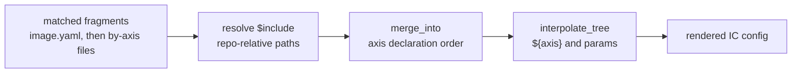
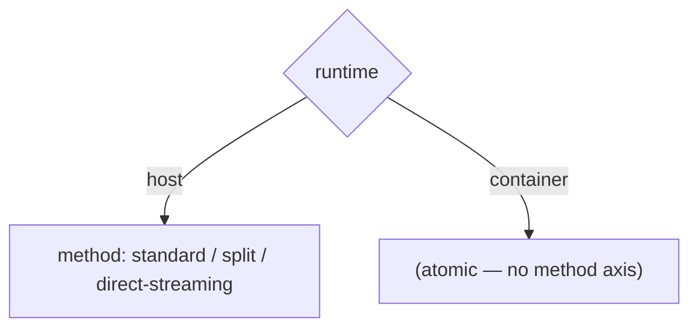

# Directive gaps after the Trident comparison port

> **Status:** Superseded by `directive-design.md` · _last reviewed 2026-06-29_
>
> The survey's accepted capabilities were consolidated in `directive-design.md` and implemented in `crates/tailor-config/src/merge.rs`, `fragment.rs`, and `render.rs`, with CLI wiring in `crates/tailor/src/run.rs`. Deferred/rejected candidates remain here as rationale, not the current plan.

This survey asks whether tailor needs merge/config directives beyond the existing set and the separately
proposed `$unset` directive. It is intentionally grounded in `comparison/`, where the Trident image YAMLs
were decomposed into tailor matrices and fragments.

## Current model, in one page



Existing directive/capability inventory:

| Construct | Current semantics |
| --- | --- |
| `$set` | Replaces the value at a field with the directive body; this is the explicit escape hatch for scalar conflicts and whole-subtree overrides. |
| `$replace` | Valid only for lists; replaces the inherited list with the directive list. |
| `$remove` | Valid only for lists; removes items that are exactly equal to entries in the directive list. |
| `$rename` | Recognized by the merger but returns `UnsupportedDirective`; no implemented semantics. |
| `$include` | Resolved before merge, before interpolation; replaces a mapping value with the parsed file, and splices included lists when used as a list item. |
| `$select` | **Reserved but unimplemented:** a `SELECT` constant and an error branch exist in `merge.rs` (and a stale comment claims it is "resolved in earlier passes"), but no resolution pass exists — any `$select` errors at merge. Decision in `directive-design.md` §4: keep it reserved, do not implement now. |
| `$unset` | Final design in [`directive-design.md` §1](./directive-design.md): canonical is the bare value `key: $unset`. Not re-proposed here. |

Core merge rules: maps deep-merge, lists append in fragment order, and differing scalars conflict unless
the later fragment uses `$set`. Lists are generic YAML sequences: tailor does not merge list elements by
`id`, `name`, `destination`, or any other IC-specific key.

## Candidate capabilities

### 1. Combination/sub-cube targeting

**Definition:** Let a fragment apply to a conjunction of axis values, without exposing arbitrary user-facing
`match:`.

**Concrete case:** `comparison/vm-testimages` has storage and overlays that depend on `(boot, verity)`, not
on either axis alone: UKI+root needs the initrd `/etc` overlay, UKI+usr must remove it, GRUB+root needs the
etc-mount overlay, and GRUB+none needs a different plain layout. `comparison/testimage` also exposed a
non-separable `variant × runtime` grid: packages/files/scripts such as `selinux-policy`,
`containerd-mmap-fix.cil`, `load-containerd-selinux-fix.sh`, `binutils`, and
`trident-static-pcrlock-files` originally lived on only some pairs, so the port normalized them upward and
accepted supersets.

**Priority:** **High** — this is the biggest real expressiveness gap, but it should be solved as fragment
selection, not as a merge directive. **Full design: [`directive-design.md` §2](./directive-design.md).**

**Syntax + semantics sketch:** Prefer constrained composite fragment paths over inline `match:`. A file in
`by-boot+verity/uki+root.yaml` applies only when every named axis equals the corresponding value. It is
ordered as a fragment after the latest axis named in the composite path, so it can refine both single-axis
fragments deterministically.

```text
vm-testimages/
  by-boot/uki.yaml
  by-verity/usr.yaml
  by-boot+verity/uki+root.yaml
  by-boot+verity/uki+usr.yaml
```

```yaml
# by-boot+verity/uki+root.yaml
config:
  os:
    overlays:
      - mountPoint: /etc
        lowerDirs:
          - /etc
        upperDir: /var/lib/overlays/etc/upper
        workDir: /var/lib/overlays/etc/work
        mountDependencies:
          - /var
        isInitrdOverlay: true
```

For the opposite UKI+usr case, the separately proposed `$unset` would remove the inherited `overlays` key;
this document does not re-propose its syntax or semantics.

This deliberately handles conjunctions only. Although `fragment.rs` already has an inline `match:`
evaluator, that should not be the sanctioned user-facing shape here. Do not add `any`, `not`, feature
predicates, or hidden conditionals; use top-level `selectors:` to choose which cells exist and composite
paths to place pair-specific deltas.

### 2. List ordering controls

**Definition:** Allow a later fragment to place list items before or near inherited items, instead of only
appending or replacing the whole list.

**Concrete case:** `scripts.postCustomization` order is significant. In `vm-testimages/by-boot/grub.yaml`,
the shared GRUB script tail fixes one order for both GRUB cells; `comparison/README.md` notes the residual
`grub/none` `duid-type-to-link-layer.sh` / `update-os-release.sh` order mismatch. The `testimage` port also
builds scripts by variant then runtime, so `trident-debug-log.sh`, `create-web-dir.sh`, and
`load-containerd-selinux-fix.sh` can only land according to axis order unless the whole list is owned by one
fragment.

**Priority:** **High** — ordering is observable for scripts, and `$replace` is too blunt when only one
cell needs a small positional adjustment. **Committed design: `$prepend` **and** `$append` (both ends) in
[`directive-design.md` §3](./directive-design.md); anchor inserts (`$insertBefore`/`$insertAfter`) and
numeric indices are deferred.**

**Syntax + semantics sketch:** Add one ordered-list directive, not a full patch language. The smallest useful
set is `$prepend` plus optional anchor-based insertion if real script cases keep appearing.

```yaml
scripts:
  postCustomization:
    $prepend:
      - path: scripts/duid-type-to-link-layer.sh
```

Semantics: valid only for lists; directive body is a list; result is `body + inherited`. If anchor insertion
is added, keep it exact-match and deterministic:

```yaml
scripts:
  postCustomization:
    $insertBefore:
      anchor:
        path: scripts/update-os-release.sh
      items:
        - path: scripts/duid-type-to-link-layer.sh
```

If the anchor is absent or non-unique, error rather than guessing. Do **not** add numeric indexes; they are
fragile across fragment reuse.

### 3. Merge-by-key for lists

**Definition:** Opt in to merging list elements by an author-named key, such as `id`, `name`, or
`destination`, instead of appending duplicate objects.

**Concrete case:** The tempting cases are real: `storage.disks[].partitions` have `id`, `os.users` have
`name`, and `os.additionalFiles` often have `destination`. The port had to `$set` entire `storage` trees in
`by-verity/none.yaml`, `by-verity/usr.yaml`, `by-target/azure.yaml`, and `by-type/functest.yaml`; Azure also
uses `$set` on `os.users` just to remove `sshPublicKeyPaths` from `testuser`.

**Priority:** **Low** — useful in theory, but it fights the current IC-agnostic merge design and the storage
cases were more readable as whole-layout ownership.

**Recommendation:** Do not add a generic `$mergeKey` now. If it ever lands, require the author to name the
key at the list site and keep it local to that merge:

```yaml
os:
  users:
    $mergeBy:
      key: name
      items:
        - name: testuser
          secondaryGroups:
            - wheel
```

Even then, nested lists such as `disks[].partitions[]` would need repeated directives, conflict rules, and
identity validation. That complexity is not justified by the comparison port.

### 4. Interpolated `$include` paths

**Definition:** Permit include targets such as `layouts/storage/${variant}.yaml` by interpolating directive
strings before loading files.

**Concrete case:** The comparison could plausibly select storage libraries or package groups by axis value,
for example `layouts/storage/${boot}_${verity}.yaml`. Today that cannot work because `$include` resolves
before interpolation. The port instead inlined many single-use storage layouts and used one explicit include
for the shared verity package group.

**Priority:** **Medium** — this is a real ergonomics gap, but it is a pipeline capability rather than a new
merge directive and can hide matrix logic inside strings.

**Recommendation:** Consider this only after composite fragment paths. If implemented, interpolate only the
`$include` target string using the same already-built axis/param context, keep paths repo-relative, and keep
cycle detection after interpolation. Avoid making it the primary storage-selection mechanism.

### 5. `$default` / set-if-unset

**Definition:** Set a value only if no earlier fragment has already set that field.

**Concrete case:** No strong comparison motivation found. Scalar defaults are already best expressed by
putting the common value in `image.yaml` and using `$set` for true overrides; minority absent-values are the
separate `$unset` problem.

**Priority:** **Skip** — it adds another precedence mode without solving a port residual.

**Recommendation:** Do not add. If authors need a default, make it the base value; if a later fragment must
win, make that explicit with `$set`.

### 6. `$select`

**Definition:** Choose a field value from axis-keyed branches co-located at the field site.

**Concrete case:** No comparison file needed it. The port consistently used per-axis fragments and top-level
`selectors:`; where pair-specific behavior was needed, single-axis `$select` would not have solved it
without becoming forbidden `match:` in disguise.

**Priority:** **Medium to clean up, Low as a feature** — the docs mention `$select`, but the implementation
errors if one reaches merge, so the current state is confusing.

**Recommendation (decided):** Keep `$select` **reserved but unimplemented** — see
[`directive-design.md` §4](./directive-design.md). Existing `by-<axis>/<value>.yaml` fragments already
select a value by one axis, and composite paths (§1) cover combinations, so the field-site selector is not
worth building now; the cleanup is to give it a clear "reserved, not implemented" error and fix the stale
"resolved in earlier passes" comment. The narrow single-axis spec, kept for if/when it is ever built:

```yaml
base:
  $select:
    arch:
      amd64:
        path: ../artifacts/baremetal.vhdx
      arm64:
        path: ../artifacts/core_arm64.vhdx
      default:
        path: ../artifacts/core.vhdx
```

Semantics: evaluate before merge for the current cell; exactly one axis name; branch keys are declared axis
values plus optional `default`; the selected branch replaces the directive node and then participates in the
normal merge. Do not allow multi-axis predicates, `all`/`any`/`not`, or feature matching; composite fragments
are the sanctioned answer for combinations.

### 7. `$rename`

**Definition:** Rename a mapping key during merge.

**Concrete case:** No real motivation found in the Trident port. The observed needs were removing a key,
replacing lists/subtrees, selecting pair-specific fragments, and occasionally ordering scripts; none required
renaming keys.

**Priority:** **Skip** — it is an unsupported stub with no demonstrated use and awkward conflict semantics.

**Recommendation:** Do not implement. Prefer dropping it from the directive inventory unless a concrete IC
schema migration case appears.

### 8. Conditional / dependent axes (ragged matrix)

**Definition:** Let one axis apply *only* for certain values of another — a non-rectangular ("ragged")
matrix — so a cell can legitimately have **no value** for an axis that does not apply to it. This is a
`matrix:`-level capability, complementary to `selectors:` (which only *prunes* cells from the full
product; every surviving cell still carries a value for every axis).

**Concrete case:** `comparison/trident-installers`. The natural major distinction is `runtime`
(host vs container), and the three host installers (`standard`, `split`, `direct-streaming`) genuinely
share a "host installer" identity: `selinux: enforcing`, the `tridentd.socket` service, and a 9-package
disk-tooling group the container installer does not use. That begs for a `runtime × method` matrix — but
the container installer is **atomic**: it has no `method`. A full product forces the container cell to
carry a meaningless `method` value, which then (a) makes the `by-method/<value>` fragment wrongly apply
(needing heavy `$remove` overrides, like `functest`), and (b) yields a misleading slug
(`amd64_container_standard`). Selectors can drop the unwanted *cells*, but cannot make `method` *not
apply* to the container cell they keep.



**Priority:** **Low (as a feature) / already-answered (in practice).** `meta/docs/matrix-constraints.md`
§7.2 already takes a deliberate stance on exactly this shape: "when one axis value forces every other axis
to a single value, that is usually a sign of a *different kind of thing*, better kept as its own image."
By that philosophy the container installer is a different artifact (a container host that runs a
downloaded Trident container, not a disk installer), so the sanctioned answer is to **split it into its
own image** — which needs no new feature, mirrors Trident's own `trident-installer/` vs
`trident-container-installer/` directory split, and matches the existing `azl-installer` standalone
precedent in this very comparison. A ragged-matrix feature would let one image keep an explicit
`runtime × method` decomposition, but it adds real modeling and slug complexity for a case the
"separate image" rule already handles cleanly.

**Recommendation:** Do not add ragged/dependent axes now. Treat an atomic member as either one value of a
flat axis (`kind: [standard, split, direct-streaming, container]`) or — when it carries a shared identity
worth factoring — its **own image**. Revisit only if a future image has a genuinely rectangular-minus-a-
corner shape that "separate image" cannot express.

## Prioritized recommendations

The first two are now committed designs in [`directive-design.md`](./directive-design.md); the rest record
where the line was drawn.

1. **Composite fragment paths for axis conjunctions** (`by-a+b/x+y.yaml`) — **designed** ([§2](./directive-design.md)).
   The most important `boot × verity` and `variant × runtime` pain, solved without user-facing `match:`.
2. **A minimal ordered-list pair, `$prepend` + `$append`** — **designed** ([§3](./directive-design.md)).
   `$prepend` alone is insufficient: once the field becomes a directive-mapping the implicit bare-list
   append is gone, so touching both ends in one fragment needs `$append`. Anchor inserts
   (`$insertBefore`/`$insertAfter`) and numeric indices stay deferred.
3. **Interpolated `$include` paths** — a pipeline improvement, kept secondary to explicit fragment
   placement; revisit after composite paths.
4. **`$select` — keep reserved, do not implement** ([§4](./directive-design.md)). `by-<axis>` fragments and
   composite paths already cover it; just give it a clear "reserved" error. Do not let it grow into `match:`.
5. **Do not add `$default`, `$rename`, `$mergeKey`, or ragged/dependent axes now.** They add surface area
   without enough comparison-backed payoff; `$unset` is the right structural-removal complement to the
   merge set, and an atomic matrix member is better modeled as a flat-axis value or its own image (see §8).
