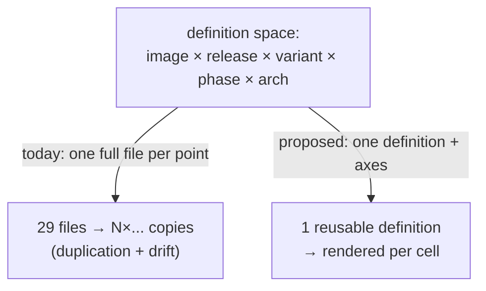
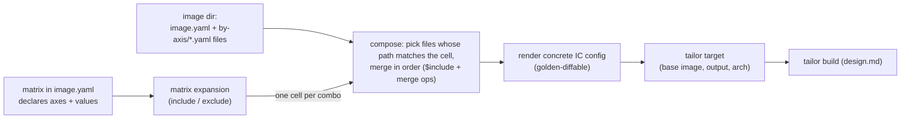
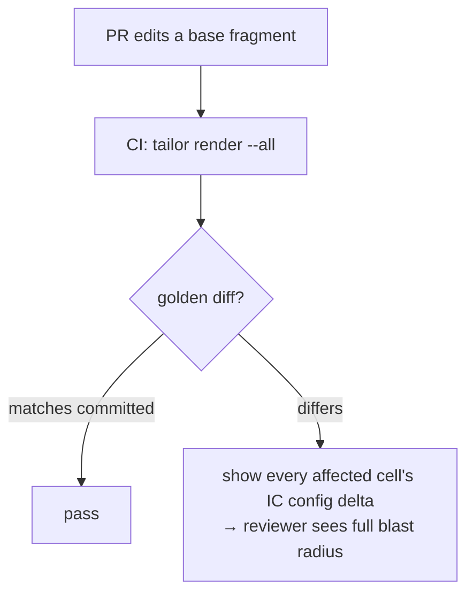

# tailor — Declarative image definitions

> **Status:** Stale · _last reviewed 2026-06-29_
>
> Much of the compositor exists in `crates/tailor-config/src/fragment.rs`, `matrix.rs`, `render.rs`, `include.rs`, and `merge.rs`, but this older doc has drift: selectors moved out of `matrix:` into sibling `selectors:`, `$select` is reserved rather than available, and path-string `config:` is still rejected. Reconcile this against `matrix-constraints.md` and `directive-design.md` before treating it as reference.

---

## 1. Problem statement (grounded in `trident/tests/images`)

The trident test images (`~/repos/trident/tests/images`) are the proven prior art tailor builds on.
Today each image is a **standalone, full IC config YAML**. Surveying the 29 configs there:

- **23 of 29** repeat the *identical* `kernelCommandLine.extraCommandLine` block
  (`console=tty0`, `console=ttyS0`, `rd.info`, `log_buf_len=1M`, "Replicates BM base image settings").
- **23 of 29** repeat the *identical* ESP partition + `fat32` `/boot/efi` `umask=0077` storage pattern.
- The same core package set (`grub2-efi-binary-noprefix`, `curl`, `dnf`, `efibootmgr`, `iproute`,
  `iptables`, `openssh-server`, `trident-service`, `vim`, `netplan`, …), the same services
  (`sshd`, `trident`, `tridentd.socket`), and the same `use-grpc-client-commit.conf` test override
  are copied across most files.
- **Variant explosion:** one logical image (`trident-vm-testimage`) is **8 near-duplicate files**
  — `baseimg-grub`, `baseimg-grub-verity`, `baseimg-root-verity`, `baseimg-usr-verity`,
  `baseimg-grub-verity-azure`, and `updateimg-*` counterparts — each a full copy differing only in
  the storage layout (A/B + verity partitions), a handful of packages, one service, and a couple of
  scripts.

### 1.1 The incoming pain: AZL 3.0 **and** 4.0 simultaneously

Today every base image is hard-coded to Azure Linux **3.0**
(`builder/download.py`: `mcr.microsoft.com/azurelinux/3.0/image/<name>:latest`;
`testimages.py`: `baremetal_vhdx-3.0-stable`). The builder has **no release axis at all**. Yet the
configs already carry scattered, comment-driven version coupling:

- `grub2-efi-binary` vs `grub2-efi-binary-noprefix` — *"going to be the default grub package for
  azl3"* (`trident-vm-testimage/base/baseimg-grub.yaml`). **14 files** reference `grub2-efi-binary`.
- `trident-static-pcrlock-files` / a static-pcrlock `additionalDirs` entry — *"can be removed once
  AZL 4.0 merges a fix … into systemd-udev"* (`trident-installer`, `trident-mos`, `usr/host.yaml`).
- Static-file behavior differences called out for 4.0 (`trident-mos/iso.yaml`).

Supporting 3.0 **and** 4.0 with the current system means **copying ~all 29 configs** and editing the
base image, the grub package, the pcrlock package/dir, and other release-specific bits in each — then
keeping the two trees in sync forever. Multiply by the existing variant axis (grub / root-verity /
usr-verity), the phase axis (base / update), and the arch axis (amd64 / arm64), and the file count
explodes combinatorially.

### 1.2 Root cause

The configs encode **one point in a multi-dimensional space** (image × release × variant × phase ×
arch) as **one whole file**, with no mechanism for **reuse** (shared base) or **variation**
(conditional, axis-driven differences). IC's native `baseConfigs` (inheritance, v1.1) helps with the
*reuse* axis but cannot express *conditional* per-axis differences (it has no notion of
"on 3.0 use X, on 4.0 use Y"). We need a layer that provides both.



---

## 2. Goals & requirements

1. **Check in the *expected* definition.** A maintainer can see and review the concrete IC config
   that will be produced for any `(image, release, variant, phase, arch)` — no hidden magic.
2. **Reuse.** Define shared structure (storage, kernel cmdline, base packages, services, test
   overrides) **once**; images inherit and extend it.
3. **Axis-driven variation.** Express differences that depend on **release / variant / phase / arch**
   as small, local fragments — *not* whole-file copies. Adding `4.0` must **not** require
   re-defining existing images.
4. **Logic in structure, not in YAML.** Conditional variation is encoded by **which file applies**
   (the directory layout), not by an embedded logic language inside YAML; prefer **declarative
   composition** over templating, with only a tiny, enforced directive set (§7, §13).
5. **Compiles to real IC configs.** The output is exactly what IC consumes (`--config-file`), so the
   mechanism never diverges from IC's schema; it can also emit IC-native `baseConfigs` where that
   maps cleanly.
6. **Reproducible & diffable.** Rendering is deterministic; concrete outputs can be snapshotted
   ("golden" files) and CI-diffed, so a change to a shared fragment shows its blast radius.
7. **Feeds tailor.** Each rendered cell yields a tailor target (root IC config + base image + output
   + arch), so the existing build/lock/run pipeline ([design.md](./design.md)) consumes it unchanged.
8. **Readable, short authored files.** Authoring must stay *easier to read* than today's full files,
   not harder: small single-purpose fragments, minimal special syntax, no giant dense documents. Any
   density belongs only in *generated* output, reviewed as ordinary flat IC YAML (§9.5).
9. **Progressive complexity.** A one-image, single-base config must be **trivial** (a few lines, no
   axes/fragments/layouts); everything beyond that is opt-in and additive, scaling smoothly to a full
   multi-variant matrix (§4.1).
10. **Flexible base sourcing.** Base images are **not assumed to be MCR** — local files, any OCI
    registry, or `azureLinux` sugar are all first-class, and different cells (e.g. 3.0 vs 4.0) may
    come from **radically different sources/kinds**, not just a version substituted into one URI
    (§8.1).

Non-negotiable: **adding a release (4.0) is a one-line axis change plus a few small matched
fragments — never a copy of the image set.**

---

## 3. Prior art surveyed (and what we borrow)

This is a well-trodden problem in OS-image and configuration tooling. Key inspirations:

| System | Mechanism | What we borrow |
| ------ | --------- | -------------- |
| **mkosi** (systemd) | `mkosi.conf` + `mkosi.conf.d/*.conf` drop-ins with `[Match] Distribution=/Release=` conditional sections; no-match ⇒ always applies | **Match-guarded fragments keyed on distro/release** — the closest analog to our 3.0/4.0 problem |
| **kiwi-ng** | `<profiles>` + `profiles="a,b"` (OR) / `"a+b"` (AND) conditional inclusion; `--profile` at build | **Profile/axis selection** + boolean profile predicates |
| **Kustomize** (k8s) | base + overlays, **strategic-merge patches**, keyed list merge, no templating | **Pure-data merge/patch, auditable, list keying** |
| **Helm** (k8s) | Go templating + `values.yaml` | Parameterization idea — but we **reject templating as the structural mechanism** (hard to audit, breaks YAML structure) |
| **CUE** | typed **unification** (`&`), conflict = error, validation built in | **Conflict-detecting merge + schema validation** semantics |
| **Bazel** | `select({ "//cond:a": [...], "//cond:b": [...] })` attribute selection | **`select`/`oneOf` value chosen by axis condition** |
| **Yocto / BitBake** | layers + `.bbappend`, `VAR:append`/`VAR:remove`, `DISTRO_FEATURES` | **Explicit list `append`/`remove` ops** driven by features/axes |
| **GitHub Actions / buildx bake** | `matrix` + `include`/`exclude`, target `inherits` | **Matrix expansion with include/exclude and inheritance** |

**Synthesis:** the sweet spot is **mkosi-style drop-in fragments selected by path** +
**Kustomize/CUE-style generic data merge** (deep-merge + append + a tiny directive set, no
IC-schema knowledge) + **a matrix model**, all over **plain partial
IC-config YAML** — with the *conditional logic pushed into the directory structure* rather than into
the YAML. This keeps fragments looking like the IC config they already are (low friction), stays
declarative/auditable (no Turing-complete templating, no in-YAML logic language), and handles both
reuse and conditional variation.

---

## 4. Design overview

An **image definition** = an `image.yaml` — **tailor config at the top level, the IC config under
`config:`** — plus a set of small **per-axis fragment files** whose *path* says when they apply
(`by-release/4.0.yaml`, …), each contributing its own `config:` delta, composed (merged) per **matrix
cell** into one concrete IC config. The matrix logic lives in the **file tree**, not in YAML
directives; the only directives are `$include` (pull a shared layout) and a few rare merge ops (§7).
tailor renders each cell to a golden-snapshotable IC config and a tailor target.



The four mechanisms (§5–§8) compose; the rendering/snapshot/CI story is §9.

### 4.1 Progressive complexity: minimal entry → full matrix

Every construct above is **optional and additive** — you pay only for what you use. The same model
spans a trivial one-image config and a full multi-variant matrix, and you climb the ladder one rung
at a time without rewrites:

- **Level 0 — no image-definition layer at all.** For a one-off, just point a plain image at
  an existing IC config and a base ([design.md §5.2](./design.md)) — the image-definition mechanism
  is *not involved*:
  ```yaml
  # tailor.yaml
  images:
    inline:                                     # a trivial image defined right in the manifest
      - name: my-image
        config: ./my-image/config.yaml          # an existing, hand-written IC config (a path)
        base:
          path: ./artifacts/core.vhdx           # local file — no MCR, no matrix, no fragments
        outputs:
          - format: cosi
  ```
- **Level 1 — one self-contained `image.yaml` (the entry level).** The simplest definition is a
  **single file**: tailor config at the top level, and the Image Customizer config under `config:`.
  The two are cleanly namespaced — top level is tailor's (`name`, `base`, `outputs`, and
  later `matrix`/`params`/`features`), `config:` is the IC `--config-file`. No `base.yaml`, no
  fragments, no `matrix`:
  ```yaml
  # images/my-image/image.yaml  — the WHOLE image is this one file
  name: my-image
  base:
    path: ./artifacts/core.vhdx              # tailor config
  outputs:
    - format: cosi
  config:                                    # ← all IC config, namespaced (passed through untouched)
    os:
      hostname: my-image
      packages:
        install: [vim, openssh-server]
    storage:
      bootType: efi
      disks:
        - partitionTableType: gpt
          partitions:
            - id: esp
              type: esp
              size: 8M
            - id: rootfs
              size: grow
      filesystems:
        - deviceId: esp
          type: fat32
          mountPoint:
            path: /boot/efi
            options: "umask=0077"
        - deviceId: rootfs
          type: ext4
          mountPoint:
            path: /
  ```
  (Already have a hand-written IC config? `config:` also accepts a path string — `config: ./baseimg.yaml`
  — to reuse it as-is.) See [examples/minimal-single-image](./examples/minimal-single-image).
- **Level 2 — add one axis.** When the image sprouts variants, **leave the shared `config:` where it
  is in `image.yaml`**, add a `matrix:` block, and drop in a `by-release/` (or `by-variant/`) folder
  with the few deltas (each a small `config:` of its own) (§8.1). Purely additive — you add files;
  nothing moves or is rewritten.
- **Level 3 — full multi-variant.** Add the `variant`/`phase` axes, `features`, shared storage
  layouts (§7), `include`/`exclude`. This is the §10 worked example.

Defaults that make the low end trivial: **absent `matrix` ⇒ one cell**; **absent `arch` ⇒ a single
default arch**; **absent fragments ⇒ the IC config is whatever sits in `image.yaml`'s `config:`** (or
an explicit `config:` path reference); `params`/`features`/`layouts` and a repo-wide `axes.yaml` are
all optional. Nothing about the entry level requires understanding axes, matches, layouts, or a
`base.yaml` — it is one file: a tailor header plus a `config:` block that is just IC config.

---

## 5. Mechanism 1 — Axes & matrix

**Axes are user-defined and *closed*.** They are **not** built-ins — `release`/`variant`/`phase`/
`arch` are *trident's* choices; another team might declare `tier`/`board`/`fips`. The **`matrix:`
block in `image.yaml` is the declaration** — it names the axes and the (closed) set of values this
image builds:

```yaml
# image.yaml — the `matrix` block IS this image's axis declaration (names + closed value sets)
matrix:
  release: ["3.0", "4.0"]          # build BOTH releases from ONE definition
  variant: [grub, root-verity, usr-verity]
  phase:   [base, update]
  arch:    [amd64, arm64]
  exclude:
    - variant: usr-verity                       # e.g. usr-verity not yet on 3.0
      release: "3.0"
  include:
    - variant: grub                             # add a stray cell
      phase: base
      arch: arm64
      release: "4.0"
```

The set of values is **closed**: the validator (§9.4) knows every axis name and permitted value, so a
typo'd axis or an undeclared value is a hard error — you get custom axes *and* a fixed-schema check.

**Optional repo-wide vocabulary.** A repo with **many** images that must share one validated axis
vocabulary may add an optional `axes.yaml` declaring the canonical names/values once; per-image
`matrix` blocks are then checked against it. A single image needs no `axes.yaml` — its `matrix` is the
declaration (don't duplicate it). Each rendered cell carries its resolved `base` (§8.1), the composed
config, and the cell's `outputs`. (If `matrix.arch` is omitted, the arch comes from the base's own
`arch` — a slot or `path` base — else the built-in `amd64` default.) Adding `4.0` to the whole suite is
**one edit** to `release`.

**Features (image-level flags, not matrix axes).** Besides axes (which *multiply* cells), an image
may declare boolean **features** it opts into — e.g. `features: [pcrlock-static-files]`. Features do
**not** expand the matrix; they are flags that fragments can `match` on (§6). This is how
non-universal coupling (pcrlock is needed only by *some* images) is expressed without a global rule
and without inventing a cell-multiplying axis. Features are especially useful with a shared fragment
library (open question §15): a pcrlock fragment defined once is pulled in only by images declaring
the feature.

---

## 6. Mechanism 2 — Fragments + `match` (conditional composition)

A fragment's **IC config lives under `config:`**, exactly as in `image.yaml`; any tailor fields it
sets (like a per-axis `base`) sit at the top level. The design is tuned so the **common case needs no
special syntax** — the `config:` body is just a small, plain IC-config snippet:

```yaml
# by-release/4.0.yaml  — applies on release 4.0; the config body is ordinary IC config
config:
  os:
    packages:
      install: [grub2-efi-binary]
```

Two readability rules make this work:

- **Append is the default.** For the additive IC lists (`os.packages.install`/`remove`,
  `kernelCommandLine.extraCommandLine`, `os.additionalFiles`, `os.services.enable`, `scripts.*`),
  fragments just *list more items* — no operator. The special directives (`$remove`, `$replace`,
  `$set`) exist only for the **rare** cases that genuinely need them.
- **The path encodes the match.** A fragment under `by-<axis>/<value>.yaml` (§9.1) applies when that
  axis equals that value — so the everyday single-axis case carries **zero `match:` boilerplate**.
  The shared `config:` in `image.yaml` always applies.

`match` (inline, for the cases the path can't express — compound conditions) supports equality,
sets, and boolean combinators (kiwi/Bazel-inspired). It sits at the **top level** of the file (it is
a tailor key, not IC config):

```yaml
match: { release: "4.0" }                         # equality
match: { variant: [root-verity, usr-verity] }     # set membership (OR)
match: { all: [ { feature: pcrlock-static-files }, { release: "3.0" } ] }   # AND
match: { any: [ { variant: grub }, { phase: update } ] }                    # OR
match: { not: { release: "4.0" } }                # negation
```

This is exactly how the scattered version coupling becomes *local and additive* instead of
copy-paste. The grub case from §1.1 — the shared `config:` mentions **no** grub package; each release
fully owns its grub install/remove, as two tiny files:

```yaml
# by-release/3.0.yaml
config: { os: { packages: { remove: [grub2-efi-binary], install: [grub2-efi-binary-noprefix] } } }
```
```yaml
# by-release/4.0.yaml
config: { os: { packages: { install: [grub2-efi-binary] } } }    # 4.0 default; nothing to remove
```

**One place per concern.** Express a difference in **one** place: a *structural* delta (different
packages, storage, services, or a different `base`) goes in the **per-axis fragment file** that the
path selects; a *shared derived scalar* used in several spots goes in `params` as an interpolation
(§8). These don't overlap, so they can't contradict — and the validator rejects the same field being
set by both a fragment and a param (§9.4).

**Feature-/image-specific deltas are not global release deltas.** Some version coupling is not
universal. `trident-static-pcrlock-files` is needed only by the *specific images* that use
PCR-based encryption (which declare `features: [pcrlock-static-files]`, §5), and only on 3.0 (the
4.0 fix lands in `systemd-udev`). Placed under `by-feature/`, the path already supplies the feature
predicate, so the file only needs the *extra* release condition (ANDed with the path, §9.1):

```yaml
# by-feature/pcrlock-static-files.yaml   (applies when the feature is enabled; AND the match below)
match: { release: "3.0" }
config: { os: { packages: { install: [trident-static-pcrlock-files] } } }   # removable once on 4.0
```

---

## 7. Mechanism 3 — Merge semantics (predictable, conflict-detecting)

**Logic lives in the file tree, not in YAML.** The matrix "logic" — *which* delta applies for a given
release/variant/arch — is encoded by **which fragment file applies** (the path, §6, §9.1), not by
conditional directives inside YAML. A per-axis file just sets plain fields (including the `base`/
`outputs` target fields, §8.1). So the everyday definition has **no directives at all**; the few that
exist are *compose-time* operations, not a logic language.

**Directives — the `$` convention (not standard YAML, by design).** The small directive set:
`$include` (splice in a shared library file — like JSON Schema `$ref`), `$set` (explicit scalar
override on conflict), `$remove` / `$replace` (rare list surgery). They are ordinary, valid YAML
*keys* the renderer interprets — a small tailor vocabulary layered on YAML, **not** a YAML language
feature. The `$` prefix is deliberate (the JSON Schema `$ref`/`$id`, Kustomize, MongoDB convention):
it marks the *only* keys that are not literal IC config, and because IC's schema has **no**
`$`-prefixed fields, a directive can never collide with a real config key. Simple, uniform rule:
**`$`-prefixed key ⇒ tailor directive; everything else ⇒ literal IC config.**

Where each directive is valid:

| Directive   | Valid position | Under it | Purpose |
| ----------- | -------------- | -------- | ------- |
| `$include`  | any mapping value | a repo-root-relative library path (string) | splice that file's content **as this key's value** (see shape rule below) |
| `$set`      | a scalar field's value | the intended scalar | override an earlier value on purpose (otherwise a conflict errors) |
| `$remove`   | a list field's value | a list of items to drop | remove from an inherited list |
| `$replace`  | a list field's value | the replacement list | replace an inherited list wholesale |
| `$select`   | any field value | `{ <axis>: { <value>: <result>, …, default: <result> } }` | **optional** co-location sugar: pick this field's value by an axis (the primary way is a per-axis *file*, §6/§8.1) |

The merger is **generic and IC-agnostic**: it deep-merges maps and appends lists, with the directives
above for the rest. It does not key lists by any IC field — see "the merger knows no IC field names"
above.

**How `$include` works (and yes, it covers arrays).** `$include` resolves to the **parsed content of
the referenced file** (repo-root-relative path) and substitutes it **as the value at its position**.
The content may be a **mapping, a list/array, or a scalar**. There are two positions:

- **As a key's value** — `storage: { $include: layouts/storage/rootverity.yaml }`. The key becomes
  the file's content. The file holds the **value** of the key — a bare storage subtree
  (`disks:`/`filesystems:`/`verity:`…) — **not** a re-stated `storage:` key (which would wrongly nest
  as `storage.storage`). If the file is a list, the key becomes that list.
- **As a list element** — `- { $include: shared/files.yaml }` inside a list. If the included file is
  a **list**, its elements are **spliced** into the surrounding list (flattened in place); if a
  mapping/scalar, it becomes that single element.

After `$include` resolves, the **normal merge rules apply**: an included list at a key that an
earlier fragment also set will **append** (the list default), so cross-file array composition works
for free (e.g. shared `additionalFiles` + a fragment's own, included and appended). `$include` must
be the **sole key** of its mapping — to tweak included content, layer a later fragment (appending to
a list, or `$replace`-ing it), don't mix sibling keys. It is **expanded in place**, inheriting
that fragment's order/provenance (§"Fragment order"), and may itself contain `$include` (resolved
recursively; cycles are an error).

`$select` is **not a primary tool** — per-axis selection is done by per-axis *files* (§6/§8.1). It is
listed above only so its valid position/shape is defined; closed-axis validation (§9.4) applies to
its branch keys (except `default`). Prefer the per-axis-file form; reach for `$select` only when you
specifically want branches co-located in one file.

**Fragment order (total, deterministic).** Matched fragments apply in a fixed total order: (1) the
base document — the shared IC config in `image.yaml` — then (2) imported/shared-library fragments,
then (3) the image's local `by-<axis>/<value>.yaml` files **in matrix axis-declaration order**
(feature fragments last, in `features`-declaration order); within a multi-doc file, by document
index. The order is reported in diagnostics and as a comment header in rendered output, so a conflict
always names the two contributing fragments. Apply order **is** merge precedence — a later fragment
wins a `$set` and appends last — so authors control it by **ordering the axes in the `matrix:` block**
(the axis declared later takes precedence), *not* by how the `by-*` directories happen to sort on
disk. Adding a new axis therefore can't silently re-order existing ones. The only sanctioned scalar
override is still an explicit `$set` (below), and provenance (§9.5) shows the winning fragment. (Two
`$set`s to the same scalar resolve to the later axis's value; a *plain* re-assignment landing on an
already-`$set` value is still a conflict — every overriding fragment must use `$set`.)

**Scalars.** Two fragments setting the same scalar to the **same** value is fine. Setting it to a
**different** value is an **error** (CUE-style) that names both fragments — *unless* the later one is
written `{ $set: <value> }`, the explicit "I intend to override" marker. So `os.hostname` set once is
fine; a deliberate per-variant hostname uses `$set`; an accidental double-set fails loudly.

**Maps** deep-merge.

**Lists append** by default — a fragment just lists more items, and they are concatenated onto the
inherited list (in fragment order). This is the everyday case for the additive IC lists
(`os.packages.install`/`remove`, `kernelCommandLine.extraCommandLine`, `os.additionalFiles`,
`os.services.enable`, `scripts.*`). For the rare cases that need it, two explicit directives change a
list wholesale: `$replace: [...]` (replace the inherited list) and `$remove: [...]` (drop matching
items).

**The merger is generic — it knows no Image Customizer field names.** tailor does **not** key lists
by an IC identity (no "merge `partitions` by `id`"), because that would bake IC's schema and version
into tailor; the inputs and capabilities of IC are a contract between the **user and IC**. If a
fragment needs to change one element of a structured list (e.g. one partition's `size`), it
`$replace`s the list, or — better — owns that whole list in the per-axis file that applies (the
common case: a variant provides its entire `storage` layout via `$include`, below). De-duplication is
likewise not tailor's job: IC treats a repeated package install idempotently. (An opt-in,
author-specified keyed-merge directive — where *you* name the key, not tailor — may be added later if
a real need arises; it is intentionally not in the MVP.)

**Storage variants: select the whole layout *in the per-variant file*, via `$include`.** Being honest
about the real trident data: a verity layout is **not** a small tweak to `esp + root` — it introduces
`boot-a`/`boot-b`, `root-a`/`root-b`, hash partitions, `var`, `trident-overlay`, different ESP sizes,
and different filesystems. So a variant gets a **whole `storage` subtree**, not a patch. The big
subtrees are authored **once** in a shared layout library and pulled in by `$include`, so the variant
file stays tiny and the verity layout shared by many images is written a single time:

```text
<repo-root>/layouts/storage/
  simple.yaml        # esp + single root            (one readable file)
  rootverity.yaml    # A/B + hash + var + overlay
  usrverity.yaml
```

The per-variant fragment file sets `storage` by including the right layout — *no `$select`; the file
that applies is chosen by its path* (§6):

```yaml
# by-variant/root-verity.yaml      (and usr-verity.yaml → usrverity.yaml; grub → simple)
config:
  storage:
    $include: layouts/storage/rootverity.yaml   # path is repo-root-relative
  os:
    packages:
      install: [veritysetup, device-mapper, dracut-overlayfs]
    services:
      enable: [etc-mount]
```

(The `grub` variant's `storage` lives in `by-variant/grub.yaml` as `{ $include: layouts/storage/simple.yaml }`,
or simply in `image.yaml` if it is the default.) When a release needs a genuinely different storage
layout (e.g. a larger ESP), it owns the whole `storage` value for that axis — either a different
`$include` layout, or `$replace` on the list it changes. tailor does not patch one partition by `id`
(that would require modeling IC's storage schema); the per-axis file that applies provides the
complete layout it wants:

```yaml
# by-release/4.0.yaml — 4.0 wants a different layout: own it wholesale.
config:
  storage:
    $include: layouts/storage/simple-large-esp.yaml
```

**Merge timing** makes this well-defined: per cell the renderer resolves `$include` (splicing the
chosen `storage` layout from the library) as each fragment is applied, **then** deep-merges later
matched fragments by the generic rules (maps deep-merge, lists append, `$set`/`$replace`/`$remove`).
Setting `storage` in one file and composing more config from another is normal composition — the same
merge rules as anything else, not a special case.

A broken storage layout (a `filesystems[].deviceId` that names no partition, a duplicate mount point,
etc.) is caught by **IC** at build time, not by tailor — validating IC's config schema is IC's job,
not the merger's (§9.4).

---

## 8. Mechanism 4 — Parameters (interpolation, for shared scalars)

`params` are a small, optional convenience for **interpolating axis values into scalars** and for
naming a constant used in several places — *not* a place to encode per-axis logic. There is **one**
construct: `${...}` interpolation of axis values and other params into a scalar string (values only,
never structure, so the YAML stays well-formed):

```yaml
params:
  osTag: "${release}-${variant}"     # e.g. a label baked into the image, derived once
```

A fragment then uses `"${osTag}"` as a plain quoted scalar.

**Per-axis *variation* is not a param — it's a fragment.** A scalar that differs by axis is set in
the per-axis file (logic in the file tree, §6/§7). To avoid a scalar double-set conflict (§7), an
axis-owned scalar is **left unset in `image.yaml`'s shared config** and set only in the per-axis files
— e.g. `config.os.selinux.mode: enforcing` in `by-variant/usr-verity.yaml` and
`config.os.selinux.mode: disabled` in `by-variant/grub.yaml` (not in the shared config). If you *do*
want a shared default that some axes override, the overriding file uses
`config: { os: { selinux: { mode: { $set: enforcing } } } }`. Either way,
"what varies, and when" stays visible in the directory, not buried in a nested map. (`params` exist only so a
*derived constant* like `${osTag}` isn't repeated.)

### 8.1 Base-image sourcing (local files, OCI, azureLinux — possibly different per axis)

The base image is **not assumed to come from MCR**. A definition's `base` is exactly tailor's base
oneOf — `path` (local file), `oci` (any registry), or `azureLinux` (MCR sugar) — see
[design.md §5.2/§6](./design.md). `base` (and `outputs`) are recognized **tailor target fields**
(distinct from IC's `input`/`output`), so they can be set in `image.yaml` *or* in any per-axis
fragment file — which is exactly how per-axis bases stay in the file tree rather than in a directive.

Cheat-sheet (each row is a complete `base:` value you put in a file):

| Need | `base:` value | Where it goes |
| ---- | ------------- | ------------- |
| One local file | `path: ./artifacts/core.vhdx` | `image.yaml` (shared) or a per-axis file |
| One OCI image (any registry) | `oci: { uri: "registry/...:tag", platform: "linux/${arch}" }` | same |
| MCR Azure Linux, version varies | `azureLinux: { version: "${release}", variant: minimal-os }` | `image.yaml` (one line covers all releases) |
| Per-arch local files | `path: ./artifacts/core.${arch}.vhdx` (interp) — or one file each | `by-arch/amd64.yaml`, `by-arch/arm64.yaml` |
| Different *kind/location* per release | `path: …` vs `oci: {…}` | `by-release/3.0.yaml`, `by-release/4.0.yaml` |

**Per-axis base = put it in the per-axis file (the primary form).** Your "3.0 local, 4.0 from MCR"
case is just two tiny files — no directive, no nesting, and the two sources sit in the obvious place:

```yaml
# by-release/3.0.yaml
base:
  path: ./artifacts/core-3.0.vhdx
```
```yaml
# by-release/4.0.yaml
base:
  oci:
    uri: "mcr.microsoft.com/azurelinux/4.0/image/minimal-os:latest"
    platform: "linux/${arch}"
```

If a single source already covers all releases (MCR, version-substituted), set it once in
`image.yaml`:

```yaml
base:
  azureLinux:                        # 3.0 / 4.0 from MCR — one source covers all releases
    version: "${release}"
    variant: minimal-os
```

Since **`arch` is a matrix axis** (§5), each cell is single-arch: for local files that differ by
arch, define one `baseImages:` catalogue slot per arch (each with its own `path` + `arch`) and put the
matching `base: { ref: <name> }` reference in `by-arch/<arch>.yaml` (or select the slot name with
`${arch}` interpolation).

**Optional co-location sugar (`$select`).** If you would rather see the release branches side by side
in one file instead of in `by-release/*.yaml`, the `$select` directive is available as an *opt-in*
convenience — but it is never required, and the per-axis-file form above is the recommended default:

```yaml
# optional — same effect as the two by-release files above, co-located
base:
  $select:
    release:
      "3.0":
        path: ./artifacts/core-3.0.vhdx
      "4.0":
        oci:
          uri: "mcr.microsoft.com/azurelinux/4.0/image/minimal-os:latest"
          platform: "linux/${arch}"
      default:
        path: ./artifacts/core.vhdx
```

Each leaf scalar containing `${…}` is quoted (an unquoted `${` would start a YAML flow mapping).
`outputs` and the composed config flow into the emitted single-arch tailor target automatically — you
do not hand-write any target wiring (the renderer fills `config` with the runnable composed IC
config; the internal `${rendered}` value, §9.3).

---

## 9. Authoring formats, rendering, and snapshots

### 9.1 Authoring layout — small files, path-encoded matching (recommended)

The **recommended default** keeps every file short and single-purpose by giving each image a
directory whose **structure encodes the matches**, so individual fragments are tiny, block-style
files — mostly plain IC config under `config:`, with little tailor syntax:

```text
images/trident-vm-testimage/
  image.yaml                       # tailor header (name/matrix/base/outputs) + shared IC config under `config:`
  by-release/
    3.0.yaml                       # applies when release == 3.0   (no `match:` boilerplate)
    4.0.yaml                       # applies when release == 4.0
  by-variant/
    root-verity.yaml               # applies when variant == root-verity
    usr-verity.yaml
  by-phase/
    update.yaml                    # applies when phase == update
  by-feature/
    pcrlock-static-files.yaml      # applies when feature `pcrlock-static-files` is enabled
  files/  scripts/                 # the image's referenced assets (unchanged)
```

- **The shared config lives in `image.yaml`** (the always-applied "base document"): the tailor header
  keys (top level) plus the shared IC config under `config:`, in one file. There is **no separate `base.yaml`** by default (you *may*
  factor the shared config into an optional sibling `base.yaml` if you want `image.yaml` header-only,
  but it is not required — see [examples/trident-vm-testimage](./examples/trident-vm-testimage)).
  Likewise there is **no `axes.yaml`** here: the `matrix:` in `image.yaml` is this image's axis
  declaration; a repo-wide `axes.yaml` is optional, for many images sharing one validated vocabulary.
- `by-<axis>/<value>.yaml` applies when that axis equals that value;
  `by-feature/<name>.yaml` applies when that **feature** is enabled (§5). So **single-condition
  fragments need no `match:` at all** — the path is the predicate. Any inline `match:` inside such a
  file is **ANDed** with the path predicate, for compound conditions (e.g. a feature *and* a release;
  §6). `by-feature/` is a directory like `by-<axis>/`; features are still image-level flags (§5), not
  matrix axes — the path just expresses "when this flag is on".
- **Axis values** must match `[A-Za-z0-9.-]+` (so `3.0`, `root-verity`, `amd64` are fine). The `_` is
  **excluded on purpose**: it is the reserved separator in output **cell-slugs** (design.md §10), so a
  value has to be safe both as a path segment (`by-<axis>/<value>.yaml`) *and* as an output-name
  segment — this one charset guarantees both. Values containing `/`, `:`, spaces, `_`, etc. are not
  valid axis values.
- Files are processed in the total order of §7 (base first, then `by-<axis>/` in matrix
  axis-declaration order); the directory names also make the intent self-documenting.

**Compact alternative (tiny images only): single-file multi-document.** An image that is small can
instead be one file whose first `---` document is the header and subsequent documents are fragments
with `match:` headers. This trades the directory's zero-boilerplate matching for one-file
convenience — use it only when the whole image fits comfortably on a screen or two; reach for the
directory layout the moment it would get long or dense.

Both compile identically (plain partial-IC YAML either way); the renderer treats a multi-doc file and
a directory of files the same way.

### 9.2 Why YAML (not TOML), and the templating stance

- **YAML primary** because IC configs *are* YAML — fragments are literally partial IC configs, no
  impedance mismatch, and rendered output drops straight into `--config-file`.
- **TOML** is fine for flat key/value but its nested-array ergonomics are poor for IC's deeply nested
  `storage`/`os` trees; using it would force a translation layer. (If a *flat* tool/axes manifest is
  ever preferred, TOML is acceptable there — but consistency with IC argues for YAML throughout.)
- **YAML anchors/aliases (`&`/`*`, `<<`)** give intra-file reuse only (not cross-file, not
  axis-conditional) — useful sugar inside one fragment, but **insufficient** as the mechanism, so the
  design does not rely on them.
- **Templating** is deliberately limited to typed value interpolation (§8). Full Go/Jinja templating
  is rejected as the structural mechanism: it breaks YAML well-formedness, defeats schema validation,
  and is hard to audit/review — the opposite of "check in the expected definition."

### 9.3 Rendering: runnable configs vs golden snapshots

There are **two distinct outputs**, because of an IC constraint: IC resolves `scripts`,
`additionalFiles`, overlays, repo files, etc. **relative to the config file's directory**
(the same rule that forces tailor's colocated working copy in [design.md §7.6](./design.md)). A
rendered config moved into a separate `.rendered/` dir would resolve `files/…` and `scripts/…` under
`.rendered/`, breaking the build.

So:

- **Runnable rendered config (for building).** Written **into the image's own source directory** as
  a per-cell dotfile, e.g. `images/<name>/.tailor-render.<cellSlug>.ic.yaml`, so every relative
  `source`/`path` still resolves against the image's real `files/`/`scripts/` (and is excluded from
  image auto-discovery and from hashing, exactly like design.md §7.6). This is what the renderer's
  **internal** `${rendered}` value points at (not an author-facing parameter) and what tailor `build`
  runs. It is ephemeral (gitignored), not a checked-in artifact.
- **Golden snapshot (for review).** `tailor render --all` also writes a **normalized** copy to
  `images/<name>/.rendered/<cellSlug>.yaml` purely for review/diffing. Goldens are *snapshot-only* —
  never used as the `--config-file` — so their location does not affect path resolution.

The **`<cellSlug>`** here is the same identifier tailor uses for the output artifact, the working
copy, and the build stamp: `<image-name>` followed by every declared matrix axis value (in matrix
order) and the output format, joined by `_` (design.md §10) — e.g.
`trident-vm-testimage_grub_amd64_4.0_base_cosi`. That uniformity is exactly why axis values exclude
`_` (§9.1).

`tailor render <image> --release 4.0 --variant root-verity --phase base --arch amd64` renders one
cell; `--all` renders the matrix. CI re-renders and **fails on unexpected golden diffs**, so:

- the *expected* concrete definition for every cell is reviewable in PRs (goal 1), and
- a change to a shared base fragment shows its **full blast radius** as a golden diff across every
  affected cell — duplication's silent-drift problem becomes a visible, reviewed change.

Rendering is pure/deterministic (sorted keys, fixed fragment order, §7), so golden files are stable.

**On golden-file scale.** A large suite (images × releases × variants × phases × arches) can be
hundreds of generated YAMLs — but these are *generated, reviewed* files, not *hand-authored,
drifting* ones, which is a categorically smaller burden. The snapshot policy is configurable to keep
PRs readable: check in goldens for a set of **canonical cells** (e.g. one arch, both releases) and
generate the full matrix in CI as artifacts for blast-radius review; or check in all and have PR
tooling collapse unchanged cells. Either way the source of truth stays the small set of fragments.



### 9.4 Validation (tailor's own inputs only — IC validates its config)

tailor validates only what is **its own** — the matrix and merge mechanics it owns. It does **not**
validate the Image Customizer config: that is the user↔IC contract, and IC rejects unsupported or
malformed config authoritatively at build time. Render **fails** (naming the contributing fragments)
only on tailor-owned invariants:

- **Closed-axis check**: every axis name and value referenced (in `matrix`, a `match:`, a
  `by-<axis>/<value>` path, or an optional `$select`) must be **declared** in the axis vocabulary
  (§5). A typo'd axis or undeclared value is a hard error.
- **Single ownership (scalars only)**: a given **scalar leaf** must not be assigned a *differing*
  value by more than one source — by a scalar `param` interpolation **and** a fragment, or by two
  fragments — without an explicit `{ $set: … }` (§6, §7, §8). This is about deterministic **merge**
  (which value wins), not IC schema: list **append**, `$include` (splicing a subtree), and setting an
  object-valued field like `base`/`storage` in the per-axis file are normal composition, **not**
  double-ownership.
- **Exactly one `base` per cell**: every rendered cell must resolve to **exactly one** valid tailor
  `base` (a single `path` | `oci` | `azureLinux`), set in `image.yaml` or a per-axis fragment. **No**
  base, or **two** files setting incompatible base kinds, is an error (resolve with `$set` or by
  moving the base into the per-axis file that owns it). `base` is a *tailor* field, so this is
  tailor's to check.

Everything else about the merged config — storage device references resolving, `install ∩ remove`,
unique mount points, `previewFeatures`/version compatibility, file references resolving, full schema
conformance — is **IC's** to validate, and IC does so when it runs. tailor deliberately does not
duplicate (and therefore does not have to track) IC's schema or version rules.

### 9.5 Readability & ergonomics (keeping files short and scannable)

The mechanism is deliberately arranged so **authored files stay small and plain**, and any density
lives only in *generated* output a human reads as ordinary flat IC YAML. The principles:

- **Many tiny files, not one dense file.** The recommended directory layout (§9.1) gives each
  axis-value its own short fragment; an image is a folder of one-screen files, each doing one thing.
- **The common case has no new syntax.** Append-by-default (§6) means most fragments are literally
  partial IC config; the `$`-directives and `match` expressions appear only where genuinely needed.
- **Path encodes intent.** `by-release/4.0.yaml` needs no `match:` and reads as "the 4.0 bits".
- **Big things are shared, not inlined.** Storage layouts (and any reusable block) live in a library
  referenced by name (§7), so they are written once and never bloat an image.
- **Read the rendered form, not the merge in your head.** You never have to mentally compose
  fragments: `tailor render <image> --release … --variant …` prints the full, flat, ordinary IC
  config for a cell (this is also the checked-in golden, §9.3). The dense, fully-resolved form is a
  *machine output you read like any IC config* — it is not what you author.
- **Provenance on demand.** `tailor explain <image> <field-path> --release … --variant …` reports
  which fragment contributed each value of a field (and the applied order), so "why is this package
  here?" is answered by the tool, not by grepping files.

Net effect: the authored surface is smaller and flatter than today's 29 full files; the only "long"
artifacts are the optional generated goldens, which are plain IC YAML reviewed exactly as a
hand-written config would be.

---

## 10. Worked example: `trident-vm-testimage`, grub/verity × 3.0/4.0

**Before:** 8 near-duplicate files (`baseimg-grub`, `baseimg-grub-verity`, `baseimg-root-verity`,
`baseimg-usr-verity`, `baseimg-grub-verity-azure`, `updateimg-grub`, `updateimg-grub-verity`,
`updateimg-grub-verity-azure`), **none** of which build on 4.0; adding 4.0 ≈ 8 → 16 files.

**After:** one image folder of small files, expanding to grub/root-verity/usr-verity × base/update ×
**3.0 and 4.0** × amd64/arm64. The whole image is the tree below — note how short each file is:

```text
images/trident-vm-testimage/
  image.yaml                              # header + the always-applied shared IC config
  by-release/{3.0.yaml, 4.0.yaml}
  by-variant/{grub.yaml, root-verity.yaml, usr-verity.yaml}
  by-phase/update.yaml
  by-feature/pcrlock-static-files.yaml
  files/  scripts/
```

```yaml
# image.yaml — tailor header + the shared IC config under `config:`, in one file. No base.yaml, no
# axes.yaml. Top level = tailor (name/features/matrix/outputs); `config:` = Image Customizer config.
name: trident-vm-testimage
features: [pcrlock-static-files]
matrix:
  release: ["3.0", "4.0"]
  variant: [grub, root-verity, usr-verity]
  phase:   [base, update]
  arch:    [amd64, arm64]
outputs:
  - format: cosi
# ↓ the always-applied shared IC config (the block 23/29 files copy today, now written ONCE).
# No grub, no storage, no base image here — those differ per axis and live in the by-*/ files.
config:
  os:
    bootloader:
      resetType: hard-reset
    hostname: trident-vm-testimg
    selinux:
      mode: disabled
    kernelCommandLine:
      extraCommandLine: [console=tty0, console=ttyS0, rd.info, log_buf_len=1M]
    packages:
      install: [curl, dnf, efibootmgr, iproute, iptables, openssh-server, trident-service, vim, netplan]
    services:
      enable: [sshd, trident, tridentd.socket]
    additionalFiles:
      - source: files/use-grpc-client-commit.conf
        destination: /etc/systemd/system/trident.service.d/override.conf
```

```yaml
# by-release/3.0.yaml — base is a local file (per-arch via ${arch}); grub package owned here.
# `base` is a TAILOR field → top level; the IC packages delta lives under `config:`.
base:
  path: "./artifacts/core-3.0.${arch}.vhdx"
config:
  os:
    packages:
      remove:  [grub2-efi-binary]
      install: [grub2-efi-binary-noprefix]
```
```yaml
# by-release/4.0.yaml — base comes from MCR (a totally different source/kind)
base:
  oci:
    uri: "mcr.microsoft.com/azurelinux/4.0/image/minimal-os:latest"
    platform: "linux/${arch}"
config:
  os:
    packages:
      install: [grub2-efi-binary]
```
```yaml
# by-variant/grub.yaml — just the simple storage layout (pulled from the library)
config:
  storage:
    $include: layouts/storage/simple.yaml
```
```yaml
# by-variant/root-verity.yaml   (and usr-verity.yaml → usrverity.yaml)
config:
  storage:
    $include: layouts/storage/rootverity.yaml
  os:
    packages:
      install: [veritysetup, device-mapper]
    services:
      enable: [etc-mount]
```
```yaml
# by-phase/update.yaml
config:
  scripts:
    postCustomization:
      - path: scripts/update-os-release.sh
```
```yaml
# by-feature/pcrlock-static-files.yaml — applies when the feature is on; ANDed with the match below
match:                                                           # `match` is a TAILOR field → top level
  release: "3.0"
config:
  os:
    packages:
      install: [trident-static-pcrlock-files]                    # removable once on 4.0
```

Every authored file is a few lines — tailor fields (`base`/`match`/`outputs`) at the top, IC config
under `config:` — no `$select`, no nested logic; the only directive is one `$include` to pull a shared
storage layout. "When does this apply?" is answered by
the **filename**, not by a directive. **Adding 4.0** was: the `release: ["3.0", "4.0"]` line in
`image.yaml` plus the tiny `by-release/4.0.yaml` (which sets the MCR base and the 4.0 grub package);
the existing `3.0.yaml` is untouched. No file was copied, and no file is long.

---

## 11. Relationship to IC `baseConfigs` and to tailor

- **IC `baseConfigs`** (v1.1) is a *subset* of what we need: it does inheritance + merge for IC's own
  schema but has **no axis/match/matrix** notion. tailor's compositor can therefore either (a) fully
  **flatten** to one IC config per cell (default — maximal IC-version compatibility, works on any
  supported IC), or (b) **emit `baseConfigs` layering** for the parts that map cleanly (shared base
  as a base config, cell deltas as the leaf), letting IC do the final merge when the pinned IC
  supports it. Default to (a) for portability; offer (b) as an optimization.
- **tailor targets**: each rendered cell yields a target exactly as in [design.md §5.2](./design.md)
  — `config` = the composed runnable IC config, `base` = the cell's resolved source
  (path | oci | azureLinux, §8.1), and `outputs` from the cell (its `arch` drives `--platform`). The
  whole
  build/lock/run/ownership pipeline is reused unchanged. The image-definition matrix is a
  **superset** of tailor's `outputs × arch` matrix, adding `release`/`variant`/`phase` axes.

---

## 12. Migration path from `tests/images`

1. **Lift the common non-storage base** (kernel cmdline, core packages, services, grpc override) into
   the shared IC config under `config:` in `image.yaml`; move the distinct **storage layouts** into shared
   `layouts/storage/*.yaml` files and pull them in from per-variant fragments via `$include` (§7).
   Render and **golden-diff against the existing files** to prove byte-equivalence per current cell.
2. **Collapse variant files** (`*-grub`, `*-verity`, `updateimg-*`) into per-axis fragment files
   (`by-variant/*.yaml`, `by-phase/update.yaml`); re-render and confirm goldens still match the
   originals.
3. **Introduce the `release` axis** with `["3.0"]` only — still byte-identical to today.
4. **Add `"4.0"`** plus the small per-release deltas (grub package, pcrlock, the 4.0 base in
   `by-release/4.0.yaml`); review the 4.0 goldens. Existing 3.0 cells are untouched.

Each step is independently reviewable and reversible, and step 1–3 produce **zero** output change
(verified by golden equality), de-risking the migration.

---

## 13. Design rationale: logic in structure, not a language

This addresses the natural worry that we are "forcing YAML to encode a lot of logic."

- **Move the logic out of YAML into the file tree.** The matrix "logic" — which delta applies for a
  given release/variant/arch — is encoded by **which file applies** (its path), not by conditional
  directives inside YAML. Per-axis files set plain fields. So the everyday definition has **no**
  in-YAML logic; the directory *is* the logic, and it is obvious at a glance.
- **A tiny, fixed directive set — not an embedded language.** What remains is `$include` (splice a
  shared file) plus rare merge ops (`$set`/`$remove`/`$replace`); their exact valid
  positions are tabled in §7. `$select` is demoted to *optional*
  co-location sugar (§8.1), never required.
- **Auditability beats cleverness.** Pure data merge + golden snapshots make the expected output
  explicit and reviewable; Turing-complete templating (Helm/Jinja) or a full config language make
  outputs harder to predict and can emit structurally invalid IC YAML.
- **Stay in IC's schema.** Fragments are partial IC configs, so there's no second schema to learn and
  no drift from IC; the validator runs the real IC schema on the merged output.

### 13.1 Why not a custom configuration language (and the escape hatch if you outgrow this)

A purpose-built DSL is tempting for a structure this rich, but it's the wrong investment here:

- **It reinvents existing, better tools.** Typed config languages — CUE (unification + validation),
  Nickel, Jsonnet, Starlark — already solve "config + logic + validation," with real grammars, type
  systems, and error messages we will not match.
- **It raises the entry barrier we just lowered.** A custom language defeats goal #9 (a one-image
  config must be trivial) and goal #8 (readable, IC-native files). Maintaining a parser, type
  checker, LSP, and docs is a large, ongoing cost.
- **Prior art agrees.** Kustomize (YAML patches), Helm (templates over YAML), and mkosi (INI
  drop-ins) all deliberately avoided inventing a language for exactly this problem.

So the decision: **plain YAML for the surface, logic in the directory structure, a tiny enforced
directive set, and a real validator** — not a new language. **But** because tailor renders *from* IC
YAML, a team that genuinely outgrows this can generate the YAML with **CUE/Jsonnet/Starlark or a
small Rust program** and feed the output to tailor unchanged. The typed-language path is a documented
**escape hatch for the few**, not the default for the many.

---

## 14. Non-goals

- Not a general-purpose config language or template engine; no arbitrary logic/loops in definitions
  (a typed-language escape hatch exists for power users — §13.1).
- Not a re-modeling of the IC schema; fragments and output are IC config.
- Not a replacement for IC `baseConfigs` — tailor can *emit* it; the two coexist.
- Not a package/dependency resolver; release-specific package *names* are author-provided, not resolved.

---

## 15. Open questions

1. **Axis vocabulary scope:** per-image `matrix` is the declaration (§5), with an *optional* repo-wide
   `axes.yaml` for many images sharing one validated vocabulary. Is the optional repo-wide file worth
   supporting at all, or is per-image `matrix` (plus cross-image lint) enough?
2. **`$select` retention:** keep it as optional co-location sugar (current), or drop it entirely so
   the *only* way to vary by axis is a per-axis file (maximally uniform, but no side-by-side view)?
3. **Validation depth:** validate each fragment against the IC schema independently, only the merged
   result, or both? (Fragments are partial, so full-schema validation only fits the merged result.)
4. **`baseConfigs` emission:** is the (b) "emit IC baseConfigs" mode worth it, or is flatten-only
   simpler and sufficient given IC-version portability?
5. **Cross-image sharing of non-storage fragments:** storage layouts are already a shared library
   (§7); should *general* fragments (not just storage) be shareable across images, and if so, how are
   they discovered/versioned/owned?
6. **Naming:** "image definition", "profile", "blueprint"? (kiwi uses *profiles*; mkosi uses
   *drop-ins*; we currently say *definition* + *fragments* + *axes*.)
7. **Relationship to tailor's cell matrix:** *(resolved)* the user-defined axes are folded into the
   image's own `matrix:`, and each image renders to **cells** (one per axis-tuple × output format) —
   the concrete unit tailor builds (design.md §4, §10). Image-definitions is the authoring front-end
   the renderer expands into those cells; there is no separate "target schema".
