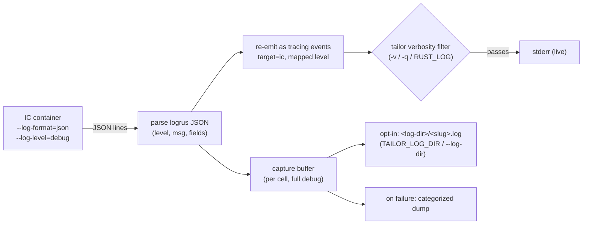
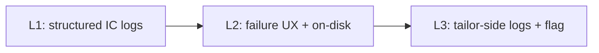

# tailor — Logging & diagnostics

> **Status:** Implemented · _last reviewed 2026-06-29_
>
> Structured IC logging is implemented: `crates/tailor-exec/src/arg_builder.rs` always passes JSON/no-color IC log flags, `crates/tailor-exec/src/ic_log.rs` parses and summarizes failures, and `crates/tailor/src/run.rs` wires `--log-dir`/`--ic-log-level`. This doc now describes shipped behavior, not a draft.

---

## 1. Problem — why logging needs a redesign

IC's output is **often the only way to tell what went wrong** (a package that won't install, a disk
that's too small, a verity mismatch). Today tailor handles it poorly:

| Symptom | Cause |
| ------- | ----- |
| `build` and `build -v` print **the same** thing | IC lines are emitted at `debug`, so `-v` (info) adds nothing; tailor itself logs almost nothing at info during a build. |
| You can't get IC's *own* debug detail | tailor never raises IC's `--log-level`, so even `-vv` only shows IC's default **info** lines — there's no debug data to display. |
| tailor's verbosity and IC's verbosity are **conflated** | One `-v` knob is expected to drive two unrelated things (how chatty *tailor* is vs how chatty *IC* is). |
| Output is **unstructured** | IC lines are raw text; tailor can't reliably categorize/filter them (level, phase), and ANSI handling is fiddly. |
| Failure dumps are raw and unbounded | On failure tailor now dumps the whole captured string verbatim — uncategorized, and potentially enormous at debug. |
| No durable record | Nothing is written to disk, so a long build's output is gone once the terminal scrolls. |

The concrete report that triggered this: a failed build first printed only `error: Image Customizer
exited with code 1` (no detail), and after a quick fix, `build` and `build -v` were indistinguishable.

---

## 2. Current state (what exists today)

- **`init_tracing`** (`tailor/src/main.rs`) maps net verbosity (`-v` minus `-q`) to a `tracing`
  `EnvFilter` level: `-q…`→error, default→warn, `-v`→info, `-vv`→debug, `-vvv`→trace. Honors
  `RUST_LOG`; writes to stderr; ANSI gated by `color_enabled()`.
- **`stream_logs`** (`tailor-exec`) attaches to the IC container, and for each output line emits
  `debug!(target: "tailor::ic", …)` and accumulates the text into a `String`.
- **`ExecError::IcFailed { code, logs }`** now renders the captured `logs` in its message (so a
  failure shows *something*), but raw and uncategorized.
- **`color_enabled()`** (`tailor-exec`) — shared `NO_COLOR`/`CLICOLOR_FORCE`/TTY decision, reused by
  tailor's status lines, the `error:` prefix, and tracing's ANSI.
- **Cargo-style status** (`tailor/src/run.rs`): `Toolchain` / `Building` / `Customizing` / `Built` /
  `Finished` lines via `eprintln`, always shown.
- **`runtime.logLevel`** (manifest) → IC `--log-level`, passed only when set.

What's missing: a deliberate split between *tailor's* chattiness and *IC's*, structured IC output,
and a sensible failure / on-disk story.

---

## 3. Goals & non-goals

**Goals**

- **IC output is first-class for debugging** — easy to get the full picture when something fails, and
  to follow progress live on a long build.
- **Two independent controls**: how verbose *tailor* is (its own logs) vs how much detail *IC*
  emits. Changing one must not silently change the other.
- **Structured, categorized IC output** — parse IC's logs into `(level, message, fields)` so tailor
  can re-emit them at the right level, filter them, and (later) route them.
- **Sensible defaults**: a successful `build` is clean; a *failed* build is information-rich without
  any extra flags.
- **Durable on demand**: a full, debug-level on-disk record is available after the fact when **opted
  in** (ideal for CI), without cluttering local runs by default.
- **Consistent presentation**: one color/TTY policy; plays nicely with the status lines.

**Non-goals**

- A logging *framework* swap — stay on `tracing` + `EnvFilter`.
- Parsing/interpreting IC's *semantics* (we categorize by level/phase, we don't try to understand
  every message).
- Remote log shipping / structured sinks beyond stderr + an optional file (could come later).

---

## 4. Key facts — IC's logging surface

IC (logrus under the hood) exposes exactly the controls we need (verified against
`imagecustomizer --help` — these are top-level flags, no subcommand):

```
--log-level=(panic|fatal|error|warn|info|debug|trace)   the minimum level IC emits
--log-format=(text|json)                                output format
--log-color=(always|auto|never)                         color for text format
--log-file=STRING                                       also write logs to a file (in-container path)
```

In **JSON** mode each line is one logrus object (verified):

```json
{"level":"info","msg":"Installing packages (1): [openssh-server]","time":"2026-06-24T19:54:00Z"}
{"level":"fatal","msg":"image customization failed:\nfailed to install packages ...","time":"…"}
```

So tailor can run IC with `--log-format=json --log-level=debug --log-color=never` and get a clean,
parseable stream it fully controls — no ANSI scraping, no guessing line levels.

### 4.1 Verified failure behavior (empirical — important caveat)

Ran IC in JSON mode and forced failures to confirm *how the cause actually surfaces* (Go error handling
does not guarantee everything goes through logrus). Findings:

- **Runtime failures (the common case): a logrus `fatal` JSON line on stderr.** A genuine customization
  error (missing config, package install fails, disk space, …) is emitted as one logrus object on
  **stderr**, with the wrapped Go error chain embedded in `msg` (newlines as `\n`), and IC exits **1**:
  ```json
  {"level":"fatal","msg":"image customization failed:\nopen /nonexistent.yaml: no such file or directory","time":"2026-06-24T23:18:31Z"}
  ```
- **Argument-parse failures bypass logrus.** A bad/missing flag is printed by IC's CLI parser as a plain
  **non-JSON** stderr line and usage text on **stdout**, with exit **80** — *not* a logrus line:
  ```
  imagecustomizer: error: missing flags: --build-dir=STRING
  ```
- **The container engine can interleave its own non-JSON stderr** (e.g. Docker's
  `WARNING: The requested image's platform … does not match …`).

**Consequence for the design:** the failure cause must **not** be inferred solely from a logrus
`fatal`/`error` line. It must key off the **non-zero exit code** and fall back to the trailing non-JSON
stderr when no `fatal` line is present (§5.3, §5.4). All IC log lines (JSON *and* non-JSON) go to
**stderr**; stdout is only usage/help.

---

## 5. Design — two independent axes

The core idea: **IC always emits rich, structured logs; tailor decides what to show.**



### 5.1 Axis A — how much IC emits (`--log-level`, default **debug**)

Independent of `-v`. Resolution (highest first): a future `--ic-log-level` flag → `runtime.logLevel`
→ **`debug`** (new default). tailor always adds `--log-format=json --log-color=never`. Running IC at
debug means the in-memory capture buffer (and the on-disk log, when enabled — §5.5) always have the
full story, even when the live view is quiet.

### 5.2 Axis B — how much tailor shows (`-v`/`-q`, unchanged)

`-v`/`-q` set tailor's `tracing` filter exactly as today. Because IC events are re-emitted as tracing
events at their *mapped* level (below), the same filter transparently governs how much IC output
reaches the screen — **without** changing what IC emits.

### 5.3 Parse & map (logrus JSON → tracing level)

| logrus `level` | tracing level | shown at |
| -------------- | ------------- | -------- |
| `trace` | `TRACE` | `-vvv` |
| `debug` | `DEBUG` | `-vv` |
| `info` | `INFO` | `-v` |
| `warn` | `WARN` | default |
| `error` / `fatal` / `panic` | `ERROR` | default (and `-q`) |

Events carry structured fields (`cell = <slug>`, and any extra logrus fields), under target **`ic`**
(so `RUST_LOG=ic=debug` works, and tailor's own logs can be filtered separately). **Non-JSON lines**
(the engine's "platform mismatch" warning, IC's `imagecustomizer: error: …` arg-parse line, or any
pre-logrus startup text) are kept verbatim in the capture buffer and re-emitted as a raw event — at
`WARN` normally, but **promoted to the failure cause when IC exits non-zero** (§5.4), so a logrus-less
failure is never silently downgraded. Nothing is dropped.

### 5.4 Failure diagnostics

On a non-zero IC exit, tailor produces a **categorized, bounded** report rather than dumping the raw
buffer. The cause is determined by the **exit code**, not by the presence of a logrus line (§4.1):

- **if** a logrus `error`/`fatal` line was captured (the runtime-failure path), use its `msg` verbatim
  — rendering the embedded `\n`s, since the wrapped Go error chain is one multi-line message; otherwise
- **fall back** to the trailing **non-JSON** stderr (the arg-parse `imagecustomizer: error: …` path, or
  any case where IC died before logrus engaged); then
- a **tail** of the preceding `info`+/`warn` context (last *N*, e.g. 50, lines) so the lead-up is
  visible, and
- **if** on-disk logging is enabled (§5.5), a pointer to the **full** per-cell debug log.

This comes entirely from the always-on in-memory capture buffer, so a failure is information-rich
**without** any opt-in — and because it is keyed off the exit code with a non-JSON fallback, it surfaces
the real cause whether IC failed through logrus or not. It keeps the default failure output focused (no
thousands of debug lines inline) while the complete record is one path away whenever a runner has opted
in.

### 5.5 On-disk logs (opt-in durable record)

Persisting logs to disk is **off by default** — a local `tailor build` keeps `artifacts/` clean and
relies on the in-memory capture (§5.4) for failure diagnostics. It is **opt-in**, designed so an
unattended runner can turn it on once and forget it. Enable it by pointing tailor at a log directory,
via any of (highest precedence first):

- **`--log-dir <path>`** — a one-off CLI flag.
- **`TAILOR_LOG_DIR=<path>`** — an environment variable. This is the intended path for **CI/pipelines**:
  set it once in the job/runner environment (e.g. `TAILOR_LOG_DIR=$RUNNER_TEMP/tailor-logs`) and every
  `tailor build` in that job persists logs for artifact upload — no per-invocation flags, no manifest
  edits.
- **`runtime.logDir`** in `tailor.yaml` — a committed workspace policy, when a repo always wants logs.

When a log directory is set, tailor passes IC `--log-file` (translated into the `/host` mount) so each
cell's **full debug** log lands at `<log-dir>/<slug>.log` (janitor-chowned like other outputs),
survives terminal scroll, is attachable to bug reports, and becomes the target of the failure pointer
(§5.4). When it is unset (the local default), nothing is written and the failure dump simply omits the
pointer. (Open question: retention/rotation within the log dir.)

### 5.6 Color, timestamps & presentation

Color stays governed by the single `color_enabled()` policy (`NO_COLOR`/`CLICOLOR_FORCE`/TTY).
Because IC now emits JSON (no ANSI), tailor renders the level/labels itself via `tracing`'s colored
output — **this supersedes the earlier "preserve IC's raw ANSI" approach** (there is no raw ANSI to
preserve in JSON mode; tailor's own coloring is more consistent).

**Timestamps are compact in the live view, full only in preserved logs.** A full RFC3339 stamp
(`2026-06-24T23:18:01.003691Z`, ~27 cols) dominates the line and adds little watching a build scroll by;
the precise instant only matters for post-hoc forensics. So:

- **Live (stderr):** the `tracing` formatter uses a **compact wall-clock `HH:MM:SS`** timer (8 cols) —
  enough to spot a slow step, a fraction of the width. (Alternatives if preferred: **elapsed since build
  start**, mirroring IC's own `INFO[0022]` convention, or **no timestamp at all** — the cargo-style
  status lines already mark phase boundaries. A `--timestamps=(time|elapsed|off)` knob could expose this.)
- **Preserved on-disk log (§5.5):** keeps **full-precision** timestamps. The simplest implementation
  writes IC's **raw JSON** (which already carries a full `time` field) verbatim, so the durable record
  loses nothing — the compacting is purely a live-display choice.

### 5.7 Matrix & per-cell

Every IC event is tagged with its `cell` slug, and each cell gets its own `<slug>.log`. When parallel
builds land (`--jobs`), the slug field disambiguates interleaved live lines and the per-cell files
stay clean.

---

## 6. Behavior matrix (what you see)

There is one live verbosity knob for two tracing streams. tailor's own events and IC's parsed,
re-emitted events both pass through the same `-v`/`-q` filter, so raising verbosity raises the live
display for **both** sources in lockstep. IC emission/capture is separate: tailor still runs IC at
`--log-level=debug --log-format=json --log-color=never`, so the full debug-level IC record is kept in
the in-memory capture buffer regardless of the live verbosity (and written to disk too **when on-disk
logging is opted in** — §5.5).

| Flag | tracing threshold | tailor logs shown live | IC logs shown live | IC logs captured (in-memory) |
| ---- | ----------------- | ---------------------- | ------------------ | ---------------------------- |
| `-q` / `-qq` | `ERROR` | `error` only | `error` / `fatal` / `panic` only | full `debug` stream, always |
| default | `WARN` | `warn` + `error` | `warn` + `error` / `fatal` / `panic` | full `debug` stream, always |
| `-v` | `INFO` | `info` and above | `info` and above | full `debug` stream, always |
| `-vv` | `DEBUG` | `debug` and above | `debug` and above | full `debug` stream, always |
| `-vvv` | `TRACE` | `trace` and above | `trace` and above if emitted; otherwise all captured IC detail | full `debug` stream, always |

The success/failure behavior then falls out of that shared live filter plus the failure dump:

| Scenario | default | `-v` | `-vv` | `-vvv` |
| -------- | ------- | ---- | ----- | ------ |
| **Success** | status lines + live `warn`/`error` from both streams | + live `info` from both streams | + live `debug` from both streams | + live `trace` from both streams (IC only if emitted) |
| **Failure** | status + live `warn`/`error` + categorized dump (cause + info tail) + log-file pointer **if persisting** | same, plus `info` was live | same, plus `debug` was live | same, plus `trace` was live where present |
| **On disk** | only when opted in (`TAILOR_LOG_DIR`/`--log-dir`/`runtime.logDir`): full IC `debug` log per cell | — | — | — |

`build` ≠ `build -v` (the original complaint) because `-v` now surfaces both tailor and IC `info`
events live, while default stays clean but still fails loudly with the categorized cause and info-level
context (plus a pointer to the on-disk IC log when persisting is enabled).

### 6.1 Sample output (illustrative)

Concrete transcripts of the intended behavior (illustrative — pre-implementation). tailor's cargo-style
status lines (right-aligned verbs) always show; IC events are `tracing` lines at target `ic`, gated by
verbosity, with the **compact `HH:MM:SS`** live timestamp (§5.6); the `cell=` field disambiguates
matrix/parallel builds.

**A — success, default verbosity.** Clean: IC emits only `info`/`debug`, all below the default `warn`
threshold, so nothing from IC appears.

```text
$ tailor build
   Toolchain mcr.microsoft.com/azurelinux/imagecustomizer:latest
    Building 1 cell(s) selected, 1 to build
 Customizing appliance_amd64_cosi  (azureLinux 3.0/minimal-os)
       Built appliance_amd64_cosi.cosi (12.4 MiB)
    Finished 1 artifact(s) in 41.5s
```

**B — success, `-v`.** Same status lines, now interleaved with IC `info` live.

```text
$ tailor build -v
   Toolchain mcr.microsoft.com/azurelinux/imagecustomizer:latest
    Building 1 cell(s) selected, 1 to build
 Customizing appliance_amd64_cosi  (azureLinux 3.0/minimal-os)
23:18:01  INFO ic: Downloading OCI image (mcr.microsoft.com/azurelinux/3.0/image/minimal-os@sha256:ef36…) cell=appliance_amd64_cosi
23:18:06  INFO ic: Creating raw base image: /tmp/image.raw cell=appliance_amd64_cosi
23:18:10  INFO ic: Base OS version: 3.0.20260616 cell=appliance_amd64_cosi
23:18:22  INFO ic: Installing packages (1): [openssh-server] cell=appliance_amd64_cosi
23:18:32  INFO ic: Enabling service (sshd) cell=appliance_amd64_cosi
       Built appliance_amd64_cosi.cosi (12.4 MiB)
    Finished 1 artifact(s) in 41.5s
```

**C — runtime failure, default verbosity (logrus `fatal` path, §4.1).** The `warn` line shows live
(default surfaces warnings); then the categorized dump — cause from the multi-line `fatal` `msg`, plus
the info/warn tail. No `-v` needed.

```text
$ tailor build
   Toolchain mcr.microsoft.com/azurelinux/imagecustomizer:latest
    Building 1 cell(s) selected, 1 to build
 Customizing appliance_amd64_cosi  (azureLinux 3.0/minimal-os)
23:18:19  WARN ic: Low free disk space 4% (20 MiB) on (/) cell=appliance_amd64_cosi
error: Image Customizer failed for appliance_amd64_cosi (exit 1)

  image customization failed:
  failed to install packages ([openssh-server]):
  Error(1036) : Insufficient disk space at cache directory /var/cache/tdnf. Try freeing space first.

  last IC context:
    INFO  Refreshing package metadata
    INFO  Installing packages (1): [openssh-server]
    WARN  Low free disk space 4% (20 MiB) on (/)

  re-run with -vv for full IC debug, or set TAILOR_LOG_DIR=<dir> to persist the per-cell log.
```

**D — pre-logrus failure, default (non-JSON fallback, §4.1).** No structured `fatal` line exists, so the
cause is taken from IC's trailing stderr.

```text
$ tailor build
   Toolchain mcr.microsoft.com/azurelinux/imagecustomizer:latest
    Building 1 cell(s) selected, 1 to build
 Customizing appliance_amd64_cosi  (azureLinux 3.0/minimal-os)
error: Image Customizer failed for appliance_amd64_cosi (exit 80)

  imagecustomizer: error: missing flags: --build-dir=STRING

  (no structured IC log was produced — cause taken from IC's stderr; usually a tailor/IC argument
   mismatch.)
```

**E — CI run with persistence (`TAILOR_LOG_DIR` set).** Same as **C**, but the dump ends with a pointer
to the durable per-cell log the runner can upload as an artifact:

```text
  re-run with -vv for full IC debug.
  full log: /home/runner/_temp/tailor-logs/appliance_amd64_cosi.log
```

---

## 7. Decisions to confirm (recommendations inline)

1. **Default IC `--log-level` = `debug`.** *(User asked for this.)* Rich in-memory capture by default;
   live display still filtered by `-v`. **Recommend: yes.**
2. **Failure dump shape & cause extraction.** Options: (a) full buffer inline, (b) **cause + info tail
   (+ file pointer when persisting)**, (c) cause + file pointer only. **Recommend (b)** — focused and
   self-contained from the in-memory capture. The cause is **keyed off the non-zero exit code**: the
   captured logrus `fatal`/`error` `msg` when present (runtime path), else the trailing **non-JSON**
   stderr (arg-parse `imagecustomizer: error: …` path) — see §4.1. *(User raised this: IC's error may
   not always arrive as a logrus line; verified — runtime errors do, arg-parse errors do not.)*
3. **On-disk per-cell logs are opt-in, off by default.** *(User: persistence should be opt-in — easy for
   unattended runners/pipelines, but not for local users.)* Enable by setting a log directory via
   `TAILOR_LOG_DIR` (env — the CI path), `--log-dir` (flag), or `runtime.logDir` (manifest); logs land at
   `<log-dir>/<slug>.log`. **Recommend: yes, opt-in.** Open: retention/rotation within the dir; whether to
   default the dir to `artifacts/.tailor/logs` *once enabled*.
3a. **Compact live timestamps; full only in preserved logs.** *(User: full RFC3339 stamps are too wide
   for the live view; that precision belongs in preserved logs.)* **Recommend** a compact wall-clock
   `HH:MM:SS` live timer (§5.6), full-precision retained on disk. Open: default to `HH:MM:SS` vs elapsed
   vs none, and whether to add a `--timestamps=(time|elapsed|off)` knob.
4. **A dedicated `--ic-log-level` flag** (independent of `-v`, overrides `runtime.logLevel`).
   **Recommend: yes**, low cost, makes the independence explicit.
5. **Default live behavior at verbosity 0.** With the level mapping, IC **warn/error** would appear
   live even by default. **Recommend: keep** (surfacing warnings early is good); alternative is to
   gate *all* live IC output behind `-v` and rely on the failure dump.
6. **Add structured tailor-side info logs** (e.g. `resolved base <ref>@<digest>`, `pulling toolchain`,
   `running janitor`) so `-v` is meaningful for *tailor* too, not just IC. **Recommend: yes**, a few
   well-placed `info!`s.
7. **Event target name** `ic` vs `tailor::ic`; whether to print the target. **Recommend `ic`**, hidden
   from the default format, available to `RUST_LOG`.
8. **`fatal`/`panic` → `ERROR`** (tracing has no fatal). **Recommend: yes** (label retained in the
   dump text).

---

## 8. Milestones



- **L1 — structured pass-through.** IC `--log-format=json --log-level=debug --log-color=never`; parse
  logrus JSON; re-emit as `tracing` events (target `ic`, mapped level, `cell` field). Removes the
  ANSI-scraping path. Outcome: `-v`/`-vv`/`-vvv` meaningfully tier IC output.
- **L2 — failure & durability.** Categorized bounded failure dump (cause + info tail) from the in-memory
  capture; **opt-in** per-cell `--log-file` persistence (`TAILOR_LOG_DIR`/`--log-dir`/`runtime.logDir`)
  with the error pointer shown when enabled.
- **L3 — tailor's own voice + control.** A handful of structured tailor `info!`/`debug!` logs around
  resolve/pull/build/janitor, and a `--ic-log-level` flag.

---

## 9. Summary

Make IC's output a first-class, structured signal: run IC at **debug + JSON**, parse it, and re-emit
it through tailor's existing `tracing` filter so **`-v`/`-vv`/`-vvv` tier IC detail** while a separate
knob (default `debug`) controls how much IC *emits*. A successful build stays clean; a failed one is
information-rich by default (categorized cause + context from the always-on in-memory capture). The two
verbosity axes are independent, the color policy is unified, and **opt-in** on-disk persistence
(`TAILOR_LOG_DIR`/`--log-dir`/`runtime.logDir`) gives unattended runners a durable per-cell record for
post-hoc debugging without cluttering local runs.
