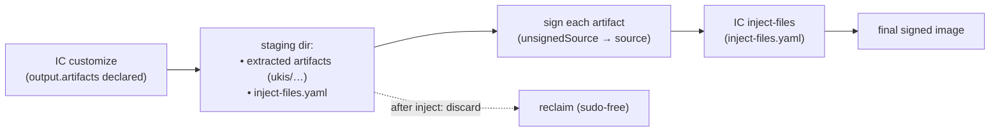

# Managing IC `output.artifacts` staging directories (partially implemented)

> **Status:** Partially implemented · _last reviewed 2026-06-29_
>
> tailor's design for the interim directory Image Customizer's `output.artifacts` feature creates
> (root-owned, in the source image dir today). It settles on one approach: **gate on the
> `output-artifacts` preview flag, relocate IC's scratch to a tailor-owned directory, reclaim it
> sudo-free, and never destroy a user-requested output.** Amends [`signing.md`](./signing.md) §3/§5
> (which currently says tailor never relocates `output.artifacts`).
>
> **Implemented:** the `output-artifacts` gate (§3.1), the `outputArtifacts: managed|scratch|strip`
> policy (§3.3, `OutputArtifactsPolicy` in `crates/tailor-config`), the relocate + sudo-free
> chown/reclaim + this-cell crash sweep (§3.2 staging, §3.4–§3.5, `crates/tailor-exec/src/output_artifacts.rs`
> + the executor). **Pending:** the signed bridge's `sign`/`inject-files` steps (await signing
> execution, [`signing-status.md`](./signing-status.md)), the `--keep-staging` opt-out, `--dry-run`
> display of the staging steps, and the forward-compat stable detector (§3.1).

## 1. Problem

An image that produces signed boot artifacts declares an `output.artifacts` block in its IC config:

```yaml
config:
  previewFeatures:
    - output-artifacts
  output:
    artifacts:
      items: [ukis]
      path: ./output
```

On `customize`, IC **extracts** the named artifacts (UKIs, shim, bootloader, verity-hash) into `path/`
and writes an **`inject-files.yaml`** manifest describing how to re-inject them — see the IC
[`output`](https://microsoft.github.io/azure-linux-image-tools/imagecustomizer/api/configuration/output.html)
/ [`outputArtifacts`](https://microsoft.github.io/azure-linux-image-tools/imagecustomizer/api/configuration/outputArtifacts.html)
reference. The artifacts are signed, re-injected via the IC
[`inject-files`](https://microsoft.github.io/azure-linux-image-tools/imagecustomizer/api/configuration/injectFilesConfig.html)
pass, and then discarded.

Two things make this a tailor problem:

1. **It lands in the source tree, root-owned.** IC resolves a relative `path` **against the config
   file's parent directory** (IC docs). tailor writes its merged config as a *colocated* working copy
   in the image's real directory (`crates/tailor-exec/src/working_copy.rs` —
   `.tailor-render.<slug>.ic.yaml`, colocated so IC resolves relative `files/`/`scripts/` paths against
   the image dir, `meta/docs/design.md` §7.6). So `./output` resolves to `<image-dir>/output/`, and
   because IC runs as root in a privileged container, everything in it is **root-owned**
   (`meta/docs/design.md` §7.7). The leftover at `tests/images/trident-testimage/output/` (`root:root`,
   holding `ukis/…efi` + `inject-files.yaml`) is exactly this.

2. **It appears even when nothing signs it.** tailor's signing *execution* is not implemented yet
   ([`signing-status.md`](./signing-status.md)), so today a cell that carries `output.artifacts` builds
   an image **and** strands a root-owned `output/` — droppings in `git status`, removable only with
   `sudo`.

tailor must keep the source tree clean, reclaim the directory **sudo-free**, and — when signing lands —
treat it as the managed bridge between `customize` and `inject-files`, **without** ever silently
deleting artifacts a user actually asked IC to emit.

## 2. Background — the mechanism & prior art



- **`output.artifacts` is a preview feature.** IC only honors it when `output-artifacts` is listed in
  `previewFeatures`; the API "is subject to change" (IC docs). That flag is therefore an authoritative,
  IC-sanctioned signal that the feature is in use.
- **Prior art — Trident's `sign.py`.** `setup_temp_yaml_and_dir`
  (`trident/tests/images/builder/builder.py`) does not let the path fall where authored: it creates a
  hidden `temp_dir(prefix=".<id>-", dir=<yaml_dir>, sudo=True)`, **rewrites** `output.artifacts.path`
  in a per-build copy of the config to point at it, runs customize→sign→inject, and an `ExitStack`
  removes the temp dir **with sudo** (the contents are root-owned). The moves are *relocate the scratch*
  and *reclaim it with elevation*.
- **tailor already has the reclaim mechanism.** The janitor (`crates/tailor-exec/src/janitor.rs`) runs
  a throwaway root container to `chown -R <caller>` (`chown_paths`) and `rm -rf` (`remove_paths`) — the
  standard sudo-free substitute (`meta/docs/design.md` §7.7). The executor already tracks
  `managed_paths` and removes the working copy after each run (`crates/tailor-exec/src/executor.rs`).
- **tailor's current stance.** [`signing.md`](./signing.md) §3/§5 passes `output.artifacts` through
  *opaquely* and never relocates it; this proposal amends that.

## 3. Design

tailor **manages** the `output.artifacts` staging directory: it engages only when the IC config opts
into the feature, relocates IC's scratch to a directory tailor names, reclaims it sudo-free, and treats
artifacts as a deliverable whenever they are not consumed by signing.

### 3.1 Activation — gate on the `output-artifacts` preview flag

tailor engages this whole mechanism **only when `output-artifacts` is present in the cell's
`previewFeatures`**. No flag ⇒ tailor does nothing: IC itself ignores `output.artifacts` without the
flag, so there is no scratch to manage. This gate is the right trigger for three reasons:

- It is the **input-side** signal, and relocation must happen **before** `customize` (tailor rewrites
  the working copy up front) — so unlike signing's post-build `inject-files.yaml` detection, tailor
  cannot wait for IC's output here.
- It matches IC's own gating exactly: while the feature is preview, the flag is *required* for IC to act
  on `output.artifacts`, so keying off the flag can never diverge from IC's behavior.
- The API is explicitly **unstable**; binding tailor's behavior to the same flag means tailor only
  takes responsibility for a feature the user has knowingly opted into.

**Forward compatibility.** When IC graduates `output-artifacts` out of preview, the flag disappears and
a bare `output.artifacts` block becomes valid on its own. At that point tailor adds a **second
detector** — presence of the `output.artifacts` block — **alongside** the flag check (kept for older IC
versions that still treat it as preview). The activation gate is deliberately a **single chokepoint**
(one predicate, e.g. `cell_uses_output_artifacts()`), so adding the stabilized detector later is a
one-line change and the two paths coexist for backwards compatibility.

### 3.2 Signed cells — the customize → sign → inject bridge

When the gate is on **and** the cell has a resolved `signing:` profile, the staging dir is interim
scratch. tailor rewrites `output.artifacts.path` in the working copy to a hidden, tailor-named,
**colocated** directory carrying a random nonce — `./.tailor-stage.<slug>.<run-id>/` — so retries,
clones, and concurrent invocations against the same worktree never collide. Colocation keeps IC's
relative-path resolution intact; tailor naming it (and knowing the path *before* IC runs) is what makes
reclaim and the crash sweep (§3.5) reliable.

```yaml
# what the user authored                # what IC actually runs against (working copy)
output:                                  output:
  artifacts:                               artifacts:
    items: [ukis]            ──rewrite──>     items: [ukis]          # intent unchanged
    path: ./output                            path: ./.tailor-stage.<slug>.<run-id>
```

The sequence — note the **chown precedes signing**, because IC writes the staging tree as root and the
host signer must read the unsigned artifacts and write signed replacements back into it before
`inject-files`:

```
customize  →  janitor chown <staging> to caller  →  sign  →  inject-files  →  janitor rm <staging>
```

### 3.3 Unsigned cells — the artifacts are a deliverable

When the gate is on but the cell has **no** signing profile, the extracted artifacts are **not** waste:
the user asked IC to emit unsigned UKIs/shim/verity-hashes, which they may sign manually, inspect, or
feed downstream. tailor must **not** silently strip or delete them. The behavior is an explicit policy,
defaulting to the safe option:

```yaml
outputArtifacts: managed   # managed (default): relocate + chown + keep as a real cell output
                           # scratch:           treat as signing scratch even unsigned (extract, then reclaim)
                           # strip:             drop output.artifacts so IC never extracts
```

- **`managed`** (default): relocate to a managed output location, janitor-`chown` to the caller, and
  **keep** the artifacts alongside the image. This still fixes today's *root-owned* droppings (via the
  chown + a managed location) while destroying nothing.
- **`scratch`**: opt into the §3.2 extract-then-reclaim behavior even without signing.
- **`strip`**: drop the `output.artifacts` block so IC never extracts. Only also remove
  `output-artifacts` from `previewFeatures` if no other retained field needs that flag for the targeted
  IC version.

### 3.4 Cleanup — sudo-free, explicit failure policy

- **Reclaim = chown then rm**, both via the janitor (sudo-free). In the signed path the chown is not
  only reclaim — it runs *before* signing (§3.2); the `rm` runs after `inject-files`.
- **Failure policy (stated to avoid an inspect-vs-reclaim contradiction):** the default on
  error/cancellation is **chown + rm** — no root-owned scratch is left behind. `--keep-staging` (or an
  existing debug flag) changes the failure behavior to **chown only**, so an operator can inspect the
  partial tree as themselves. Success always ends in `rm` unless `--keep-staging`.
- **Best-effort, not a hard guarantee.** Cleanup runs from a scope-guard on the normal error/cancel
  path; it cannot survive `SIGKILL`/reboot, so it is **backed by the §3.5 sweep**.
- **Idempotent**, and `--dry-run` prints the reclaim like every other step.
- **Hook:** register the staging path in the executor's `managed_paths` **before** the `customize`
  invocation (tailor named it, so it need not wait for IC to create it), reusing the existing
  `chown_paths`/`remove_paths` flow (`crates/tailor-exec/src/executor.rs`).

### 3.5 Crash-orphan sweep — tailor-named only

A run killed before its scope-guard fires leaves a recognisably tailor-named `.tailor-stage.*.<run-id>`
directory. At the start of the next run, tailor reclaims **only directories matching that convention**.
It **never** sweeps a generic `output/` or any user-named path — that risks deleting authored outputs.
Legacy/hand-authored leftovers (like the existing root-owned `output/`) are reclaimed only by an
**explicit** command/flag, and only after verifying the directory contains the IC marker
(`inject-files.yaml`) and nothing unrelated.

## 4. Reconciling with config-opacity

§3.2/§3.3 (`scratch`/`strip`) edit IC fields, which signing.md §3/§5 currently forbids, and §3.1 reads
the config (the preview flag). This **narrows**, not abandons, opacity:

- tailor never interprets the user's **intent** — `items:` is passed through verbatim; the user decides
  *what* to extract and *whether* to sign.
- tailor governs only **where IC's scratch lands and when it is reclaimed**, exactly as it already
  governs `--build-dir`, `--output-image-file`, and the working-copy location.
- The §3.1 read is a single, well-defined predicate (a known feature flag), not config interpretation.

signing.md §3/§5 should be amended from "never rewrites `output.artifacts`" to "relocates the
`output.artifacts` *path* to a managed staging dir and reclaims it after re-injection; never changes
*what* is extracted."

## 5. Alternatives considered

- **Opaque + track-and-clean (keep the user's path).** Read only `output.artifacts.path` and reclaim it
  in place. *Rejected:* the path is user-controlled (could be absolute, shared between cells, or `.`),
  so reclaim is fragile and clone-unsafe — tailor naming the dir (§3.2) is strictly safer.
- **Strip `output.artifacts` for every unsigned cell.** *Rejected* as a default: it silently destroys a
  user-requested output (§3.3). Retained only as the explicit `strip` policy.
- **Ephemeral working-copy directory** (move the working copy out of the image dir so `./output` lands
  in a build dir). *Rejected:* breaks colocated relative `files/`/`scripts/` resolution
  (`meta/docs/design.md` §7.6) until the "read-only-config symlink farm" (§18 future work) exists.

## 6. Sibling case — `output.selinuxPolicyPath`

`output.selinuxPolicyPath` has the **same** relative-to-config-dir resolution and emits **root-owned**
host files (IC docs, `output.html`), so it produces the identical source-tree dropping — and it too is
a **preview** feature (`output-selinux-policy`), so the §3.1 flag-gate generalizes. It is a
*deliverable*, so the `managed`/keep treatment applies (never `strip`). (`output.image.path` is already
steered by tailor's `--output-image-file`; `--build-dir` is container-internal — neither leaks into the
source tree.) Whether to fold this into the same mechanism now or defer is an open question (§7).

## 7. Open questions

- **Stable detector (forward compat):** once `output-artifacts` leaves preview, what exactly triggers
  the §3.1 fallback — bare `output.artifacts` presence, an IC-version check, or both — and how is it
  tested against an IC build that has graduated the feature?
- **Extraction side effects (precondition, not assumption):** `scratch`/`strip` assume
  `output.artifacts` is purely extractive (copies artifacts + emits `inject-files.yaml`, no
  image-visible change). The IC docs support this, but it is a **preview** API — gate `scratch`/`strip`
  behind version-tested behavior; the default `managed` does not depend on it.
- **Published CA cert:** `sign.py`'s `publish_ca_certificate` writes `ca_cert.pem` into the output dir.
  In tailor's model that is a deliberate **signing-profile output** tied to the profile's
  `publishCaCert` field (signing.md §4), not scratch — it must be written to the cell's real output dir
  (and tracked by the build stamp), never into the swept staging dir.
- **Incremental stamps:** ensure a relocated/kept staging dir never perturbs the up-to-date check
  (`crates/tailor-core/src/stamp.rs`).
- **`selinuxPolicyPath` scope:** fold it into this mechanism now, or ship `output.artifacts` first and
  generalize once the gate/policy shape is proven (§6)?
