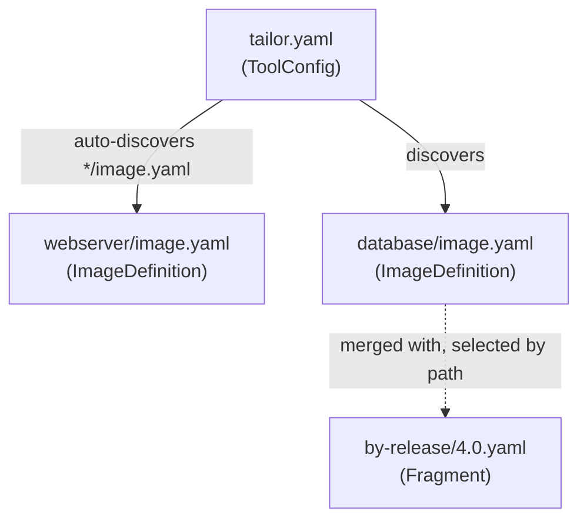

# tailor configuration reference

Human-readable reference for tailor's configuration files. The authoritative, machine-checkable
source is [`../tailor.schema.json`](../tailor.schema.json) (JSON Schema, Draft 2020-12); these pages
mirror it field-for-field.

> tailor configures the Azure Linux **Image Customizer (IC)**. Anything under an image's **`config:`**
> key is **IC** configuration and is intentionally **not** documented here — tailor treats it as an
> opaque pass-through (an inline mapping or a path to an IC config file). Only the *tailor* surface is
> covered below.

## The three document kinds

| Page | File(s) | Role |
| ---- | ------- | ---- |
| [tailor.yaml](./tailor-yaml.md) | `tailor.yaml` | workspace root: `toolchains`, `runtime`, `defaults`, image catalogue |
| [image.yaml](./image-yaml.md) | `image.yaml` | one image: `name`, `matrix`, `outputs`, `base`, `config:` |
| [Fragments & directives](./fragments.md) | `by-*/<value>.yaml` | conditional deltas + the `$`-directives |
| [Shared types](./types.md) | — | toolchain, base source, output, matrix, params, arch, … |

## Two modes, one discovery rule

- **Workspace mode** — a `tailor.yaml` plus member images in subdirectories. Repo-wide toolchains and
  defaults; each image may override.
- **Standalone mode** — a lone `image.yaml` with no `tailor.yaml`. Self-contained.

`tailor build` (from anywhere) walks **up** to find a `tailor.yaml`; that directory is the workspace
root. If none is found, the `image.yaml` in the current directory is built standalone.

## Conventions used on these pages

- **Req** column: `yes` = required, `no` = optional, `cond` = conditionally required (the Notes say
  when).
- A **`Default`** is what tailor uses when the field is omitted.
- Type names link to [Shared types](./types.md); `[T]` means "array of T".

See the runnable [examples](../../examples/): `minimal-single-image`, `standalone-image`,
`workspace-two-images`, `trident-vm-testimage`.
