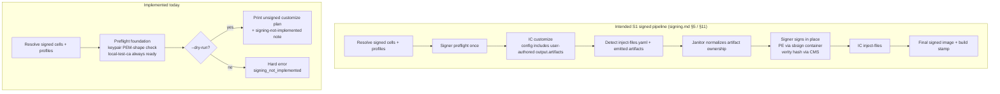

# tailor — Signing implementation status

> **Status:** Partially implemented (S1 foundation only) · _last reviewed 2026-06-29_
>
> The `signing:` manifest surface, profile resolution, preflight checks, and signed-build dry-run note from [signing.md](./signing.md) are present in code; the actual signing execution pipeline is not. A non-dry-run signed build runs preflight and then hard-errors through `signing_not_implemented` rather than emitting an unsigned image (`crates/tailor/src/run.rs:558-563`, `crates/tailor/src/run.rs:876-888`).

## Summary

Signing is at the **S1 foundation** stage. Users can declare signing profiles and opt images into them, `tailor validate` / `tailor build --dry-run` surface signing prerequisite status, and real signed builds fail fast before any Image Customizer run. What does **not** exist yet is the S1 execution path from [signing.md §11](./signing.md#11-milestones-refines-designmd-17-m4): no `Signer` port, no `tailor-sign` backend crate, no `rcgen` CA/leaf generation, no `sbsign` container invocation, no CMS/PKCS#7 verity-hash signing, no `inject-files` executor pass, and no real signed E2E cell.

## What's implemented

| Implemented slice | Code evidence | Design coverage |
| --- | --- | --- |
| Workspace-level signing config is parsed from `tailor.yaml`. | `ToolConfig` has `signing: Option<SigningConfig>` (`crates/tailor-config/src/schema.rs:23-25`). `SigningConfig` has `default` and named `profiles` (`crates/tailor-config/src/schema.rs:161-172`). | [signing.md §4](./signing.md#4-manifest-surface) |
| Image-level opt-in is parsed as `signing: true`, `signing: false`, or `signing: <profile-id>`. | `ImageDefinition` has `signing: Option<SigningRef>` (`crates/tailor-config/src/schema.rs:356-359`); `SigningRef` is bool-or-string (`crates/tailor-config/src/schema.rs:253-262`). | [signing.md §4](./signing.md#4-manifest-surface) |
| The schema models the S1/S2 key-source names currently exposed to users. | `SigningBackend` supports `local-test-ca`, `keypair`, and `azure-key-vault` (`crates/tailor-config/src/schema.rs:198-208`, `crates/tailor-config/src/schema.rs:210-218`). | [signing.md §6](./signing.md#6-signer-abstraction) / [§11](./signing.md#11-milestones-refines-designmd-17-m4) |
| Profile references are resolved and structurally validated. | `resolve_signing` maps omitted/`false` to unsigned, `true` to `signing.default`, and strings to named profiles, then validates (`crates/tailor-config/src/schema.rs:264-302`). `SigningProfile::validate` requires `key`+`cert` for `keypair` and `vault`+`certificate` for `azure-key-vault` (`crates/tailor-config/src/schema.rs:221-250`). | [signing.md §4](./signing.md#4-manifest-surface), partial [§5.1](./signing.md#51-preflight--fail-fast-before-building) |
| The CLI gathers distinct signing requirements for selected images before execution. | `signing_requirements` resolves each selected target, deduplicates by profile id, and records requesting images (`crates/tailor/src/run.rs:823-850`). | [signing.md §5.1](./signing.md#51-preflight--fail-fast-before-building) step 1 |
| Preflight exists as a cheap, aggregate prerequisite check. | `SigningRequirement`, `MissingPrerequisite`, `SignError`, `preflight_profile`, and `preflight` live in `tailor-core` (`crates/tailor-core/src/signing.rs:23-147`). `keypair` checks readable PEM-shaped key/cert files; `local-test-ca` is considered satisfiable; `azure-key-vault` is structural-only for now (`crates/tailor-core/src/signing.rs:74-95`). | Partial [signing.md §5.1](./signing.md#51-preflight--fail-fast-before-building) |
| `tailor validate` reports signing readiness non-fatally. | `validate` calls `report_signing(&signing_requirements(...))` after cell validation (`crates/tailor/src/run.rs:237-250`); `report_signing` prints ready/not-ready details (`crates/tailor/src/run.rs:852-874`). | [signing.md §5.1](./signing.md#51-preflight--fail-fast-before-building) |
| `tailor build --dry-run` remains daemon-free and warns that signing execution is absent. | Dry-run renders the current unsigned plan, then reports signing status and prints `signing execution is not yet implemented` (`crates/tailor/src/run.rs:537-555`). | Partial [signing.md §5.1](./signing.md#51-preflight--fail-fast-before-building) / [§11 S1](./signing.md#11-milestones-refines-designmd-17-m4) |
| Real signed builds hard-stop after successful preflight. | Non-dry-run signed builds call `tailor_core::preflight` and immediately return `signing_not_implemented` (`crates/tailor/src/run.rs:558-563`). | Safety guard for [signing.md §11 S1](./signing.md#11-milestones-refines-designmd-17-m4) while execution is incomplete |
| Integration tests cover the foundation and refusal behavior. | Tests assert non-fatal validate reporting, fail-fast missing-key preflight, dry-run notes, unknown profile errors, and the hard refusal instead of silently unsigned output (`crates/tailor/tests/signing.rs:1-129`). | Regression coverage for the implemented S1 foundation |

### Important fingerprint note

The intended S1 fingerprint change in [signing.md §8](./signing.md#8-reproducibility-fingerprint--lockfile) is **not implemented as signer identity** yet. Current fingerprint inputs still include the legacy `inject_files` boolean (`crates/tailor-core/src/fingerprint.rs:10-23`, `crates/tailor-core/src/fingerprint.rs:51-54`), and the orchestrator fills it from `target.definition.inject_files` (`crates/tailor-core/src/orchestrator.rs:88-97`). Because signed execution hard-stops today, this does not yet produce stale signed artifacts, but it must change before signed outputs can be cached correctly.

## What's missing

### S1 remaining — the headline gap

- **No `Signer` port or signing plan/result types.** `tailor-core::ports` currently defines `Executor`, `ContainerRuntime`, `BaseResolver`, `BaseImageFetcher`, and `FilesystemOps`, but no `Signer` trait (`crates/tailor-core/src/ports.rs:18-35`, `crates/tailor-core/src/ports.rs:104-168`, `crates/tailor-core/src/ports.rs:183-220`). The public re-export is only the preflight helper set, not a signing port (`crates/tailor-core/src/lib.rs:33-35`).
- **No `tailor-sign` crate / backend implementation.** The workspace members are `tailor`, `tailor-config`, `tailor-core`, `tailor-exec`, and `tailor-resolve`; there is no signing backend crate yet (`Cargo.toml:1-9`).
- **No three-pass executor.** The executor port exposes one `execute` call returning one artifact (`crates/tailor-core/src/ports.rs:18-27`). The IC arg builder has only `customize` and `convert` subcommands (`crates/tailor-exec/src/arg_builder.rs:36-45`, `crates/tailor-exec/src/arg_builder.rs:142-147`), so there is no `customize → sign → inject-files` path.
- **No post-customize `inject-files.yaml` / artifact detection.** The current implemented detection is manifest/profile detection before execution (`crates/tailor/src/run.rs:823-850`). The runtime presence check described in [signing.md §5](./signing.md#5-execution-pipeline)—`signing:` set but IC emitted no `inject-files.yaml`—has nowhere to run because signed builds stop before customize (`crates/tailor/src/run.rs:558-563`).
- **No `rcgen` local test CA generation.** The schema exposes `local-test-ca` (`crates/tailor-config/src/schema.rs:201-208`) and preflight treats it as always satisfiable (`crates/tailor-core/src/signing.rs:74-95`), but execution-time CA/leaf generation is explicitly deferred (`crates/tailor-core/src/signing.rs:8-11`). `rcgen` is the planned Rust X.509 generator; its docs describe generating self-signed X.509 certificates.[^rcgen]
- **No `keypair` signing backend.** `keypair` currently requires `key` and `cert` structurally (`crates/tailor-config/src/schema.rs:231-238`) and preflight only checks that they are readable and PEM-shaped (`crates/tailor-core/src/signing.rs:74-95`, `crates/tailor-core/src/signing.rs:97-121`). It does not parse private keys/certificates as signing material or produce signatures.
- **No `sbsign`-in-a-container PE/Authenticode signing.** There is no signer execution path; the design's PE signer is deferred in code comments (`crates/tailor-core/src/signing.rs:8-11`). `sbsign` signs EFI boot images with PEM `--key` and X.509 `--cert`, which matches the planned lean stack.[^sbsign] Authenticode is the PE-signing format family relevant to signed EFI binaries.[^authenticode]
- **No verity-hash CMS/PKCS#7 signature writer.** There is no artifact-signing module today. The design calls for detached CMS/PKCS#7 DER for verity hashes; CMS is the IETF syntax for digital signatures over arbitrary content,[^cms] and dm-verity is the kernel mechanism whose root/hash-tree integrity data this artifact belongs to.[^dmverity]
- **No signed dry-run plan.** Dry-run currently states it is showing the unsigned customize invocation (`crates/tailor/src/run.rs:548-555`), not the intended two container invocations plus signing commands from [signing.md §5](./signing.md#5-execution-pipeline).
- **No real signed E2E cell.** Existing tests intentionally assert that execution is refused (`crates/tailor/tests/signing.rs:67-91`) and that dry-run only notes the missing execution (`crates/tailor/tests/signing.rs:95-106`). [signing.md §11](./signing.md#11-milestones-refines-designmd-17-m4) names one real signed E2E cell as the S1 correctness bar.
- **Fingerprint must move from legacy `injectFiles` to signer identity.** See the fingerprint note above (`crates/tailor-core/src/fingerprint.rs:10-23`, `crates/tailor-core/src/fingerprint.rs:51-54`, `crates/tailor-core/src/orchestrator.rs:88-97`).

### S2 — remote signing backends

- **`azure-key-vault` is schema-only plus structural validation.** It requires `vault` and `certificate` (`crates/tailor-config/src/schema.rs:239-246`), and preflight explicitly says a live credential/handshake probe is later (`crates/tailor-core/src/signing.rs:79-80`).
- **`pkcs11` and `esrp` are not schema variants yet.** The backend enum contains only `LocalTestCa`, `Keypair`, and `AzureKeyVault` (`crates/tailor-config/src/schema.rs:198-208`).
- **No remote-key Authenticode/CMS structure-building exists.** This depends on the missing `Signer` port and signing crate described above.

### S3 — optional pure-Rust Authenticode writer

- **No first-party Authenticode PE writer exists.** Today there is no PE signature writer, local or remote. S3 would replace `sbsign` with first-party construction of Authenticode/CMS data and PE attribute-certificate embedding; Authenticode remains a security-sensitive external format, so [signing.md §11](./signing.md#11-milestones-refines-designmd-17-m4) keeps this optional and later.

## The hard-stop behavior

A real build with signing requested does **not** continue as an unsigned build. After target selection, `build` computes signing requirements (`crates/tailor/src/run.rs:535`) and, for non-dry-run builds, checks them before resolving or contacting the container engine (`crates/tailor/src/run.rs:558-566`). If preflight succeeds, `signing_not_implemented` returns an error saying the pipeline is not implemented and that tailor is refusing to build a silently unsigned image (`crates/tailor/src/run.rs:876-888`). This is the right failure mode while S1 execution is incomplete: it preserves the user's signing intent instead of producing an artifact that looks successful but is missing Secure Boot signatures.

## Intended three-pass pipeline vs. today's implementation

## Next step to unblock

The smallest useful slice is **one real signed E2E cell** from [signing.md §11 S1](./signing.md#11-milestones-refines-designmd-17-m4):

1. Add a `Signer` port and `SigningPlan`/`SigningResult` types to `tailor-core::ports`, then add a `tailor-sign` crate.
2. Implement one backend first—prefer `local-test-ca` for CI—using `rcgen` for a per-build CA and per-cell leaf, `sbsign` in a container for PE artifacts, and CMS/PKCS#7 for verity-hash signatures.
3. Extend execution to branch signed cells into `customize → janitor → sign → inject-files → janitor`, including runtime detection of missing `inject-files.yaml`.
4. Update dry-run to show all three signed steps and update the fingerprint inputs to include signer identity instead of the legacy `injectFiles` boolean.
5. Add a fixture that produces real `output.artifacts` and assert the signed E2E cell succeeds; keep the current hard-stop tests for any backend/profile that still lacks execution support.

[^rcgen]: `rcgen` crate docs: <https://docs.rs/rcgen/latest/rcgen/>.
[^sbsign]: `sbsign(1)` manual: <https://manpages.ubuntu.com/manpages/noble/man1/sbsign.1.html>.
[^authenticode]: Microsoft Authenticode overview: <https://learn.microsoft.com/en-us/windows-hardware/drivers/install/authenticode>.
[^cms]: RFC 5652, Cryptographic Message Syntax: <https://www.rfc-editor.org/rfc/rfc5652.txt>.
[^dmverity]: Linux kernel dm-verity documentation: <https://docs.kernel.org/admin-guide/device-mapper/verity.html>.
