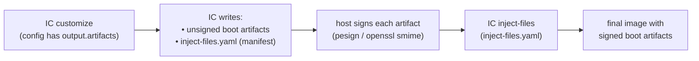
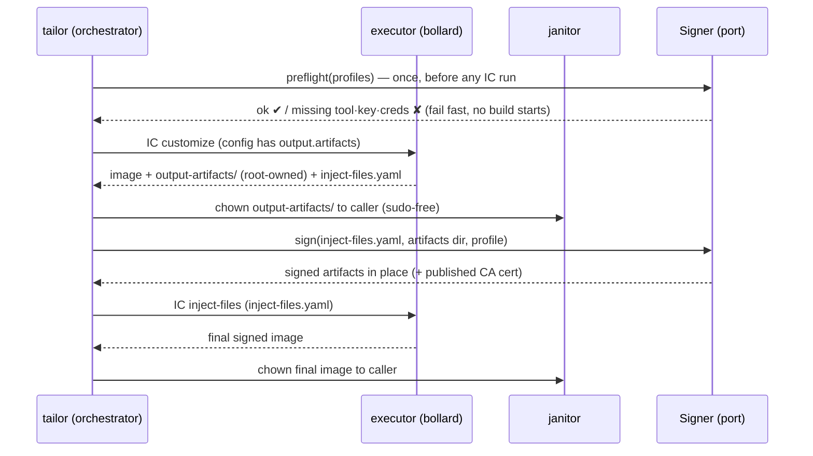
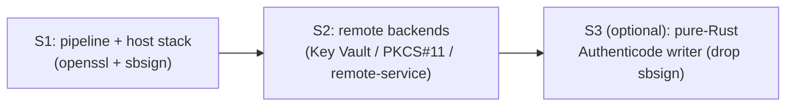

# tailor — Signing & `inject-files`

> **Status:** Implemented (S1) — as-built design · _last reviewed 2026-07-08_
>
> **Stack (as built in sessions 262/263/268; being reconstructed after the 2026-07-06 data loss):**
> external **host** tools only — **`openssl`** mints the per-build CA and per-cell code-signing leaf and
> signs verity-hash (detached CMS/DER), and **`sbsign`** signs PE/Authenticode boot artifacts. No
> `rcgen`, no bundled crypto crate, no separate signing container. The `Signer` port lives in
> `tailor-core`, the backends in a `tailor-sign` crate, and the executor gains a three-pass
> (`customize` → sign → `inject-files`) mode. Preflight fails fast **at build start** if `openssl` /
> `sbsign` (or a BYO key/cert) is missing — before any slow, privileged IC run.

---

## 1. Current state — what works, what's missing

| Piece | Today |
| ----- | ----- |
| `injectFiles: bool` image field | Parsed (`schema.rs`), validated, and folded into the per-cell **fingerprint** (`fingerprint.rs`) — but **never read by the executor**. |
| IC `output.artifacts` in `config:` | Passed through opaquely like the rest of the IC config (tailor never models it). |
| `inject-files` IC subcommand | Documented (design §7.4) but **not emitted** by `arg_builder.rs`; only `customize`/`convert` are wired. |
| Signing (keys, certs, `pesign`) | **Not implemented.** No signer, no key handling, no CA. |

So a user can *write* `injectFiles: true` and an `output.artifacts` block, and tailor will happily
run a single `customize` pass — producing an image whose boot artifacts are **unsigned**, silently
ignoring the request. The signing pipeline below closes that gap.

> This design **retires the `injectFiles` field** from the user surface: a single `signing:` profile
> (§4) is both the opt-in and the key selection, so a separate boolean gate is redundant. The schema
> field is removed (or kept internal-only); its fingerprint role is replaced by the signer identity
> (§8).

---

## 2. Background — how IC signing actually works

Image Customizer cannot sign boot artifacts itself (signing needs keys the build host owns). It
instead splits a signed build into **two IC passes around a host-side signing step**:



1. **`customize`** with `output.artifacts` declared in the IC config. Besides the image, IC extracts
   the **unsigned** boot artifacts (UKIs, `shim`, `systemd-boot`, verity root-hash) to an output
   directory and emits an **`inject-files.yaml`** describing them.
2. **Host-side signing.** For every entry in `inject-files.yaml`, sign the `unsignedSource` →
   `source` in place. Trident's `sign.py` does:
   - **PE binaries** (`vmlinuz*.efi` UKIs, `bootx64.efi` shim, `systemd-bootx64.efi`): `pesign
     --certdir <nssdb> --certificate <leaf> --sign --in <unsigned> --out <signed>`.
   - **verity-hash**: `openssl smime -sign -noattr -binary -outform der` (detached DER signature).
   - Artifact **type** comes from the `inject-files.yaml` entry, or is inferred from the filename.
3. **`inject-files`** IC pass, fed the same `inject-files.yaml`, re-injects the now-signed artifacts
   back into the image at their declared destinations → the final, Secure Boot–bootable image.

### What Trident's builder adds around that

`sign.py` also owns the **key material** for its test images (this is the part Milestone 4 calls
"port `builder/sign.py`"):

- **One CA per build** — `efikeygen -C -S` into an NSS key DB (`generate_ca_certificate`).
- **One leaf signing cert per image/clone** — `efikeygen --signer <CA> [--kernel]`
  (`generate_leaf_certificate`); leaf names are unique per clone so parallel signs don't collide.
- **Publish the CA cert** (`ca_cert.pem`) so it can be enrolled into the firmware db / trusted at
  boot (`publish_ca_certificate`).

> Note: `sign.py` shells out with **`sudo cp`** because IC's outputs are root-owned. tailor already
> solves root-owned outputs sudo-free via the **janitor** (design §7.7), so tailor's signer needs
> **no `sudo`** — a concrete improvement over the builder.

---

## 3. Goals & non-goals

**Goals**

- Produce Secure Boot–signed images from a declarative manifest: a single `signing:` profile, no
  bespoke scripts.
- **Lean, explicit external toolchain**: `openssl` (CA + per-cell leaf + verity-hash CMS) and `sbsign`
  (PE/Authenticode), both **host** binaries. Orchestration and `inject-files.yaml` handling are pure
  Rust. No bundled crypto crate; no separate signing container (§6).
- **Fail fast**: verify every signing prerequisite — the signer tool **binaries** (`openssl`, and
  `sbsign` when PE artifacts are expected), BYO key+cert files, remote credentials — **once, up front,
  before any (slow, privileged) IC run**. Never customize N cells only to discover at the signing step
  that `sbsign` or a key is missing.
- Stay **config-opaque** (design §8): tailor must not parse the IC `config:` to discover
  `output.artifacts`. Drive the pipeline off the **artifacts IC actually emits**.
- Keep the **no-`sudo`** guarantee: sign host-side after the janitor normalizes ownership.
- Be **backend-pluggable**: a local test-CA (port of `sign.py`) for CI, with room for real signing
  services (Azure Key Vault / PKCS#11 / remote-service) without touching the orchestration.
- Compose with the **matrix**: per-cell signing, a shared CA per build, leaf-per-cell(/clone).

**Non-goals (for this feature)**

- tailor does **not** model or rewrite `output.artifacts` — the user authors it in their `config:`.
- No firmware/db enrollment, no Azure VM provisioning — tailor stops at "signed image + published
  CA cert".
- No bit-for-bit reproducibility of *signed* outputs (signatures embed certs/timestamps; §9).

---

## 4. Manifest surface

Signing is opt-in **per image via a single field**, `signing:`. There is intentionally **no separate
`injectFiles` flag** — the `inject-files` pass is an implementation detail of "sign this image", so
having both a boolean gate *and* a profile selector would be redundant (and `injectFiles` names the
IC mechanism, not the user's intent). The existing `injectFiles` schema field is therefore retired
from the user surface (it is currently an inert no-op; see §1).

```yaml
# tailor.yaml  (workspace-wide signing profiles)
signing:
  default: test-ca                 # the profile used when an image says `signing: true`
  profiles:
    test-ca:                       # MVP: self-signed CA minted per build with openssl (port of sign.py)
      backend: local-test-ca
      publishCaCert: ./artifacts/ca_cert.pem   # where to write the enrollable CA cert
    byo:                           # bring-your-own signing key + cert (no CA generation)
      backend: keypair
      key: ./secrets/db.key        # PEM private key + cert, sourced at build time
      cert: ./secrets/db.crt
    akv:                           # future: remote signing service / HSM
      backend: azure-key-vault
      vault: https://my-vault.vault.azure.net
      certificate: secureboot-db
```

```yaml
# image.yaml
name: appliance
signing: test-ca                   # ← the ONLY opt-in: presence enables the signed pipeline,
                                   #   the value selects a profile (`true` = the workspace default)
config:
  # ... user-authored IC config, INCLUDING their own output.artifacts block ...
  output:
    artifacts:
      items: [ukis, shim, systemd-boot, verity-hash]
      path: ./output-artifacts
```

Notes:

- `signing:` is a profile **id** (string), or `true` to use the workspace `signing.default`.
  **Omitted ⇒ unsigned** — unlike `toolchain:`, the workspace default is *not* auto-applied to every
  image (most images have no boot artifacts to sign), so signing is always an explicit choice.
- The user still authors `output.artifacts` in their own `config:` (it tells IC *what* to extract);
  `signing:` tells tailor *how* to sign. Those are genuinely different concerns, not a duplicate of
  each other — and tailor never reads the `config:` to find `output.artifacts` (§5).
- `backend` is the only field the executor branches on; everything else is backend-specific and
  parsed by the chosen `Signer`. Private key material is **referenced**, never inlined or imaged.

---

## 5. Execution pipeline

The executor (`tailor-exec`) gains a third mode beside `customize`/`convert`. tailor first
**preflights** the signing prerequisites for the whole build (§5.1) and aborts before touching IC if
anything is missing. Then, per cell whose image has a resolved `signing:` profile:



1. **Customize** exactly as today (the user's `output.artifacts` rides along in the working-copy
   config). Output dir is the cell's artifact dir.
2. **Detect signing work — presence-based, not config parsing.** After customize, if the image has a
   `signing:` profile **and** IC emitted an `inject-files.yaml` (+ artifacts dir), proceed; otherwise:
   - `signing:` set but **no** `inject-files.yaml` ⇒ the IC config declared no `output.artifacts`
     → **hard error** ("`signing:` requested but the IC config produced no `output.artifacts`").
   - no `signing:` ⇒ skip (single-pass, today's behavior). This keeps tailor config-opaque:
     it reacts to IC's *output*, never reads the input `config:`.
3. **Normalize ownership** of the artifacts dir via the janitor so signing runs as the caller.
4. **Sign** via the resolved `Signer` (§6), in place: `unsignedSource` → `source` for every entry in
   `inject-files.yaml`, by artifact type.
5. **inject-files** IC pass: a new arg vector
   `inject-files --build-dir /tmp --image-file <customized> --inject-files-config <inject-files.yaml>
    --output-image-format <fmt> --output-image-file <final>` (exact flags TBD against IC — §10),
   with all host paths translated to the `/host` mount as usual.
6. **Normalize ownership** of the final image; write the build stamp.

`--dry-run` prints all three steps (the two `docker run` invocations and the signing commands)
without executing — so the signed flow is as inspectable as the unsigned one.

### 5.1 Preflight — fail fast before building

An IC `customize` run is slow and privileged; a build set can be many cells. Discovering only at the
signing step that `sbsign` isn't installed, the signer container can't be pulled, a BYO key file is
missing, or a Key Vault credential is absent — *after* customizing N cells — wastes a lot of time and
leaves half-built, root-owned outputs around. So tailor runs a **preflight** check once, **before the
first IC invocation**:

1. Collect the **distinct signing profiles** across the selected cells (a build may mix signed and
   unsigned images; only signed ones contribute).
2. For each, call the backend's `preflight()` (§6) — a **cheap, side-effect-free** capability probe:
   - **signer tools present** — `openssl`, and (when PE artifacts will be signed) `sbsign`, resolvable
     on `PATH`. This binary-presence check runs **at build start**, so a missing tool fails
     immediately rather than minutes into a customize;
   - **key material resolvable** — for `keypair`, the `key`/`cert` files exist, are readable, and
     parse; for `local-test-ca`, that `openssl` is present to mint the CA/leaf;
   - **remote reachable** — for `azure-key-vault`/`pkcs11`/`remote-service`, required credentials/modules are
     present and a cheap auth/handshake (or at least config completeness) succeeds.
3. If **anything** is missing, **abort the whole build before any cell is customized**, with an error
   that names every missing prerequisite and the image/profile that needs it (so the user fixes all
   of them in one pass, not one failed build at a time).

This is distinct from the runtime "`signing:` set but IC emitted no `output.artifacts`" error
(pipeline step 2): preflight verifies tailor *can* sign; that check verifies there was *something* to
sign. Preflight is also surfaced **non-fatally** by `tailor validate` and `tailor build --dry-run`
(they *report* missing prerequisites without failing), so the requirements are discoverable without
starting a real build. A pure `tailor build` treats them as a hard gate.

---

## 6. Signer abstraction

A new port in `tailor-core`, implemented in a new `tailor-sign` crate (keeps key/PKI code isolated
and unit-testable, and keeps `tailor-exec` focused on containers):

```rust
// tailor-core::ports — object-safe and synchronous. Held as `dyn Signer` in `ExecutionContext`; the
// executor calls `sign` on a blocking thread so the async runtime is never blocked on openssl/sbsign.
pub trait Signer: Send + Sync {
    /// Cheap, side-effect-free check that this backend can sign: required host binaries present
    /// (`openssl`, and `sbsign` when PE artifacts are expected) and key material resolvable. Called
    /// once per build, before any IC run (§5.1).
    fn preflight(&self) -> Result<(), SignError>;

    /// Sign every entry in inject-files.yaml in place (unsignedSource -> source).
    fn sign(&self, plan: &SigningPlan) -> Result<SigningResult, SignError>;
}

pub struct SigningPlan {
    pub inject_files_yaml: PathBuf,   // emitted by IC customize
    pub artifacts_dir: PathBuf,       // where the (un)signed artifacts live
    pub leaf_id: String,              // per-cell/clone, for unique leaf keys
}
pub struct SigningResult { pub published_ca_cert: Option<PathBuf> }
```

Each backend implements `preflight()` to assert its own prerequisites — `openssl`/`sbsign` on `PATH`,
and for `keypair` the `key`/`cert` are stat'd and parsed — so the fail-fast gate (§5.1) needs no
special-casing in the orchestrator.

**Two external host binaries, no bundled crypto.** `sign.py` shells out to five NSS/`pesign` tools;
tailor collapses that to `openssl` + `sbsign`:

| Operation | `sign.py` uses | tailor uses | Why |
| --------- | -------------- | ----------- | --- |
| **Key + cert generation** (CA, per-cell leaf, code-signing EKU) | `efikeygen`, `certutil`, `pk12util` (NSS) | **`openssl`** | Mints a self-signed X.509 CA + a code-signing leaf as PEM; drops the entire NSS chain. |
| **Orchestration / `inject-files.yaml`** | (python) | **pure Rust — `serde_yaml_ng` + std** | Already tailor's wheelhouse. |
| **verity-hash signature** (detached CMS/PKCS#7 DER) | `openssl smime -sign` | **`openssl smime -sign -noattr -binary -outform der`** | The same command `sign.py` uses; a detached DER signature. |
| **PE/Authenticode signing** (UKIs, shim, systemd-boot `.efi`) | `pesign` | **`sbsign`** | Non-trivial + security-critical; `sbsign` takes a PEM `--key`/`--cert`, pairing cleanly with the openssl-minted leaf. |

So the **as-built stack** is two external host binaries:

> **`openssl` (CA + per-cell leaf + verity-hash CMS) + `sbsign` (PE/Authenticode).**

A useful detail: **`sbsign` takes a PEM `--key`/`--cert`** whereas `pesign` wants an NSS db. Pairing
`openssl`'s PEM output with `sbsign` drops the *entire* `efikeygen`/`certutil`/`pk12util`/NSS/`pesign`
chain — **two** external tools instead of five, both run on the host.

> **Fully pure-Rust is possible but optional (S3).** Replacing both tools means a first-party
> **Authenticode PE writer** and RustCrypto-based cert/CMS generation — fully specified but
> security-critical first-party crypto, so a *later, optional* hardening. It becomes most attractive
> for **remote-key backends** (an HSM can't feed `sbsign`), where tailor would build the structures and
> ask the HSM only for the raw signature; the `signature::Signer` trait keeps that pluggable.

**Backends:**

The three backends are **key-source profiles** (where the signing key comes from); the PE signer is
orthogonal (`sbsign` for local keys, a first-party writer for remote keys, §6):

- **`local-test-ca`** (MVP, CI) — mint a self-signed CA once per build and a code-signing leaf per
  `leaf_id` with `openssl`; sign PE with `sbsign` and verity-hash with `openssl smime`; publish the CA
  as `<slug>.ca_cert.pem` beside each image. **Not** a production trust root.
- **`keypair`** (BYO) — load a PEM key + cert and sign with `sbsign`. The "we already have a Secure
  Boot cert" case.
- **`azure-key-vault` / `pkcs11` / `remote-service`** (future) — the key can't be handed to `sbsign`, so tailor
  builds the Authenticode/CMS structures itself (the first-party PE writer, §6) and asks the remote
  signer only for the raw signature; the private key never leaves the HSM/service.

> **Verdict on external deps:** two host binaries — `openssl` (certs + verity CMS) and `sbsign` (PE).
> Both are checked for presence at **build-start preflight** so a missing tool fails immediately. A
> fully pure-Rust signer (first-party Authenticode writer) remains an optional later step (S3).

---

## 7. Matrix, cells & clones

- Signing is **per cell** — only cells whose image has a `signing:` profile and that emit
  `output.artifacts`. A `vm-img` cell with no verity/UKI simply emits no artifacts and is skipped
  (presence-based, §5.2).
- The **CA is per `build` invocation** (one trust root for the run); **leaf certs are per cell, and
  per clone** (`--clones N`) so parallel/independent cells never share a leaf — matching `sign.py`'s
  unique leaf-name scheme.
- Selectors compose unchanged: `tailor build -s variant=root-verity` signs just those cells.

---

## 8. Reproducibility, fingerprint & lockfile

- **Fingerprint.** Add the **signer identity** to the per-cell fingerprint (`FingerprintInputs`):
  the backend id plus a stable key identity (e.g. the leaf/CA **certificate fingerprint** for
  BYO/remote backends). A different signing identity ⇒ a different artifact ⇒ a rebuild. (This
  replaces the retired `injectFiles` bool that the fingerprint hashes today.)
- **`local-test-ca` is intentionally non-reproducible**: it mints fresh keys each build, so signed
  outputs differ run-to-run. That is acceptable and consistent with design §9.3's *bounded*
  reproducibility; `--locked` still pins IC + base digests, just not the freshly-generated keys. Doc
  this loudly; production builds use BYO/remote backends with a fixed cert identity.
- **Lockfile.** No new registry inputs (keys are local/remote, not OCI), so `tailor.lock` is
  unchanged. A remote backend may later record the signing certificate's identity for auditability.

---

## 9. Security considerations

- **No private keys in images.** tailor signs *extracted* artifacts and injects them back; signing
  keys live only in the build environment (file refs or a remote vault) and are never added to the
  IC `config:` or the rootfs.
- **No `sudo`.** The janitor normalizes IC's root-owned artifact dir before signing, so the signer
  runs entirely as the calling user (improving on `sign.py`'s `sudo cp`).
- **Least exposure for BYO keys.** Key/cert paths are read at build time; tailor never copies them
  into outputs or logs their contents. Remote backends keep the private key in the HSM/service.
- **Published CA cert is public** by design (it is the enrollment artifact); only the CA/leaf
  *private* keys are sensitive.
- The signed pipeline keeps IC's existing `--privileged` + `/:/host` blast radius (design §15); it
  adds `openssl` + `sbsign` host signing, all unprivileged.

---

## 10. Open questions / assumptions to validate

1. **Exact `inject-files` IC arg vector** and the `inject-files.yaml` schema across IC versions
   (`source`/`unsignedSource`/`type`; MIC v1.1+ reuses one path) — validate against IC docs and a
   real run before wiring `arg_builder.rs`.
2. **PE signer choice — decided.** `sbsign` (PEM key, host binary) is the standing PE signer: it
   pairs with the `openssl`-minted PEM leaf and avoids NSS/`pesign`. Verity-hash is `openssl smime`
   (detached DER). A first-party pure-Rust Authenticode writer (`object`/`goblin` + `cms`) stays
   optional/later (S3), becoming worthwhile mainly for remote-key backends where `sbsign` can't reach
   the key.
3. **Output-artifacts directory location** relative to the working-copy config (IC resolves
   `output.artifacts.path` relative to the config file, like other paths — §7.6) and its
   translation into `/host`.
4. **Verity-hash signing** detail parity with `sign.py` (`openssl smime` detached DER) and any other
   artifact types newer IC versions emit.
5. **CA lifetime** — confirm per-build (not per-cell) CA is the right granularity for multi-image
   workspaces; consider a `signing.profiles.*.caCert`/`caKey` to reuse a stable CA across builds.

---

## 11. Milestones (refines design.md §17 M4)



- **S1 — pipeline + the host stack.** Three-pass executor mode (`customize` → sign → `inject-files`),
  **fail-fast preflight (§5.1)** including `openssl`/`sbsign` binary-presence, presence-based detection,
  janitor ownership, `--dry-run`, and the fingerprint change. Certs + verity-hash via `openssl`, PE
  signing via `sbsign` — both host binaries. Backends `keypair` (BYO) + `local-test-ca`; one real
  signed E2E cell as the correctness bar.
- **S2 — remote backends.** `azure-key-vault` / `pkcs11` / `remote-service` behind the same `Signer` trait. As
  `sbsign` can't reach a remote key, this is where the first-party Authenticode/CMS structure-building
  lands for PE artifacts (tailor builds, the HSM/service signs).
- **S3 (optional) — fully pure-Rust signer.** A first-party Authenticode PE writer to drop `sbsign`
  entirely, for a zero-external-signing-tool binary. Only if the maintenance of security-critical
  first-party crypto is judged worth it over a vetted tool.

---

## 12. Summary

tailor can't sign today — `injectFiles` is an inert placeholder. This design adds a **config-opaque,
no-`sudo`, dependency-lean, backend-pluggable** signed pipeline: tailor runs IC `customize`, reacts
to the `inject-files.yaml`/artifacts IC emits, signs them through a `Signer` port — certs and
verity-hash via `openssl` and PE/Authenticode via `sbsign`, two external **host** binaries checked for
presence up front — then runs IC `inject-files` to produce the final Secure Boot–signed image. It's
all driven by a **single `signing:` profile** (the redundant `injectFiles` flag is retired), with the
user's `output.artifacts` left untouched in their IC config. A fully pure-Rust signer (first-party
Authenticode writer) remains an optional later step.
